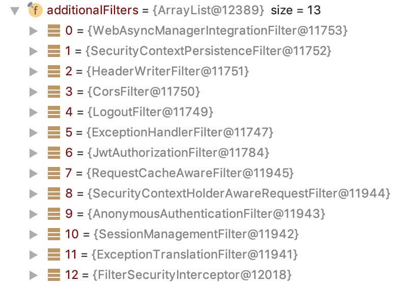
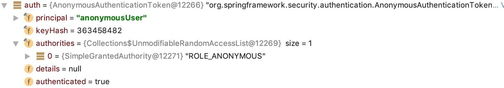
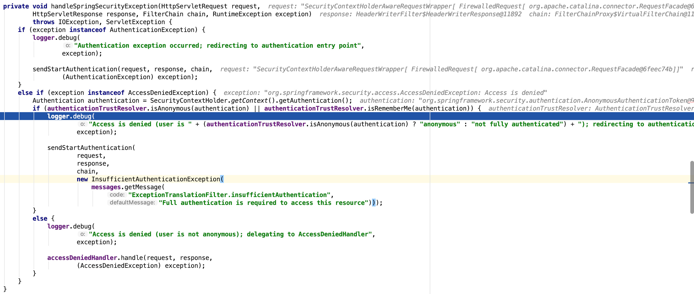

<!--more-->

## 问题描述

请求认证的时候，会通过redis验证用户是否logout过，如果没在redis里说明已经logout过，那`AuthorizationFilter`就不会往`SecurityContext`中设置`Authentication`，此时就会报错如下：

```
{
    "timestamp": "2019-04-18T23:41:56+08:00",
    "status": 401,
    "error": "Unauthorized",
    "message": "Full authentication is required to access this resource",
    "path": "/api/xxx"
}
```

那就在想这个错误是哪里抛出来的呢？

首先看这个返回的数据结构，很可能就是 spring 默认的全局错误处理。这里有个东西有必要说明一下，spring对异常的处理分两类：

1. `@ControllerAdvice` 和`@ExceptionHandler` 注解实现自定义的统一异常处理模块。
	这种方式处理的是`controller`层未捕获的异常，如果是`interceptor`等还是无法捕获到的。
2. 自定义`controller`，需要实现 `ErrorController`, 该`controller` 处理`"/error"`请求。因为当异常最终暴露到`tomcat`层时，就会被这个`controller`拦截到。如果没有自定义实现，那么spring提供了默认的实现`BasicErrorController`:

	```
	@RequestMapping
	@ResponseBody
   	public ResponseEntity<Map<String, Object>> error(HttpServletRequest request) {
        Map<String, Object> body = this.getErrorAttributes(request, this.isIncludeStackTrace(request, MediaType.ALL));
        HttpStatus status = this.getStatus(request);
        return new ResponseEntity(body, status);
    }
	```
	这里就是上面返回请求结果异常的地方。
	
那是哪里抛出了异常导致被`ErrorController`拦截到了呢？

我们看下请求进入到spring以及spring security的验证流程：



其中 ExceptionHandlerFilter 和 JwtAuthorizationFilter 是我自定义的。

按照顺序进入了Filter，这里我们关注 ExceptionHandlerFilter 及之后的filter,前面几个filter可以先简单地顾名思义。 

1. `ExceptionHandlerFilter` 只是简单地 doFilter(),没有什么业务的处理逻辑，主要是出现异常后的catch处理。如果是`JwtAuthorizationFilter`中未捕获的异常，则会被`ExceptionHandlerFilter`catch到，
2. JwtAuthorizationFilter 解析 token，并从redis判断是否 login,`Optional<JwtAuthentication> jwtAuthenticationOption = this.parseJwtAuthentication(request)` 这里由于未 login，所以没有执行`SecurityContextHolder.getContext()::setAuthentication`
3. `AnonymousAuthenticationFilter`

	```
	public void doFilter(ServletRequest req, ServletResponse res, FilterChain chain)
			throws IOException, ServletException {

		if (SecurityContextHolder.getContext().getAuthentication() == null) {
			SecurityContextHolder.getContext().setAuthentication(
					createAuthentication((HttpServletRequest) req));

			if (logger.isDebugEnabled()) {
				logger.debug("Populated SecurityContextHolder with anonymous token: '"
						+ SecurityContextHolder.getContext().getAuthentication() + "'");
			}
		}
		else {
			if (logger.isDebugEnabled()) {
				logger.debug("SecurityContextHolder not populated with anonymous token, as it already contained: '"
						+ SecurityContextHolder.getContext().getAuthentication() + "'");
			}
		}

		chain.doFilter(req, res);
	}
	```
	其中，`createAuthentication` 生成了 `AnonymousAuthenticationToken`：
	
	```
	protected Authentication createAuthentication(HttpServletRequest request) {
		AnonymousAuthenticationToken auth = new AnonymousAuthenticationToken(key,
				principal, authorities);
		auth.setDetails(authenticationDetailsSource.buildDetails(request));

		return auth;
	}
	```
	
	
	
	之后就被自定义的 `JwtAuthenticationEntryPoint` 接收到进行处理。
	
	`filter`依次序反向返回处理,最终进入到`BasicErrorController`
4. `ExceptionTranslationFilter`
	用来处理`AuthenticationException`和`AccessDeniedException`两种异常。   `ExceptionTranslationFilter` 持有两个处理类，分别是`AuthenticationEntryPoint`和`AccessDeniedHandler`。处理规则很简单：
	>规则1. 如果异常是 AuthenticationException，使用 AuthenticationEntryPoint 处理  
规则2. 如果异常是 AccessDeniedException 且用户是匿名用户，使用 AuthenticationEntryPoint 处理  
规则3. 如果异常是 AccessDeniedException 且用户不是匿名用户，如果否则交给 AccessDeniedHandler 处理。  

	`AccessDeniedHandler` 默认实现是 `AccessDeniedHandlerImpl`。该类对异常的处理是返回403错误码。   
	`AuthenticationEntryPoint` 默认实现是 `LoginUrlAuthenticationEntryPoint`, 该类的处理是转发或重定向到登录页面。
	
	本次调试中，收到5抛出的异常后，重新`throw AccessDeniedException`, 然后进入 `handleSpringSecurityException()` :
	
5. `FilterSecurityInterceptor`   
	`doFilter` 调用`invoke()`, `invoke()`调用它的父类 `AbstractSecurityInterceptor `的 `beforeInvocation()`，它会从 `SecurityContextHolder.getContext().getAuthentication()` 拿到对应的`authentication`，如果未验证过则会交给 `authenticationManager` 进行验证，这里是被之前的`filter`设置为了`true`，所以直接返回。然后调用 `AffirmativeBased` 的 `decide()`方法抛出 `throw new AccessDeniedException(messages.getMessage("AbstractAccessDecisionManager.accessDenied", "Access is denied"));`, `beforeInvocation()` 捕获到异常后
	
	```
	// Attempt authorization
		try {
			this.accessDecisionManager.decide(authenticated, object, attributes);
		}
		catch (AccessDeniedException accessDeniedException) {
			publishEvent(new AuthorizationFailureEvent(object, attributes, authenticated,
					accessDeniedException));

			throw accessDeniedException;
		}
	```
	该异常会反向地被 `ExceptionTranslationFilter` 捕获到。

	```
	public void invoke(FilterInvocation fi) throws IOException, ServletException {
		if ((fi.getRequest() != null)
				&& (fi.getRequest().getAttribute(FILTER_APPLIED) != null)
				&& observeOncePerRequest) {
			// filter already applied to this request and user wants us to observe
			// once-per-request handling, so don't re-do security checking
			fi.getChain().doFilter(fi.getRequest(), fi.getResponse());
		}
		else {
			// first time this request being called, so perform security checking
			if (fi.getRequest() != null && observeOncePerRequest) {
				fi.getRequest().setAttribute(FILTER_APPLIED, Boolean.TRUE);
			}

			InterceptorStatusToken token = super.beforeInvocation(fi);

			try {
				fi.getChain().doFilter(fi.getRequest(), fi.getResponse());
			}
			finally {
				super.finallyInvocation(token);
			}

			super.afterInvocation(token, null);
		}
	}

	```