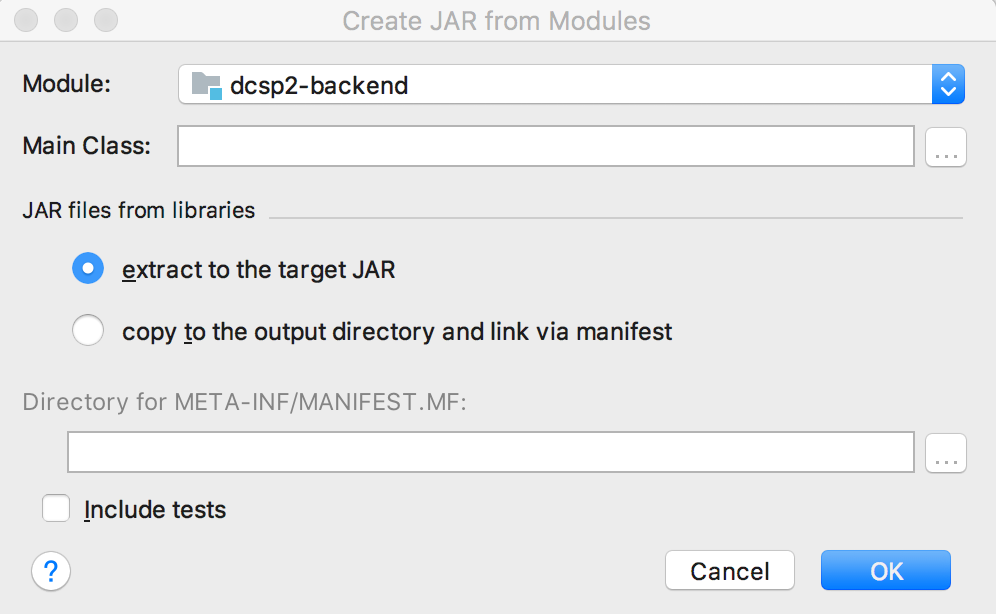

<!--more-->

## 在命令行中直接运行带main方法的Java

本文假设class都已生成，略过javac命令。   

#### 不带package的HelloWorld   

进入到编译后的HelloWorld.class所处的bin目录，执行`java HelloWorld`

#### 带package的HelloWorld   

进入到bin目录，执行`java com.test.HelloWorld`

#### 导入了jar包的HelloWorld

如果直接按以上方法运行，会报错   
```
Exception in thread "main" java.lang.NoClassDefFoundError: org/apache/http/client/methods/HttpUriRequest
```   

有3种办法： 
  
1. `set classpath=%classpath%;foo.jar;dll.jar;`   
再次执行`java full.package.name.ClassName`      

2. 将上述命令合并为一条执行
`java -cp foo.jar full.package.name.ClassName`

3. 设置一大堆的jar太繁琐，可以设置路径依赖，把所有的jar包放到lib目录下   
`java -Djava.ext.dirs=D:\workspace\eclipse\helloword\lib full.package.name.ClassName`   

  或者使用相对路径，lib/与bin/同级   
`java -Djava.ext.dirs=../lib com.test.SpiderTest`

#### 运行manifest的jar包
`java -jar <jar-file-name>.jar  `

### 如何打包出jar包
JAR包是Java中所特有一种压缩文档,其实大家就可以把它理解为.zip包。当然也是有区别的,JAR包中有一个META-INF\MANIFEST.MF文件,当你生成JAR包时,它会自动生成。

JAR包是由JDK安装目录\bin\jar.exe命令生成的，当我们安装好JDK，设置好path路径，就可以正常使用jar.exe命令，它会用lib\tool.jar工具包中的类。

eclipse和idea都提供了打包功能，只需要设置Main Class和META-INF/MAINFEST.MF文件的位置，以及选择JAR files from libraries。



选择 extract to the target JAR 会把依赖的jar包也打包进去。
#### jar命令参数
**jar命令格式：jar {c t x u f }[ v m e 0 M i ][jar-file][manifest-file][-C 目录]文件名...**
 
其中{ctxu}这四个参数必须选选其一。[v f m e 0 M i ]是可选参数，文件名也是必须的。
 
-c 创建一个jar包   
-t 显示jar中的内容列表   
-x 解压jar包  
-u 添加文件到jar包中   
-f 指定jar包的文件名   
-v 生成详细的报造，并输出至标准设备   
-m 指定manifest.mf文件.(manifest.mf文件中可以对jar包及其中的内容作一些一设置) 
-e  为捆绑到可执行 jar 文件的独立应用程序指定应用程序入口点  
-0 产生jar包时不对其中的内容进行压缩处理    
-M 不产生所有文件的清单文件(Manifest.mf)。这个参数与忽略掉-m参数的设置   
-i 为指定的jar文件创建索引文件    
-C 更改为指定的目录并包含以下文件   

示例 1: 将两个类文件归档到一个名为 classes.jar 的档案中:   
       `jar cvf classes.jar Foo.class Bar.class`
       
示例 2: 使用现有的清单文件 'mymanifest' 并将 foo/ 目录中的所有文件归档到'classes.jar' 中:   
       `jar cvfm classes.jar mymanifest -C foo/`
       
示例 3: 生成可以运行的jar包       
`jar -cvfe HelloWorld.jar HelloWorld HelloWorld.class   #创建可以运行的jar包`

jar打包时，会默认向jar包中添加一个清单文件(MANIFEST.MF)，放在META-INF目录。上面的例子中，可以看到：如果指定了jar包的入口程序，清单文件中就会多一行Main-Class: HelloWorld。实际上，-e选项的作用就是向MANIFEST.MF文件中添加这样一行信息，来声明jar包的入口程序。当然，我们也可以直接修改清单文件的内容。

如果依赖了外部的jar包，可以在MANIFEST.MF文件中修改Class-Path.   

#### Manifest.mf文件编写规则：
 
 manifest.mf的编写一定要注意一些细节。
 
1.  不能有空行和空格的地方   
    第一行不可以是空行( 第一行的行前不可以有空行)，行与行之间不能有空行，第行的行尾不可以有空格
2.  一定要有空行的地方   
最后一行得是空行(在输完你的内容后加一个回车就OK)

3.  一定有空格的地方
     key: value       在分号后面一定要写写一个空格

