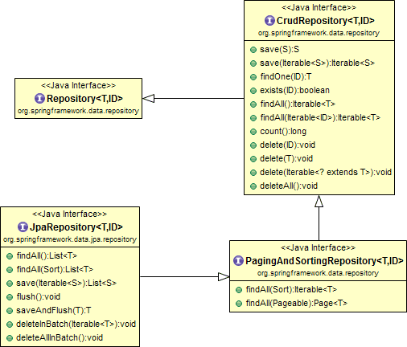

<!--more-->

## Java Persistence API

java 对象与数据库表的映射称为 ORM (Object-relational mapping),JPA是ORM的一种方法。开发者可以通过JPA从关系型数据库中映射、存储、更新和获取数据为Java对象，或者反过来。

JPA是一个标准，有几种具体的实现：

- Hibernate
- EclipseLink
- Apache OpenJPA

JPA使得开发者可以直接操作对象，而不用写SQL语句。也将JPA的实现称为 persistence provider。Java对象与数据库表之间的映射是通过 persistence metadata 实现的，它可以是注解，也可以是xml配置文件。

### Entity
被`@Entity`注解的实体，对应数据库中的一张表。每个实体必须定义一个主键，必须有一个非final的无参构造函数。   

默认情况下类名即为表名，也可以不相同，通过注解`@Table(name="NEWTABLENAME")`映射。

### Fields
JPA可以通过实例变量或者相应的getter、setter访问字段，JPA默认情况下可以访问所有的字段，如果某个字段不想被访问，可以通过注解`@Transient`实现。

默认情况下每个字段映射为表的列，可以通过注解`@Column(name = "newColumnName")`映射。

### Relationship Mapping
JPA运行定义class直接的关系，比如一个class属于另一个class。一般有如下几种关系： 
  
* @OneToOne
* @OneToMany
* @ManyToOne
* @ManyToMany

关系既可以是单向的也可以是双向的，在双向关系中需要通过属性"mappedBy"在另一个class中指明关系归属方，比如`@ManyToMany(mappedBy="attributeOfTheOwningClass")`

### Entity Manager
Entity Manager 提供到数据库的操作。它通过EntityManagerFactory创建，该工厂类通过持久化单元配置，持久化单元通过META-INF下的persistence.xml描述。

## YAZ(Yet Another Zeratul)
Zeratul的新版本，它提供了一个基础的BaseDao。比如：

```
public class UserDao extends BaseDao<User> {
    public UserDao() {
        super(User.class);
    }
    
    @PersistenceContext
    public void injectEntityManager(EntityManager entityManager) {
        super.setEntityManager(entityManager);
    }
    
    public List<User> findUserByName(String key) {
        return where(field("name").like(key), field("status").ne(DISABLED)).queryList();
    }
}
```

有时候会添加一个BaseDaoWrapper：

```
public abstract class BaseDaoWrapper<T> extends BaseDao<T> {
    protected BaseDaoWrapper(Class<T> prototype) {
        super(prototype);
    }

    @PersistenceContext
    public void injectEntityManager(EntityManager entityManager) {
        super.setEntityManager(entityManager);
    }
}

public class UserDao extends BaseDaoWrapper<User> {
    public UserDao() {
        super(User.class);
    }
    
    public List<User> findUserByName(String key) {
        return where(field("name").like(key), field("status").ne(DISABLED)).queryList();
    }
}
```

如果使用DDD,则会如下使用：

```
public class UserDao extends BaseDaoWrapper<User> {
    public UserDao() {
        super(User.class);
    }
}

public class UserRepository extends BaseRepository<User> {
    private UserDao userDao;

    public User find(String userId) {
        return userDao.idEquals(userId).querySingle();
    }
}
```

## Querydsl
使用过spring data jpa的同学，都很清楚，对于复杂的sql查询，处理起来还是比较复杂的，而本文中的QueryDSL就是用来简化JPA操作的。

1. QueryDSL仅仅是一个通用的查询框架，专注于通过Java API构建类型安全的SQL查询。
2. Querydsl可以通过一组通用的查询API为用户构建出适合不同类型ORM框架或者是SQL的查询语句，也就是说QueryDSL是基于各种ORM框架以及SQL之上的一个通用的查询框架。
3. 借助QueryDSL可以在任何支持的ORM框架或者SQL平台上以一种通用的API方式来构建查询。目前QueryDSL支持的平台包括JPA,JDO,SQL,Java Collections,RDF,Lucene,Hibernate Search。

### 准备工作

```
buildscript {
    repositories {
        jcenter()
        maven {
            url "https://plugins.gradle.org/m2/"
        }
    }
    dependencies {
        classpath "gradle.plugin.com.ewerk.gradle.plugins:querydsl-plugin:1.0.9"
        classpath "io.spring.gradle:dependency-management-plugin:${depMgmtPluginVersion}"
        classpath "org.springframework.boot:spring-boot-gradle-plugin:${springBootVersion}"
    }
}

allprojects {
    apply plugin: 'idea'

    repositories {
        jcenter()
    }
}

subprojects {

    apply plugin: 'java'
    apply plugin: 'io.spring.dependency-management'
    apply plugin: 'com.ewerk.gradle.plugins.querydsl'

    version = '2.0.0'
    group = 'com.bulgari.we'

    tasks.withType(JavaCompile) {
        sourceCompatibility = 1.8
        targetCompatibility = 1.8
        options.encoding = 'utf-8'
    }

    querydsl {
        library = 'com.querydsl:querydsl-apt'
        jpa = true
    }

    ideaModule.dependsOn compileQuerydsl

    idea {
        module {
            sourceDirs += file('src/querydsl/java')
        }
    }
}

idea {
    module {
        sourceDirs += file('src/querydsl/java')
    }
}
```
该插件会查找使用javax.persistence.Entity注解的域类型，并为它们生成对应的查询类型。

## 实现JPA的两种方式
1. 使用yaz + querydsl
	
	```
	public class BaseRepositoryWrapper<T> extends BaseDao<T> {
	
	    protected BaseRepositoryWrapper(Class<T> prototype) {
	        super(prototype);
	    }
	
	    protected boolean isManaged(T entity) {
	        return entityManager.contains(entity);
	    }
	
	    protected <T> JPAQuery<T> from(EntityPath<T> from) {
	        JPAQueryFactory jpaQueryFactory = new JPAQueryFactory(entityManager);
	        return jpaQueryFactory.selectFrom(from);
	    }
	
	    protected <T> JPAQuery<T> select(Expression<T> what) {
	        JPAQueryFactory jpaQueryFactory = new JPAQueryFactory(entityManager);
	        return jpaQueryFactory.select(what);
	    }
	
	    @PersistenceContext
	    public void injectEntityManager(EntityManager entityManager) {
	        super.setEntityManager(entityManager);
	    }
	}
	```

2. 仅使用querydsl

	```
	public class QuerydslJpaSupport {
	
	    private EntityManager entityManager;
	
	    protected <T> JPAQuery<T> from(EntityPath<T> from) {
	        JPAQueryFactory jpaQueryFactory = new JPAQueryFactory(entityManager);
	        return jpaQueryFactory.selectFrom(from);
	    }
	
	    protected <T> JPAQuery<T> select(EntityPath<T> what) {
	        JPAQueryFactory jpaQueryFactory = new JPAQueryFactory(entityManager);
	        return jpaQueryFactory.select(what);
	    }
	
	    protected <T> JPAQuery<T> select(Expression<T> what) {
	        JPAQueryFactory jpaQueryFactory = new JPAQueryFactory(entityManager);
	        return jpaQueryFactory.select(what);
	    }
	
	    protected void store(Object entity) {
	        if (entityManager.contains(entity)) {
	            entityManager.merge(entity);
	            return;
	        }
	        entityManager.persist(entity);
	    }
	
	    protected JPADeleteClause delete(EntityPath<?> from) {
	        return new JPADeleteClause(entityManager, from);
	    }
	
	    protected EntityManager entityManager() {
	        return entityManager;
	    }
	
	    @PersistenceContext
	    protected void setEntityManager(final EntityManager entityManager) {
	        this.entityManager = entityManager;
	    }
	}
```

3. 要想使用spring data jpa提供的QueryDSL功能，很简单，直接继承接口即可。Spring Data JPA中提供了QueryDslPredicateExecutor接口,用于支持QueryDSL的查询操作接口，如下：

	```
	public interface UserRepositoryDls extends JpaRepository<User, Integer>, QueryDslPredicateExecutor<User>{
	}
	```


## Spring Data Jpa

它是spring提供的一个轻量级ORM持久化框架，它并没有实现JAP，是一个管理工具，JPA的底层通常使用Hibrenate。

我们在实现的时候只需要声明持久化接口，该接口继承Repository或其子接口，Spring会生成实现代码：

```
public interface UserDao extends JpaRepository<User, Serializable>{
    List<User> findByNameLikeAndAgeGreaterThan(String firstName,Integer age);
}
```

spring 中接口的关系：

1. Repository：仅仅只是一个标识，没有任何方法，方便Spring自动扫描识别
2. CrudRepository：继承Repository，实现一组CRUD相关方法
3. PagingAndStortingRepository：继承CrudRepository，实现一组分页排序相关方法
4. JpaRepository：继承PagingAndStortingRepository，实现一组JPA规范方法



### Spring JPA方法名解析步骤

在进行方法名解析时会先去掉多余的前缀，比如find、findBy、read、readBy、get、getBy，然后对剩下部分进行解析，并且如果方法最后一个参数时 Sort 或 Pageable 类型，也会提取相关信息。
