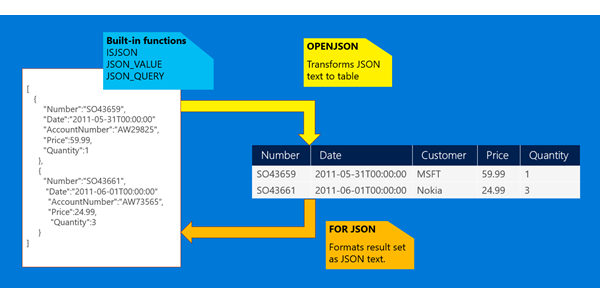

<!--more-->

## JSON data in SQL Server




### JSON_VALUE 读取 json 列 Data

```
SELECT 
Name, 
Price, 
JSON_VALUE(Data, '$.Color') Color, 
JSON_VALUE(Data, ‘$.StandardCost’) Cost, 
JSON_VALUE(Data, '$.Class') Class
FROM ProductCatalog
WHERE JSON_VALUE(Data, '$.Color') = 'Black'
AND Price < 100
```

### JSON_MODIFY 修改json 列 Data

```
UPDATE ProductCatalog
SET Data = JSON_MODIFY(Data, '$.Color', 'White')
WHERE JSON_VALUE(Data, '$.ProductNumber') = 'BK-R50R-60'
```
如果担心性能问题，那么与正常column一样，用索引即可。

### 如果日志是按json格式记录的，那么可以转化为报表

比如日志文件包含的格式如下：

```
{"type":"Debug","page":"user/delete","Time":"2016-02-04 4:58:51",...}
```
读出所有的日志：

```
SELECT log.* 
FROM OPENROWSET(BULK N'c:\JSON\logANSI.txt',
					FORMATFILE = 'c:\\JSON\ldjfmt.txt',
					CODEPAGE = '65001') as log
```

通过OPENJSON函数读出所有的entry：

```
SELECT data.* 
FROM OPENROWSET(BULK N'c:\JSON\logANSI.txt',
					FORMATFILE = 'c:\\JSON\ldjfmt.txt',
					CODEPAGE = '65001') as log
		CROSS APPLY OPENJSON (log.log_entry)
					  WITH ( Page varchar(30),
					  		  [User] varchar(20),
					  		  Time datetime2,
					  		  Ip varchar(20) '$.Origin',
					  		  Duration bigint) as data
```

### 将数据库中数据读出为json

```
SELECT id, name as text, COALESCE(managerid, '#') as parent
FROM employee
order by managerid asc
FOR JSON PATH
```