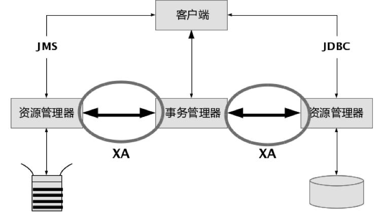
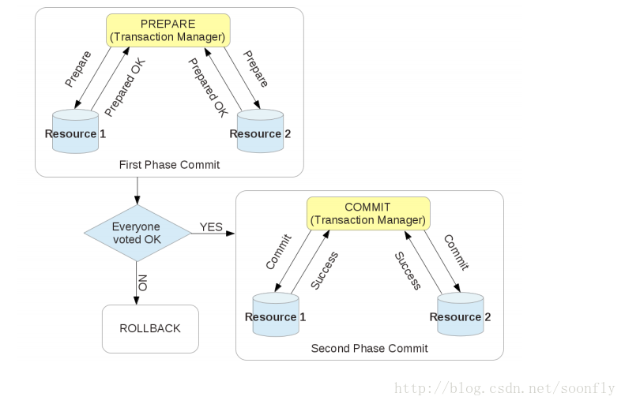
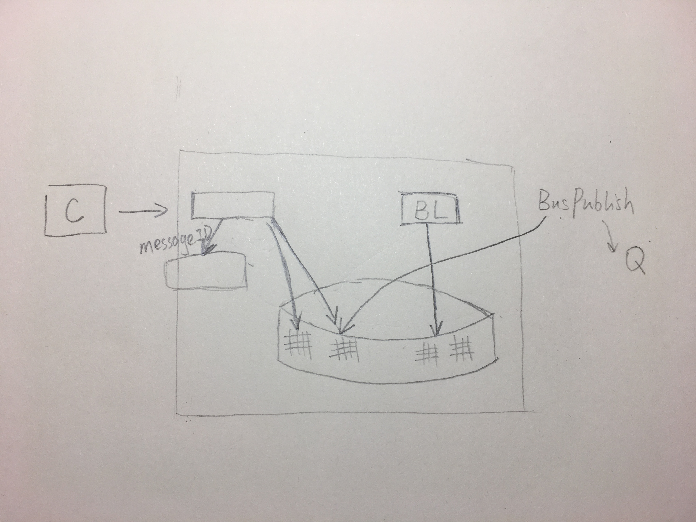

<!--more-->

## XA接口详解
先声明两个概念：

- **资源管理器**（resource manager）：用来管理系统资源，是通向事务资源的途径。数据库就是一种资源管理器。资源管理还应该具有管理事务提交或回滚的能力。
- **事务管理器**（transaction manager）：事务管理器是分布式事务的核心管理者。事务管理器与每个资源管理器（resource 
manager）进行通信，协调并完成事务的处理。事务的各个分支由唯一命名进行标识。

X/Open XA接口是双向的系统接口，在事务管理器（Transaction Manager）以及一个或多个资源管理器（Resource Manager）之间形成通信桥梁。事务管理器控制着JTA事务，管理事务生命周期，并协调资源。在JTA中，事务管理器抽象为javax.transaction.TransactionManager接口，并通过底层事务服务（即JTS）实现。资源管理器负责控制和管理实际资源（如数据库或JMS队列）。下图说明了事务管理器、资源管理器，以及典型JTA环境中客户端应用之间的关系：

注意，上图中XA接口形成了事务管理器和资源管理器之间的通信桥梁。因为XA接口的双向特质，XA支持两阶段提交协议，我们将在本章的后续部分讨论。

## 什么时候应该使用XA

> 仅在同一个事务上下文中需要协调多种资源（即数据库，以及消息主题或队列）时，才有必要使用X/Open XA接口。

资源的情形包括访问两个或更多的数据库，或者一个数据库加上一个消息队列，又或者是多个消息队列。您可能有一个应用同时使用到一个数据库和一个消息队列。然而，如果这些资源并不在同一个事务中使用，就没有必要去用XA。比如一个例子预置一个固定收入交易，而后向队列发送一条消息，就是需要使用XA以便维护ACID特性的例子。

## 分布式事物原理：分段式提交
**两阶段提交协议（The two-phase commit protocol，2PC）是XA用于在全局事务中协调多个资源的机制。**

分布式事务通过2PC协议将提交分成两个阶段：

prepare；
commit/rollback
阶段一为准备（prepare）阶段。即所有的参与者准备执行事务并锁住需要的资源。参与者ready时，向transaction manager报告已准备就绪。 
阶段二为提交阶段（commit）。当transaction manager确认所有参与者都ready后，向所有参与者发送commit命令。 
如下图所示： 

**XA接口是如何做到的呢以及相关异常处理？**请参考[XA事务处理](http://www.infoq.com/cn/articles/xa-transactions-handle)

## 另一种保证领域模型存储和事件存储一致性的方案

在领域模型的持久化存储中，创建一个特殊的存储区域（比如一张数据库表），该区域用于存储领域事件，这便是一个事件存储(Event Store)。同时，你创建一个消息外发组件将事件存储中的所有消息通过消息机制发送出去。消息消费方需要考虑消息处理的幂等性。

> One drawback of this approach is that it is potentially error‑prone since the developer must remember to publish events. A limitation of this approach is that it is challenging to implement when using some NoSQL databases because of their limited transaction and query capabilities.

### 事物日志挖掘

> One benefit is that it guarantees that an event is published for each update without using 2PC. Transaction log mining can also simplify the application by separating event publishing from the application’s business logic. A major drawback is that the format of the transaction log is proprietary to each database and can even change between database versions. Also, it can be difficult to reverse engineer the high‑level business events from the low‑level updates recorded in the transaction log.

### Using Event Sourcing
