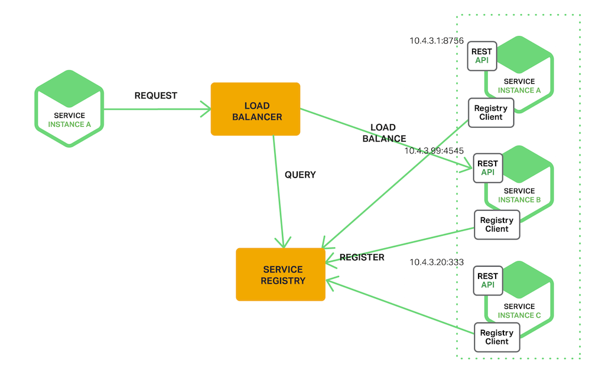
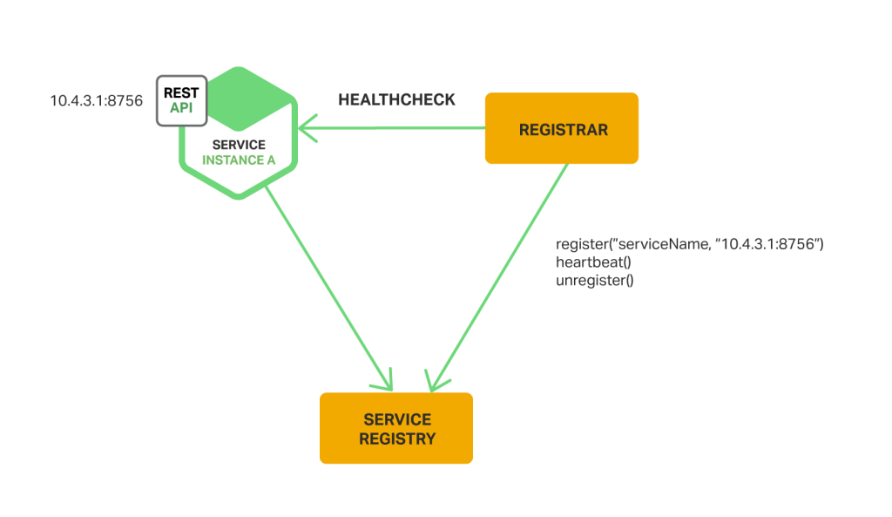

<!--more-->

## Microservices概述
缺点：

- 分布式系统，交互，错误的处理
- 分库，考虑一致性问题
- 测试
- 改变服务
- 自动化

## 使用API Gateway构建微服务

 优点：
 
 - 可以并行发送请求
 - 可以组合出结果时，不需要异步回调，而用reactive写声明式的代码。比如Java8中的CompletableFuture. Netflix在它们的API Gateway中专为JVM创造了RxJava

## 微服务架构下的进程间通信

 | One-to-One | One-to-Many
-----| --------- | ------------
Synchronous | Request/Response | -
Asynchronous | Notification(Request/async response) | Publish/Subscribe(Publish/async response)

## 微服务架构中的服务发现

### The Client‑Side Discovery Pattern

> Netflix Eureka is a service registry. It provides a REST API for managing service‑instance registration and for querying available instances.

### The Server‑Side Discovery Pattern

> The AWS Elastic Load Balancer (ELB) is an example of a server-side discovery router. 

### 服务注册

> Netflix achieves high availability by running one or more Eureka servers in each Amazon EC2 availability zone. Each Eureka server runs on an EC2 instance that has an Elastic IP address. DNS TEXT records are used to store the Eureka cluster configuration, which is a map from availability zones to a list of the network locations of Eureka servers. When a Eureka server starts up, it queries DNS to retrieve the Eureka cluster configuration, locates its peers, and assigns itself an unused Elastic IP address.

> DNS TEXT records 存储Eureka集群配置——Map\<AZ, List\<Eureka server网络地址>>，当Eureka server启动时，去查询DNS获取Eureka集群配置信息，定位它的peers，并分配一个没有使用的Elastic IP 地址。

>Eureka clients – services and service clients – query DNS to discover the network locations of Eureka servers. Clients prefer to use a Eureka server in the same availability zone. However, if none is available, the client uses a Eureka server in another availability zone.

服务注册还包括：
 
- etcd
- Consul
- Zookeeper

### 服务注册选项

#### 自己主动注册（The Self‑Registration Pattern）

Netflix OSS Eureka client是个典型的样例，Spring Cloud项目实现了多种模式，包括服务发现，使通过Eureka自动注册你的服务实例变得非常简单，你只需要注解你的Java配置文件为`@EnableEurekaClient`

#### The Third‑Party Registration Pattern

开源项目Registrator是个典型的案例，可以支持多种注册方式，如etcd和Consul, Netflix OSS Prana也是，它是一个sidecar application，与Netflix Eureka共同工作。

> The service registrar is a built‑in component of deployment environments. The EC2 instances created by an Autoscaling Group can be automatically registered with an ELB. Kubernetes services are automatically registered and made available for discovery.

**除非是内置在部署环境中的，否则它也是一个你需要配置和维护的高可用的组件。**

## 微服务中事件驱动数据管理
参考[分布式事物](../_posts/2018-09-06-SQL-XA.md)

## 微服务部署策略

### 多个实例跑在一个主机上面

- 每个服务实例跑在一个port上
- 每个实例是一个进程或者进程组——tomcat server
- 多个实例跑在一个进程或者进程组——比如部署多个Java web应用在同一个Tomcat server

优点：

- 资源利用率相对较高
- 部署相对较快，你只需要copy service到host上，然后启动起来
- 启动也非常快

缺点：

- 不能限制每个实例对资源的使用
- 没有隔离，会相互影响，比如共享JVM heap
- 没法监控资源的使用
- 操作团队必须了解如何启动每个应用

### 每个主机上一个实例

#### Service Instance per Virtual Machine
每个服务打包为一个虚拟机镜像。
优点：

- 完全独立
- 可以使用成熟的云基础设施
- 封装了服务的实现技术

缺点：

- 资源利用率低
- 部署一个新版本的服务较慢

#### Service Instance per Container Pattern