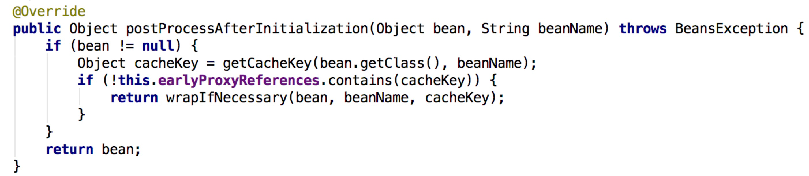

<!--more-->

## @Transactional注解的工作原理

[该文章有详细的代码分析](https://juejin.im/post/59e87b166fb9a045030f32ed)

## EventBus的@Subscribe在同时被@Transactional注解时不能被解析为订阅者

链接文章中，事物的代理生成时会调用`AbstractAutoProxyCreator`中的`postProcessAfterInitialization`

在调试的时候发现首先是扫描所有的`@Transactional`，所以就进入了`AbstractAutoProxyCreator`，在生成了代理类之后，`@Subscribe`注解就已经不存在了。