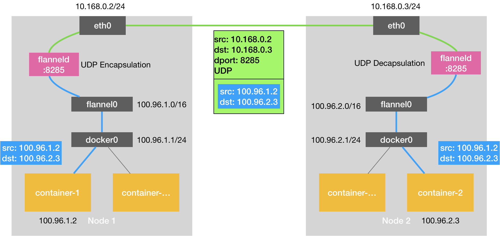

<!--more-->

## PaaS 简说
Cloud Foundry 为代表的开源 PaaS 项目，是2013年云计算中的一股清流。**PaaS 项目被大家接纳的一个主要原因，就是它提供了一种名叫“应用托管”的能力。**为了解决云端服务器和本地环境不一致的问题，PaaS开源项目应运而生。 
  
举个例子，虚拟机创建好之后，运维人员只需要在这些机器上部署一个 Cloud Foundry 项目，然后开发者只要执行一条命令就能把本地的应用部署到云上，这条命令就是：
 
```
$ cf push " 我的应用 "
```

该项目的核心组件就是一套应用的打包和分发机制。Cloud Foundry 为每种主流编程语言都定义了一种打包格式，而`cf push`的作用相当于是用户把应用的可执行文件和启动脚本打进一个压缩包内，上传到云上 Cloud Foundry 的存储中。然后，Cloud Foundry 会通过一个调度器选择一个可以运行这个应用的虚拟机，然后通知这个机器上的 Agent 把应用压缩包下载下来启动。

由于需要在一个虚拟机上启动很多个来自不同用户的应用，Cloud Foundry 会调用操作系统的 Cgroups 和 Namespace 机制为每一个应用单独创建一个称作“沙盒”的隔离环境，然后在“沙盒”中启动这些应用进程。


## Docker 基础

Docker 项目确实与 Cloud Foundry 的容器在大部分功能和实现原理上都是一样的。

### 为何Docker会取代PaaS

使用 PaaS， 用户就需要为每种语言、每种框架的应用维护一个打好的包。这个打包过程是没有任何章法可循的。而**docker 镜像**解决了这个问题。   

docker 镜像就是一个压缩包，但是这个压缩包不仅包含 PaaS 中的应用可执行文件 + 启停脚本。实际上，大多数 Docker 镜像是直接由一个完整操作系统的所有文件和目录构成的，也就是包含了这个应用运行所需要的所有依赖。  

docker run 创建的“沙盒”，也是使用 Cgroups 和 Namespace 机制创建出来的隔离环境。

### Linux Namespace 隔离

左图为虚拟机的工作原理，右图用一个名为Docker Engine 的软件替换了 Hypervisor。**可是这样的说法，却并不严谨。**


在使用 Docker 的时候，并没有一个真正的“Docker 容器”运行在宿主机里面。Docker 项目帮助用户启动的，还是原来的应用进程，只不过在创建这些进程时，Docker 为它们加上了各种各样的 Namespace 参数。 

所以应该把 Docker 画在跟应用同级别并且靠边的位置。


#### 隔离得不彻底

1. 多个容器之间使用的就还是同一个宿主机的操作系统内核。所以要在 Windows 宿主机上运行 Linux 容器，或者在低版本的 Linux 宿主机上运行高版本的Linux 容器，都是行不通的。
2. 在 Linux 内核中，有很多资源和对象是不能被 Namespace 化的，最典型的例子就是：时间。如果你的容器中的程序使用 settimeofday(2) 系统调用修改了时间，整个宿主机的时间都会被随之修改。

### Linux Cgroups 限制(Linux Control Group)

**限制一个进程组能够使用的资源上限，包括 CPU、内存、磁盘、网络带宽等等。**

在 Linux 中，Cgroups 给用户暴露出来的操作接口是文件系统，即它以文件和目录的方式组织在操作系统的/sys/fs/cgroup 路径下。可以通过mount指令把它们展示出来：


```
$ mount -t cgroup
cgroup on /sys/fs/cgroup/systemd type cgroup (rw,nosuid,nodev,noexec,relatime,xattr,release_agent=/lib/systemd/systemd-cgroups-agent,name=systemd)
cgroup on /sys/fs/cgroup/cpuset type cgroup (rw,nosuid,nodev,noexec,relatime,cpuset)
cgroup on /sys/fs/cgroup/net_cls,net_prio type cgroup (rw,nosuid,nodev,noexec,relatime,net_cls,net_prio)
cgroup on /sys/fs/cgroup/perf_event type cgroup (rw,nosuid,nodev,noexec,relatime,perf_event)
cgroup on /sys/fs/cgroup/blkio type cgroup (rw,nosuid,nodev,noexec,relatime,blkio)
cgroup on /sys/fs/cgroup/cpu,cpuacct type cgroup (rw,nosuid,nodev,noexec,relatime,cpu,cpuacct)
cgroup on /sys/fs/cgroup/memory type cgroup (rw,nosuid,nodev,noexec,relatime,memory)
cgroup on /sys/fs/cgroup/pids type cgroup (rw,nosuid,nodev,noexec,relatime,pids)
cgroup on /sys/fs/cgroup/devices type cgroup (rw,nosuid,nodev,noexec,relatime,devices)
cgroup on /sys/fs/cgroup/hugetlb type cgroup (rw,nosuid,nodev,noexec,relatime,hugetlb)
cgroup on /sys/fs/cgroup/freezer type cgroup (rw,nosuid,nodev,noexec,relatime,freezer)
```
任意打开cpu，见名知意。。。

```
# ls /sys/fs/cgroup/cpu
cgroup.clone_children  cgroup.sane_behavior  cpu.cfs_quota_us  cpu.stat      cpuacct.usage         docker      kube-proxy  notify_on_release  system.slice  user.slice
cgroup.procs           cpu.cfs_period_us     cpu.shares        cpuacct.stat  cpuacct.usage_percpu  init.scope  kubepods    release_agent      tasks
```
#### 如何使用

1. 在想要限制的资源的目录下创建一个子目录，子目录里会自动生成默认的资源配额文件。如container文件。

	`/sys/fs/cgroup/cpu# mkdir container`

2. 启动进程。
3. 修改这些文件的内容来设置限制,如
	
	```
	$ cat /sys/fs/cgroup/cpu/container/cpu.cfs_quota_us 
	-1
	$ echo 20000 > /sys/fs/cgroup/cpu/container/cpu.cfs_quota_us

	$ cat /sys/fs/cgroup/cpu/container/cpu.cfs_period_us 
	100000
	```
4. 把进程的PID写入container的tasks文件

	`$ echo 226 > /sys/fs/cgroup/cpu/container/tasks`

在docker中的使用：

```
$ docker run -it --cpu-period=100000 --cpu-quota=20000 ubuntu /bin/bash

$ cat /sys/fs/cgroup/cpu/docker/5d5c9f67d/cpu.cfs_period_us 
100000
$ cat /sys/fs/cgroup/cpu/docker/5d5c9f67d/cpu.cfs_quota_us 
20000

```

#### Cgroups 限制的不完善点

1. 如果在容器中执行top指令，会发现，它显示的信息居然是宿主机的CPU和内存数据，而不是当前容器的数据。原因就是，/proc 文件系统并不知道用户通过 Cgroups 给这个容器做了什么样的资源限制，即：/proc 文件系统不了解 Cgroups 限制的存在。

**如何解决呢？**

LXCFS是基于FUSE实现而成的一套用户态文件系统，和其他文件系统最本质的区别在于，文件系统通过用户态程序和内核FUSE模块交互完成。Linux内核从2.6.14版本开始通过FUSE模块支持在用户空间实现文件系统。通过LXCFS的源码可以看到，LXCFS主要通过调用底层fuse的lib库libfuse和内核模块fuse交互实现成一个用户态的文件系统。此外，LXCFS涉及到对cgroup文件系统的管理则是通过cgmanager用户态程序实现(为了提升性能，从0.11版本开始，LXCFS自身实现了cgfs用以替换第三方的cgroup manager,目前已经合入upstream)。


### Mount Namespace


**Mount Namespace 是对 chroot 的不断改良才被发明出来的，它也是 Linux 操作系统的第一个Namespace。**

为了能够让容器的这个根目录看起来更“真实”，我们一般会在这个容器的根目录下挂载一个完整操作系统的文件系统，比如 Ubuntu16.04 的 ISO。这样，在容器启动之后，我们在容器里通过执行"ls /" 查看根目录下的内容，，就是 Ubuntu 16.04 的所有目录和文件。

**而这个挂载在容器根目录上、用来为容器进程提供隔离后执行环境的文件系统，就是所谓的“容器镜像”。它还有一个更为专业的名字，叫作：rootfs（根文件系统）。**

对 Docker 项目来说，它最核心的原理实际上就是为待创建的用户进程：

1. 启用 Linux Namespace 配置；
2. 设置指定的 Cgroups 参数；
3. 切换进程的根目录（Change Root；优先使用pivot_root系统调用）。

**需要明确的是，rootfs 只是一个操作系统所包含的文件、配置和目录，并不包括操作系统内核。在 Linux 操作系统中，这两部分是分开存放的，操作系统只有在开机启动时才会加载指定版本的内核镜像。**

**正是由于 rootfs 的存在，容器才有了一个被反复宣传至今的重要特性：一致性。**

## Docker 镜像

chroot

```
$ mkdir -p $HOME/test
$ mkdir -p $HOME/test/{bin,lib64,lib}
$ cd $T
$ cp -v /bin/{bash,ls} $HOME/test/bin
$ T=$HOME/test
$ list="$(ldd /bin/ls | egrep -o '/lib.*\.[0-9]')"
$ for i in $list; do cp -v "$i" "${T}${i}"; done
$ chroot $HOME/test /bin/bash
$ ls /

```

利用联合文件系统（Union File System）的能力。联合挂载指的是比如有A,B两个目录，将它们挂载到C目录，会将A,B下的文件合并到一起，相同文件名的只会保存一份。如果在C目录下对文件进行了修改，A,B目录下的文件也会修改。


```
$ tree
.
├── A
│  ├── a
│  └── x
└── B
  ├── b
  └── x
$ mkdir C
$ mount -t aufs -o dirs=./A:./B none ./C
$ tree ./C
./C
├── a
├── b
└── x

```

查看 Ubuntu 镜像：   
由4个层组成，每一层都是 Ubuntu 操作系统文件与目录的一部分；而在使用镜像时，Docker 会把这些增量联合挂载在一个统一的挂载点上。

```
$docker image inspect ubuntu:latest
 "RootFS": {
            "Type": "layers",
            "Layers": [
                "sha256:bebe7ce6215aee349bee5d67222abeb5c5a834bbeaa2f2f5d05363d9fd68db41",
                "sha256:283fb404ea9415ab48456fd8a82b153b1a719491cdf7b806d1853b047d00f27f",
                "sha256:663e8522d78b5b767f15b2e43885da5975068e3195bbbfa8fc3a082297a361c1",
                "sha256:4b7d93055d8781d27259ba5780938e6a78d8ef691c94ee9abc3616c1b009ec4a"
            ]
        }
```

这个挂载点就是 `/var/lib/docker/overlay2/`， 比如： 

`/var/lib/docker/overlay2/67c81fa956d4fec55e6d1113228857f5eb75d3c23acf6784cb08a9bf51d98490/merged`

```
# ls /var/lib/docker/overlay2/67c81fa956d4fec55e6d1113228857f5eb75d3c23acf6784cb08a9bf51d98490/merged
app  bin  dev  etc  home  lib  media  mnt  proc  root  run  sbin  srv  sys  tmp  usr  var
```

通过overlay2的挂载信息，我们可以找到对应的

```
# cat /proc/mounts | grep overlay2
overlay /var/lib/docker/overlay2/67c81fa956d4fec55e6d1113228857f5eb75d3c23acf6784cb08a9bf51d98490/merged overlay rw,relatime,lowerdir=/var/lib/docker/overlay2/l/LFMCDDFLSTSXU2AGLENHKE6B4B:/var/lib/docker/overlay2/l/ASBXXDHZUANZ7EJWVNXPD7GODR:/var/lib/docker/overlay2/l/4ZJE3MX4WFKTWJZPTLD2BJYWBM:/var/lib/docker/overlay2/l/JHWIGR45SLOCGTPSUHWEUC4CR6:/var/lib/docker/overlay2/l/ZTF72IYW2GRXMFLXGW5J5J27LD:/var/lib/docker/overlay2/l/3AI25CDBRO45R3OIN3HQOOU4M2,upperdir=/var/lib/docker/overlay2/67c81fa956d4fec55e6d1113228857f5eb75d3c23acf6784cb08a9bf51d98490/diff,workdir=/var/lib/docker/overlay2/67c81fa956d4fec55e6d1113228857f5eb75d3c23acf6784cb08a9bf51d98490/work 0 0
overlay /var/lib/docker/overlay2/0987b09cdd2a925038165fdad901c3208809161ff9cbf3730539a7a26a69f290/merged overlay rw,relatime,lowerdir=/var/lib/docker/overlay2/l/QRTB3LNGEMA45UAW5P3GYS5TXF:/var/lib/docker/overlay2/l/OZAXTIMJYL2Q5QOOBQ3LTYCW7C:/var/lib/docker/overlay2/l/HT2YCMJKD6C2U53UDS6X5JS47Q:/var/lib/docker/overlay2/l/5ZLH2ZYQRTFFPE5VLEW36NDWB4:/var/lib/docker/overlay2/l/PDKZRDMTL2SNQQH2I7UFE5YJSX:/var/lib/docker/overlay2/l/XA7VQQBTJQPDJVT2ABVEONDJDS:/var/lib/docker/overlay2/l/S2KJKXZU3UCVWQZZ3ATPX2SITR:/var/lib/docker/overlay2/l/RMHIDF54ZLRIEL6Z3GI4MCQ5LM,upperdir=/var/lib/docker/overlay2/0987b09cdd2a925038165fdad901c3208809161ff9cbf3730539a7a26a69f290/diff,workdir=/var/lib/docker/overlay2/0987b09cdd2a925038165fdad901c3208809161ff9cbf3730539a7a26a69f290/work 0 0
```

镜像的层都放置zai `/var/lib/docker/overlay2/l/`目录下，每层是以增量的形式分别包含了 Ubuntu 操作系统的一部分。


**需要注意**

为了实现这样的删除操作，AuFS会在可读写层创建一个 whiteout 文件，把只读层里的文件“遮挡”起来。

#### Init层

Init 层是 Docker 项目单独生成的一个内部层，专门用来存放 /etc/hosts、/etc/resolv.conf等信息。比如在容器启动时需要写入一些指定的值比如hostname，所以就需要在可读写层对它们进行修改。可是我们并不希望执行docker commits时，把这些信息一起提交了。


## Docker 容器

docker tag 给镜像起名字时，

`$ docker tag helloworld suyue466300740/helloworld:v1


### docker exec 是怎么做到进入容器里的呢？

一个进程的 Namespace 信息在宿主机上是确确实实存在的，并且是以一个文件的方式存在。

通过如下指令，你可以看到当前正在运行的 Docker 容器的的进程号（PID）是 25686：

```
$ docker inspect --format '{{ .State.Pid }}'  4ddf4638572d
25686
```

这时，你可以通过查看宿主机的 proc 文件，看到这个 25686 进程的所有 Namespace对应的文件：

```
$ ls -l  /proc/25686/ns
total 0
lrwxrwxrwx 1 root root 0 Aug 13 14:05 cgroup -> cgroup:[4026531835]
lrwxrwxrwx 1 root root 0 Aug 13 14:05 ipc -> ipc:[4026532278]
lrwxrwxrwx 1 root root 0 Aug 13 14:05 mnt -> mnt:[4026532276]
lrwxrwxrwx 1 root root 0 Aug 13 14:05 net -> net:[4026532281]
lrwxrwxrwx 1 root root 0 Aug 13 14:05 pid -> pid:[4026532279]
lrwxrwxrwx 1 root root 0 Aug 13 14:05 pid_for_children -> pid:[4026532279]
lrwxrwxrwx 1 root root 0 Aug 13 14:05 user -> user:[4026531837]
lrwxrwxrwx 1 root root 0 Aug 13 14:05 uts -> uts:[4026532277]
```

一个进程，可以选择加入到某个进程已有的 Namespace当中，从而达到“进入”这个进程所在容器的目的，这正是 docker exec 的实现原理。

Docker 还专门提供了一个参数，可以让你启动一个容器并“加入”到另一个容器的 Network Namespace 里，这个参数就是 -net，比如:

```
$ docker run -it --net container:4ddf4638572d busybox ifconfig
```

而如果我指定–net=host，就意味着这个容器不会为进程启用 Network Namespace。所以，它会和宿主机上的其他普通进程一样，直接共享宿主机的网络栈。这就为容器直接操作和使用宿主机网络提供了一个渠道。

## Kubernetes


**kubelet 主要负责同容器运行时（比如 Docker 项）打交道。**

1. CRI: kubelet与容器的交互通过CRI（Container Runtime Interface）的远程调用接口，这个接口定义了容器运行时的各项核心操作，比如：启动一个容器需要的所有参数。

2. OCI: 而具体的容器运行时，比如 Docker 项目，则一般通过 OCI 这个容器运行时规范同底层的Linux 操作系统进行交互，即：把 CRI 请求翻译成对 Linux 操作系统的调用（操作 Linux Namespace 和 Cgroups 等）。

3. gRPC 协议： **此外，kubelet 还通过 gRPC 协议同一个叫作 Device Plugin 的插件进行交互。**这个插件，是 Kubernetes 项目用来管理 GPU 等宿主机物理设备的主要组件，也是基于 Kubernetes 项目进行机器学习训练、高性能作业支持等工作必须关注的功能。

4. CNI（Container Networking Interface）和 CSI（Container Storage Interface）： 调用网络插件和存储插件为容器配置网络和持久化存储。


1. Secret: 两个不同 Pod 之间要求在发起时加上授权信息。最典型的例子就是 Web 应用对数据库访问时需要 Credential（数据库的用户名和密码）信息。那么，在 Kubernetes 中这样的关系又如何处理呢？Secret 对象，它其实是一个保存在 Etcd 里的键值对数据。这样，你把 Credential 信息以 Secret 的方式存在 Etcd 里，Kubernetes 就会在你指定的 Pod（比如，Web 应用的 Pod）启动时，自动把 Secret 里的数据以 Volume 的方式挂载到容器里。这样，这个 Web 应用就可以访问数据库了。

2. **Kubernetes 定义了新的、基于 Pod 改进后的对象.**
	- job: 用来描述一次性运行的 Pod（比如，大数据任务）
	- DaemonSet: 用来描述每个宿主机上必须且只能运行一个副本的守护进程服务
	- CronJob: 则用于描述定时任务

## kubeadm

## Pod

**Pod 里的容器共享哪些 Namespace**:

1. PID Namespace(同一个pod内的容器可以看到彼此的PID)
2. Network Namespace(同一个网络空间，使用localhost访问彼此)
3. IPC Namespace(能使用SystemV IPC或者POSIX消息队列进行通信)
4. UTS Namespace(共享同一个主机名)

Pod 里的所有容器，共享的是同一个 Network Namespace，并且可以声明共享同一个 Volume。那这么来看的话，一个有 A、B 两个容器的 Pod，不就是等同于一个容器（容器 A）共享另外一个容器（容器 B）的网络和Volume，如果用docker命令实现，大概如下：

`$ docker run --net=B --volumes-from=B --name=A image-A ...`

但是这样有个问题，容器B就必须先于容器A启动，这样一个pod里的多个容器就不算对等关系，而是拓扑关系了。

所以在K8S中，pod里实现了一个中间容器，这个容器叫Infra容器。在这个pod里，Infra容器永远都是第一个被创建的容器，其他容器通过join network namespace。


这个Infra容器使用的镜像是个特殊的镜像，k8s.gcr.io/pause。这个镜像是用一个汇编语言编写的，永远处于“暂停”状态。

**共享volume**   
Kubernetes 项目只要把所有 Volume 的定义都设计在 Pod 层级即可。

**容器设计模式 —— sidecar**

第一个最典型的例子是：WAR 包与 Web 服务器。

```
apiVersion: v1
kind: Pod
metadata:
  name: javaweb-2
spec:
  Containers:
  - image: geektime/sample:v2
    name: war
    command: ["cp", "/sample.war", "/app"]
    volumeMounts:
    - mountPath: /app
      name: app-volume
  containers:
  - image: geektime/tomcat:7.0
    name: tomcat
    command: ["sh","-c","/root/apache-tomcat-7.0.42-v2/bin/start.sh"]
    volumeMounts:
    - mountPath: /root/apache-tomcat-7.0.42-v2/webapps
      name: app-volume
    ports:
    - containerPort: 8080
      hostPort: 8001 
  volumes:
  - name: app-volume
    emptyDir: {}

```

Init Container 容器会按顺序逐一启动，而直到它们都启动并且退出了，用户容器才会启动。

像这样，我们就用一种“组合”方式，解决了 WAR 包与 Tomcat 容器之间耦合关系的问题。

### pod 里的基本概念

如果你能把 Pod 看成传统环境里的“机器”、把容器看作是运行在这个“机器”里的“用户程序”，那么很多关于 Pod 对象的设计就非常容易理解了。

- 凡是调度、网络、存储，以及安全相关的属性，基本上是 Pod 级别的。
  1. NodeSelector：是一个供用户将 Pod 与 Node 进行绑定的字段
  2. NodeName：一旦 Pod 的这个字段被赋值，Kubernetes 项目就会被认为这个 Pod 已经经过了调度，调度的结果就是赋值的节点名字。所以，这个字段一般由调度器负责设置，但用户也可以设置它来“骗过”调度器，当然这个做法一般是在测试或者调试的时候才会用到。
  3. HostAliases：定义了 Pod 的 hosts 文件（比如 /etc/hosts）里的内容。
  
- 凡是跟容器的 Linux Namespace 相关的属性，也一定是 Pod 级别的。

   1. 
  
   ```
   apiVersion: v1
	kind: Pod
	metadata:
	  name: nginx
	spec:
	  shareProcessNamespace: true
	  containers:
	  - name: nginx
	    image: nginx
	  - name: shell
	    image: busybox
	    stdin: true
	    tty: true
   ```
   
   这个 Pod 被创建后，你就可以使用 shell 容器的 tty 跟这个容器进行交互了。
 
  `kubectl attach -it nginx -c shell`

  2. 共享宿主机的 Network、IPC 和 PID Namespace：
  
  ```
  	apiVersion: v1
	kind: Pod
	metadata:
	  name: nginx
	spec:
	  hostNetwork: true
	  hostIPC: true
	  hostPID: true
	  containers:
	  - name: nginx
	    image: nginx
	  - name: shell
	    image: busybox
	    stdin: true
	    tty: true

  ```

- Container相关

  1. ImagePullPolicy： 默认是 Always

  2. Lifecycle：Container Lifecycle Hooks

     ```
	apiVersion: v1
	kind: Pod
	metadata:
	  name: lifecycle-demo
	spec:
	  containers:
	  - name: lifecycle-demo-container
	    image: nginx
	    lifecycle:
	      postStart:
	        exec:
	          command: ["/bin/sh", "-c", "echo Hello from the postStart handler > /usr/share/message"]
	      preStop:
	        exec:
	          command: ["/usr/sbin/nginx","-s","quit"]

     ```
     
     需要明确的是，postStart 定义的操作，虽然是在 Docker 容器 ENTRYPOINT 执行之后，但它并不严格保证顺序。

### Projected Volume

在 Kubernetes 中，有几种特殊的 Volume,是为容器提供预先定义好的数据。所以，从容器的角度来看，这些 Volume 里的信息就是仿佛是被 Kubernetes“投射”（Project）进入容器当中的。

- Secret

  帮你把 Pod 想要访问的加密数据，存放到 Etcd 中。然后，你就可以通过在 Pod 的容器里挂载 Volume 的方式，访问到这些Secret里保存的信息了。比如存放数据库的Credential信息。
 
  ```
	apiVersion: v1
	kind: Pod
	metadata:
	  name: test-projected-volume 
	spec:
	  containers:
	  - name: test-secret-volume
	    image: busybox
	    args:
	    - sleep
	    - "86400"
	    volumeMounts:
	    - name: mysql-cred
	      mountPath: "/projected-volume"
	      readOnly: true
	  volumes:
	  - name: mysql-cred
	    projected:
	      sources:
	      - secret:
	          name: user
	      - secret:
	          name: pass

  ```
  Secret对象可以通过kubectl create secret指令或者通过编写YAML文件的方式来创建：
  
  ```
 	$ cat ./username.txt
	admin
	$ cat ./password.txt
	c1oudc0w!
	$ kubectl create secret generic user --from-file=./username.txt
	$ kubectl create secret generic pass --from-file=./password.txt

  ```
  或者
  
  ```
  	apiVersion: v1
	kind: Secret
	metadata:
	  name: mysecret
	type: Opaque
	data:
	  user: YWRtaW4=
	  pass: MWYyZDFlMmU2N2Rm

  ```
  Secret 对象要求这些数据必须是经过 Base64 转码的。

  
- ConfigMap

  它与 Secret 的区别在于，ConfigMap 保存的是不需要加密的、应用所需的配置信息。而 ConfigMap 的用法几乎与 Secret 完全相同。比如一个Java应用所需要的配置文件：
 
  ```
   # .properties 文件的内容
	$ cat example/ui.properties
	color.good=purple
	color.bad=yellow
	allow.textmode=true
	how.nice.to.look=fairlyNice
	
	# 从.properties 文件创建 ConfigMap
	$ kubectl create configmap ui-config --from-file=example/ui.properties
	
	# 查看这个 ConfigMap 里保存的信息 (data)
	$ kubectl get configmaps ui-config -o yaml
	apiVersion: v1
	data:
	  ui.properties: |
	    color.good=purple
	    color.bad=yellow
	    allow.textmode=true
	    how.nice.to.look=fairlyNice
	kind: ConfigMap
	metadata:
	  name: ui-config
  ...

  ```

- Downward API

  让 Pod 里的容器能够直接获取到这个 Pod API 对象本身的信息。
  
  ```
 	apiVersion: v1
	kind: Pod
	metadata:
	  name: test-downwardapi-volume
	  labels:
	    zone: us-est-coast
	    cluster: test-cluster1
	    rack: rack-22
	spec:
	  containers:
	    - name: client-container
	      image: k8s.gcr.io/busybox
	      command: ["sh", "-c"]
	      args:
	      - while true; do
	          if [[ -e /etc/podinfo/labels ]]; then
	            echo -en '\n\n'; cat /etc/podinfo/labels; fi;
	          sleep 5;
	        done;
	      volumeMounts:
	        - name: podinfo
	          mountPath: /etc/podinfo
	          readOnly: false
	  volumes:
	    - name: podinfo
	      projected:
	        sources:
	        - downwardAPI:
	            items:
	              - path: "labels"
	                fieldRef:
	                  fieldPath: metadata.labels

  ```

  目前，Downward API 支持的字段已经非常丰富了，比如:

  ```
	1. 使用 fieldRef 可以声明使用:
	spec.nodeName - 宿主机名字
	status.hostIP - 宿主机 IP
	metadata.name - Pod 的名字
	metadata.namespace - Pod 的 Namespace
	status.podIP - Pod 的 IP
	spec.serviceAccountName - Pod 的 Service Account 的名字
	metadata.uid - Pod 的 UID
	metadata.labels['<KEY>'] - 指定 <KEY> 的 Label 值
	metadata.annotations['<KEY>'] - 指定 <KEY> 的 Annotation 值
	metadata.labels - Pod 的所有 Label
	metadata.annotations - Pod 的所有 Annotation
	
	2. 使用 resourceFieldRef 可以声明使用:
	容器的 CPU limit
	容器的 CPU request
	容器的 memory limit
	容器的 memory request

  ```
  **Downward API 能够获取到的信息，一定是 Pod 里的容器进程启动之前就能够确定下来的信息。**

- ServiceAccountToken
  
  Service Account对象是K8S内置的一种“服务账户”，它是K8S进行权限分配的对象。比如，SA1只被允许对K8S API进行Get操作。像这样的授权信息就保存在它所绑定的一个特殊的Secret对象里 -- ServiceAccountToken。任何允许在K8S集群上的应用，都必须使用这个token才可以合法地访问API Server.
  
  为了方便使用，K8S提供了一个默认“服务账户”（default Service Account），并且，任何一个运行在K8S里的**POD**,都可以直接使用这个默认的Service Account,而无需显示地声明挂载它。
  
  ```
  	$ kubectl describe pod nginx-deployment-5c678cfb6d-lg9lw
	Containers:
	...
	  Mounts:
	    /var/run/secrets/kubernetes.io/serviceaccount from default-token-s8rbq (ro)
	Volumes:
	  default-token-s8rbq:
	  Type:       Secret (a volume populated by a Secret)
	  SecretName:  default-token-s8rbq
	  Optional:    false

  ```
  
  POD创建完成后，容器里的应用就可以直接从这个默认token的挂载目录里访问到授权信息和文件。
  
  ```
  	$ ls /var/run/secrets/kubernetes.io/serviceaccount 
	ca.crt namespace  token

  ```
  
  所以应用程序只要直接加载这个授权文件，就可以访问并操作K8S API了。而且，如果你使用的是K8S官方的Client包（k8s.io/client-go）的话，它还可以自动加载这个目录下的文件，你不需要做任何配置或者编码操作。
  
  这种把K8S 客户端以容器的方式运行在集群里，然后使用default Service Account自动授权的方式，被称为“InClusterConfig”，是被推荐的进行K8S API编程的授权方式。
  
### 容器健康检查和恢复机制

1. 方式1：

  ```
	apiVersion: v1
	kind: Pod
	metadata:
	  labels:
	    test: liveness
	  name: test-liveness-exec
	spec:
	  containers:
	  - name: liveness
	    image: busybox
	    args:
	    - /bin/sh
	    - -c
	    - touch /tmp/healthy; sleep 30; rm -rf /tmp/healthy; sleep 600
	    livenessProbe:
	      exec:
	        command:
	        - cat
	        - /tmp/healthy
	      initialDelaySeconds: 5
	      periodSeconds: 5
	
  ```

	上例中POD会保持Running状态，它会被K8S重启，这个功能就是 Kubernetes 里的Pod 恢复机制，也叫 restartPolicy。需要强调的是，Pod的恢复过程，永远都是发生在当前节点上，而不会跑到别的节点上去。事实上，一旦一个 Pod 与一个节点（Node）绑定，除非这个绑定发生了变化（pod.spec.node字段被修改），否则它永远都不会离开这个节点。这也就意味着，如果这个宿主机宕机了，这个Pod 也不会主动迁移到其他节点上去。而如果你想让 Pod 出现在其他的可用节点上，就必须使用 Deployment这样的“控制器”来管理 Pod，哪怕你只需要一个 Pod 副本。
	
	restartPolicy可能取值:
	
	- Always
	- OnFailure
	- Never

2. 方式2：

  ```
  	...
	livenessProbe:
	     httpGet:
	       path: /healthz
	       port: 8080
	       httpHeaders:
	       - name: X-Custom-Header
	         value: Awesome
	       initialDelaySeconds: 3
	       periodSeconds: 3

  ```
  
  ```
      ...
    livenessProbe:
      tcpSocket:
        port: 8080
      initialDelaySeconds: 15
      periodSeconds: 20

  ```

### PodPreset对象

## “控制器”模型 -- Deployment 

K8S项目中的一个通用编排模式，即：控制循环，用伪代码表示如下:

```
for {
  实际状态 := 获取集群中对象 X 的实际状态（Actual State）
  期望状态 := 获取集群中对象 X 的期望状态（Desired State）
  if 实际状态 == 期望状态{
    什么都不做
  } else {
    执行编排动作，将实际状态调整为期望状态
  }
}

```

## 声明式API

一个yaml文件是如何创建出一个API对象的呢？

在kubernetes中一个API对象在Etcd里的完整资源路径，是由Group（API组）、Version（API版本）和Resource（API资源类型）三部分组成的。所以，整个kubernetes的所有API对象，可以用如下的树形结构表示:


层层递进的关系

```
apiVersion: batch/v2alpha1
kind: CronJob
...
```

CronJob就是这个API对象的Resource,batch是它的组，v2alpha1是它的版本。

转换过程：

1. 匹配API对象的Group
	kubernetes中的核心API对象，比如POD,Node等，是不需要Group的，它们的Group是“”。所以，对于对于这些API对象来说，kubernetes会直接在/api这个层级进行下一步的匹配过程。而对于CronJob等非核心API对象来说，kubernetes就必须在/apis这个层级里查找它对应的Group —— batch。
2. 匹配API对象的版本号
3. 匹配API对象的资源类型

4. 创建流程：


	1. APIServer收到用户请求的yaml文件。
	2. 过滤请求，并完成一些前置性的工作，比如授权、超时处理、审计等。
	3. 进入MUX和Routes流程，完成URL和handler的绑定。handler要做的事情就是按照匹配过程找到对应的CronJob类型定义。
	4. 创建对象：Convert工作，把用户提交的yaml文件，转换成一个叫作Super Version的对象，它是API资源类型所有版本的字段全集。
	5. APIServer会先后进行Admission()和Validation()操作。AdmissionController和Initializer都属于Admission的内容。Validation负责验证这个对象里的各个字段是否合法。被验证过的API对象都保存在Registry中。
	6. 把验证过的API对象转换成用户最初提交的版本，序列化，存入etcd。

### Custom Resource Definition

举个例子，现在要添加一个叫作Network的API资源类型，它的作用是一旦用户创建该对象，那么kubernetes就调用该对象的参数，调用真实的网络插件，比如Neutron项目，为用户创建一个真正的网络。


该对象的yaml文件如下，network-example.yaml

```
apiVersion: samplecrd.k8s.io/v1
kind: Network
metadata:
  name: example-network
spec:
  cidr: "192.168.0.0/16"
  gateway: "192.168.0.1"
```

**Kubernetes 又该如何知道这个 API（samplecrd.k8s.io/v1/network）的存在呢？**

其实，上面的这个 YAML 文件，就是一个具体的“自定义 API 资源”实例，也叫 CR（Custom Resource）。而为了能够让 Kubernetes 认识这个 CR，你就需要让 Kubernetes 明白这个 CR 的宏观定义是什么，也就是 CRD（Custom Resource Definition）。

step1:
接下来，我就先需编写一个 CRD 的 YAML 文件，它的名字叫作 network.yaml，内容如下所示：

```
apiVersion: apiextensions.k8s.io/v1beta1
kind: CustomResourceDefinition
metadata:
  name: networks.samplecrd.k8s.io
spec:
  group: samplecrd.k8s.io
  version: v1
  names:
    kind: Network
    plural: networks
  scope: Namespaced
```
step2:
接下来，我还需要让 Kubernetes“认识”这种 YAML 文件里描述的“网络”部分，比如“cidr”（网段），“gateway”（网关）这些字段的含义。这时候呢，我就需要稍微做些代码工作了。

要在 GOPATH 下，创建一个结构如下的项目：

	```
	$ tree $GOPATH/src/github.com/<your-name>/k8s-controller-custom-resource
	.
	├── controller.go
	├── crd
	│   └── network.yaml
	├── example
	│   └── example-network.yaml
	├── main.go
	└── pkg
	    └── apis
	        └── samplecrd
	            ├── register.go
	            └── v1
	                ├── doc.go
	                ├── register.go
	                └── types.go
	```
	代码可在[github](https://github.com/466300750/k8s-controller-custom-resource)中找到,

step3:接下来，我就要使用 Kubernetes 提供的代码生成工具，为上面定义的 Network 资源类型自动生成 clientset、informer 和 lister。其中，clientset 就是操作 Network 对象所需要使用的客户端。

这个代码生成工具名叫k8s.io/code-generator，使用方法如下所示：

```
# 代码生成的工作目录，也就是我们的项目路径
$ ROOT_PACKAGE="github.com/resouer/k8s-controller-custom-resource"
# API Group
$ CUSTOM_RESOURCE_NAME="samplecrd"
# API Version
$ CUSTOM_RESOURCE_VERSION="v1"

# 安装 k8s.io/code-generator
$ go get -u k8s.io/code-generator/...
$ cd $GOPATH/src/k8s.io/code-generator

# 执行代码自动生成，其中 pkg/client 是生成目标目录，pkg/apis 是类型定义目录
$ ./generate-groups.sh all "$ROOT_PACKAGE/pkg/client" "$ROOT_PACKAGE/pkg/apis" "$CUSTOM_RESOURCE_NAME:$CUSTOM_RESOURCE_VERSION"
```

代码生成工作完成之后，我们再查看一下这个项目的目录结构：

```
$ tree
.
├── controller.go
├── crd
│   └── network.yaml
├── example
│   └── example-network.yaml
├── main.go
└── pkg
    ├── apis
    │   └── samplecrd
    │       ├── constants.go
    │       └── v1
    │           ├── doc.go
    │           ├── register.go
    │           ├── types.go
    │           └── zz_generated.deepcopy.go  //自动生成的 DeepCopy 代码文件。
    └── client   //Kubernetes 为 Network 类型生成的客户端库
        ├── clientset
        ├── informers
        └── listers
```

使用：

```
$ kubectl apply -f crd/network.yaml
customresourcedefinition.apiextensions.k8s.io/networks.samplecrd.k8s.io created
$ kubectl get crd
NAME                        CREATED AT
networks.samplecrd.k8s.io   2018-09-15T10:57:12Z
$ kubectl apply -f example/example-network.yaml 
network.samplecrd.k8s.io/example-network created
$ kubectl get network
NAME              AGE
example-network   8s
```

### 为这个 API 对象编写一个自定义控制器（Custom Controller）

这样， Kubernetes 才能根据 Network API 对象的“增、删、改”操作，在真实环境中做出相应的响应。比如，“创建、删除、修改”真正的 Neutron 网络。

基于声明式 API 的业务功能实现，往往需要通过控制器模式来“监视”API 对象的变化（比如，创建或者删除 Network），然后以此来决定实际要执行的具体工作。总得来说，编写自定义控制器代码的过程包括：编写 main 函数、编写自定义控制器的定义，以及编写控制器里的业务逻辑三个部分。

自定义控制器的工作原理：


所谓 Informer，其实就是一个带有本地缓存和索引机制的、可以注册 EventHandler 的 client。它是自定义控制器跟 APIServer 进行数据同步的重要组件.更具体地说，Informer 通过一种叫作 ListAndWatch 的方法，把 APIServer 中的 API 对象缓存在了本地，并负责更新和维护这个缓存。

### RBAC：基于角色的访问控制（Role-Based Access Control）

Kubernetes 中所有的 API 对象，都保存在 Etcd 里。可是，对这些 API 对象的操作，却一定都是通过访问 kube-apiserver 实现的。其中一个非常重要的原因，就是你需要 APIServer 来帮助你做授权工作。

1. Role：角色，它其实是一组规则，定义了一组对 Kubernetes API 对象的操作权限。

	```
	kind: Role
	apiVersion: rbac.authorization.k8s.io/v1
	metadata:
	  namespace: mynamespace
	  name: example-role
	rules:
	- apiGroups: [""]
	  resources: ["pods"]
	  verbs: ["get", "watch", "list"]
	```
2. Subject：被作用者，既可以是“人”，也可以是“机器”，也可以是你在 Kubernetes 里定义的“用户”。

	```
	kind: RoleBinding
	apiVersion: rbac.authorization.k8s.io/v1
	metadata:
	  name: example-rolebinding
	  namespace: mynamespace
	subjects:
	- kind: User
	  name: example-user
	  apiGroup: rbac.authorization.k8s.io
	roleRef:
	  kind: Role
	  name: example-role
	  apiGroup: rbac.authorization.k8s.io
	```
3. RoleBinding：定义了“被作用者”和“角色”的绑定关系。

**对于非 Namespaced（Non-namespaced）对象（比如：Node），或者，某一个 Role想要作用于所有的 Namespace 的时候，我们又该如何去做授权呢？**

```
kind: ClusterRole
apiVersion: rbac.authorization.k8s.io/v1
metadata:
  name: example-clusterrole
rules:
- apiGroups: [""]
  resources: ["pods"]
  verbs: ["get", "watch", "list"]
```	

```
kind: ClusterRoleBinding
apiVersion: rbac.authorization.k8s.io/v1
metadata:
  name: example-clusterrolebinding
subjects:
- kind: User
  name: example-user
  apiGroup: rbac.authorization.k8s.io
roleRef:
  kind: ClusterRole
  name: example-clusterrole
  apiGroup: rbac.authorization.k8s.io
```

在大多数时候，我们其实都不太使用“用户”这个功能，而是直接使用 Kubernetes 里的“内置用户”——ServiceAccount。

```
apiVersion: v1
kind: ServiceAccount
metadata:
  namespace: mynamespace
  name: example-sa
```
这时候，用户的 Pod，就可以声明使用这个 ServiceAccount了：

```
apiVersion: v1
kind: Pod
metadata:
  namespace: mynamespace
  name: sa-token-test
spec:
  containers:
  - name: nginx
    image: nginx:1.7.9
  serviceAccountName: example-sa
```

如果要赋予用户 example-user 所有权限，那你就可以给它指定一个 verbs 字段的全集，如下所示：

```
verbs: ["get", "list", "watch", "create", "update", "patch", "delete"]
```

Role 对象的 rules 字段也可以进一步细化。比如，你可以只针对某一个具体的对象进行权限设置，如下所示：

```
rules:
- apiGroups: [""]
  resources: ["configmaps"]
  resourceNames: ["my-config"]
  verbs: ["get"]
```

除了前面使用的“用户”（User），Kubernetes 还.拥有“用户组”（Group）的概念，也就是一组“用户”的意思。而对于 Kubernetes 的内置“用户”ServiceAccount 来说，上述“用户组”的概念也同样适用。

实际上，一个 ServiceAccount，在 Kubernetes 里对应的“用户”的名字是：

```
system:serviceaccount:<ServiceAccount 名字 >
```

而它对应的内置“用户组”的名字，就是：

```
system:serviceaccounts:<Namespace 名字 >
```

在 Kubernetes 中已经内置了很多个为系统保留的 ClusterRole，它们的名字都以 system: 开头。你可以通过 kubectl get clusterroles查看到它们。

## Operator

一种相对更加灵活和友好的“有状态应用”的解决方案。以Etcd Oparator为例：

## PV PVC StorageClass

### Static Provisioning

PVC和PV的设计，其实跟“面向对象”的思想完全一致。如果在创建Pod的时候，系统里并没有合适的PV可以跟它定义的PVC绑定，那么Pod的启动就会报错。然后运维人员创建一个对应的PV，kubernetes会再次完成PVC和PV的绑定，从而启动Pod。这是由一个专门处理持久化存储的控制——Volume Controller，它维护着多个循环控制，其中一个循环就是绑定PVC和PV——PersistentVolumeController。它会不断地查看当前每一个PVC，是不是已经Bound状态，如果不是，那么它就会遍历所有的、可用的PV，并尝试与“单身”的PVC进行绑定。

**PV如何变成容器里的一个持久化存储的呢？**

**所谓容器的Volume,其实就是将一个宿主机上的目录，跟一个容器里的目录绑定挂载在一起。所谓的“持久化Volume”，指的就是这个宿主机上的目录，具备“持久性”。**kubernetes要做的工作，就是使用存储服务（比如远程文件存储——NFS,GlusterFS, 远程块存储——公有云提供的远程磁盘），来为容器准备一个持久化的宿主机目录，以供挂载使用。

**这个准备“持久化”宿主机目录的过程，称为“两阶段处理”。**
当一个Pod调度到一个节点上之后，kubelet就要负责为这个pod创建它的Volume目录。默认情况下它的宿主机目录是
`/var/lib/kubelet/pods/<Pod 的 ID>/volumes/kubernetes.io~<Volume 类型 >/<Volume 名字 >`

1. 接下来kubelet要做的操作就取决于你的Volume类型了。如果是远程块存储，则需要为虚拟机挂载远程磁盘 —— Attach
2. 格式化这个磁盘设备，然后将它挂载到宿主机指定的挂载点上——Mount.远程文件存储则只需要执行这一步。

接下来，kubelet只要把这个Volume目录通过CRI里的Mounts参数，传递给Docker，然后就可以为Pod里的容器挂载这个Volume了。

**这个PV的处理流程似乎跟Pod以及容器的启动流程没有太多的耦合，只要kubelet在向Docker发起CRI请求之前，确保“持久化”的宿主机目录已经处理完毕即可。**所以，在kubernetes中，PV的处理是靠独立于kubelet主控循环之外的两个控制循环来实现的：
- AttachDetachController——由Volume Controller负责维护，不断检查每一个Pod对应的PV，和这个Pod所在的宿主机之间的挂载情况，从而决定是否需要attach操作。运行在master节点上。
- VolumeManagerReconciler——kubelet组件的一部分。

### Dynamic Provisioning

StorageClass对象的作用，就是创建PV的模板。它会定义如下两部分：
1. PV的属性。比如存储类型、Volume大小。
2. 需要用到的存储插件。比如Ceph。

Kubernetes根据用户提交的PVC，找到一个对应的StorageClass，然后调用StorageClass声明的存储插件，创建出需要的PV。

举个例子，假如我们的 Volume 的类型是 GCE 的 Persistent Disk 的话，运维人员就需要定义一个如下所示的 StorageClass：

```
apiVersion: storage.k8s.io/v1
kind: StorageClass
metadata:
  name: block-service
provisioner: kubernetes.io/gce-pd
parameters:
  type: pd-ssd
```

这个 StorageClass 的 provisioner 字段的值是：kubernetes.io/gce-pd，这正是 Kubernetes 内置的 GCE PD 存储插件的名字。

有了 Dynamic Provisioning 机制，运维人员只需要在 Kubernetes 集群里创建出数量有限的 StorageClass 对象就可以了。

**StorageClass 并不是专门为了 Dynamic Provisioning 而设计的。**

在 PV 和 PVC 里都声明了 storageClassName=manual。而我的集群里，实际上并没有一个名叫 manual 的 StorageClass 对象。这完全没有问题，这个时候 Kubernetes 进行的是 Static Provisioning，但在做绑定决策的时候，它依然会考虑 PV 和 PVC 的 StorageClass 定义。

## 存储插件

### Flexvolume的原理和使用方法

比如现在要编写一个使用NFS实现的FlexVolume插件。

```
apiVersion: v1
kind: PersistentVolume
metadata:
  name: pv-flex-nfs
spec:
  capacity:
    storage: 10Gi
  accessModes:
    - ReadWriteMany
  flexVolume:
    driver: "k8s/nfs"
    fsType: "nfs"
    options:
      server: "10.10.0.25" # 改成你自己的 NFS 服务器地址
      share: "export"
```
像这样一个PV被创建后，一旦和某个PVC绑定起来，这个FlexVolume类型的Volume就会进入到“两阶段处理”。具体的控制循环实际上调用的是kubernetes的pkg/volume目录下的存储插件。


局限：

1. 不能支持Dynamic Provisioning
2. 不方便umount

存储插件担任的角色仅仅是两阶段的具体执行者，而像Dynamic Provisioning这样的功能，就不是存储插件的责任，而是kubernetes本身存储管理功能的一部分。

### Container Storage Interface(CSI)插件体系设计


## 容器网络

一个容器可以声明直接使用宿主机的网络栈（—net=host），即不开启Network Namespace（包括网卡、回环设备、路由表和iptables规则）。

容器间的通信：Docker项目会默认在宿主机上创建一个名叫docker0的网桥，凡是连接在docker0网桥上的容器，就可以通过它来通信。

容器连接docker0: Veth Pair,它总是以两张虚拟网卡（Veth Peer）的形式成对出现的。一张是容器中的eth0,另一张则在宿主机上，并被“插”在了docker0上。所以同一个宿主机上的两个容器默认是相互连通的。

```
$ docker run –d --name nginx-1 nginx
# 在宿主机上
$ docker exec -it nginx-1 /bin/bash
# 在容器里
root@2b3c181aecf1:/# ifconfig
eth0: flags=4163<UP,BROADCAST,RUNNING,MULTICAST>  mtu 1500
        inet 172.17.0.2  netmask 255.255.0.0  broadcast 0.0.0.0
        inet6 fe80::42:acff:fe11:2  prefixlen 64  scopeid 0x20<link>
        ether 02:42:ac:11:00:02  txqueuelen 0  (Ethernet)
        RX packets 364  bytes 8137175 (7.7 MiB)
        RX errors 0  dropped 0  overruns 0  frame 0
        TX packets 281  bytes 21161 (20.6 KiB)
        TX errors 0  dropped 0 overruns 0  carrier 0  collisions 0
        
lo: flags=73<UP,LOOPBACK,RUNNING>  mtu 65536
        inet 127.0.0.1  netmask 255.0.0.0
        inet6 ::1  prefixlen 128  scopeid 0x10<host>
        loop  txqueuelen 1000  (Local Loopback)
        RX packets 0  bytes 0 (0.0 B)
        RX errors 0  dropped 0  overruns 0  frame 0
        TX packets 0  bytes 0 (0.0 B)
        TX errors 0  dropped 0 overruns 0  carrier 0  collisions 0
        
$ route
Kernel IP routing table
Destination     Gateway         Genmask         Flags Metric Ref    Use Iface
default         172.17.0.1      0.0.0.0         UG    0      0        0 eth0
172.17.0.0      0.0.0.0         255.255.0.0     U     0      0        0 eth0
# 在宿主机上
$ ifconfig
...
docker0   Link encap:Ethernet  HWaddr 02:42:d8:e4:df:c1  
          inet addr:172.17.0.1  Bcast:0.0.0.0  Mask:255.255.0.0
          inet6 addr: fe80::42:d8ff:fee4:dfc1/64 Scope:Link
          UP BROADCAST RUNNING MULTICAST  MTU:1500  Metric:1
          RX packets:309 errors:0 dropped:0 overruns:0 frame:0
          TX packets:372 errors:0 dropped:0 overruns:0 carrier:0
 collisions:0 txqueuelen:0 
          RX bytes:18944 (18.9 KB)  TX bytes:8137789 (8.1 MB)
veth9c02e56 Link encap:Ethernet  HWaddr 52:81:0b:24:3d:da  
          inet6 addr: fe80::5081:bff:fe24:3dda/64 Scope:Link
          UP BROADCAST RUNNING MULTICAST  MTU:1500  Metric:1
          RX packets:288 errors:0 dropped:0 overruns:0 frame:0
          TX packets:371 errors:0 dropped:0 overruns:0 carrier:0
 collisions:0 txqueuelen:0 
          RX bytes:21608 (21.6 KB)  TX bytes:8137719 (8.1 MB)
          
$ brctl show
bridge name bridge id  STP enabled interfaces
docker0  8000.0242d8e4dfc1 no  veth9c02e56
$ docker run –d --name nginx-2 nginx
$ brctl show
bridge name bridge id  STP enabled interfaces
docker0  8000.0242d8e4dfc1 no  veth9c02e56
       vethb4963f3
```


所以当你遇到容器连不通“外网”的时候，应该先试试docker0网桥能不能ping通，然后查看一下跟docker0和Veth Pair设备相关的iptables规则是不是有异常。

### 容器跨主机网络实现——Flannel 项目

它本身只是一个框架，真正提供容器网络功能的，是Flannel的后端实现。目前，Flannel支持三种后端实现：

1. UDP

	最早支持的一种方式，也是性能最差的一种方式。但是最直接和最容易理解的。
	
	举个例子：   
	node1上有个容器c1,它的IP是100.96.1.2，对应的docker0网桥的地址是：100.96.1.1/24；      
	Node2上有个容器c2, IP是100.96.2.3，100.96.2.1/24。   
	c1访问c2 -> 目的地址不在一个网段，IP包被交给默认路由规则，通过容器的网关进入docker0网桥，-> 然后出现在宿主机上 -> 由宿主机上的路由规则决定下一跳，Flannel在宿主机上创建了一系列的路由规则，比如node1如下：
	
	```
	# 在 Node 1 上
	$ ip route
	default via 10.168.0.1 dev eth0
	100.96.0.0/16 dev flannel0  proto kernel  scope link  src 100.96.1.0
	100.96.1.0/24 dev docker0  proto kernel  scope link  src 100.96.1.1
	10.168.0.0/24 dev eth0  proto kernel  scope link  src 10.168.0.2
	```
	目的地址100.96.2.3，它匹配不到本机docker0网桥对应的100.96.1.0/24网段，只能匹配到第二条，100.96.0.0/16，从而进入一个叫flannel0的设备中 —— flannel0设备是一个TUN设备（Tunnel设备），TUN设备是一种工作在三层的虚拟网络设备，在操作系统内核和用户应用程序之间传递IP包。宿主机上的flanneld进程收到这个IP包后，根据IP包的目的地址，把IP封装成一个UDP包发送到node2宿主机。-> 每台宿主机的flanneld进程都监听着8285端口。-> node2上的flanneld进程从UDP包中解析出IP包 -> 发送给flannel0设备 -> 从用户态流向内核态，内核网络栈通过路由表寻找下一跳，node2上的路由表：
	
	```
	# 在 Node 2 上
	$ ip route
	default via 10.168.0.1 dev eth0
	100.96.0.0/16 dev flannel0  proto kernel  scope link  src 100.96.2.0
	100.96.2.0/24 dev docker0  proto kernel  scope link  src 100.96.2.1
	10.168.0.0/24 dev eth0  proto kernel  scope link  src 10.168.0.3
	```
	-> 发送docker0
	
	

	**flanneld是如何知道IP地址对应的宿主机呢？**

	子网——在由flannel管理的容器网络里，一台宿主机上的所有容器，都属于该宿主机被分配的一个“子网”，node1的子网是100.96.1.0/24，node2的子网是100.96.2.0/24，这些子网与宿主机的对应关系，保存在etcd中：
	
	```
	$ etcdctl ls /coreos.com/network/subnets
	/coreos.com/network/subnets/100.96.1.0-24
	/coreos.com/network/subnets/100.96.2.0-24
	/coreos.com/network/subnets/100.96.3.0-24
	$ etcdctl get /coreos.com/network/subnets/100.96.2.0-24
	{"PublicIP":"10.168.0.3"}
	```

	**上述流程一个重要的前提**——docker0网桥的地址范围必须是Flannel为宿主机分配的子网。
	
	```
	$ FLANNEL_SUBNET=100.96.1.1/24
	$ dockerd --bip=$FLANNEL_SUBNET ...
	```
	该方式之所以性能低，是因为用户态和内核态之间的数据拷贝有三次并且存在用户态和内核态的切换。所以Flannel后来支持VXLAN模式，并逐渐成为主流的容器网络方案。
	
	

2. VXLAN
	Virtual Extensible LAN(虚拟可扩展局域网)，是Linux本身就支持的一种网络虚拟化技术。所以VXLAN可以完全在内核态实现上述的封装和解封装的工作，从而通过与前面相似的“隧道”机制，构建出覆盖网络（Overlay Network）。

	它的设计思想是：在现有的三层网络上，“覆盖”一层虚拟的、由内核VXLAN模块负责维护的二层网络，使得连在这个VXLAN二层网络上的“主机”之间像在一个局域网一样。为了能够在二层网络上打通“隧道”，VXLAN会在宿主机上设置一个特殊的网络设备作为“隧道”的两端——VTEP(VXLAN Tunnel End Point, 虚拟隧道端点)，VTEP设备的作用跟flanneld进程非常相似，只是它封装和解封装的是二层数据帧，并且都在内核态直接完成。
	
	

3. Host-gw(纯三层网络方案)

	
	
	Host-gw模式的工作原理，是将每个Flannel子网的“下一跳”，设置成了该子网对应的宿主机的IP地址。Flannel子网和主机的信息，都是保存在Etcd当中的。flannel只需要watch这些数据的变化，然后实时更新路由表即可。

## kubernetes网络模型与CNI网络插件

前面的上两个例子有一个共性——用户的容器都连接在docker0网桥上。网络插件则在宿主机上创建一个特殊的设备（UDP模式创建的是TUN设备，VXLAN模式创建的是VTEP设备），docker0和这个设备之间，通过IP转发（路由表）进行协作。然后网络插件要做的就是通过某种方法，把不同宿主机上的特殊设备连通。

Kubernetes对容器网络的主要处理方法也是上面这个流程，只不过kubernetes通过一个CNI接口维护了一个单独的网桥来代替docker0——CNI网桥，它在宿主机上的设备名称默认是cni0。

kubernetes之所以要设置一个跟docker0网桥功能几乎一样的CNI网桥，主要原因包括两：

- kubernetes项目并没有使用docker的网络模型，所以它不希望、也不具备配置docker0网桥的能力；
- 与kubernetes如何配置pod，也就是Infra容器的Network Namspace密切相关。CNI的设计思想就是：kubernetes在启动Infra容器之后，就可以直接调用CNI网络插件，为Infra容器的Network Namespace，配置符合期望的网络栈。


## Calico项目

Calico项目提供的网络解决方案，与Flannel的host-gw这样的三层网络方案几乎完全一样。是这个领域的龙头老大。不同于Flannel通过Etcd和宿主机上的flanneld来维护路由信息的做法，Calico项目使用了一个“重型武器”来自动地在集群中分发路由信息——BGP。

Calico项目的架构由三部分组成：

1. Calico的CNI插件。是Calico与kubernetes对接的部分。如前所述。
2. Felix。它是一个DaemonSet，负责在宿主机上插入路由规则（即：写入Linux内核的FIB转发信息库），以及维护Calico所需的网络设备等工作。
3. BIRD。它是BGP的客户端，专门负责在集群里分发路由规则信息。


可以看到，Calico的CNI插件会为每个容器设置一个Veth Pair设备，然后把其中一端放置在宿主机上。此外，由于Calico没有使用CNI的网桥模式，Calico的CNI插件还需要在宿主机上为每个容器的的Veth Pair设备配置一条路由规则，用于接收传入的IP包。比如：

```
10.233.2.3 dev cali5863f3 scope link
```
Clico项目实际上将集群里的所有节点，都当作边界路由器来处理，它们一起组成了一个全连通的网络，互相之间通过BGP协议交换路由规则。

## 调度与管理

### 默认调度器

它的主要职责就是为了一个新创建出来的Pod，寻找一个最合适的node。

而这里“最合适”的含义，包括两层： 

1. 从集群所有的节点中，根据调度算法挑选出所有可以运行该 Pod 的节点；

2. 从第一步的结果中，再根据调度算法挑选一个最符合条件的节点作为最终结果。


## Cluster-level-logging

对于一个容器来说，当应用把日志输出到stdout和stderr之后，容器项目在默认情况下就会把这些日志输出到宿主机的一个JSON文件里。这样，就可以通过kubectl logs命令查看日志了。

三种日志方案：

1. 在Node上部署logging agent，将日志文件转发到后端存储里保存起来。

	

	一般会以DemonSet的方式运行logging agent，然后将宿主机上的容器日志目录挂载进去，最后由logging-agent把日志转发出去。

	举个例子，可以通过Fluentd项目作为宿主机上的logging-agent，然后把日志转发到远端的ES里保存起来供将来进行检索。

	方案一的优点：一个节点只需要部署一个agent，并且没有侵入性。
缺点：它要求输出的日志，都必须是直接输出到容器的stdout和stderr里。
2. 当容器里的日志只能输出到某些文件里的时候，可以通过一个sidecar容器把这些日志文件重新输出到sidecar的stdout和stderr上，再继续使用方案一。

	

3. 通过一个sidecar容器，直接把应用的日志文件发送到远程存储里面去。也就相当于把方案一里的logging agent放在了应用pod里。

	
	
	虽然部署简单，并且对宿主机非常友好，但是这个sidecar容器很可能会消耗较多的资源，甚至拖垮应用容器。