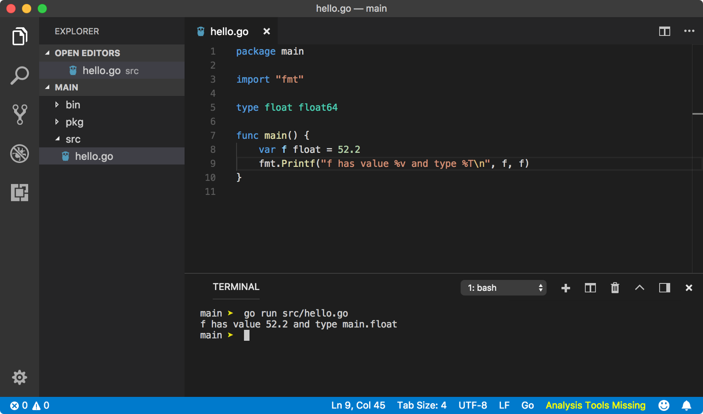
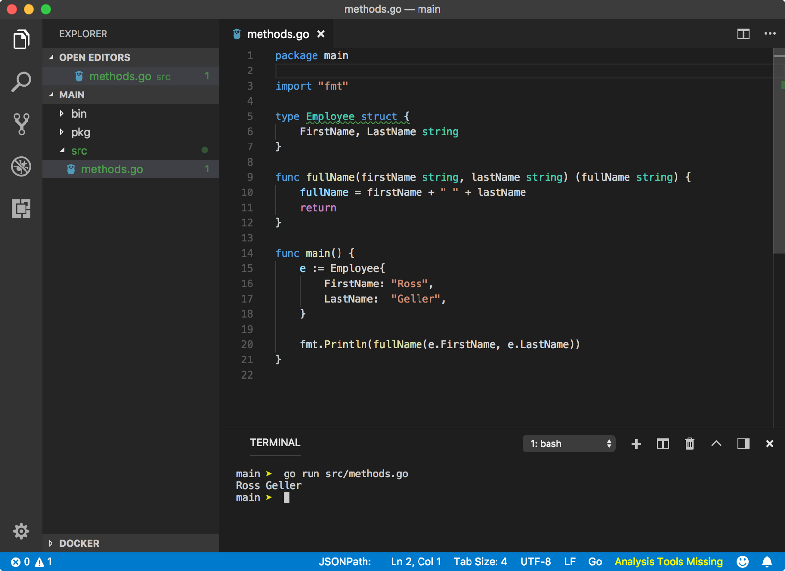

<!--more-->

## 1. 安装

通过 brew 安装的，所以`GOROOT=/usr/local/Cellar/go/1.12.3/libexec/ `
默认的`GOPATH=$HOME/go`

## 2. Go Workspace

它是系统上的一个目录，Go在这个目录下寻找source code文件，管理依赖包，build二进制文件。Go的`import`语句首先在Go的标准库（`$GOROOT/src`）下寻找，然后是`$GOPATH/src`。可以有多个Workspace, 只要让`GOPATH`指向当前workspace即可。

workspace的目录结构必须是：

- src (.go文件)
- pkg (.a文件，可以节约编译时间，`go install command on non-main packages`)
- bin (`go build <package-name> (main package) or go build program/path.go`会在当前目录生成二进制文件，`go install command runs go build command internally and output theses files to bin directory`)

## 3. Package

一个标准的可执行Go程序必须有`package main`声明。
> If a program is part of main package, then go install will create a binary file; which upon execution calls main function of the program. If a program is part of package other than main, then a package archive file is created with go install command. 

比如src>app>entry.go，里面有main函数，它的package声明是`package main`，`go install app`会发生什么呢？

在$GOPATH的src下找到app子目录，编译该包，在bin目录下生成app二进制可执行文件。
>`go install <package>` command looks for any file with main package declaration inside given package directory. If it finds a file, then Go knows this is an executable program and it needs to create a binary file. **A package can have many files but only one file with main function**, since that file will be entry point of the execution.
>
>If a package does not contain file with main package declaration, then Go creates a package archive (.a) file inside pkg directory.

### 3.1 Export members
>An utility package is supposed to provide some variables to a package who imports it. Go exports a variable if a variable name starts with **Uppercase**. 

### 3.2 Package import
>When you import a package, Go creates a global variable using package declaration of the package.

### 3.3 Nested package

`import "greet/de"`

### 3.4 Package initialization

A package scope is a region within a package where a declared variable is accessible from within a package (across all files in the package). This region is the top-most block of any file in the package.

1. 在同一个package下声明的**包变量**（而不是在函数内部），在不同的文件下也能直接使用，即是没有大写字母开头。
2. 在同一个package下不允许重新定义同名**包变量**，但在函数内部是可以的。
3. 函数内的变量初始化不允许前面的变量依赖后面定义的变量。
4. 包变量可以允许前面的变量依赖后面定义的变量，甚至是定义在同包不同文件中的函数。

### 3.5 Init function
1. 在包被导入的时候即被调用。
2. 可以有多个init函数，按照顺序执行
3. 在main函数之前执行。
4. init函数主要用于初始化全局变量，比如有些变量在package scope没法初始化，如array。
5. 同一个package中导入package时该初始化函数只被执行一次（an imported package is initialized only once per package.）

### 3.6 Package alias

We state a variable name in between import keyword and package name which is new variable to references the package.


## 4. 执行顺序
```
go run *.go
├── Main package is executed
├── All imported packages are initialized
|  ├── All imported packages are initialized (recursive definition)
|  ├── All global variables are initialized 
|  └── init functions are called in lexical file name order
└── Main package is initialized
   ├── All global variables are initialized
   └── init functions are called in lexical file name order
```

## 5. Variale

1. 与其他语言不一样的是，未初始化的变量会被分配相应的zero-value。   
2. 驼峰命名。   
3. 类型推导：从已有变量或者初始值复赋值的新变量可以不加类型
	
	```
	var integer1 = 52 //int
	var string1 = "Hello World" //string
	var boolean1 = false //bool
	```
4. short-hand notation

	```
	integer1 := 52 //int
	string1 := "Hello World" //string
	boolean1 := false //bool
	```
	
	- 只能用于function内部
	- 左边至少有一个是新声明的变量
5. 类型转换
	
	```
	var1 := 10 // int
	var2 := 10.5 // float
	// illegal 
	// var3 := var1 + var2
	// legal
	var3 := var1 + int(var2) // var3 == 20
	```
	
6. 类型别名
	
	
	
	
## 6. Const

```
const(
	a = 1 // a == 1
	b = 2 // b == 2
	c     // c == 2
	d     // d == 2
)
```

```
const(
    a = iota // a == 0
    b = iota // b == 1
    c = iota // c == 2
    d        // d == 3 (implicitely d = iota)
)
```


## 7. Interface

## 8. Method

method是归属于某种类型的function。它需要额外的一个参数，receiver，定义该method的归属类型。method可以访问receiver的属性。




另一个重要的区别是：同一个package下method可以同名(不同类型receiver下相同的方法名)，function不能同名。


**Methods on non-struct type**是不允许的。

### 6.1 Pointer receivers 

函数接收的是receiver的备份：


如果想要修改receiver本身，则需要接收receiver指针：


go针对此提供了一些快捷处理：


**针对内嵌匿名struct，有prompted field & prompted method**.

**Method can accept both pointer and value**

## 7. client-go in kubernetes

### 7.1 client-go对kubernetes资源对象的调用

整个调用的过程如下：

>kubeconfig→rest.config→clientset→具体的client(CoreV1Client)→具体的资源对象(pod)→RESTClient→http.Client→HTTP请求的发送及响应

2. ClientSet.CoreV1().Pods("").List(meta_v1.ListOptions{
		LabelSelector: string(nodelabel),
	})
3. 定义变量可以不指定类型吗

1. 连接API server

	```
	import (
	...
	    "k8s.io/client-go/tools/clientcmd"
	)
	func main() {
	    kubeconfig := filepath.Join(
	         os.Getenv("HOME"), ".kube", "config",
	    )
	    config, err := clientcmd.BuildConfigFromFlags("", kubeconfig)
	    if err != nil {
	        log.Fatal(err)
	    }
	...
	}
	```
2. 创建Clientset

	```
	func main() {
	    config, err := clientcmd.BuildConfigFromFlags("", kubeconfig)
	    ...
	    clientset, err := kubernetes.NewForConfig(config)
	    if err != nil {
	        log.Fatal(err)
	    }
	    
	    // 获得core API resource
	    api := clientset.CoreV1()
	}
	```


OCI runtime create failed: container_linux.go:348: starting container process caused "process_linux.go:402: container init caused \"rootfs_linux.go:58: mounting \\\"/var/lib/kubelet/pods/601d93a0-5fe7-11e9-9e41-70106fbaa0f6/volume-subpaths/docker-sock/commit-container/0\\\" to rootfs \\\"/var/lib/docker/overlay2/27bf152fc018e73f3d538d2901f4a5985a763a6d8cd0570b9a67a4629bb15399/merged\\\" at \\\"/var/lib/docker/overlay2/27bf152fc018e73f3d538d2901f4a5985a763a6d8cd0570b9a67a4629bb15399/merged/run/docker.sock\\\" caused \\\"no such file or directory\\\"\"": unknown


