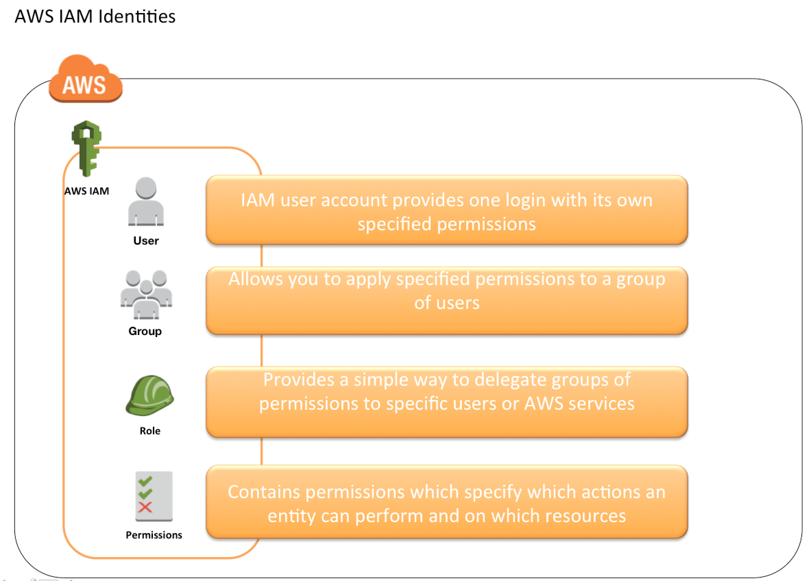

<!--more-->

## AWS Identity Access Management

### Overview

1. IAM 用于控制：
	- Identity – 谁可以使用你的 AWS 资源 (authentication)
	- Access – 哪些资源他们可以以哪种方式使用 (authorization)
2. AWS 账号可以创建多个 IAM 用户，或者 temporary access can be enabled through identity federation with corporate directory or third party providers.
3. global view 

### Features

1. 共享 AWS 账户，授权其他人管理和使用资源，而不用分享你的密码和access key.
2. 细粒度权限控制
3. EC2实例上的应用的安全访问。
	IAM can help provide applications running on EC2 instance temporary credentials that they need in order to access other AWS resources
4. Identity federation	
	- 允许用户没有 AWS 账号，通过 *corporate network or Google or Amazon authentication* 提供临时证书来访问 AWS 资源。
	- 大企业通常在 IAM 中集成他们自己的用户仓库，这样他们就可以通过公司账号登录 AWS
	- 使用 SAML 标准 （Active Directory）
5. Identity information for assurance   
	CloudTrail 会接收日志记录，其中包含账号请求资源的信息。
6. PCI DSS Compliance   
	IAM 支持处理、存储和传输 merchant 或者 service provider 的信用卡数据，and has been validated as being Payment Card Industry Data Security Standard (PCI DSS) compliant
7. 最终一致性
8. 免费
9. AWS Security Token Service   
	AWS charges only for the use of other AWS services accessed by the AWS STS temporary security credentials.
	
### Identities

#### Account Root User

1. Root Account 证书是注册时的邮件地址和密码。
2. Root Credentials 有所有不受限制的权限，包括账号安全证书，这其中包含敏感信息。
3. IAM 最佳实践 – 不要使用和共享根账号，而是创建一个独立的用户，该用户拥有 admin 权限。
4. 一个管理员账号可以拥有所有的权限，除了账号安全信息，付款信息和修改密码。

### IAM Users

1. IAM user 表示的是一个访问 AWS 的人或者服务。
2. IAM 最佳实践 – Create Individual Users
3. User credentials 可以由以下组成：
	- Password to access AWS services through AWS Management Console
	- Access Key/Secret Access Key to access AWS services through API, CLI or SDK
4. IAM user 最初没有任何的权限，需要根据每个 job function requirement 授予权限。
5. IAM 最佳实践 – Grant least Privilege
6. 每个 IAM user 只跟一个 AWS account 关联.
7. IAM User 不能通过 AWS 管理控制台重命名，只能通过 CLI 或者 SDK 工具。
8. IAM handles the renaming of user w.r.t unique id, groups, policies where the user was mentioned as a principal. However, you need to handle the renaming in the policies where the user was mentioned as a resource

1. 一个 IAM user 对应一个物理个体
2. 一个 IAM role 对应一个应用
3. IAM 证书不可以被共享

## AZ(Availible Zone)

1. AWS region 遍布全球
2. 所有 region 都有 AZs
3. 每个 AZ 是 region 里的物理数据中心，但相互间是独立的。所以灾难隔离。
4. 每个 AWS console 都是基于 region 范围的，除了 IAM 和 S3

## SecurityGroup

1. 可以绑定到多个instance
2. 限制在region/VPC组合
3. 在EC2之外，类似EC2的防火墙
4. 最好是对于SSH维护一个独立的安全组
5. 如果应用不可达（time out），那就是安全组的问题；如果是 connection refused 那就是应用本身的问题
6. 默认情况下所有inbound都被block，所有outbound都被授权

## EC2
### Elastic IPs

1. EC2重启之后可能public IP会变化，如果你想有个固定的public IP则需要一个 Elastic IP，它是一个IPv4地址，你可以把它attach到一个实例上。它的优点是当你当应用出错时可以把该IP映射到另外一个实例。
2. 你只能拥有5个Elastic IP, 可以向AWS申请增加。
3. 应该尽量避免使用Elastic IP，应该使用 DNS name 来解决上面的问题。

### EC2 User Data

可以写一些启动脚本

### EC2 Instance Launch Types

1. On Demand Instance: 短期负载，可预测的价格：
	按秒计费，适合auto-scale
2. Reserved Instance: 长期负载 >= 1年
	相比第一种高达75%的折扣，需要预先付款
3. Convertible Reserved Instance：长期负载，灵活的实例数
	可修改EC2实例类型，高达54%的折扣
4. Scheduled Reserved Instance: 在某个时间窗口启动
5. Spot Instance： 短期负载，便宜，
	90%的折扣，当价格低于你的bid price时启动实例，所以会lose instance；适用于批作业，大数据分析，可以容忍失败
6. Dedicated Instance: 没有customer共享你的硬件
7. Dedicated Hosts: 预订一整个物理机，可以控制实例的放置

### custom AMI

可以在AWS instance页面直接生成AMI，可以设置它的权限，copy等等。

可以分享给其他账户

限制在AWS region范围，不是global的。默认是private，并且限制在你的账户/region下，你可以公开它，并分享，或者到AMI Marketplace售卖。它会被存放到S3。

### Placement Groups

1. Cluster —— 一个AZ下的低延迟集群，同一个Rack,所以网络带宽大，但是不容灾
2. Spread —— 跨instance的硬件共享，每个AZ每个Group最多7个实例，容灾
3. 不适用于t2实例

## 高可用性和可扩展性

可扩展性：

1. 垂直扩展：   
	比如像RDS, ElasticCache可以通过升级它的type来获得更好的性能。
2. 水平扩展（弹性）   
	
高可用性：

1. 通常意味应用至少跑在两个AZ上

>Q: 在创建LB的时候选择了3个AZ，但是instance又只有一个，那这个的作用是什么呢？   
>A: 它是在三个AZ分别启动了一个instance

Load Balancer： ELB(EC2 Load Balancer)	

- AWS 保证它的可工作行
- AWS 负责它的升级，可维护，高可用
- AWS 提供了很少的配置 knobs

分类：

1. Classic Load Balancer(v1 - old generation) - 2009
	
	这个要在每个后端应用前创建一个
2. Application Load Balancer(v2 - new generation) - 2016
	
	在所有后端应用前创建一个
	
	
	ALB（7层）:
	
	- 可以在target group level 配置 stickness
		
		- 相同client的请求到同一个instance
		- 是直接通过ALB产生的，而不是通过应用。它会在ALB层面添加一个cookie
	- ALB支持HTTP/HTTPS & Websockets。支持转发，HTTP 转为 HTTPS。 
	- 后端应用服务器不能直接看到客户端IP、端口和协议，而是在X-Forwarded-For和X-Forward-Port，X-Forward-Proto字段里面
	- ALB可以基于hostname / path 路由
	- 非常适用于 ECS（Docker）
3. Network Load Balancer(v2 - new generation) - 2017

	NLB（4层）：
	
	- 转发TCP流量
	- 高性能，每秒百万级请求
	- 低延迟，大约100ms（vs 400ms for ALB）
	- 在对性能要求很高的场景下使用，不是你的默认选择
	- 直接看到客户端的IP
	- 必须绑定一个Elastic IP, 可以help whitelist by clients
	
	
stickness:

1. CLB 和 ALB 可以支持
2. 可以设置保持时间，直接在Target Group中设置

Load Balancer：SSL certificate

>Q:HTTPS listener:
• You must specify a default certificate   
• You can add an optional list of certs to support multiple domains   
• Clients can use SNI (Server Name Indication) to specify the hostname they reach   
• Ability to specify a security policy to support older versions of SSL /TLS (legacy clients)

ASG(Auto Scaling Groups)

A launch configuration:
 
- AMI + InstanceType
- EC2 User Data 
- EBSVolumes
- Security Groups 
- SSH Key Pair

	

