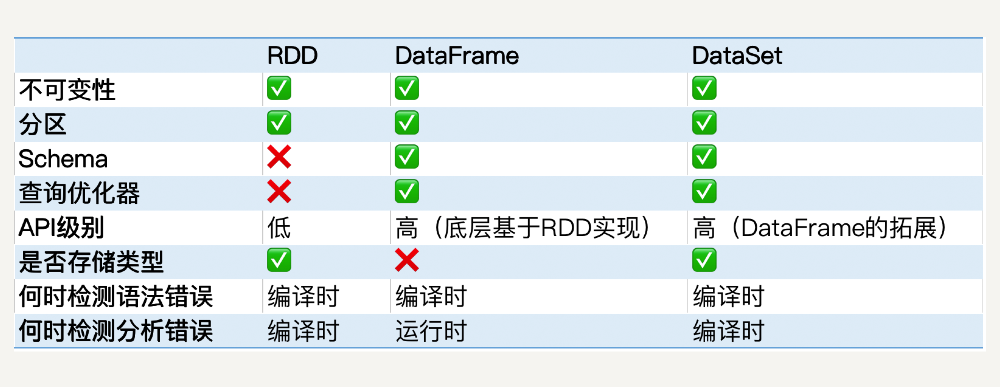

<!--more-->

# Hadoop


## MapReduce


## Pig


5颗星最多的最老的电影：

```
ratings = LOAD '/user/maria_dev/ml-100k/u.data' AS (userId:int, movieId:int, rating:int, ratingTime:int);

metadata = LOAD '/user/maria_dev/ml-100k/u.item' USING PigStorage('|') AS (movieId:int, movieTitle:chararray, releaseDate:chararray, videoRelease:chararray, imdbLink:chararray);

nameLookup = FOREACH metadata GENERATE movieId, movieTitle, ToUnixTime(ToDate(releaseDate, 'dd-mmm-yyyy')) AS releaseTime;

ratingsByMovie = GROUP ratings BY movieId;

avgRatings = FOREACH ratingsByMovie GENERATE group AS movieId, AVG(ratings.rating) AS avgRating;

fiveStarMovies = FILTER avgRatings BY avgRating > 4.0;

fiveStarsWithDate = JOIN fiveStarMovies BY movieId, nameLookup BY movieId;

oldestFiveStarMovies = ORDER fiveStarsWithDate BY nameLookup::releaseTime;

DUMP oldestFiveStarMovies;
```	

1颗星最多的电影：

```
ratings = LOAD '/user/maria_dev/ml-100k/u.data' AS (userId:int, movieId:int, rating:int, ratingTime:int);

metadata = LOAD '/user/maria_dev/ml-100k/u.item' USING PigStorage('|') AS (movieId:int, movieTitle:chararray, releaseDate:chararray, videoRelease:chararray, imdbLink:chararray);

nameLookup = FOREACH metadata GENERATE movieId, movieTitle;

ratingsByMovie = GROUP ratings BY movieId;

avgRatings = FOREACH ratingsByMovie GENERATE group AS movieId, AVG(ratings.rating) AS avgRating, COUNT(ratings.rating) AS ratingNums;

oneStarMovies = FILTER avgRatings BY avgRating < 2.0;

oneStarWithCount = JOIN oneStarMovies BY movieId, nameLookup BY movieId;

finalResults = FOREACH oneStarWithCount GENERATE nameLookup::movieTitle AS movieName, oneStarMovies::avgRating AS avgRating, oneStarMovies::ratingNums AS ratingNums;

mostOneStarMovie = ORDER finalResults BY ratingNums DESC;

DUMP mostOneStarMovie;
```

### Pig Latin

- LOAD STORE DUMP
	- STORE ratings INTO 'outRating' USING PigStorage(':');
- FILTER DISTINCT FOREACH/GENERATE MAPREDUCE STREAM SAMPLE
- JOIN COGROUP GROUP CROSS CUBE
- ORDER RANK LIMIT
- UNION SPLIT

调试：

- DISCRIBE
- ILLUSTRTE
- EXPLAIN

UDF:

- IMPORT
- REGISTER
- DEFINE

存储：

- PigStorage
- TextLoader
- JsonLoader
- AvroStorage
- ParquetStorage
- orcStorage
- HBaseStorage

## Spark


### 1 LowestRatedMovieDataFrame.py

```
from pyspark.sql import SparkSession
from pyspark.sql import Row
from pyspark.sql import functions

def loadMovieNames():
    movieNames = {}
    with open("ml-100k/u.item") as f:
        for line in f:
            fields = line.split('|')
            movieNames[int(fields[0])] = fields[1]
    return movieNames

def parseInput(line):
    fields = line.split()
    return Row(movieID = int(fields[1]), rating = float(fields[2]))

if __name__ == "__main__":
    # Create a SparkSession (the config bit is only for Windows!)
    spark = SparkSession.builder.appName("PopularMovies").getOrCreate()

    # Load up our movie ID -> name dictionary
    movieNames = loadMovieNames()

    # Get the raw data
    lines = spark.sparkContext.textFile("hdfs:///user/maria_dev/ml-100k/u.data")
    # Convert it to a RDD of Row objects with (movieID, rating)
    movies = lines.map(parseInput)
    # Convert that to a DataFrame
    movieDataset = spark.createDataFrame(movies)

    # Compute average rating for each movieID
    averageRatings = movieDataset.groupBy("movieID").avg("rating")

    # Compute count of ratings for each movieID
    counts = movieDataset.groupBy("movieID").count()

    # Join the two together (We now have movieID, avg(rating), and count columns)
    averagesAndCounts = counts.join(averageRatings, "movieID").filter()

    # Pull the top 10 results
    topTen = averagesAndCounts.orderBy("avg(rating)").take(10)

    # Print them out, converting movie ID's to names as we go.
    for movie in topTen:
        print (movieNames[movie[0]], movie[1], movie[2])

    # Stop the session
    spark.stop()

```
### 2 Running spark on a cluster 

如果只是IDE里面run那是在local运行，如果需要在cluster中运行则需要用命令行 `spark-submit`：

1. 确保代码里没有本地文件系统路径，应该用HDFS,S3等等
2. 打包工程为一个jar包
3. spark-submit --class <class object that contain your main function> --jars <path to any dependencies> --files <files you want placed alongside your application> <your JAR file>

spark-submit 的选项：

- --master

	- yarn - for running a YARN/Hadoop cluster
	- hostname:port - for connecting to a master on a spark standalone cluster
	- mesos://masternode:port
	- a master in you SparkConf will override this!!!
- --num-executor
	- must set explicitly with YARN, only 2 by default
- --executor-memory
	- make sure you dont try to use more memory than you have
- --total-executor-cores

对于其中的第2点：可以通过sbt来打包，可以把所有的依赖都打进包里（sbt是Scala的依赖管理工具）

```
sbt assembly
```

build.sbt

```
name := "PopularMovies"

version := "1.0"

organization := "com.sundogsoftware"

scalaVersion := "2.10.6"

libraryDependencies ++= Seq(
"org.apache.spark" %% "spark-core" % "1.6.1" % "provided"
)
```


最佳实践：

1. 用默认的SparkConf,这样最灵活，因为代码里面的是最高优先级，无法覆盖
2. 如果executor失败了，那么需要调整内存。specify memory per executor。
3. specify a cluster manager

调试和调优:

1. 可以通过4040端口连接到spark UI，看detail， stage， DAG，executor，environment
2. logs 

### 3 partition

Spark并不都是魔法，你需要自己分区，比如是self-join就是很昂贵的计算，Spark并不会自己去分发这些任务。因此你需要在执行昂贵操作前（join(), cogroup(), groupWith(), join(), leftOuterJoin(), rightOuterJoin(), groupByKey(), reduceByKey(), combineByKey(), lookup()）,执行.partitionBy()]

## Hive

**Distributing SQL queries with hadoop**

### 1 Why Hive?

1. SQL语法相似（HiveQL）
2. 交互式的
3. scalable——“big data” on a cluster
4. Easy OLAP queries(比 MapReduce 简单)	
5. 高度优化了的
6. 高度可扩展
	- User defined functions
	- Thrift server
	- JDBC/ODBC driver 

### 2 Why not Hive?

1. 高延迟——不适合OLTP（它底层也是做一些MapReduce，所以要花费较长时间）
2. 存储的数据 de-normalized（flat text files），所以不能像关系型数据库那样进行连接等操作。
3. SQL 操作有限：
	- Pig, Spark 支持更复杂的操作
4. 没有 record-level 的更新，插入和删除

### 3 HiveQL

与 MySql 非常接近，有一些扩展，比如 view，以及允许你指明如何存储和分区结构化数据。

```
CREATE VIEW topMovieIds AS
SELECT movie_id, count(movie_id) as ratingCount
FROM ratings
GROUP BY movie_id
ORDER BY ratingCount DESC;

SELECT m.name, ratingCount
FROM topMovieIds t JOIN movies m ON t.movie_id = m.id;
```
### 4 Schema On Read

传统数据库是在写的时候就已经有一个 schema 了，Hive 维护了一个 ‘metastore’ 告诉 HDFS 你定义的结构是什么，在 read 的时候 apply 这个schema。文件依然是以text file的形式存储。

```
CREATE TABLE ratings （
	user_id INT,
	moive_id INT,
	rating INT,
	rating_time INT
）ROW FORMAT DELIMTED
FIELDS TERMINATED BY '/t'
STORED AS TEXTFILE;

LOAD DATA LOCAL INPATH '${env.HOME}/bigdata/ml-100k/u.data' OVERWRITE INTO TABLE ratings;
```

### 5 数据在哪里：

1. LOAD DATA
	将数据从分布式文件系统移动到Hive
2. LOAD DATA LOCAL
	从本地文件系统copy到HIVE
	
Managed vs. External tables

1. 前面已经提到过，数据会被Hive管理，如果你执行了 drop table 那么数据也会被删除；
2. 如果你只是希望drop table 的时候只删除元数据，保留真正的数据，那么就需要使用create external table

	```
	CREATE EXTERNAL TABLE IF NOT EXISTS ratings（
		user_id INT,
		movie_id INT,
		rating INT,
		rating_time INT
	）ROW FORMAT DELIMITED FIELDS TERMINATED BY '\t'
	LOCATION '/data/ml-100k/u.data';
	```
	
### 6 Partitioning

当你只需要查询某个确定的分区时，优化效果会很明显。

```
CREATE TABLE customers (
	name STRING,
	address STRUCT<street:STRING, city:STRING, state:STRING>
) PARTITIONED BY (country STRING);
```
.../customers/country=CA/
.../customers/country=CB/

### 7 如何使用 Hive

1. 交互模式 通过 `hive>`
2. 保存为文件后执行 `hive -f /somepath/queries.hql`
3. 通过 Ambari / Hue
4. 通过 JDBC/ODBC server
5. 通过 Thrift 服务
6. 通过 Oozie

### 练习

```
drop view topmovieids;

CREATE VIEW IF NOT EXISTS topMovieIds AS
SELECT movie_id, avg(rating) as avgRating, count(movie_id) as countRating
FROM ratings
GROUP BY movie_id
HAVING countRating > 10
ORDER BY avgRating DESC;

SELECT m.name, avgRating
FROM topMovieIds t JOIN movies m ON t.movie_id = m.id;
```

## Sqoop

集成MySql 


从MySql 导入数据到HDFS:`sqoop import --connet jdbc:mysql://localhost/movielens --driver com.mysql.jdbc.Driver --table movies` 
-m 参数可以指定用多少个mapper

导入到hive：`sqoop import --connet jdbc:mysql://localhost/movielens --driver com.mysql.jdbc.Driver --table movies --hive-import`

确保同步：
`--check-column and --last-value`

导出:`sqoop export --connet jdbc:mysql://localhost/movielens -m 1 --driver com.mysql.jdbc.Driver --table exported_movies --export-dir /apps/hive/warehouse/movies --input-fields-terminated-by '\0001'`

数据库必须事先以创建好，并且列名是按照期望的顺序。

## HBase


基于Google发表的 BigTable


使用方式：

1. shell -- `hbase shell`
2. java API, 也有python或者scala的封装
3. Spark, Hive，Pig -- 也需要在 hbase 中先创建table，并且第一个column必须是唯一的。
	eg: 与pig集成:
	
	```
	users = LOAD '/user/maria_dev/ml-100k/u.user' 
	USING PigStorage('|') 
	AS (userID:int, age:int, gender:chararray, occupation:chararray, zip:int);
	
	STORE users INTO 'hbase://users' 
	USING org.apache.pig.backend.hadoop.hbase.HBaseStorage (
	'userinfo:age,userinfo:gender,userinfo:occupation,userinfo:zip');
	```
	
4. REST 服务

	- 开启 HBase 的 rest 端口：设置虚拟机的 network 端口；
	- Armbiri 开启 HBase 服务
	- 开启 HBase server : `usr/hdp/current/hbase-master/bin/hbase-daemon.sh start(stop) rest -p 8000 --infoport 8001`
	- python client:

	```
	from starbase import Connection

	c = Connection("127.0.0.1", "8000")
	
	ratings = c.table('ratings')
	
	if (ratings.exists()):
	    print("Dropping existing ratings table\n")
	    ratings.drop()
	
	ratings.create('rating')
	
	print("Parsing the ml-100k ratings data...\n")
	ratingFile = open("/home/Su/bigdata/ml-100k/u.data", "r")
	
	batch = ratings.batch()
	
	for line in ratingFile:
	    (userID, movieID, rating, timestamp) = line.split()
	    batch.update(userID, {'rating': {movieID: rating}})
	
	ratingFile.close()
	print("Committing ratings data to HBase via REST service\n")
	batch.commit(finalize=True)
	
	print("Get back ratings for some users...\n")
	print("Ratings for user ID 1:\n")
	print(ratings.fetch("1"))
	print("Ratings for user ID 33:\n")
	print(ratings.fetch("33"))
	```
5. Thrift 服务
6. Avro 服务 

## Cassandra


利用gossip 协议

CQL:

1. 它是Cassandra 的 API
2. 类似 SQL，但是有它的局限：数据不是格式的，不能join；所有的查询必须基于相同的主键
3. CQLSH 是命令行工具
4. keyspace 类似于MySql中的database, table都是基于database的。

## Cassandra和spark结合可以非常好地工作

DataStax 是一个 Spark-Cassandra connector, 可以直接将 Cassandra table 读取或者写入为 DataFrames

```
from pyspark.sql import SparkSession
from pyspark.sql import Row
from pyspark.sql import functions

def parseInput(line):
    fields = line.split('|')
    return Row(user_id = int(fields[0]), age = int(fields[1]), gender = fields[2], occupation = fields[3], zip = fields[4])

if __name__ == "__main__":
    # Create a SparkSession
    spark = SparkSession.builder.appName("CassandraIntegration").config("spark.cassandra.connection.host", "127.0.0.1").getOrCreate()

    # Get the raw data
    lines = spark.sparkContext.textFile("hdfs:///user/maria_dev/ml-100k/u.user")
    # Convert it to a RDD of Row objects with (userID, age, gender, occupation, zip)
    users = lines.map(parseInput)
    # Convert that to a DataFrame
    usersDataset = spark.createDataFrame(users)

    # Write it into Cassandra
    usersDataset.write\
        .format("org.apache.spark.sql.cassandra")\
        .mode('append')\
        .options(table="users", keyspace="movielens")\
        .save()

    # Read it back from Cassandra into a new Dataframe
    readUsers = spark.read\
    .format("org.apache.spark.sql.cassandra")\
    .options(table="users", keyspace="movielens")\
    .load()

    readUsers.createOrReplaceTempView("users")

    sqlDF = spark.sql("SELECT * FROM users WHERE age < 20")
    sqlDF.show()

    # Stop the session
    spark.stop()

```

## Mongodb


sharding quirks:

1. 自动sharding在这种情况下会失效 —— split storm， mongo process经常被重启
2. 必须有3个config server, 其中任何一个down机，DB都会down机；这是基于single-master设计

注意事项：

1. shell是一个JavaScript解释器
2. 支持多个索引，但是超过2-3个还是不被鼓励的；可以有空间索引，这样就可以基于经纬度进行搜索。
3. 内置聚合，MapReduce，gridfs；所以有的时候可以完全不需要hadoop,当然它也可以和hadoop, spark集成。

```
db.users.aggregate([
	{$group: {_id:{occupaton: "$occupation"}, avgAge: {$avg: "$age"}}}
	])
```

eg: 与spark集成:
MongodbSpark.py

```
from pyspark.sql import SparkSession
from pyspark.sql import Row
from pyspark.sql import functions

def parseInput(line):
    fields = line.split('|')
    return Row(user_id = int(fields[0]), age = int(fields[1]), gender = fields[2], occupation = fields[3], zip = fields[4])

if __name__ == "__main__":
    # Create a SparkSession
    spark = SparkSession.builder.appName("MongoDBIntegration").getOrCreate()

    # Get the raw data
    lines = spark.sparkContext.textFile("hdfs:///user/maria_dev/ml-100k/u.user")
    # Convert it to a RDD of Row objects with (userID, age, gender, occupation, zip)
    users = lines.map(parseInput)
    # Convert that to a DataFrame
    usersDataset = spark.createDataFrame(users)

    # Write it into Cassandra
    usersDataset.write\
        .format("com.mongodb.spark.sql.DefaultSource")\
        .option("uri", "mongodb://127.0.0.1/movielens.users")\
        .mode('append')\
        .save()

    # Read it back from Cassandra into a new Dataframe
    readUsers = spark.read\
    .format("com.mongodb.spark.sql.DefaultSource")\
    .option("uri", "mongodb://127.0.0.1/movielens.users")\
    .load()

    readUsers.createOrReplaceTempView("users")

    sqlDF = spark.sql("SELECT * FROM users WHERE age < 20")
    sqlDF.show()

    # Stop the session
    spark.stop()
```

## 数据库选型

1. scaling up
2. 技术实力
3. 预算
4. CAP
5. 简单

## Apache Drill

SQL for noSQL，基于谷歌的Dremel

1. Hive, MongoDB, HBase
2. json 或者 HDFS、S3、Azure、Google cloud、本地文件系统等上面的文件，但不支持Cassandra

注意事项：

尽管是执行真正的SQL，但是底层仍然是非关系型数据；它可以跨数据源系统进行查询

eg: 关联hive和mongodb查询每种职业的评价数。

## Phoenix

1. 基于 HBase 的 事物处理
2. 支持OLTP，优化
3. 开源
4. 提供 JDBC connector
5. 支持次级索引，用户定义方法
6. 可以和 MapReduce、Spark、Hive、Pig 、Flume
7. fast 


用法:

1. cli
2. Java API 
3. jdbc driver(thick client)
4. Phenex Query Server（thin client）—— 为了使非Java应用也可以使用
5. 提供给MapReduce、hive、pig、flume、spark的JAR 

eg: 与 Pig 集成：

```
create table users(
USERID INTEGER NOT NULL,
AGE INTEGER,
GENDER CHAR(1),
OCCUPATION VARCHAR,
ZIP VARCHAR
CONSTRAINT pk PRIMARY KEY (USERID)
);
```
phoenix.pig：

```
REGISTER /usr/hdp/current/phoenix-client/phoenix-client.jar

users = LOAD '/user/maria_dev/ml-100k/u.user' 
USING PigStorage('|') 
AS (USERID:int, AGE:int, GENDER:chararray, OCCUPATION:chararray, ZIP:chararray);

STORE users into 'hbase://users' using
    org.apache.phoenix.pig.PhoenixHBaseStorage('localhost','-batchSize 5000');

occupations = load 'hbase://table/users/USERID,OCCUPATION' using org.apache.phoenix.pig.PhoenixHBaseLoader('localhost');

grpd = GROUP occupations BY OCCUPATION; 
cnt = FOREACH grpd GENERATE group AS OCCUPATION,COUNT(occupations);
DUMP cnt;  

```
## Presto

1. 类似与Drill,可以连接不同的大数据数据库，类似SQL语法，适用于OLAP
2. JDBC, CLI, Tableau interface 

why Presto

1. 相比于 Drill,它支持Cassandra连接
2. 有成熟的使用场景

eg: 关联Cassandra和mongodb，查询每种职业的评价数。

## Yarn


工作机制（参考前面的MapReduce图片）：

1. 应用向ResourceManager申请distributed work。
2. 你可以指明数据位置——你想使用哪个HDFS块，YARN会尽量使你的进程运行在HDFS块同一个node上。
3. 你可以指明不同的调度选择，你可以在集群里同时跑多个应用，FIFO，容量或者公平调度。

## Tez

1. 可以使你的Hive,Pig，MapReduce 任务更快
2. 它可以替代MapReduce，上层应用可以选择使用Tez
3. 构造DAG以使更高效地处理分布式任务，甚至可以优化物理数据流向。
4. 所以可以直接让Hive和Pig使用Tez

## Mesos

1. 跟Yarn类似，也是一种资源管理工具，但不同的是Yarn局限于Hadoop中使用。
2. Spark 和 Storm 可以基于 Mesos，而不是 Yarn，YARN可以使用工具 Myriad 与 Mesos 集成。

Mesos vs YARN

1. YARN是一个整体的调度，你给它一个job，然后YARN决定哪里去run这个job；Mesos是一个两层系统，Mesos 只是提交资源到你的应用（框架），由你的应用决定接收与否，你也可以自己决定调度算法。
3. YARN对于长期的分析job做了优化；Mesos也可用于处理长期的任务，当然也可处理短期任务。

如果你的系统已经有Mesos了，那么选择它也许是个不错的选择，如果集群里面没有Mesos，那么用YARN也可以得到好的性能。

## Zookeeper

## Oozie

编排你的Hadoop job。

Workflow:


Workflow XML 结构：


上传到HDFS：

```
首先将数据导入到MySQL，导入之前要设置字符编码：
hadoop fs -put workflow.xml /user/maria_dev
hadoop fs -put oldmovies.sql /user/maria_dev
fs -put /usr/share/java/mysql-connector-java.jar /user/oozie/share/lib/lib_20161025075203/sqoop
重启oozie
oozie job --oozie http://localhost:11000/oozie --config /home/maria_dev/job.properties -run
```

## Zeppelin

a notebook interface to your big data 1

 类似 jupyter notebook 
 
 它有多种编译器：
 
 ```
 c
 wget http://
 wget http://
 hadoop fs -rm -r -f /tmp/ml-100k
 hadoop fs 	-mkdir /tmp/ml-100k
 hadoop fs -put /tmp/u.data /tmp/ml-100k/
 hadoop fs -put /tmp/u.item /tmp/ml-100k/
 然后执行scala程序
 final case class Rating(movieID: Int, rating: Int)
 val lines = sc.textFile("hdfs:////tmp/ml-100k/u.data").map(x => {val fields = x.split("\t");Rating(fields(1).toInt, fields(2).toInt)})
 
 import sqlContext.implicits._
 val ratingsDF = lines.toDF()
 
 ratingsDF.printSchema()
 
 val topMovieIDs = ratingsDF.groupBy("movieID").count().orderBy(desc("count")).cache()
 
 topMovieIDs.show()
 
 //use sparkSQL
 ratingsDF.registerTempTable("ratings")
 
 %sql
 select * from ratings limit 10
 ```
## Hue

Hadoop Use Experience

Hue 之于 Clodera，等价于 Ambari + Zeppelin 之于 Hortonworks

## Kafka -- feeding data to your cluster

```
cd /usr/hdp/current/kafka-broker/bin
//create
./kafka-topics.sh --create --zookeeper sandbox.hortonworks.com:2181 --replication-factor 1 --partition 1 --topic fred
//list
./kafka-topics.sh --list --zookeeper sandbox.hortonworks.com:2181 
//publish data
./kafka-console-producer.sh --broker-list sandbox.hortonworks.com:6667 --topic fred
//input data
//另启shell
./kafka-console-consumer.sh --bootstrap-server sandbox.hortonworks.com:6667 --zookeeper sandbox.hortonworks.com:2181 --topic fred --from-beginning 
```
## Flume -- feeding data to your cluster


built-in source type:

1. Spooling directory
2. Avro
3. Kafka
4. Exec
5. Thrift
6. Netcat
7. HTTP
8. Custom
9. And more!

built-in sink type:

1. HDFS
2. Hive
3. HBase
4. Avro
5. Thrift
6. Elasticsearch
7. Kafka
8. Custom
9. And more!

## Spark Streaming -- analyzing streams of data


demo:


```
mkdir checkpoint
export SPARK_MAJOR_VERSION=2
spark-submit --packages org.apache.spark:spark-streaming-flume_2.11:2.0.0 SparkFlume.py
//  启动flume
cd /usr/hdp/current/flume-server/
bin/flume-ng agent --conf conf --conf-file ~/sparkstreamingflume.conf --name a1
// 往 spooldir 添加文件
wget http://media.sundog-soft.com/hadoop/access_log.txt
cp access_log.txt spool/log22.txt
```

Spark Streaming 提供一个对于流数据的抽象 DStream。DStream 可以由来自 Apache Kafka、Flume 或者 HDFS 的流数据生成，也可以由别的 DStream 经过各种转换操作得来。底层 DStream 也是由很多个序列化的 RDD 构成，按时间片（比如一秒）切分成的每个数据单位都是一个 RDD。

### Structured Streaming 模型
如果可以拥有一个基于 DataFrame API 的流处理模块，作为工程师的我们就不需要去用相对 low level 的 DStream API 去处理无边界数据，这样会大大提升我们的开发效率。   

基于这个思想，2016 年，Spark 在其 2.0版本中推出了结构化流数据处理的模块 Structured Streaming。

是基于 Spark SQL 引擎实现的，依靠 Structured Streaming，在开发者眼里，流数据和静态数据没有区别。我们完全可以像批处理静态数据那样去处理流数据。


与 Spark Streaming 类似，Structured Streaming 也是将输入的数据流按照时间间隔（以一秒为例）划分成数据段。每一秒都会把新输入的数据添加到表中，Spark 也会每秒更新输出结果。输出结果也是表的形式，输出表可以写入硬盘或者 HDFS。

这里我要介绍一下 Structured Streaming 的三种输出模式:

1. 完全模式（Complete Mode）：整个更新过的输出表都被写入外部存储；
2. 附加模式（Append Mode）：上一次触发之后新增加的行才会被写入外部存储。如果老数据有改动则不适合这个模式；
3. 更新模式（Update Mode）：上一次触发之后被更新的行才会被写入外部存储。

**Structured Streaming 只会存储更新输出表所需要的信息。**

Structured Streaming 的模型在根据事件时间（Event Time）处理数据时十分方便。

在 Structured Streaming 发布以后，DaaFrame 既可以代表静态的有边界数据，也可以代表无边界数据。之前对静态 DataFrame 的各种操作同样也适用于流式DataFrame.


## Apache Storm -- analyzing streams of data

1. 集群中连续流处理的又一个框架, 延迟可以基于微秒级。
2. 基于独立事件，而不是微块（spark streaming那种模式）
3. Spark Streaming 可以和 MLLib, Graphx 等集成，生态更丰富。


demo:count words 

```
ambari中开启storm 和 kafka
cd /usr/hdp/current/storm-client
cd /contrib/storm-starter/src/jvm/org/apache/storm
ls
cd starter
vim WordCountTopology.java
storm jar /usr/bin/current/storm-client/contrib/storm-starter/storm-starter-topologies-*.jar org.strom.starter.WordCountTopology wordcount
127.0.0.7:8744 ui界面
查看日志，获取结果 cd /usr/hdp/current/storm-client/logs/workers-artifacts/

```

## Flink -- analyzing streams of data

1. Flink比Storm快
2. Flink类似Storm 提供了“real streaming”，但是如果你使用 Trident，那么也是采用的微块的形式
3. 虽然是用Java实现的，但Scala 支持很好，类似spark
4. 有它自己的生态，类似spark
5. Flink可以基于事件时间处理，而不是数据到达。很适合金融行业
6. 它采用了基于操作符（Operator）的连续流模型，可以做到微秒级别的延迟。

Flink 中最核心的数据结构是 Stream，它代表一个运行在多个分区上的并行流。

在 Stream 上同样可以进行各种转换操作（Transformation）。与 Spark 的 RDD 不同的是，Stream 代表一个数据流而不是静态数据的集合。所以，它包含的数据是随着时间增长而变化的。而且 Stream 上的转换操作都是逐条进行的，即每当有新的数据进来，整个流程都会被执行并更新结果。这样的基本处理模式决定了 Flink 会比 Spark Streaming 有更低的流处理延迟性。


在图中，你可以看出 Streaming Dataflow 包括 Stream 和 Operator（操作符）。

在 Flink 中，程序天生是并行和分布式的。一个 Stream 可以包含多个分区（Stream Partitions），一个操作符可以被分成多个操作符子任务，每一个子任务是在不同的线程或者不同的机器节点中独立执行的。


它的架构与Spark 架构比较类似，都分为四层：存储层、部署层、核心处理引擎、high-level 的 API 和库：


demo:count words 

[wordcount.scala](https://github.com/apache/flink/blob/master/flink-examples/flink-examples-streaming/src/main/scala/org/apache/flink/streaming/scala/examples/socket/SocketWindowWordCount.scala)

```
安装Flink: flink.apache.org 下载，解压，修改flink-conf.yml的port，因为虚拟机未开放那个端口。
./bin/start-local.sh
127.0.0.7:8082 ui界面
查看日志，获取结果 
```
## The Best of the Rest

### 1 Impala

1. Cloudera中可替换Hive，优先使用Impala
2. Hadoop 中大量的并发SQL引擎
3. Impala一直在running，所以避免了启动的花销
4. 比HIve快，但是Hive提供了更多的通用性

### 2 Accumulo

1. 另一个BigTable clone，类似HBase
2. 但是提供更好的安全模式，Cell-based 接入控制
3. 服务端编程

### 3 Ingite

1. in-memory data fabric 
2. 等价于Redis
3. 更接近于数据库 -- ACID,SQL支持，但是都在内存实现

### 4 Elasticsearch

1. 分布式文档搜索和分析引擎
2. 实时搜索

### 5 Kinesis（AWS 生态）

1. AWS版本的Kafka

### 6 Apache NiFi

1. Directed graphs of data routing, 可以连接到kafka, HDFS, Hive
2. 提供设计复杂系统的web ui
3. IoT 系统中常用

### 7 Falcon

1. a "data governance engine" 基于 Oozie
2. 包含在Hortonworks中
3. 类似NiFi，也提供UI界面设计数据处理图

### 8 Apache Slider

1. YARN 集群的部署工具
2. 提供监控


## 如何把这些技术组合起来解决实际的问题

### exam1: top 10 best-selling items on an e-commerce website

（从题目中可以看出有滑动窗口时间）

分析：

1. Work backwards:

	1. 百万级用户，QPS几千，要求低延迟;分布式NoSQL solution; Access Pattern is simple(give me the current top N sellers in category)
	2. 可以小时单位更新
	3. 高可用
	4. AP  => Cassandra，mongodb
2. 数据如何进入Cassandra
	Spark可以和Cassandra一起工作 => Spark Streaming
3. 数据如何进入 Spark Streaming
	Kafka/Flume（其中Flume为HDFS设计，也为log ingestion设计）   
	在此我们完全未提及需要Hadoop，所以并未选择Flume是最好的。
4. 安全
	日志不用记录谁买了什么，只需要记录买了什么。
	


可替换方案：

1. 如果你已经有个购物数据库，那么可以不用streaming，hourly batch job也可以满足你的要求 -- sqoop + spark -> Cassandra
2. 用Hbase, MongoDB，Redis(如果已经有专家) -> Cassandra 
3. Kafka -> Flume
4. HDFS -> Cassandra，这样可以在上层用一些分析工具，比如drill，presto

### exam2：电影推荐

分析：

1. Work backwards:

	1. 用户想要搜索到他未看过但是可能会喜欢的电影
	2. 他们自己的行为（评分、购买、浏览）是最好的参考
	3. AP  => Cassandra，mongodb
2. 电影推荐如何进入Cassandra

	1. 需要机器学习库 Spark MLLib/Flink 
	2. Timeliness requirements , real-time ML
	Spark可以和Cassandra一起工作 => Spark Streaming
3. Creative thinking:
	
	1. 预先为每个用户计算（非实时、资源浪费）
	2. item-based collaborative filtering, 不经常变化
		find every pair of movies that were watched by the same person; measure the similarity of their ratings across all users who watched both; sort by movie, then by similarity strength
	3. 找相似电影
	4. 快速找到你以前的评分、浏览等


### exam3：设计网页分析系统，该系统会记录网站的会话，现需要统计每日唯一会话数量

要求：

1. only run daily -> spark streaming
2. 存储session data 


如果已有会话数据库，就用sqoop去导入，那么你甚至不需要HDFS,Hive
	

# 大规模数据处理框架


# 超大规模数据处理

## 1 技术发展可以分为三个阶段：

1. 石器时代：MapReduce 诞生之前
2. 青铜时代: MapReduce 诞生
3. 蒸汽时代：MapReduce 在 Google内部被替换为FlumeJava（因为MapReduce维护成本高；时间性能不足）

## 2 服务等级SLA(评估我们设计的分布式系统)

可用性、准确性、系统容量、延迟

可扩展性、持久性、一致性

一致性分为：

- 强一致性：一般会牺牲一部分延迟，而且对于全局时钟要求很高，比如Google Cloud的Cloud Spanner，就是一款具备强一致性的全球分布式企业级数据库服务。
- 弱一致性
- 最终一致性：延迟较小，比如AWS的Dynamo DB

## 3 批处理/流处理

有边界数据 -- 日志分析、计费应用程序、数据仓库   
无边界数据 -- 实时监控、实时商业智能、销售终端

## 4 大规模数据处理中用到的四种设计模式：

- 复制模式
- 过滤模式
- 分离模式
- 合并模式

## 5 发布/订阅模式的使用场景

- 系统的发送方需向大量的接收方广播消息
- 系统中的某一个组件需要与多个独立开发的组件或服务进行通信，而这些独立开发的组件或服务可以使用不同的编程语言和通信协议。
- 无需接收方进行实时响应
- 只需要支持数据最终一致性

## 6 Lamda架构，Kappa架构


应该对用户投放什么样的广告？作为一个查询到来时，我们从服务层既查询服务层中保存好的批处理输出模型，也对速度层中处理的实时行为进行查询。缺点：维护很复杂

改造：改进Lamda架构，改进速度层的系统性能，使它也可以处理好数据的完整性和准确性问题呢？改进速度层，使它既能够进行实时数据处理，同时也能够在业务逻辑更新的情况下重新处理以前处理过的数据。

利用 Kafka 具有永久保存数据日志的功能，改进为 Kappa 架构：

1. 部署Kafka，并设置数据日志的保留期
2. 需要对历史数据进行重新计算，LogOffset 设为0
3. 新的数据视图处理过的数据进度赶上了旧的数据视图时，我们的应用便可以切换到新的数据视图中读取
4. 停止旧版本的作业实例，删除旧视图


## 7 MapReduce 的缺陷：

1. MapReduce 模型的抽象层次太低，大量的底层逻辑都需要开发者手工完成
2. 只提供Map 和 Reduce 两个操作
3. 在Hadoop中，每个Job的计算结果都会存储在HDFS文件存储系统中，所以每步计算都要进行硬盘的读取和写入，大大增加了系统的延迟
4. 只支持批数据处理

在任务级别上，Spark的并行机制是多线程模型，而MapReduce是多进程模型。虽然多进程模型便于细粒度控制每个任务占用的资源，但会消耗较多的启动时间。而Spark同一个节点上的任务以多线程的方式运行在一个JVM进程中，可以带来更快的启动速度，更高的CPU利用率，以及更好的内存共享。

## 8 RDD

### Spark 为什么需要新的数据抽象模型？

MapReduce 之所以运行速度慢，DAG的中间计算结果需要写入硬盘这样的稳定存储介质中防止运行结果丢失，这样反复对硬盘进行读写操作以及潜在的数据复制和序列化操作大大提高了计算的延迟。

因此，需要一种新的分布式存储方案，不仅保持之前系统的稳定性、错误恢复性和可扩展，还要尽可能地减少硬盘I/O操作。

也就是在分布式内存中，存储中间计算的结果。RDD就是一个基于分布式内存的数据抽象。

### RDD表示已被分区、不可变的，并能够被并行操作的数据集合。

1. 分区。代表同一个RDD包含的数据被存储在系统的不同节点中，这也是它可以被并行处理的前提。逻辑上，我们可以认为RDD是一个大的数组。数组中的每个元素代表一个分区。在物理存储中，每个分区指向一个放在内存或者硬盘中的数据块。

	
	
	RDD中每个分区存有它在该RDD中的index。通过RDD的ID 和 分区的INDEX 可以唯一确定对应的数据块的编号，从而通过底层存储层的接口提取到数据进行处理。
	
	在集群中，各个节点上的数据块会尽可能地存放在内存中，只有当内存没有空间时才会存入硬盘。
	
	虽然RDD内部存储的数据是只读的，但是，我们可以去修改(例如通过repartition转换操作)并行计算单元的划分结构，也就是分区的数量。
	
2. 不可变的。函数式编程，只可以对现有的RDD进行转换。好处是：记录了它的依赖关系，而不用立刻去具体存储计算出的数据本身。这样有助于提升Spark的计算效率，并且使错误恢复更加容易。

### RDD包含的信息：分区信息、所依赖的父RDD、怎样的转换得到的。

- SparkContext: SparkContext 是所有 Spark 功能的入口，它代表了与 Spark 节点的连接，可以用来创建 RDD对象以及在节点中的广播变量等。一个线程只有一个SparkContext   
- SparkConf
- Partitioner: 有Hash partitioner 和 Range partitioner两种
- Denpendencies
- Partitions：RDD中数据的逻辑结构
- checkpoint：对一些计算耗时的RDD，我们可以把它缓存至硬盘或者HDFS中，标记这个RDD有被检查点处理过，并且**清空它的所有依赖关系**。同时给它新建一个依赖于checkpointRDD依赖关系，checkpointRDD可以用来从硬盘中读取RDD和生成新的分区信息。
- Storage Level: 枚举类型 -- MEMORY_ONLY MEMORY_AND_DISK DISK_ONLY MEMEORY_ONLY_2 MEMORY_AND_DISK_2
- Iterator: 表示RDD怎么样通过父RDD计算得到的
	

### RDD的依赖关系可以分为以下两种：

- 窄依赖（map, filter, union）: 父RDD的分区可以一一对应到子RDD分区
- 款依赖（join, groupBy）：父RDD的每个分区可以被多个子RDD的分区使用

### RDD持久化（缓存）

它和checkpoint不同的是checkpoint会清空RDD的依赖关系。

cache()和persist()的区别：persist()可以选择存储到磁盘，避免节点down机丢失数据。

## 9 Spark 生态

### SparkSQL

Spark生态系统提供了很多库，让我们在不同的场景中使用。

Hive之于Hadoop，就如编程语言中的高级语言，Hive提供类似SQL的编程接口，HQL语句经过语法解析、逻辑计划、物理计划转化成MapReduce程序执行，使得开发人员很容易对HDFS上存储的数据进行查询和分析。在Spark刚问世的时候，Spark团队也开发了一个Shark来支持用SQL语言查询Spark的数据，它的本质其实也是Hive，因此它无法利用Spark的特性进行深度优化。


DataFrame 和 DataSet 是 Spark SQL 提供的基于 RDD 的结构化数据抽象。RDD 是 Spark 最基本的数据抽象。就像 Java 里的基本数据类型（Primitive Type）一样，所有的数据都可以用基本数据类型描述。

**所以，Spark 是一个高度统一的平台，所有的高级 API 都有相同的性质，它们之间可以很容易地相互转化。Spark 的野心就是用这一套工具统一所有数据处理的场景。**

### DataSet

DataSet，顾名思义，就是数据集的意思，它是 Spark 1.6 新引入的接口。同RDD一样，Dataset也是不可变分布式的数据单元，它既有与RDD类似的各种转换和动作含义，而且还享受Spark SQL优化过的执行引擎，使数据搜索效率更高。Dataset的内部结构包含了执行计划，即生成数据集所包需要的所有的运算。当动作操作执行时，Spark SQL的查询优化器会优化这个逻辑计划，并生成一个可以分布式执行的、包含分区信息的物理计划。


DataSet提供数据表的schema信息。这样的结构使得 DataSet API 的执行效率更高。比如，如果我们要查询 People 的年龄信息，Spark SQL 执行的时候可以依靠查询优化器仅仅把需要的那一列取出来，其他列的信息根本就不需要去读取了。所以，有了这些信息以后在编译的时候能够做更多的优化。其次，由于 DataSet 存储了每列的数据类型。所以，在程序编译时可以执行类型检测。

### DataFrame
DataFrame 可以被看作是一种特殊的 DataSet。它也是关系型数据库中表一样的结构化存储机制，也是分布式不可变的数据结构。但是，它的每一列并不存储类型信息，所以在编译时并不能发现类型错误。DataFrame 每一行的类型固定为 Row，他可以被当作 DataSet[Row] 来处理，我们必须要通过解析才能获取各列的值。

所以，对于 DataSet 我们可以用类似 people.name 来访问一个人的名字，而对于 DataFrame我们一定要用类似 people.get As \[String] (“name”) 来访问。



RDD 和 DataSet 都是类型安全的，而 DataFrame 并不是类型安全的。这是因为它不存储每一列的信息如名字和类型。


### MLLib

1. 特征值获取 -- 词频 IDF
2. 基本统计 -- Chi-squared test
3. 线性回归、逻辑回归
4. 支持向量机
5. 朴素贝叶斯
6. 决策树
7. K-Means 聚类
8. Pricipal component analysis，singular value decomposition
9. recommendations using Alternative Least Squares
E