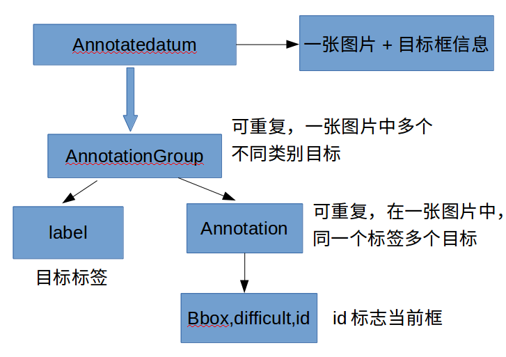

<!--more-->

> 问题1：对于不同类型的任务，如 DETECTION, SEGMENTATION, CLASSIFICATION, 人脸标注27点， 3D标注，可以生产COCO 和 VOC 两种类型的数据集，数据集中的元数据是如何确定的呢？


> 问题2：对于不同的数据类型，它对应的压缩类型有哪些呢？如LMDB, TFRECORD等。。。

### 1. 先看下TFRECORD 是什么。

TFRecord是谷歌推荐的一种二进制文件，理论上可以保存任何格式的信息。整个文件由文件长度信息、长度校验码、数据、数据校验码组成。但对于普通开发而言，不需要关心这些，TensorFlow提供了丰富的API可以帮助我们轻松读写TFRecord文件。它的核心内容在于内部有一系列的Example，Example是protocolbuf协议下的消息体。

一个 Example 消息体包含了一系列的 feature 属性。

每一个 feature 是一个 map，也就是 key-value 的键值对。

key 取值是 String 类型。

而 value 是 Feature 类型的消息体，它的取值有 3 种：

BytesList
FloatList
Int64List
**需要注意的是，他们都是列表的形式。**

将其他数据存储为TFRecords文件的时候，需要经过两个步骤：

1. 建立TFRecord存储器

	```
　　在tensorflow中使用下面语句来建立tfrecord存储器:tf.python_io.TFRecordWriter(path) //path,创建的TFRecords文件的路径 
	
	方法: 
	
		1. write（record):向文件中写入一个字符串记录（即一个样本）
		2. close() : 在写入所有文件后，关闭文件写入器。
	注：此处的字符串为一个序列化的Example,通过Example.SerializeToString()来实现，它的作用是将Example中的map压缩为二进制，节约大量空间。
```
2. 构造每个样本的Example模块

	```
	example = tf.train.Example(
            features=tf.train.Features(feature={
                "label": tf.train.Feature(float_list=tf.train.FloatList(value=[string[1]])),
                'img_raw': tf.train.Feature(bytes_list=tf.train.BytesList(value=[img_raw])),
                'x1_offset':tf.train.Feature(float_list=tf.train.FloatList(value=[string[2]])),
                'y1_offset': tf.train.Feature(float_list=tf.train.FloatList(value=[string[3]])),
                'x2_offset': tf.train.Feature(float_list=tf.train.FloatList(value=[string[4]])),
                'y2_offset': tf.train.Feature(float_list=tf.train.FloatList(value=[string[5]])),
                'beta_det':tf.train.Feature(float_list=tf.train.FloatList(value=[string[6]])),
                'beta_bbox':tf.train.Feature(float_list=tf.train.FloatList(value=[string[7]]))
            }))
            
   构造好了Example模块后，我们就可以将样本写入文件了：
	writer.write(example.SerializeToString())
	```
	
###  2. LMDB是什么

LMDB是基于Btree-based的高性能mmap key-value数据库，是在BerkeleyDB的基础上改进来的，支持事务操作，支持多进程访问。只产生两个文件data.mdb与lock.mdb，它的访问简单，不需要运行单独的数据库管理进程，只要在访问数据的代码里引用LMDB库，访问时给文件路径即可。它的主要优势是减少了IO开销，LMDB的整个数据库放在一个文件里，避免了文件系统寻址的开销。

Caffe中的LMDB数据：

1. 输入DataLayer的训练/测试数据集
2. extract_feature输出的特征数据

Caffe并不是把向量和矩阵直接放进数据库的，而是将数据通过caffe.proto里定义的一个datum类来封装。数据库里放的是一个个的datum序列化成的字符串。

一个Datum有三个维度，channels, height 和width，可以看做是少了num维度的Blob。存放数据的地方有两个：byte_data和float_data，分别存放整数型和浮点型数据。图像数据一般是整形，放在byte_data里，特征向量一般是浮点型，放在float_data里。label存放数据的类别标签，是整数型。encoded标识数据是否需要被解码（里面有可能放的是JPEG或者PNG之类经过编码的数据）。

Datum这个数据结构将数据和标签封装在一起，兼容整形和浮点型数据。


SSD读取训练集是从LMDB中读取AnnotatedDatum结构的数据，在训练和测试之前，要将图片和XML(label)数据存储为AnnotatedDatum结构，然后将数据经过反序列化，存入到LMDB数据库。训练和测试的时候直接从LMDB读取数据，经过反序列化获取AnnotatedDatum结构的数据，获得训练集的图片和XML数据。可参看[该博客](https://blog.csdn.net/Touch_Dream/article/details/80598901)


LMDB 存储的为单标签的数据，因此一般只针对目标检测和图片分类。

caffe 本身并不支持 多类标的输入， 该框架主要用于解决图片分类的问题，而目前，两个重要的问题需要多标签的输入：多任务学习（multi-task）和多标签分类（multi-label）。目前，网上流行的多标签输入方法主要有以下四种：

1. 最简单，使用mxnet，它本身支持了多标签分类的问题，因此也自带了多标签的输入
2. 用HDF5 + Slice Layer的方法完成，这种方法实现上没有什么难度，但是当数据量很大时，HDF5的存储方式会产生数十倍于图片的硬盘消耗，而且生成的过程也非常缓慢。
3. 用两个data的输入（两个LMDB），一个只输出图片，一个只输出标签，这种方法相对前面两种要难一些，不过应该效果也不错
4. 直接修改caffe的网络使其满足多标签的输入


## 卷积神经网络CNN

### R-CNN 

**2014年：R-CNN - 将CNN用于对象检测的起源**

R-CNN的目标是分析图像，并正确识别图像中主要对象，通过边界框标出对象的具体位置。

输入：图像
输出：图像中每个对象的边界框和标签

但是我们如何确定这些边界框的大小和位置呢？R-CNN网络通过以下操作完成了一个我们直观上可以完成的任务：在图像中提出了多个边框，并判断这其中的任何一个是否对应着一个具体对象。

R-CNN网络使用了选择性搜索的方法，来创建这些边界框或区域建议（region proposal）。在图6中，选择性搜索通过不同大小的边框分析图像，并且对于每个图像块，尝试通过纹理、颜色或强度将相邻像素组合在一起，以识别对象。

创建了区域建议后，R-CNN网络将该区域块变形标准的方形，并将其输入到改进版的AlexNet网络，具体步骤如图7所示。AlexNet是在ImageNet 2012比赛中的最优网络，R-CNN灵感就来源于它。

在CNN的输出层，R-CNN网络还应用了支持向量机（SVM）的方法，它能够判断该图像是否为对象，以及是什么对象。

**改善边界框**

现在，我们已经能在边界框中找到对象，但是还能缩小边界框来适应对象的真实尺寸吗？可以的，这就是构建R-CNN网络的最后一个步骤。R-CNN网络对区域建议进行简单的线性回归操作，来获得更贴近的边界框坐标，获得了R-CNN网络的最终输出结果。回归模型的输入和输出分别为：

输入：与对象相对应的图像子区域。
输出：子区域中对象的新边界框坐标。

所以，R-CNN网络总结为以下几个步骤：

1. 为边界框生成一组区域建议；
2. 通过预先训练好的AlexNet网络来判断边框中的图像是否为有效区域，最后通过支持向量机算法来确定边框中的图像类别；
3. 在确定边框图像的类别后，应用线性回归模型，来输出更紧密的边框坐标。

### Fast R-CNN

**2015年：Fast R-CNN - 加速并简化R-CNN**

R-CNN网络的性能很好，但是实际上训练起来很慢，有以下几个原因：

单个图像的每个区域建议都需要利用AlexNet网络进行判断，每次判断大约需要2000次前向传播。
此网络必须单独训练三种不同的模型：提取图像特征的CNN网络，判断类别的分类器和缩小边框的回归模型。这样子很难训练这些网络。

**创新点1：引入感兴趣区域池化（ROI Pooling）**

在CNN的前向传递过程中，Girshick意识到，每个图像的多个区域总是互相重叠，导致我们多次运行相同的CNN计算，多达2000次。他的创新很简单：可不可以对每个图像只运行一次CNN运算，然后在2000次前向传播过程中找到一种共享这个计算结果的方法？

**创新点2：将所有模型整合到一个网络中**

Fast R-CNN的第二个创新点是在一个模型中联合训练卷积神经网络、分类器和边界框回归模型。在R-CNN中，我们使用了卷积神经网络来提取图像特征，用支持向量机来分类对象和用了回归模型来缩小边界框，但是Fast R-CNN使用单个网络模型来实现以上三个功能。

整个模型的输入和输出分别为：

输入：带多个区域建议的图像。
输出：具有更紧密边界框的每个区域的对象类别。

### Faster R-CNN

**2016年：Faster R-CNN - 加快区域建议**

即使Fast R-CNN的性能有了很大的改善，但是仍然存在一个短板——区域建议生成方式（region proposer）。在上面已经提到，为了检测图像中对象位置，第一步是要产生一系列随机多尺度的边界框或是待测试的感兴趣区域。在Fast R-CNN中，通过选择性搜索方法创建这些区域，这是一个相当缓慢的过程，被认为是整个流程的短板。

Faster R-CNN的创新点在于，区域建议取决于通过CNN里的第一个卷积层前进传播过程中的图像特征。那为什么不对单独运行选择性搜索算法的方式进行改变，重复利用多个区域建议中相同的CNN结果呢？

**如何生成区域**

接下来我们来看下Faster R-CNN如何从CNN特征中生成这些区域建议。Faster R-CNN在CNN特征的顶部添加了一个完全卷积网络（FCN），创建了所谓的区域建议网络（Region Proposal Network）。

### Mask R-CNN

**2017年：Mask R-CNN - 扩展Faster R-CNN用于像素级分割**


这是Facebook Research组最近发布的一篇文章，其扩展了这种对象检测技术，且提供了像素级分割的技术。


