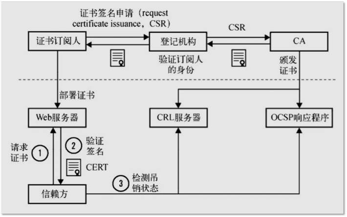
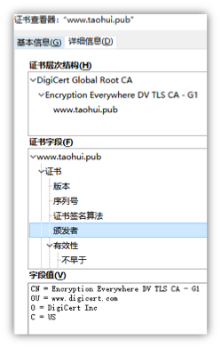
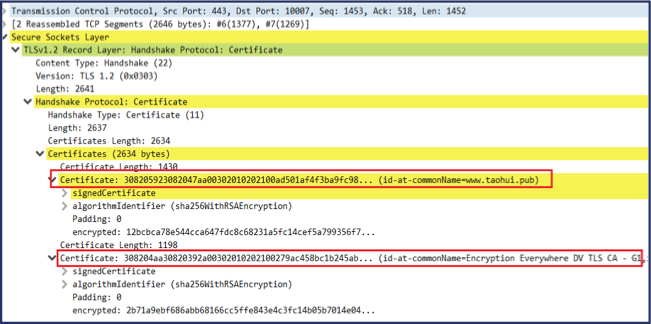
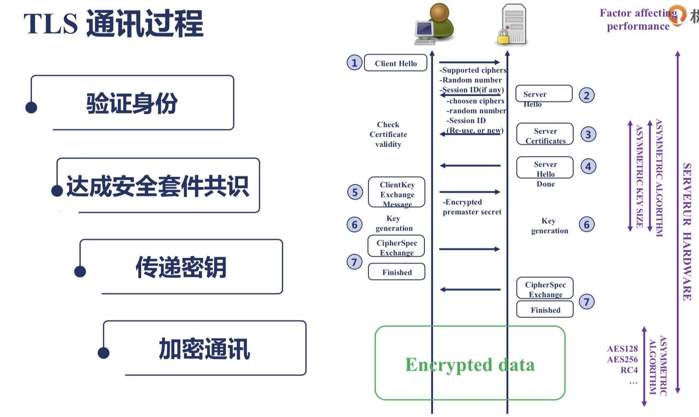

<!--more-->

# 反向代理

上游服务器配置：

```
server {
   listen 127.0.0.1:8011;   //只能被本机的进程访问
	default_type text/plain;
	limit_rate 1;
        return 200 '8011 server response.\n';
}
```
反向代理服务器的配置：

```
server {
    listen       80;
    server_name  localhost;
    
    location / {
       proxy_set_header Host $host; 
       proxy_set_header X-Real-IP $remote_addr;
       proxy_set_header X-Forwarded-For $proxy_add_x_forwarded_for;
       proxy_pass http://local;
}
```

### proxy_pass指令的使用

带有URL和不带有URL的使用举例：

```
//upserver的配置
server {
   listen 127.0.0.1:8011;
   default_type text/plain;
   return 200 '8011 server response.\n';
}

server {
    listen 8012;
    default_type text/plain;
    return 200 '8012 server response. 
uri: $uri'}

//反向代理服务器
upstream proxyupstream {
	server 127.0.0.1:8012 weight=1;
}

server {
	server_name proxy.taohui.tech;
	error_log logs/myerror.log debug;
	access_log logs/upstream_access.log varups;

	location /a {
		proxy_pass http://proxyupstream;
		#proxy_method POST;

		proxy_pass_request_headers off;
		#proxy_pass_request_body off;
		proxy_set_body 'hello world!';
		proxy_set_header name '';
		proxy_http_version 1.1;
		proxy_set_header Connection "";
}

//reload之后命令行访问
# curl proxy.taohui.tech/a/b/c
8012 server response. 
uri: /a/b/c

// 如果proxy_pass http://proxyupstream/www;
# curl proxy.taohui.tech/a/b/c
8012 server response. 
uri: /www/b/c
```


### 很多时候需要用到方向代理服务器的缓存功能，缓存功能如何配置呢：

```
proxy_cache_path /tmp/nginxcache levels=1:2 keys_zone=my_cache:10m max_size=10g inactive=60m use_temp_path=off;

server {
    listen       80;
    server_name  localhost;
    
    location / {
       proxy_cache my_cache;
       proxy_cache_key $host$uri$is_args$args; //不同的用户可能返回不同的内容，所以key选择和用户相关
       proxy_cache_valid 200 304 302 1d; // 对于哪些响应不返回
       proxy_pass http://local;
}
```

# access.log

用[goaccess](http://goaccess.io)分析access日志 goaacess.io

# https协议的配置

### 证书的公信力是如何保证的呢？



### 证书的类型

1. 域名验证（DV）证书
	`https://www.**taohui.pub**`只会验证域名的归属是否正确，只要你的域名指向的是你正在申请证书那台服务器，就可以成功申请到证书。
2. 组织验证（OV）证书
	`https://www.**jd.com**`会验证我们在申请的时候填写的机构、企业名称是否正确。所以OV证书的申请往往需要几天的时间。
3. 扩展验证（EV）证书
	`https://www.**mingyou.com**`它会做更严格的验证，所以大部分浏览器会对这类证书的显示表现得非常友好，它会把申请证书时候填写的机构名称显示在地址栏的最左侧。
	
证书链：

 
 
 根证书一般是操作系统内置或者浏览器内置，所以不需要传输给NGINX。只需要传输二级证书和主域名证书。
 
 ### TLS通讯过程
 
 
