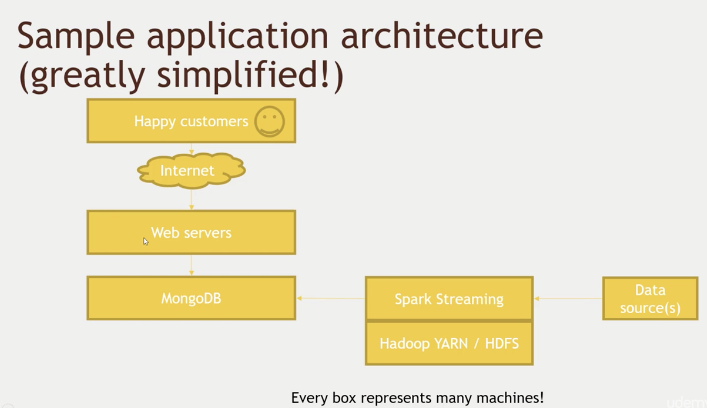
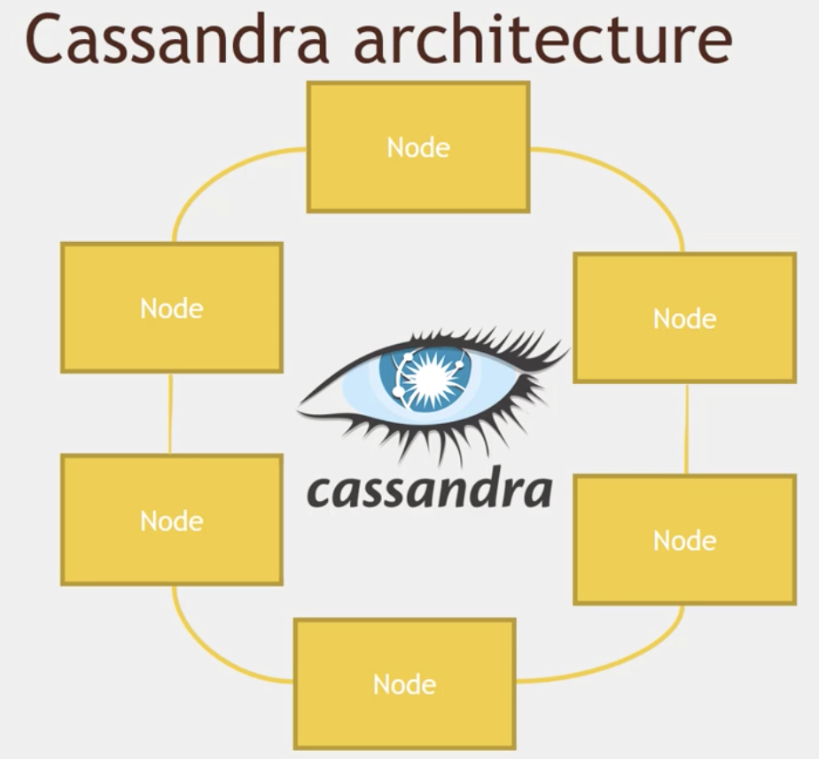

*  目录
{:toc}
	
	
<!--more-->

# 数据库相关技术
## HBase



基于Google发表的 BigTable


Hbase是由Client、Zookeeper、Master、HRegionServer、HDFS等几个组建组成。


- Client包含了访问Hbase的接口，另外Client还维护了对应的cache来加速Hbase的访问，比如cache的.META.元数据的信息。
- Hbase通过Zookeeper来做master的高可用、RegionServer的监控、元数据的入口以及集群配置的维护等工作。具体工作如下：
	1. 通过Zoopkeeper来保证集群中只有1个master在运行，如果master异常，会通过竞争机制产生新的master提供服务
	2. 通过Zoopkeeper来监控RegionServer的状态，当RegionSevrer有异常的时候，通过回调的形式通知Master RegionServer上下线的信息
	3. 通过Zoopkeeper存储元数据的统一入口地址。
- master节点的主要职责如下：
	1. 为RegionServer分配Region
	2. 维护整个集群的负载均衡
	3. 维护集群的元数据信息发现失效的Region，并将失效的Region分配到正常RegionServer上当RegionSever失效的时候，协调对应Hlog的拆分
- HregionServer直接对接用户的读写请求，是真正的“干活”的节点。它的功能概括如下：
	1. 管理master为其分配的Region
	2. 处理来自客户端的读写请求
	3. 负责和底层HDFS的交互，存储数据到HDFS
	4. 负责Region变大以后的拆分
	5. 负责Storefile的合并工作
- HDFS为Hbase提供最终的底层数据存储服务，同时为Hbase提供高可用（Hlog存储在HDFS）的支持。


	
### Region寻址方式（通过zookeeper .META）：


1. Client请求ZK获取.META.所在的RegionServer的地址。
2. Client请求.META.所在的RegionServer获取访问数据所在的RegionServer地址，client会将.META.的相关信息cache下来，以便下一次快速访问。
3. Client请求数据所在的RegionServer，获取所需要的数据

### Hbase的写逻辑


1. 获取RegionServer--Client获取数据写入的Region所在的RegionServer
2. 请求写Hlog--请求写Hlog,Hlog存储在HDFS，当RegionServer出现异常，需要使用Hlog来恢复数据。
3. 请求写MemStore--请求写MemStore,只有当写Hlog和写MemStore都成功了才算请求写入完成。MemStore后续会逐渐刷到HDFS中

### MemStore刷盘
为了提高Hbase的写入性能，当写请求写入MemStore后，不会立即刷盘。而是会等到一定的时候进行刷盘的操作。具体是哪些场景会触发刷盘的操作呢？总结成如下的几个场景：

1. 全局内存控制--这个全局的参数是控制内存整体的使用情况，当所有memstore占整个heap的最大比例的时候，会触发刷盘的操作。这个参数是hbase.regionserver.global.memstore.upperLimit，默认为整个heap内存的40%。但这并不意味着全局内存触发的刷盘操作会将所有的MemStore都进行输盘，而是通过另外一个参数hbase.regionserver.global.memstore.lowerLimit来控制，默认是整个heap内存的35%。当flush到所有memstore占整个heap内存的比率为35%的时候，就停止刷盘。这么做主要是为了减少刷盘对业务带来的影响，实现平滑系统负载的目的。
2. MemStore达到上限--当MemStore的大小达到hbase.hregion.memstore.flush.size大小的时候会触发刷盘，默认128M大小RegionServer的Hlog
3. 数量达到上限--前面说到Hlog为了保证Hbase数据的一致性，那么如果Hlog太多的话，会导致故障恢复的时间太长，因此Hbase会对Hlog的最大个数做限制。当达到Hlog的最大个数的时候，会强制刷盘。这个参数是hase.regionserver.max.logs，默认是32个。
4. 手工触发--可以通过hbase shell或者java api手工触发flush的操作。
5. 关闭RegionServer触发--在正常关闭RegionServer会触发刷盘的操作，全部数据刷盘后就不需要再使用Hlog恢复数据。
6. Region使用HLOG恢复完数据后触发--当RegionServer出现故障的时候，其上面的Region会迁移到其他正常的RegionServer上，在恢复完Region的数据后，会触发刷盘，当刷盘完成后才会提供给业务访问。


### 使用方式：

1. shell -- `hbase shell`
2. java API, 也有python或者scala的封装
3. Spark, Hive，Pig -- 也需要在 hbase 中先创建table，并且第一个column必须是唯一的。
	eg: 与pig集成:
	
	```
	users = LOAD '/user/maria_dev/ml-100k/u.user' 
	USING PigStorage('|') 
	AS (userID:int, age:int, gender:chararray, occupation:chararray, zip:int);
	
	STORE users INTO 'hbase://users' 
	USING org.apache.pig.backend.hadoop.hbase.HBaseStorage (
	'userinfo:age,userinfo:gender,userinfo:occupation,userinfo:zip');
	```
	
4. REST 服务

	- 开启 HBase 的 rest 端口：设置虚拟机的 network 端口；
	- Armbiri 开启 HBase 服务
	- 开启 HBase server : `usr/hdp/current/hbase-master/bin/hbase-daemon.sh start(stop) rest -p 8000 --infoport 8001`
	- python client:

	```
	from starbase import Connection

	c = Connection("127.0.0.1", "8000")
	
	ratings = c.table('ratings')
	
	if (ratings.exists()):
	    print("Dropping existing ratings table\n")
	    ratings.drop()
	
	ratings.create('rating')
	
	print("Parsing the ml-100k ratings data...\n")
	ratingFile = open("/home/Su/bigdata/ml-100k/u.data", "r")
	
	batch = ratings.batch()
	
	for line in ratingFile:
	    (userID, movieID, rating, timestamp) = line.split()
	    batch.update(userID, {'rating': {movieID: rating}})
	
	ratingFile.close()
	print("Committing ratings data to HBase via REST service\n")
	batch.commit(finalize=True)
	
	print("Get back ratings for some users...\n")
	print("Ratings for user ID 1:\n")
	print(ratings.fetch("1"))
	print("Ratings for user ID 33:\n")
	print(ratings.fetch("33"))
	```
5. Thrift 服务
6. Avro 服务 

## Cassandra
Apache Cassandra是高度可扩展的，高性能的分布式NoSQL数据库。Cassandra旨在处理许多商品服务器上的大量数据，提供高可用性而无需担心单点故障。

Cassandra具有能够处理大量数据的分布式架构。数据放置在具有多个复制因子的不同机器上，以获得高可用性，而无需担心单点故障。




### 利用gossip 协议
Gossip算法如其名，灵感来自办公室八卦，只要一个人八卦一下，在有限的时间内所有的人都会知道该八卦的信息，这种方式也与病毒传播类似，因此Gossip有众多的别名“闲话算法”、“疫情传播算法”、“病毒感染算法”、“谣言传播算法”。Gossip的特点：在一个有界网络中，每个节点都随机地与其他节点通信，经过一番杂乱无章的通信，最终所有节点的状态都会达成一致。因为Gossip不要求节点知道所有其他节点，因此又具有去中心化的特点，节点之间完全对等，不需要任何的中心节点。实际上Gossip可以用于众多能接受“最终一致性”的领域：失败检测、路由同步、Pub/Sub、动态负载均衡。


### 数据模型
- Key Space（对应SQL数据库中的database）-- 一个Key Space中可包含若干个CF，如同SQL数据库中一个database可包含多个table
- Key（对应SQL数据库中的主键）-- 在Cassandra中，每一行数据记录是以key/value的形式存储的，其中key是唯一标识。
- column（对应SQL数据库中的列）-- Cassandra中每个key/value对中的value又称为column，它是一个三元组，即：name，value和timestamp，其中name需要是唯一的。
- super column（SQL数据库不支持）-- cassandra允许key/value中的value是一个map(key/value_list)，即某个column有多个子列。
- Standard Column Family（相对应SQL数据库中的table）-- 每个CF由一系列row组成，每个row包含一个key以及其对应的若干column。
- Super Column Family（SQL数据库不支持）-- 每个SCF由一系列row组成，每个row包含一个key以及其对应的若干super column。

### Cassandra一致Hash和虚拟节点
为每个节点分配一个token，根据这个token值来决定节点在集群中的位置以及这个节点所存储的数据范围。

由于这种方式会造成数据分布不均的问题，在Cassandra1.2以后采用了虚拟节点的思想：不需要为每个节点分配token，把圆环分成更多部分，让每个节点负责多个部分的数据，这样一个节点移除后，它所负责的多个token会托管给多个节点处理，这种思想解决了数据分布不均的问题。

### CQL:

1. 它是Cassandra 的 API
2. 类似 SQL，但是有它的局限：数据不是格式的，不能join；所有的查询必须基于相同的主键
3. CQLSH 是命令行工具
4. keyspace 类似于MySql中的database, table都是基于database的。

### Cassandra和spark结合可以非常好地工作

DataStax 是一个 Spark-Cassandra connector, 可以直接将 Cassandra table 读取或者写入为 DataFrames

```
from pyspark.sql import SparkSession
from pyspark.sql import Row
from pyspark.sql import functions

def parseInput(line):
    fields = line.split('|')
    return Row(user_id = int(fields[0]), age = int(fields[1]), gender = fields[2], occupation = fields[3], zip = fields[4])

if __name__ == "__main__":
    # Create a SparkSession
    spark = SparkSession.builder.appName("CassandraIntegration").config("spark.cassandra.connection.host", "127.0.0.1").getOrCreate()

    # Get the raw data
    lines = spark.sparkContext.textFile("hdfs:///user/maria_dev/ml-100k/u.user")
    # Convert it to a RDD of Row objects with (userID, age, gender, occupation, zip)
    users = lines.map(parseInput)
    # Convert that to a DataFrame
    usersDataset = spark.createDataFrame(users)

    # Write it into Cassandra
    usersDataset.write\
        .format("org.apache.spark.sql.cassandra")\
        .mode('append')\
        .options(table="users", keyspace="movielens")\
        .save()

    # Read it back from Cassandra into a new Dataframe
    readUsers = spark.read\
    .format("org.apache.spark.sql.cassandra")\
    .options(table="users", keyspace="movielens")\
    .load()

    readUsers.createOrReplaceTempView("users")

    sqlDF = spark.sql("SELECT * FROM users WHERE age < 20")
    sqlDF.show()

    # Stop the session
    spark.stop()

```

### HBase vs Cassandra
   |HBase|Cassandra
---|-----|--------
语言|Java|Java
出发点|BigTable|BigTable and Dynamo
License|Apache|Apache
Protocol|HTTP/REST (also Thrift)|Custom, binary (Thrift)
数据分布|表划分为多个region存在不同region server上|改进的一致性哈希（虚拟节点）
存储目标|大文件|小文件
一致性|强一致性|最终一致性，Quorum NRW策略
架构|master/slave|p2p
高可用性|NameNode是HDFS的单点故障点|P2P和去中心化设计，不会出现单点故障
伸缩性|Region Server扩容，通过将自身发布到Master，Master均匀分布Region|扩容需在Hash Ring上多个节点间调整数据分布
读写性能|数据读写定位可能要通过最多6次的网络RPC，性能较低。|数据读写定位非常快
数据冲突处理|乐观并发控制（optimistic concurrency control）|向量时钟
临时故障处理|Region Server宕机，重做HLog|数据回传机制：某节点宕机，hash到该节点的新数据自动路由到下一节点做hinted handoff，源节点恢复后，推送回源节点。
永久故障恢复|Region Server恢复，master重新给其分配region|Merkle 哈希树，通过Gossip协议同步Merkle Tree，维护集群节点间的数据一致性
成员通信及错误检测|Zookeeper|基于Gossip
CAP|1，强一致性，0数据丢失。2，可用性低。3，扩容方便。|1，弱一致性，数据可能丢失。2，可用性高。3，扩容方便。

## Mongodb

MongoDB 是由C++语言编写的，是一个基于分布式文件存储的开源数据库系统。**在高负载的情况下，添加更多的节点，可以保证服务器性能。**MongoDB 旨在为WEB应用提供可扩展的高性能数据存储解决方案。

MongoDB是**面向文档**的数据库管理系统DBMS（显然mongodb不是oracle那样的RDBMS，而仅仅是DBMS)。 

值得注意的是，MongoDB既不支持JOIN（连接）也不支持transaction(事务)。

但是请注意MongDB有着大量其他优良的特性，如二级索引、功能丰富的查询语言以及对每一个单个文档文件的原子写保证以及完全一致性的读取。


sharding quirks:

1. 自动sharding在这种情况下会失效 —— split storm， mongo process经常被重启
2. 必须有3个config server, 其中任何一个down机，DB都会down机；这是基于single-master设计

注意事项：

1. shell是一个JavaScript解释器

	MongoDB允许在服务端执行脚本，可以用Javascript编写某个函数，直接在服务端执行，也可以把函数的定义存储在服务端，下次直接调用即可。

2. 支持多个索引，但是超过2-3个还是不被鼓励的；可以有空间索引，这样就可以基于经纬度进行搜索。
3. 内置聚合，MapReduce，gridfs；所以有的时候可以完全不需要hadoop,当然它也可以和hadoop, spark集成。：

	```
	db.users.aggregate([
		{$group: {_id:{occupaton: "$occupation"}, avgAge: {$avg: "$age"}}}
		])
	```
	
	- Mongodb中的Map/reduce主要是用来对数据进行批量处理和聚合操作。
	- Map和Reduce。Map函数调用emit(key,value)遍历集合中所有的记录，将key与value传给Reduce函数进行处理。
	- Map函数和Reduce函数是使用Javascript编写的，并可以通过db.runCommand或mapreduce命令来执行MapReduce操作。
	
	GridFS是MongoDB中的一个内置功能，可以用于存放大量小文件。


eg: 与spark集成:
MongodbSpark.py

```
from pyspark.sql import SparkSession
from pyspark.sql import Row
from pyspark.sql import functions

def parseInput(line):
    fields = line.split('|')
    return Row(user_id = int(fields[0]), age = int(fields[1]), gender = fields[2], occupation = fields[3], zip = fields[4])

if __name__ == "__main__":
    # Create a SparkSession
    spark = SparkSession.builder.appName("MongoDBIntegration").getOrCreate()

    # Get the raw data
    lines = spark.sparkContext.textFile("hdfs:///user/maria_dev/ml-100k/u.user")
    # Convert it to a RDD of Row objects with (userID, age, gender, occupation, zip)
    users = lines.map(parseInput)
    # Convert that to a DataFrame
    usersDataset = spark.createDataFrame(users)

    # Write it into Cassandra
    usersDataset.write\
        .format("com.mongodb.spark.sql.DefaultSource")\
        .option("uri", "mongodb://127.0.0.1/movielens.users")\
        .mode('append')\
        .save()

    # Read it back from Cassandra into a new Dataframe
    readUsers = spark.read\
    .format("com.mongodb.spark.sql.DefaultSource")\
    .option("uri", "mongodb://127.0.0.1/movielens.users")\
    .load()

    readUsers.createOrReplaceTempView("users")

    sqlDF = spark.sql("SELECT * FROM users WHERE age < 20")
    sqlDF.show()

    # Stop the session
    spark.stop()
```

## 数据库选型

1. scaling up
2. 技术实力
3. 预算
4. CAP
5. 简单