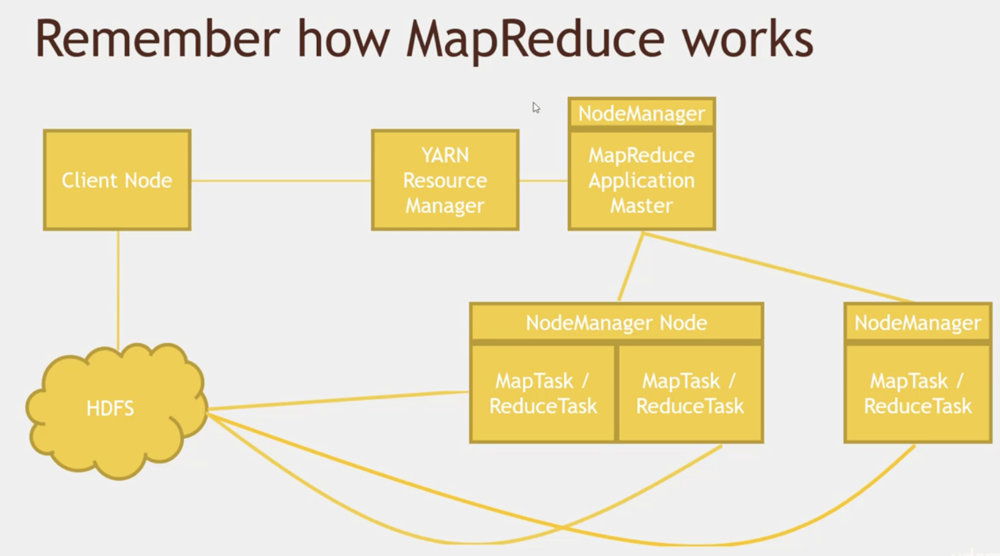
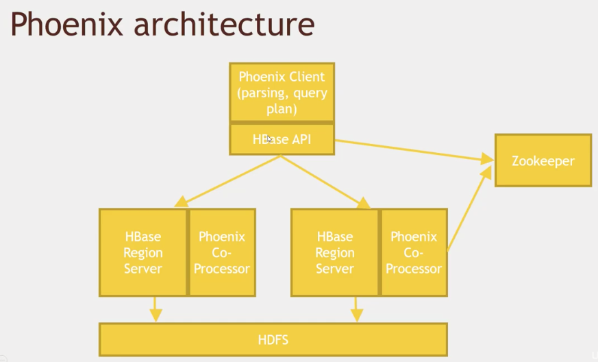
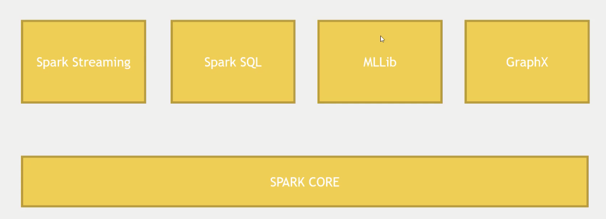
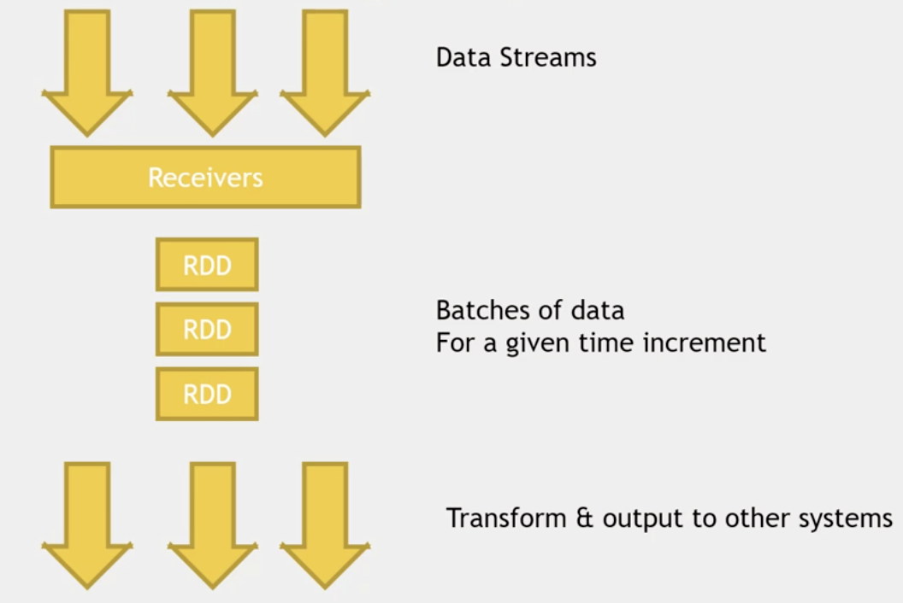
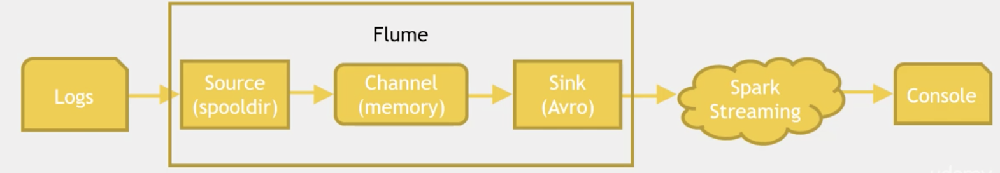
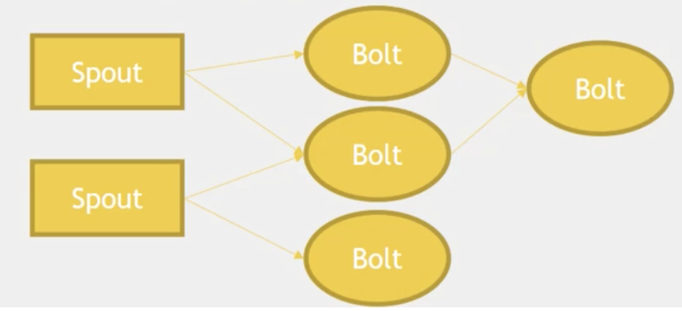
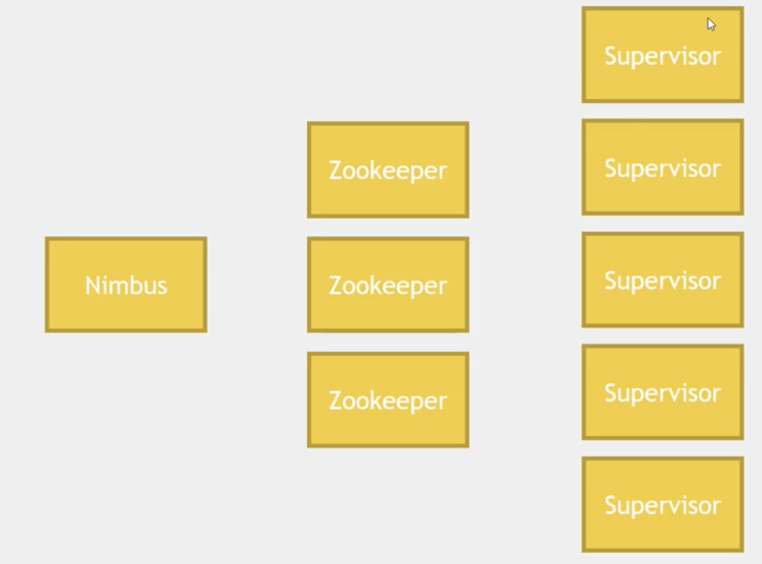
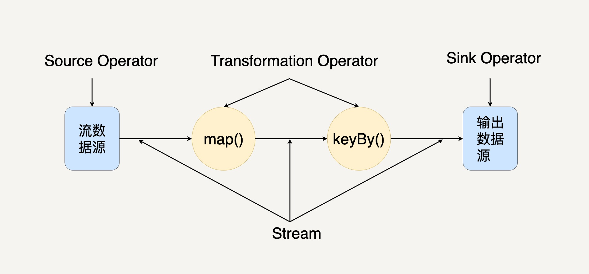
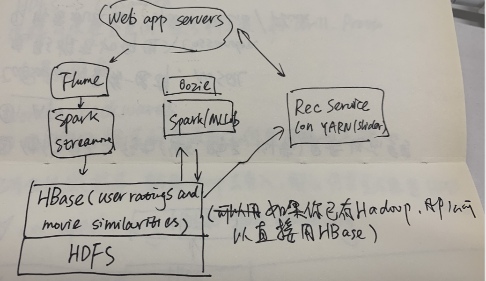

*  目录
{:toc}
	
	
<!--more-->

> 在正式开始接触大数据之前，经常听到一些术语，HDFS, YARN, Mesos, Pig, Hive, Sqoop, Spark， Storm等等等等，也许你也会觉得耳熟，但是这些技术它们是干啥的，分别适用于什么场景，同类型的技术间又有些什么差别，在做项目的技术选型时应该如何组合使用呢？这些都是我刚刚加入大数据团队开始思考的问题。于是我写下了这篇入门导读，希望通过这篇文章也能让你对于Hadoop生态圈的技术有个入门级别的认识，能够回答上面的那些基本问题，而不只是对它们感到耳熟。
> 

本文将分三大部分进行讲解，第一部分是Hadoop生态圈相关技术的介绍；第二部分会介绍数据库存储相关；第三部分会简单介绍下spark生态圈。最后会通过一个或者两个案例来实操一下，如何把这么多的技术整合起来完成一个大数据项目。首先进入第一部分——Hadoop核心相关技术

# Hadoop 核心相关技术


这张图涵盖了Hadoop生态绝大多数的技术，我将采取先中间、后两边，自底向上的顺序一一进行阐述。
在这个过程中，会对相关技术进行一个大致的分类：

- 分布式文件存储 —— HDFS
- 任务调度 —— YRAN & Mesos
- MapReduce及相关优化技术 —— MapReduce & TEZ
- 基于MR的上层应用 —— Pig, Hive
- 数据导入技术 —— Sqoop, Flume, Kafka
- 工作流编写 —— Oozie
- 其它相关工具	

## 1 HDFS

HDFS是Hadoop应用用到的一个最主要的分布式存储系统。一个HDFS集群主要由一个NameNode和很多个Datanode组成：Namenode管理文件系统的元数据，而Datanode存储了实际的数据。它们与客户端之间的交互如下图：


客户端从Namenode中获取文件的元数据或修饰属性，然后与Datanode进行真正的文件I/O操作。

**组件**

- namenode：负责管理hdfs中文件块的元数据，响应客户端请求，管理datanode上文件block的均衡，维持副本数量。整个Hadoop 集群中只有一个NameNode。它是整个系统的“总管”，负责管理HDFS的目录树和相关的文件元数据信息。这些信息是以“fsimage”（HDFS 元数据镜像文件）和“editlog”（HDFS 文件改动日志）两个文件形式存放在本地磁盘，当HDFS 重启时重新构造出来的。此外，NameNode 还负责监控各个DataNode 的健康状态，一旦发现某个DataNode 宕掉，则将该DataNode 移出HDFS 并重新备份其上面的数据。
- Secondname:主要负责做checkpoint操作；也可以做冷备，对一定范围内数据做快照性备份。Secondary NameNode 最重要的任务并不是为NameNode 元数据进行热备份，而是定期合并fsimage 和edits 日志，并传输给NameNode。这里需要注意的是，为了减小NameNode压力，NameNode 自己并不会合并fsimage 和edits，并将文件存储到磁盘上，而是交由Secondary NameNode 完成。
- Datanode:存储数据块，负责客户端对数据块的io请求。一般而言，每个Slave 节点上安装一个DataNode，它负责实际的数据存储，并将数据信息定期汇报给NameNode。DataNode 以固定大小的block 为基本单位组织文件内容，默认情况下block 大小为64MB。当用户上传一个大的文件到HDFS 上时，该文件会被切分成若干个block，分别存储到不同的DataNode ；同时，为了保证数据可靠，会将同一个block以流水线方式写到若干个（默认是3，该参数可配置）不同的DataNode 上。这种文件切割后存储的过程是对用户透明的。

**重要特性：**

1. HDFS中的文件在物理上是分块存储（block），块的大小可以通过配置参数( dfs.blocksize)来规定，默认大小在hadoop2.x版本中是128M，老版本中是64M
2. HDFS文件系统会给客户端提供一个统一的抽象目录树，客户端通过路径来访问文件，形如：hdfs://namenode:port/dir-a/dir-b/dir-c/file.data
3. HDFS是设计成适应一次写入，多次读出的场景，且不支持文件的修改

**操作方式：**

1. Shell命令，比如`hadoop fs -ls`。这些命令支持大多数普通文件系统的操作，比如复制文件、改变文件权限等。它还支持一些HDFS特有的操作，比如改变文件副本数目。
2. Web接口   
	NameNode和DataNode各自启动了一个内置的Web服务器，显示了集群当前的基本状态和信息。在默认配置下NameNode的首页地址是http://namenode-name:50070/。这个页面列出了集群里的所有DataNode和集群的基本状态。这个Web接口也可以用来浏览整个文件系统（使用NameNode首页上的"Browse the file system"链接）。

## 2 Yarn & Mesos

### 2.1 Hadoop MapReduceV2(Yarn) 

Hadoop 原 MapReduce 架构如图


它的设计思路：

1. 首先用户程序 (JobClient) 提交了一个 job，job 的信息会发送到 Job Tracker 中，Job Tracker 是 Map-reduce 框架的中心，他需要与集群中的机器定时通信 (heartbeat), 需要管理哪些程序应该跑在哪些机器上，需要管理所有 job 失败、重启等操作。
2. TaskTracker 是 Map-reduce 集群中每台机器都有的一个部分，它做的事情主要是监视自己所在机器的资源情况。TaskTracker 同时监视当前机器的 tasks 运行状况。
3. TaskTracker 需要把这些信息通过 heartbeat 发送给 JobTracker，JobTracker 会搜集这些信息以给新提交的 job 分配运行在哪些机器上。

随着分布式系统集群的规模和其工作负荷的增长，该框架的问题逐渐暴露：

1. JobTracker 同时完成资源管理和任务调度/监控，造成了过多的资源消耗，当 map-reduce job 非常多的时候，会造成很大的内存开销，潜在来说，也增加了 JobTracker fail 的风险，这也是业界普遍总结出老 Hadoop 的 Map-Reduce 只能支持 4000 节点主机的上限。
2. 在 TaskTracker 端，以 map/reduce task 的数目作为资源的表示过于简单，没有考虑到 cpu/ 内存的占用情况，如果两个大内存消耗的 task 被调度到了一块，很容易出现 OOM。
3. 在 TaskTracker 端，把资源强制划分为 map task slot 和 reduce task slot, 如果当系统中只有 map task 或者只有 reduce task 的时候，会造成资源的浪费。

**新的Hadoop MapReduce框架命名为MapReduceV2 或者叫 Yarn**

它在Hadoop中的位置如下，可以基于它运行Spark, MapReduce, Tez等。


它的架构图如下：


包含的组件有：

1. Container   
	
	- Container是Yarn框架的计算单元，是具体执行map task/reduce task的基本单位，一个节点会运行多个Container。
	- 一个Container指的是分配的具体节点上的计算资源（CPU和内存）。Container中必定含有计算资源的位置信息：计算资源位于哪个机架的哪台机器上。所以我们在请求某个Container时，其实是向个node发起的请求。
	- 你可以指明数据位置——你想使用哪个HDFS block，YARN会尽量使你的进程运行在HDFS block 同一个node上，避免数据的移动。
	
2. Node Manager   
	
	- 运行在集群中的节点上，每个节点都会有自己的NodeManager。
	- NodeManager是一个slave服务：它负责接收ResourceManager的资源分配请求，分配具体的Container给应用。
	- 同时，它还负责监控并报告Container使用信息给ResourceManager。通过和ResourceManager配合，NodeManager负责整个Hadoop集群中的资源分配工作。

3. Resource Manager主要有两个组件：Scheduler和ApplicationManager。   
	
	- Scheduler是一个资源调度器，它主要负责协调集群中各个应用的资源分配，保障整个集群的运行效率。Scheduler的角色是一个纯调度器，它只负责调度Containers，不会关心应用程序监控及其运行状态等信息。你可以在集群里同时跑多个应用，指明不同的调度选择，如FIFO，容量或者公平调度。
	- ApplicationManager主要负责接收job的提交请求，为应用分配第一个Container来运行ApplicationMaster，还有就是负责监控ApplicationMaster，在遇到失败时重启ApplicationMaster运行的Container。
		
4. Application Master

	- 向ResourceManager申请资源并和NodeManager协同工作来运行应用的各个任务然后跟踪它们状态及监控各个任务的执行，遇到失败的任务还负责重启它。
	- NodeManager只负责管理自身的Container，它并不知道运行在它上面应用的信息。负责管理应用信息的组件是ApplicationMaster。
	- 负责一个 Job 生命周期内的所有工作，类似老的框架中 JobTracker。但注意每一个 Job（不是每一种）都有一个 ApplicationMaster，它可以运行在 ResourceManager 以外的机器上。


工作机制如图：



1. 客户端程序向`ResourceManager`提交应用并请求一个`ApplicationMaster`实例。
2. `ResourceManager`找到可以运行一个`Container`的`NodeManager`，并在这个`Container`中启动`ApplicationMaster`实例
3. `ApplicationMaster`向`ResourceManager`进行注册，注册之后客户端就可以查询`ResourceManager`获得自己`ApplicationMaster`的详细信息，以后就可以和自己的`ApplicationMaster`直接交互了
4. `ApplicationMaster`根据`resource-request`协议向`ResourceManager`发送`resource-request`请求
5. `ResourceManager`收到请求后，告诉`ApplicationMaster`哪些`Containers`可以用，`ApplicationMaster`通过向`NodeManager`发送`container-launch-specification`消息来启动`Container`
6. 应用程序的代码在启动的`Container`中运行，并把运行的进度、状态等信息通过`application-specific`协议发送给`ApplicationMaster`
7. 一旦应用程序执行完成并且所有相关工作也已经完成，`ApplicationMaster`向`ResourceManager`取消注册然后关闭，用到所有的`Container`也归还给系统


**Yarn 框架相对于老的 MapReduce 框架什么优势呢？**

- 这个设计大大减小了 JobTracker 的资源消耗，并且让监测每一个 Job 子任务 (tasks) 状态的程序分布式化了，更安全、更优美。
- 在新的 Yarn 中，ApplicationMaster 是一个可变更的部分，用户可以对不同的编程模型写自己的 AppMst，让更多类型的编程模型能够跑在 Hadoop 集群中，可以参考 hadoop Yarn 官方配置模板中的 ``mapred-site.xml`` 配置。
- 对于资源的表示以内存为单位 ( 在目前版本的 Yarn 中，没有考虑 cpu 的占用 )，比之前以剩余 slot 数目更合理。
- 老的框架中，JobTracker 一个很大的负担就是监控 job 下的 tasks 的运行状况，现在，这个部分就扔给 ApplicationMaster 做了，而 ResourceManager 中有一个模块叫做 ApplicationsManager，它是监测 ApplicationMaster 的运行状况，如果出问题，会将其在其他机器上重启。
- Container 是 Yarn 为了将来作资源隔离而提出的一个框架。这一点应该借鉴了 Mesos 的工作，目前是一个框架，仅仅提供 java 虚拟机内存的隔离 ,hadoop 团队的设计思路应该后续能支持更多的资源调度和控制 , 既然资源表示成内存量，那就没有了之前的 map slot/reduce slot 分开造成集群资源闲置的尴尬情况。

### 2.2 Mesos

首先通过一个官方提供的资源分配的例子来了解下它的工作：


1. Slave1 向 Master 报告，有4个CPU和4 GB内存可用
2. Master 发送一个 Resource Offer 给 Framework1 来描述 Slave1 有多少可用资源
3. FrameWork1 中的 FW Scheduler会答复 Master，我有两个 Task 需要运行在 Slave1，一个 Task 需要`<2个CPU，1 GB内存=””>`，另外一个Task需要`<1个CPU，2 GB内存=””>`
4. 最后，Master 发送这些 Tasks 给 Slave1。然后，Slave1还有1个CPU和1 GB内存没有使用，所以分配模块可以把这些资源提供给 Framework2

可以看出Mesos的工作只是资源管理、分配和task转发。调度由Framework实现，task的定义以及具体执行也由Framework实现。

再来看看Mesos的架构图：


对于组件的介绍，采用与Yarn类比的方式：

|Mesos中的组件|YARN中的组件|功能|
|-----------|------------|----|
|Mesos Master | Resource Manager | 整个集群的资源管理和调度|
|Mesos Slave + Framework Executor | Node Manager | 单个节点的资源管理（资源隔离、汇报等）、任务启动等|
|Framework Scheduler | ApplicationMaster | 单个应用程序的管理和资源二次调度，基本操作均包括注册、资源申请/获取、资源分配（给内部的任务）等|

对于Master和Slave在图上都可以找到对应的地方，而这里说的Framework呢。指的就是外部的计算框架，比如Hadoop、MPI等，包括Scheduler，Executor两部分。这里的Scheduler通过注册的方式接入Mesos，接收Master发送的Resource Offer消息，来决定是否接收。Executor是给slave调用的，执行Framework的task。由于不同的框架，启动task的接口或者方式不同，当一个新的框架要接入Mesos时，需要编写自己的Executor。可以看出，一个Framework想要接入Mesos时，需要提供一个scheduler，用于向Mesos注册，并获取Mesos分配给自己的资源，然后再由自己的scheduler将这些资源分配给框架中的任务。采用的是两层调度框架：1) Mesos将资源分配给框架；2) 框架自己的scheduler将资源分配给自己内部的任务。

**Mesos vs YARN**

1. 跟Yarn类似，也是一种资源管理工具，但不同的是Yarn局限于Hadoop中使用。Spark 和 Storm 可以基于 Mesos。YARN可以使用工具 Myriad 与 Mesos 集成。
2. YARN是一个整体的调度，你给它一个job，然后YARN决定哪里去run这个job；Mesos是一个两层系统，Mesos 只是提交资源到你的应用（框架），由你的应用决定接收与否，你也可以自己决定调度算法。
3. YARN对于长期的分析job做了优化；Mesos也可用于处理长期的任务，当然也可处理短期任务。

如果你的系统已经有Mesos了，那么选择它也许是个不错的选择，如果集群里面没有Mesos，那么用YARN也可以得到好的性能。

## 3 MapReduce

这里通过一个电影评分文件中的每类评分的个数统计的MR例子展示下 Map 和 Reduce 任务， u.data中保存的是`userID movieID rating timestamp`格式的数据，：

```
  1 from mrjob.job import MRJob
  2 from mrjob.step import MRStep
  3
  4 class RatingsBreakdown(MRJob):
  5     def steps(self):
  6         return [
  7             MRStep(mapper=self.mapper_get_ratings,
  8                    reducer=self.reducer_count_ratings)
  9         ]
 10
 11     def mapper_get_ratings(self, _, line):
 12         (userID, movieID, rating, timestamp) = line.split('\t')
 13         yield rating, 1
 14
 15     def reducer_count_ratings(self, key, values):
 16         yield key, sum(values)
 17
 18 if __name__ == '__main__':
 19     RatingsBreakdown.run()
```
MapReduce任务并非一定要在Hadoop上面执行，你也可以本地执行，比如在开发过程中，你想要测试你的任务功能是否正确，你不需要大数据量来进行测试，你就可以本地执行。测试通过之后再放到集群中对hdfs中的数据进行MR计算。

- run locally
	- `python RatingsBreakDown.python u.data`
- run with hadoop
	- `python RatingsBreakDown.py -r hadoop --hadoop-streaming-jar /usr/hdp/current/hadoop-mapreduce-client/hadoop-streaming.jar hdfs://...`

#### shuffle详解

Map端shuffle：


从图中可以看到Map端输出的数据会被提交到一个内存缓冲区当中，当内存满了后，会被Spill到HDFS中，当Map任务结束后，会把所有的临时文件合并到一个最终的文件中，作为一个最终的Map输出文件。这个过程涉及到两个过程都有排序操作，第一个是从KVBuffer到文件Spill中，默认通过快速排序算法进行排序。第二个是所有临时文件合并时，此时会有一次多路归并排序的过程，使用归并排序算法。

如果没有定义combine的话就直接把这个分区的键值对spill写出到磁盘。spill是mapreduce的中间结果，存储在数据节点的本地磁盘上，存储路径由以下参数指定：

```
1.core-site.xml：

hadoop.tmp.dir// hadoop临时文件夹目录

2.mapred-site.xml：

mapreduce.cluster.local.dir =${hadoop.tmp.dir}/mapred/local;

//默认的中间文件存放路径

在执行mapreduce任务的过程，我们可以通过这个路径去查看spill文件的情况。
```
Combine的作用是对单个Map的输出进行本地的部分聚合之后再将结果传递给Reduce，以减少网络中的IO开销和Reduce的压力，所以其实际上就是一个局部的Reduce。

Combine的简单使用场景
考虑到以上两个限制：输入与输出格式一致、具体在使用的时候，有以下几种使用场景：

1. Combine中进行数据去重。如果我们使用的场景中，需要用到distinct这种唯一性操作，那么我们可以在同一个Map里进行部分去重（因为无法跨Map进行Combine去重），来减少传输量和Reduce的工作量。

2. Combine中进行局部计算。如果需要求和、求最大值、最小值这种局部操作不会改变最后结果的计算，也可以使用Combine来进行优化。


spill merge过程：


merge合并操作也会带有排序操作，将单个有序的spill文件合并成最终的有序的文件。

reduce端shuffle：

1. .Copy阶段
2. .Merge Sort
	
		
**Tez**

Apache Tez旨在构造一个应用框架，它在采用DAG作业处理数据。现在是基于YARN。它的核心思想是将Map操作拆分为Input, Processor, Sort, Merge 和Output；Reduce操作被拆分为Input, Shuffle, Sort, Merge, Processor和Output。这些分解后的元操作可以任意灵活组合，经过一些组装之后，可形成一个大的DAG作业。Tez并不直接面向最终用户，它是通过允许开发者为最终用户构建性能更快、扩展性更好的应用程序。

**特点：**

1. 适用于与DAG应用，如Hive,Pig类MapReduce任务，使之更快
2. 它可以替代MapReduce，上层应用可以选择使用Tez
3. 构造DAG以使更高效地处理分布式任务，甚至可以优化物理数据流向。

 

## 4 基于MR的上层应用
### 4.1 Pig —— 基于MR的脚本工具


这里也通过例子的形式呈现出一个比较直观的认识 —— 找出所有评分结果中评分为5分的最多的最老的电影：

```
ratings = LOAD '/user/maria_dev/ml-100k/u.data' AS (userId:int, movieId:int, rating:int, ratingTime:int);

metadata = LOAD '/user/maria_dev/ml-100k/u.item' USING PigStorage('|') AS (movieId:int, movieTitle:chararray, releaseDate:chararray, videoRelease:chararray, imdbLink:chararray);

nameLookup = FOREACH metadata GENERATE movieId, movieTitle, ToUnixTime(ToDate(releaseDate, 'dd-mmm-yyyy')) AS releaseTime;

ratingsByMovie = GROUP ratings BY movieId;

avgRatings = FOREACH ratingsByMovie GENERATE group AS movieId, AVG(ratings.rating) AS avgRating;

fiveStarMovies = FILTER avgRatings BY avgRating > 4.0;

fiveStarsWithDate = JOIN fiveStarMovies BY movieId, nameLookup BY movieId;

oldestFiveStarMovies = ORDER fiveStarsWithDate BY nameLookup::releaseTime;

DUMP oldestFiveStarMovies;
```	

可以看出上面的脚本中有很多 Pig Latin

- LOAD STORE DUMP
- FILTER DISTINCT FOREACH/GENERATE MAPREDUCE STREAM SAMPLE
- JOIN COGROUP GROUP CROSS CUBE
- ORDER RANK LIMIT
- UNION SPLIT

### 4.2 Hive —— SQL查询工具

Hive 是建立在 Hadoop 上的数据仓库基础构架。它提供了一系列的工具，可以用来进行数据提取转化加载（ETL）。

Hive是为了解决Hadoop中mapreduce编写困难，提供给熟悉SQL的人使用的。它是一个数据仓库工具，可以将结构化的数据文件映射为一张数据库表，并提供简单的SQL查询功能，可以将SQL语句转换为MapReduce任务进行运行。HiveQL，与 MySql 非常接近，有一些扩展，比如 **view**，以及允许你**指明如何存储**和**分区结构化数据**。通过LOAD DATA将数据移动到Hive，如1) LOAD DATA 将数据从分布式文件系统移动到Hive 2) LOAD DATA LOCAL从本地文件系统copy到HIVE

**Schema On Read**

传统数据库是在写的时候就已经有一个 schema 了，Hive 维护了一个 ‘metastore’ 告诉 HDFS 你定义的结构是什么，在 read 的时候 apply 这个schema。文件依然是以text file的形式存储。

```
CREATE TABLE ratings （
	user_id INT,
	moive_id INT,
	rating INT,
	rating_time INT
）ROW FORMAT DELIMTED
FIELDS TERMINATED BY '/t'
STORED AS TEXTFILE;

LOAD DATA LOCAL INPATH '${env.HOME}/bigdata/ml-100k/u.data' OVERWRITE INTO TABLE ratings;
```
**创建View**

```
CREATE VIEW topMovieIds AS
SELECT movie_id, count(movie_id) as ratingCount
FROM ratings
GROUP BY movie_id
ORDER BY ratingCount DESC;

SELECT m.name, ratingCount
FROM topMovieIds t JOIN movies m ON t.movie_id = m.id;
```

**Partitioning**

当你只需要查询某个确定的分区时，优化效果会很明显。

```
CREATE TABLE customers (
	name STRING,
	address STRUCT<street:STRING, city:STRING, state:STRING>
) PARTITIONED BY (country STRING);
```
.../customers/country=CA/   
.../customers/country=CB/

**Managed vs. External tables**

1. 前面已经提到过，数据会被Hive管理，如果你执行了 drop table 那么数据也会被删除；
2. 如果你只是希望drop table 的时候只删除元数据，保留真正的数据，那么就需要使用create external table

	```
	CREATE EXTERNAL TABLE IF NOT EXISTS ratings（
		user_id INT,
		movie_id INT,
		rating INT,
		rating_time INT
	）ROW FORMAT DELIMITED FIELDS TERMINATED BY '\t'
	LOCATION '/data/ml-100k/u.data';
	```

**Why Hive?**

1. SQL语法相似（HiveQL），学习成本低
2. 
3. scalable——“big data” on a cluster
4. Easy OLAP queries(比 MapReduce 简单)	
5. 高度优化了的
6. 高度可扩展
	- 交互式的界面通过 `hive>`
	- 命令行执行，如保存为文件后执行 `hive -f /somepath/queries.hql`
	- Ambari / Hue / Oozie
	- Thrift server
	- JDBC/ODBC driver 

**Why not Hive?**

1. 高延迟——不适合OLTP（它底层也是做一些MapReduce，所以要花费较长时间）
2. 存储的数据是de-normalized（flat text files），所以不能像关系型数据库那样进行连接等操作，也没有 record-level 的更新，插入和删除
3. SQL 操作有限，而Pig, Spark 支持更复杂的操作

**demo**

```
drop view topmovieids;

CREATE VIEW IF NOT EXISTS topMovieIds AS
SELECT movie_id, avg(rating) as avgRating, count(movie_id) as countRating
FROM ratings
GROUP BY movie_id
HAVING countRating > 10
ORDER BY avgRating DESC;

SELECT m.name, avgRating
FROM topMovieIds t JOIN movies m ON t.movie_id = m.id;
```

**数据倾斜**

针对mapreduce的过程来说就是，有多个reduce，其中有一个或者若干个reduce要处理的数据量特别大，而其他的reduce处理的数据量则比较小，那么这些数据量小的reduce很快就可以完成，而数据量大的则需要很多时间，导致整个任务一直在等它而迟迟无法完成。

产生数据倾斜的原因：

1. key的分布不均匀或者说某些key太集中。
	上面就说过，reduce的数据量大小差异过大，而reduce的数据是分区的结果，分区是对key求hash值，根据hash值决定该key被分到某个分区，进而进入到某个reduce，而如果key很集中或者相同，那么计算得到它们的hash值可能一样，那么就会被分配到同一个reduce，就会造成这个reduce所要处理的数据量过大。
2. 关联字段重复数据较多

解决方法：

1. 设置参数
	1. 设置hive.map.aggr=true //开启map端部分聚合功能，就是将key相同的归到一起，减少数据量，这样就可以相对地减少进入reduce的数据量，在一定程度上可以提高性能，当然，如果数据的减少量微乎其微，那对性能的影响几乎没啥变化。
	2. 设置hive.groupby.skewindata=true //如果发生了数据倾斜就可以通过它来进行负载均衡。

2. join定位：
	1. 主表驱动表应该选择分布均匀的表作为驱动表，并做好列裁剪。
	2. 大小表Join，需要记得使用map join,小表会先进入内存，在map端即会完成reduce.
	3. 此种情形最为常用！！！大表join大表时，关联字段存在大量空值null key
		解决方法为把空值null key变成字符串加上随机数！！！可以把由于数据倾斜而导致的数据集中到一个reduce上处理的情形，打散到不同的reduce上，生成多个reduce！！！
`on case when haha.id is null then concat('hive',rand()) else 
haha.id end = xixi.id`
	4. 不同数据类型关联也会产生数据倾斜滴！	
	例如注册表中ID字段为int类型，登录表中ID字段即有string类型，也有int类型。当按照ID字段进行两表之间的join操作时，默认的Hash操作会按int类型的ID来进行分配，这样会导致所有string类型ID的记录统统都都分配到一个Reduce里面去！！！   
	解决方法：把数字类型转换成字符串类型   
	`on haha.ID = cast(xixi.ID as string)`

## 5 数据导入工具
### 5.1 Sqoop

集成MySql 


从 MySql 导入数据到HDFS:`sqoop import --connet jdbc:mysql://localhost/movielens --driver com.mysql.jdbc.Driver --table movies` 
-m 参数可以指定用多少个mapper

从 MySql 导入到hive：`sqoop import --connet jdbc:mysql://localhost/movielens --driver com.mysql.jdbc.Driver --table movies --hive-import`

确保同步：
`--check-column and --last-value`

导出:`sqoop export --connet jdbc:mysql://localhost/movielens -m 1 --driver com.mysql.jdbc.Driver --table exported_movies --export-dir /apps/hive/warehouse/movies --input-fields-terminated-by '\0001'`

数据库必须事先以创建好，并且列名是按照期望的顺序。

### 5.2 Kafka -- feeding data to your cluster

```
cd /usr/hdp/current/kafka-broker/bin
//create
./kafka-topics.sh --create --zookeeper sandbox.hortonworks.com:2181 --replication-factor 1 --partition 1 --topic fred
//list
./kafka-topics.sh --list --zookeeper sandbox.hortonworks.com:2181 
//publish data
./kafka-console-producer.sh --broker-list sandbox.hortonworks.com:6667 --topic fred
//input data
//另启shell
./kafka-console-consumer.sh --bootstrap-server sandbox.hortonworks.com:6667 --zookeeper sandbox.hortonworks.com:2181 --topic fred --from-beginning 
```
### 5.3 Flume -- feeding data to your cluster
Apache flume是一个分布式，可靠且可用的系统，用于有效地从多个源收集、聚合和移动大量数据到一个集中式的数据存储区。它的数据流模型如下，一个Flume事件被定义为一个数据流单元。Flume agent其实是一个JVM进程，该进程包含完成任务所需要的各个组件，其中最核心的三个组件是 Source, Channel以及Sink。在flume节点中是以Event为数据单元，Event从source经过channel交给sink。Event对象携带了payload信息。   


source会以特定的格式产生event对象，可以把source看做event的产生服务器。比如，avroSource可以接受其他的Flume节点产生的Avro的信息，产生event对象。当source接收到事件event后，会把它存储在channel中。channel被动地存储数据，直到event被sink取走，sink负责转发event给下一个节点或者最终的存储点（如HDFS），然后删除channel中的事件，保证了传输的可靠性。在多节点的情况下，前一节点的sink会维护与下一节点的source之间的会话，保证传输的可靠性。

flume支持一个由本地文件系统支持的持久化文件（文件模式：channel.type = "file"），同样也支持内存模式（channel.type = "memory"）。如果采取文件channel则具有可恢复性。

**客户端**   

客户端操作事件对象的源头，并且把它们发送给flume节点。client最典型的就是处理应用进程产生的数据。目前flume支持Avro, log4j, syslog, http等数据源类型，execsource类型可以消费本地进程输出的信息。如何创建一种自定义的机制发送数据，有以下两种方式:

1. 创建自定义的客户端与flume的source进行交互，比如AvroSource和SyslogTcpSource，这样client需要把数据转换为flume理解的格式。
2. 自定义中flume source基于IPC或者RPC协议与本地进程进行沟通，然后把数据传给flume节点。

具体实现可参考该[链接](https://github.com/xinghalo/CodeTesting/wiki/%E3%80%8AFlume-%E5%BC%80%E5%8F%91%E8%80%85%E6%8C%87%E5%8D%97%E3%80%8B%E2%80%94%E2%80%94-%E5%AE%98%E6%96%B9%E6%96%87%E6%A1%A3%E7%BF%BB%E8%AF%91)

**支持的source type:**

1. Spooling directory（Spool检测配置的目录下新增的文件，并将文件中的数据读取出来。需要注意的是：拷贝到spool目录下的文件不可以再打开编辑；spool目录下不可以包含相应的子目录）。
2. Avro
3. Kafka
4. Exec
5. Thrift
6. Netcat
7. HTTP
8. 自定义

**支持的sink type:**

1. HDFS
2. Hive
3. HBase
4. Avro
5. Thrift
6. Elasticsearch
7. Kafka
8. 自定义

**多agent设置**

串联


合并

当需要从众多主机上收集日志信息时，我们可以在每台主机上部署 agent,这些主机的 slink 均连接到最终日志落地主机的 source 上。落地主机将所有数据进行组合，落地到 HDFS 上。   


## Apache Drill

SQL for noSQL，基于谷歌的Dremel

1. Hive, MongoDB, HBase
2. json 或者 HDFS、S3、Azure、Google cloud、本地文件系统等上面的文件，但不支持Cassandra

注意事项：

尽管是执行真正的SQL，但是底层仍然是非关系型数据；它可以跨数据源系统进行查询

eg: 关联hive和mongodb查询每种职业的评价数。

## Phoenix

1. 基于 HBase 的 事物处理
2. 支持OLTP，优化
3. 开源
4. 提供 JDBC connector
5. 支持次级索引，用户定义方法
6. 可以和 MapReduce、Spark、Hive、Pig 、Flume
7. fast 



用法:

1. cli
2. Java API 
3. jdbc driver(thick client)
4. Phenex Query Server（thin client）—— 为了使非Java应用也可以使用
5. 提供给MapReduce、hive、pig、flume、spark的JAR 

eg: 与 Pig 集成：

```
create table users(
USERID INTEGER NOT NULL,
AGE INTEGER,
GENDER CHAR(1),
OCCUPATION VARCHAR,
ZIP VARCHAR
CONSTRAINT pk PRIMARY KEY (USERID)
);
```
phoenix.pig：

```
REGISTER /usr/hdp/current/phoenix-client/phoenix-client.jar

users = LOAD '/user/maria_dev/ml-100k/u.user' 
USING PigStorage('|') 
AS (USERID:int, AGE:int, GENDER:chararray, OCCUPATION:chararray, ZIP:chararray);

STORE users into 'hbase://users' using
    org.apache.phoenix.pig.PhoenixHBaseStorage('localhost','-batchSize 5000');

occupations = load 'hbase://table/users/USERID,OCCUPATION' using org.apache.phoenix.pig.PhoenixHBaseLoader('localhost');

grpd = GROUP occupations BY OCCUPATION; 
cnt = FOREACH grpd GENERATE group AS OCCUPATION,COUNT(occupations);
DUMP cnt;  

```
## Presto

1. 类似与Drill,可以连接不同的大数据数据库，类似SQL语法，适用于OLAP
2. JDBC, CLI, Tableau interface 

why Presto

1. 相比于 Drill,它支持Cassandra连接
2. 有成熟的使用场景

eg: 关联Cassandra和mongodb，查询每种职业的评价数。


## Zookeeper

## Oozie

编排你的Hadoop job。

Workflow:


Workflow XML 结构：


上传到HDFS：

```
首先将数据导入到MySQL，导入之前要设置字符编码：
hadoop fs -put workflow.xml /user/maria_dev
hadoop fs -put oldmovies.sql /user/maria_dev
fs -put /usr/share/java/mysql-connector-java.jar /user/oozie/share/lib/lib_20161025075203/sqoop
重启oozie
oozie job --oozie http://localhost:11000/oozie --config /home/maria_dev/job.properties -run
```

## Zeppelin

a notebook interface to your big data 1

 类似 jupyter notebook 
 
 它有多种编译器：
 
 ```
 c
 wget http://
 wget http://
 hadoop fs -rm -r -f /tmp/ml-100k
 hadoop fs 	-mkdir /tmp/ml-100k
 hadoop fs -put /tmp/u.data /tmp/ml-100k/
 hadoop fs -put /tmp/u.item /tmp/ml-100k/
 然后执行scala程序
 final case class Rating(movieID: Int, rating: Int)
 val lines = sc.textFile("hdfs:////tmp/ml-100k/u.data").map(x => {val fields = x.split("\t");Rating(fields(1).toInt, fields(2).toInt)})
 
 import sqlContext.implicits._
 val ratingsDF = lines.toDF()
 
 ratingsDF.printSchema()
 
 val topMovieIDs = ratingsDF.groupBy("movieID").count().orderBy(desc("count")).cache()
 
 topMovieIDs.show()
 
 //use sparkSQL
 ratingsDF.registerTempTable("ratings")
 
 %sql
 select * from ratings limit 10
 ```
## Hue

Hadoop Use Experience

Hue 之于 Clodera，等价于 Ambari + Zeppelin 之于 Hortonworks

## Spark




### 核心组件


- Cluster Manager-控制整个集群，监控worker。在standalone模式中即为Master主节点，控制整个集群，监控worker。在YARN模式中为资源管理器
- Worker节点-负责控制计算节点从节点，负责控制计算节点，启动Executor或者Driver。
	- Driver：运行Application 的main()函数
	- Executor：执行器，是为某个Application运行在worker node上的一个进程
### SPARK编程模型

Spark 应用程序从编写到提交、执行、输出的整个过程如图所示，图中描述的步骤如下：

1. 用户使用SparkContext提供的API（常用的有textFile、sequenceFile、runJob、stop等）编写Driver application程序。此外SQLContext、HiveContext及StreamingContext对SparkContext进行封装，并提供了SQL、Hive及流式计算相关的API。
2. 使用SparkContext提交的用户应用程序，首先会使用BlockManager和BroadcastManager将任务的Hadoop配置进行广播。然后由DAGScheduler将任务转换为RDD并组织成DAG，DAG还将被划分为不同的Stage。最后由TaskScheduler借助ActorSystem将任务提交给集群管理器（Cluster Manager）。
3. 集群管理器（ClusterManager）给任务分配资源，即将具体任务分配到Worker上，Worker创建Executor来处理任务的运行。Standalone、YARN、Mesos、EC2等都可以作为Spark的集群管理器

### 运行模型

1. 构建Spark Application的运行环境，启动SparkContext
2. SparkContext向资源管理器（可以是Standalone，Mesos，Yarn）申请运行Executor资源，并启动StandaloneExecutorbackend，
3. Executor向SparkContext申请Task
4. SparkContext将应用程序分发给Executor
5. SparkContext构建成DAG图，将DAG图分解成Stage、将Taskset发送给Task Scheduler，最后由Task Scheduler将Task发送给Executor运行
6. Task在Executor上运行，运行完释放所有资源

### 1 LowestRatedMovieDataFrame.py

```
from pyspark.sql import SparkSession
from pyspark.sql import Row
from pyspark.sql import functions

def loadMovieNames():
    movieNames = {}
    with open("ml-100k/u.item") as f:
        for line in f:
            fields = line.split('|')
            movieNames[int(fields[0])] = fields[1]
    return movieNames

def parseInput(line):
    fields = line.split()
    return Row(movieID = int(fields[1]), rating = float(fields[2]))

if __name__ == "__main__":
    # Create a SparkSession (the config bit is only for Windows!)
    spark = SparkSession.builder.appName("PopularMovies").getOrCreate()

    # Load up our movie ID -> name dictionary
    movieNames = loadMovieNames()

    # Get the raw data
    lines = spark.sparkContext.textFile("hdfs:///user/maria_dev/ml-100k/u.data")
    # Convert it to a RDD of Row objects with (movieID, rating)
    movies = lines.map(parseInput)
    # Convert that to a DataFrame
    movieDataset = spark.createDataFrame(movies)

    # Compute average rating for each movieID
    averageRatings = movieDataset.groupBy("movieID").avg("rating")

    # Compute count of ratings for each movieID
    counts = movieDataset.groupBy("movieID").count()

    # Join the two together (We now have movieID, avg(rating), and count columns)
    averagesAndCounts = counts.join(averageRatings, "movieID").filter()

    # Pull the top 10 results
    topTen = averagesAndCounts.orderBy("avg(rating)").take(10)

    # Print them out, converting movie ID's to names as we go.
    for movie in topTen:
        print (movieNames[movie[0]], movie[1], movie[2])

    # Stop the session
    spark.stop()

```
### 2 Running spark on a cluster 

如果只是IDE里面run那是在local运行，如果需要在cluster中运行则需要用命令行 `spark-submit`：

1. 确保代码里没有本地文件系统路径，应该用HDFS,S3等等
2. 打包工程为一个jar包
3. spark-submit --class <class object that contain your main function> --jars <path to any dependencies> --files <files you want placed alongside your application> <your JAR file>

spark-submit 的选项：

- --master

	- yarn - for running a YARN/Hadoop cluster
	- hostname:port - for connecting to a master on a spark standalone cluster
	- mesos://masternode:port
	- a master in you SparkConf will override this!!!
- --num-executor
	- must set explicitly with YARN, only 2 by default
- --executor-memory
	- make sure you dont try to use more memory than you have
- --total-executor-cores

对于其中的第2点：可以通过sbt来打包，可以把所有的依赖都打进包里（sbt是Scala的依赖管理工具）

```
sbt assembly
```

build.sbt

```
name := "PopularMovies"

version := "1.0"

organization := "com.sundogsoftware"

scalaVersion := "2.10.6"

libraryDependencies ++= Seq(
"org.apache.spark" %% "spark-core" % "1.6.1" % "provided"
)
```


最佳实践：

1. 用默认的SparkConf,这样最灵活，因为代码里面的是最高优先级，无法覆盖
2. 如果executor失败了，那么需要调整内存。specify memory per executor。
3. specify a cluster manager

调试和调优:

1. 可以通过4040端口连接到spark UI，看detail， stage， DAG，executor，environment
2. logs 

### 3 partition

Spark并不都是魔法，你需要自己分区，比如是self-join就是很昂贵的计算，Spark并不会自己去分发这些任务。因此你需要在执行昂贵操作前（join(), cogroup(), groupWith(), join(), leftOuterJoin(), rightOuterJoin(), groupByKey(), reduceByKey(), combineByKey(), lookup()）,执行.partitionBy()]


## Spark Streaming -- analyzing streams of data



demo:



```
mkdir checkpoint
export SPARK_MAJOR_VERSION=2
spark-submit --packages org.apache.spark:spark-streaming-flume_2.11:2.0.0 SparkFlume.py
//  启动flume
cd /usr/hdp/current/flume-server/
bin/flume-ng agent --conf conf --conf-file ~/sparkstreamingflume.conf --name a1
// 往 spooldir 添加文件
wget http://media.sundog-soft.com/hadoop/access_log.txt
cp access_log.txt spool/log22.txt
```

Spark Streaming 提供一个对于流数据的抽象 DStream。DStream 可以由来自 Apache Kafka、Flume 或者 HDFS 的流数据生成，也可以由别的 DStream 经过各种转换操作得来。底层 DStream 也是由很多个序列化的 RDD 构成，按时间片（比如一秒）切分成的每个数据单位都是一个 RDD。

### Structured Streaming 模型
如果可以拥有一个基于 DataFrame API 的流处理模块，作为工程师的我们就不需要去用相对 low level 的 DStream API 去处理无边界数据，这样会大大提升我们的开发效率。   

基于这个思想，2016 年，Spark 在其 2.0版本中推出了结构化流数据处理的模块 Structured Streaming。

是基于 Spark SQL 引擎实现的，依靠 Structured Streaming，在开发者眼里，流数据和静态数据没有区别。我们完全可以像批处理静态数据那样去处理流数据。


与 Spark Streaming 类似，Structured Streaming 也是将输入的数据流按照时间间隔（以一秒为例）划分成数据段。每一秒都会把新输入的数据添加到表中，Spark 也会每秒更新输出结果。输出结果也是表的形式，输出表可以写入硬盘或者 HDFS。

这里我要介绍一下 Structured Streaming 的三种输出模式:

1. 完全模式（Complete Mode）：整个更新过的输出表都被写入外部存储；
2. 附加模式（Append Mode）：上一次触发之后新增加的行才会被写入外部存储。如果老数据有改动则不适合这个模式；
3. 更新模式（Update Mode）：上一次触发之后被更新的行才会被写入外部存储。

**Structured Streaming 只会存储更新输出表所需要的信息。**

Structured Streaming 的模型在根据事件时间（Event Time）处理数据时十分方便。

在 Structured Streaming 发布以后，DaaFrame 既可以代表静态的有边界数据，也可以代表无边界数据。之前对静态 DataFrame 的各种操作同样也适用于流式DataFrame.


## Apache Storm -- analyzing streams of data

1. 集群中连续流处理的又一个框架, 延迟可以基于微秒级。
2. 基于独立事件，而不是微块（spark streaming那种模式）
3. Spark Streaming 可以和 MLLib, Graphx 等集成，生态更丰富。




demo:count words 

```
ambari中开启storm 和 kafka
cd /usr/hdp/current/storm-client
cd /contrib/storm-starter/src/jvm/org/apache/storm
ls
cd starter
vim WordCountTopology.java
storm jar /usr/bin/current/storm-client/contrib/storm-starter/storm-starter-topologies-*.jar org.strom.starter.WordCountTopology wordcount
127.0.0.7:8744 ui界面
查看日志，获取结果 cd /usr/hdp/current/storm-client/logs/workers-artifacts/

```

## Flink -- analyzing streams of data

1. Flink比Storm快
2. Flink类似Storm 提供了“real streaming”，但是如果你使用 Trident，那么也是采用的微块的形式
3. 虽然是用Java实现的，但Scala 支持很好，类似spark
4. 有它自己的生态，类似spark
5. Flink可以基于事件时间处理，而不是数据到达。很适合金融行业
6. 它采用了基于操作符（Operator）的连续流模型，可以做到微秒级别的延迟。

Flink 中最核心的数据结构是 Stream，它代表一个运行在多个分区上的并行流。

在 Stream 上同样可以进行各种转换操作（Transformation）。与 Spark 的 RDD 不同的是，Stream 代表一个数据流而不是静态数据的集合。所以，它包含的数据是随着时间增长而变化的。而且 Stream 上的转换操作都是逐条进行的，即每当有新的数据进来，整个流程都会被执行并更新结果。这样的基本处理模式决定了 Flink 会比 Spark Streaming 有更低的流处理延迟性。



在图中，你可以看出 Streaming Dataflow 包括 Stream 和 Operator（操作符）。

在 Flink 中，程序天生是并行和分布式的。一个 Stream 可以包含多个分区（Stream Partitions），一个操作符可以被分成多个操作符子任务，每一个子任务是在不同的线程或者不同的机器节点中独立执行的。


它的架构与Spark 架构比较类似，都分为四层：存储层、部署层、核心处理引擎、high-level 的 API 和库：


demo:count words 

[wordcount.scala](https://github.com/apache/flink/blob/master/flink-examples/flink-examples-streaming/src/main/scala/org/apache/flink/streaming/scala/examples/socket/SocketWindowWordCount.scala)

```
安装Flink: flink.apache.org 下载，解压，修改flink-conf.yml的port，因为虚拟机未开放那个端口。
./bin/start-local.sh
127.0.0.7:8082 ui界面
查看日志，获取结果 
```
## The Best of the Rest

### 1 Impala

1. Cloudera中可替换Hive，优先使用Impala
2. Hadoop 中大量的并发SQL引擎
3. Impala一直在running，所以避免了启动的花销
4. 比Hive快，但是Hive提供了更多的通用性

### 2 Accumulo

1. 另一个BigTable clone，类似HBase
2. 但是提供更好的安全模式，Cell-based 接入控制
3. 服务端编程

### 3 Ingite

1. in-memory data fabric 
2. 等价于Redis
3. 更接近于数据库 -- ACID,SQL支持，但是都在内存实现

### 4 Elasticsearch

1. 分布式文档搜索和分析引擎
2. 实时搜索

### 5 Kinesis（AWS 生态）

1. AWS版本的Kafka

### 6 Apache NiFi

1. Directed graphs of data routing, 可以连接到kafka, HDFS, Hive
2. 提供设计复杂系统的web ui
3. IoT 系统中常用

### 7 Falcon

1. a "data governance engine" 基于 Oozie
2. 包含在Hortonworks中
3. 类似NiFi，也提供UI界面设计数据处理图

### 8 Apache Slider

1. YARN 集群的部署工具
2. 提供监控


## 如何把这些技术组合起来解决实际的问题

### exam1: top 10 best-selling items on an e-commerce website

（从题目中可以看出有滑动窗口时间）

分析：

1. Work backwards:

	1. 百万级用户，QPS几千，要求低延迟;分布式NoSQL solution; Access Pattern is simple(give me the current top N sellers in category)
	2. 可以小时单位更新
	3. 高可用
	4. AP  => Cassandra，mongodb
2. 数据如何进入Cassandra
	Spark可以和Cassandra一起工作 => Spark Streaming
3. 数据如何进入 Spark Streaming
	Kafka/Flume（其中Flume为HDFS设计，也为log ingestion设计）   
	在此我们完全未提及需要Hadoop，所以并未选择Flume是最好的。
4. 安全
	日志不用记录谁买了什么，只需要记录买了什么。
	


可替换方案：

1. 如果你已经有个购物数据库，那么可以不用streaming，hourly batch job也可以满足你的要求 -- sqoop + spark -> Cassandra
2. 用Hbase, MongoDB，Redis(如果已经有专家) -> Cassandra 
3. Kafka -> Flume
4. HDFS -> Cassandra，这样可以在上层用一些分析工具，比如drill，presto

### exam2：电影推荐

分析：

1. Work backwards:

	1. 用户想要搜索到他未看过但是可能会喜欢的电影
	2. 他们自己的行为（评分、购买、浏览）是最好的参考
	3. AP  => Cassandra，mongodb
2. 电影推荐如何进入Cassandra

	1. 需要机器学习库 Spark MLLib/Flink 
	2. Timeliness requirements , real-time ML
	Spark可以和Cassandra一起工作 => Spark Streaming
3. Creative thinking:
	
	1. 预先为每个用户计算（非实时、资源浪费）
	2. item-based collaborative filtering, 不经常变化
		find every pair of movies that were watched by the same person; measure the similarity of their ratings across all users who watched both; sort by movie, then by similarity strength
	3. 找相似电影
	4. 快速找到你以前的评分、浏览等


### exam3：设计网页分析系统，该系统会记录网站的会话，现需要统计每日唯一会话数量

要求：

1. only run daily -> spark streaming
2. 存储session data 

one

如果已有会话数据库，就用sqoop去导入，那么你甚至不需要HDFS,Hive	