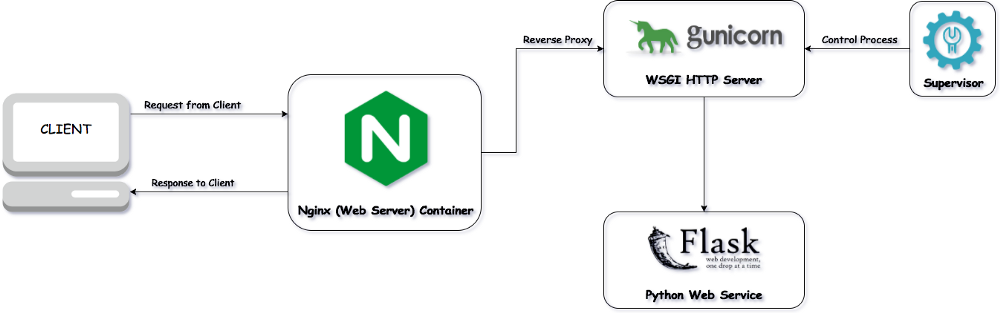

<!--more-->

# 部署python web server 


# Supervisor

它是一个C/S系统，允许用户在类Unix操作系统上控制进程，它有以下特点：

1. 方便   
	对每个进程实例写rc.d是非常不方便的，rc.d脚本是一个进程初始化/自动启动/管理的最小公分母形式，但是书写和维护它是个痛苦的过程。另外，rc.d脚本不能自动重启crashed的进程。而Supervisor把进程作为它的子进程启动，并且可以设置crash后自动重启。
	
2. 准确性   
	在UNIX系统上准确获取进程的up/down状态是很难的，pidfiles经常具有欺骗性。而Supervisor把进程作为它的子进程启动，所有它可以准确知道子进程的存活状态。

3. 授权   
	监听TCP端口号较小的进程通常需要以root用户进行启动和重启，但通常情况下需要允许普通用户去启动和重启进程（但是提供他们shell access以及root权限或者sudo权限是不合适的）。如果Supervisor以root用户启动，它就可以允许普通用户控制进程。Supervisorctl开放有限的接入权限，特别是允许用户看到进程的状态以及通过shell或者web UI发送"stop"，"start", "restart"命令来控制supervisord控制的子进程。
	
4. 进程组   
	多个进程可以以组的形式启动和停止，并且可以有优先级的概念。Supervisor允许你为进程指定优先级，并且可以通过supervisorctl发送命令"start all"和"restart all"，那么进程就会以指定的优先级顺序进行启动。
	
### 配置文件 `supervisord.conf`

supervisord and supervisorctl都使用这个文件，如果启动的时候没有指定-c参数，那应用就会按照以下顺序搜索配置文件：

```
1. $CWD/supervisord.conf
2. $CWD/etc/supervisord.conf
3. /etc/supervisord.conf
4. /etc/supervisor/supervisord.conf (since Supervisor 3.3.0)
5. ../etc/supervisord.conf (Relative to the executable)
6. ../supervisord.conf (Relative to the executable)
```

配置文件主要包含以下几部分：

```
1. [unix_http_server] 为监听在UNIX domain socket 的 HTTP server配置
2. [inet_http_server] 为监听在TCP socket 的HTTP server配置
3. [supervisord] 是与supervisord进程相关的全局设置
4. [supervisorctl]  supervisorctl 交互shell的配置
5. [program:x] 配置哪些服务需要被supervisord监控
6. [include] 包含其他的配置文件
7. [group:x] 以组的形式进行管理
...
```	
# Gunicorn

Gunicorn 'Green Unicorn' is a Python WSGI HTTP Server for UNIX.

Gunicorn是Python下的一个WSGI服务器，听起来很普通，不过因为它支持很多特性，在 Python界还是很流行，例如作为起Flask的父进程，支持用gevent把Flask打个patch等。

它使用的是pre-fork的模式，即启动的时候fork出n个进程，然后master进程负责监听 信号和子进程，如果子进程挂了，那么master会拉一个新的起来，如果有对应信号， master会发起相应的动作。

Flask，webpy，Django都带着 WSGI server，当然性能都不好，自带的web server 更多的是测试用途。线上发布时，则使用高性能的 wsgi server或者是联合nginx做uwsgi。 guincorn是支持wsgi协议的http server，gevent只是它支持的模式之一 ，是为了解决django、flask这些web框架自带wsgi server性能低下的问题。它的特点是与各个web框架结合紧密，部署特别方便。可以和NGINX配合使用，效率更高。

启动方式非常简单，指定配置文件如下：

`gunicorn -c gunicorn_config.py myapp:app`

```
import multiprocessing

bind = '0.0.0.0:9000'
workers = multiprocessing.cpu_count() * 2 + 1

backlog = 2048
worker_class = "gevent"
worker_connections = 1024
daemon = False
debug = True
timeout = 30
proc_name = 'image_handler'
pidfile = '/var/log/gunicorn.pid'
errorlog = '/var/log/gunicorn.log'
```


# WSGI

Web应用的本质就是接收到浏览器发过来的请求，生成一个HTML文档，作为响应返回到浏览器。所以最简单的Web应用就是先把HTML用文件保存好，用一个现有的HTTP服务器软件，接收用户请求，从文件中读取HTML，返回。Apache, Nginx, Lighttpd等这些常见的静态服务器就是干这件事的。如果要动态生成HTML，就需要自己实现上面的所有的步骤。但是，接受HTTP请求，解析HTTP请求，发送HTTP响应都是些底层代码，这些可以由专门的服务器软件实现，我们只需要用python专注于HTML文档的生成，所以需要一个统一的接口，可以让我们专心用python编写web业务代码。

这个接口就是 WSGI：Web Server Gateway Interface，这是一个规范，描述了web server如何与web application交互、web application如何处理请求。

WSGI接口定义非常简单，它只要求Web开发者实现一个函数，就可以响应HTTP请求。

```
def application (environ, start_response):

    response_body = [
        '%s: %s' % (key, value) for key, value in sorted(environ.items())
    ]
    response_body = '\n'.join(response_body)  # 由于下面将Content-Type设置为text/plain，所以`\n`在浏览器中会起到换行的作用

    status = '200 OK'
    response_headers = [
        ('Content-Type', 'text/plain'),
        ('Content-Length', str(len(response_body)))
    ]
    start_response(status, response_headers)

    return [response_body]
    
    

from wsgiref.simple_server import make_server

# 实例化WSGI server
httpd = make_server (
    '127.0.0.1',
    8051, # port
    application # WSGI application，此处就是一个函数
)

# handle_request函数只能处理一次请求，之后就在控制台`print 'end'`了
# httpd.serve_forever()会一直监听
httpd.handle_request()

print('end')
```

上面的application()函数就是符合WSGI标准的一个HTTP处理函数，它接收两个参数：

- environ：一个包含所有HTTP请求信息的dict对象；
- start_response：一个发送HTTP响应的函数。

有了WSGI，我们关心的就是如何从environ这个dict对象拿到HTTP请求信息，然后构造HTML，通过start_response()发送Header，最后返回Body。

application()函数必须由WSGI服务器来调用。有很多符合WSGI规范的服务器，Python内置了一个WSGI服务器，这个模块叫wsgiref，它是用纯Python编写的WSGI服务器的参考实现。所谓“参考实现”是指该实现完全符合WSGI标准，但是不考虑任何运行效率，仅供开发和测试使用。

复杂的Web应用程序，光靠一个WSGI函数来处理还是太底层了，我们需要在WSGI之上再抽象出Web框架，进一步简化Web开发。当前运行在WSGI之上的web框架有Bottle、Flask、Django等

