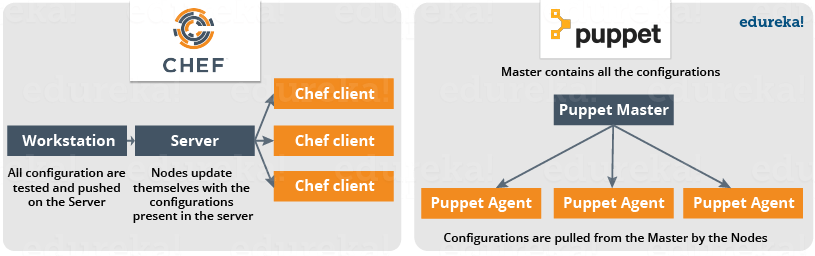
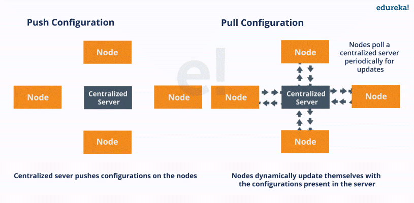
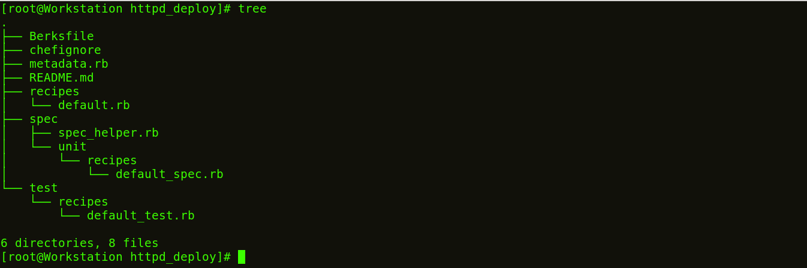
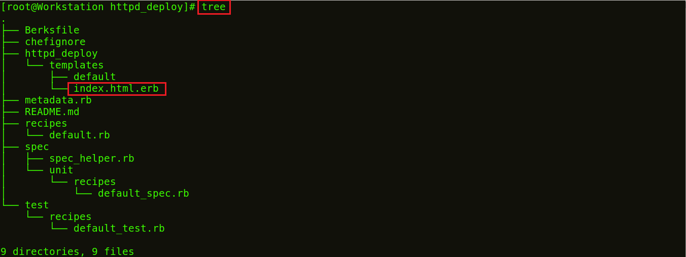
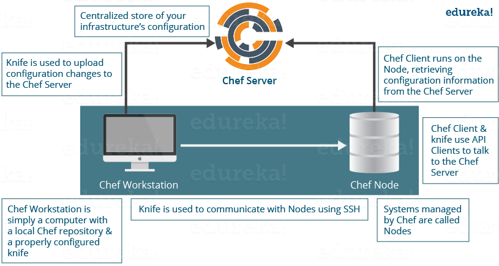
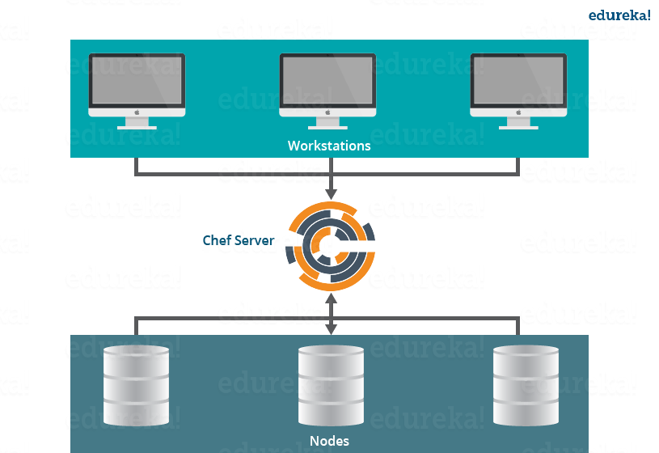

<!--more-->

## What is Chef

Chef 是一个可以提供代码即基础设施的的自动化工具。C/S架构：



nodes可以动态更新server端的配置，pull configuration，不需要在server端执行push configuration到node的命令，所有的node都可以自动更新server端的配置。像Chef 和 Puppet都是pull configuration。

与之相对的 push configuration，ansible。




### Chef 有三大组件:

- Workstation

	- 用于写 Cookbooks 和 Recipes， 这些会被push到 central Chef Server
	- 管理 central Chef Server 的节点。

	Workstations 有两大组件:
	
	- Knife utility
	- A local Chef repository
	
- Server

	类似于一个配置数据的hub. Chef Server 存储 Cookbooks, 应用到Nodes的 policies, 和描述注册节点的元数据（被Chef-Client管理）.
	
	Nodes 通过 Chef-Client 去向 Chef Server 获取配置详情，比如 Recipes, Templates, and file distributions. 
	
	每个节点都安装有 Chef Client , 它会从 Chef Server pull down 配置文件. 
	
- Nodes
	
	主要的组件就是Chef Client, 它主要有以下功能：
	
	- 负责与 central Chef Server交互.
	- 管理Node到 central Chef Server 的初始注册.
	- 拉取 Cookbooks, 并 apply 到 Node 进行配置.
	- 周期性轮训 central Chef Server 获取新的配置

## Install Chef

Following are the steps to install Chef:

1. Install Chef DK (Development Kit) on Chef Workstation

	```
	#wget https://packages.chef.io/stable/el/6/chefdk-1.0.3-1.el6.x86_64.rpm
	#rpm -ivh chefdk-1.0.3-1.el6.x86_64.rpm
	```
	
	Create a Recipe in the Workstation, you will see the file with this content:
	
	```
	#mkdir chef-repo
	#cd chef-repo
	#vim edureka.rb , add : 
	
	file '/etc/motd' do
	content 'Welcome to Chef' 
	end
	
	#chef-apply edureka.rb
	```
	
	
	Modifying Recipe file to install httpd package, you can go to localhost through Chrome:
	
	```
	#vim edureka.rb
	package 'httpd'
	service 'httpd' do
	action [:enable, :start]
	end
	file '/var/www/html/index.html' do
	content 'Welcome to Apache in Chef'
	end
	#chef-apply edureka.rb
	```
2. Create a Recipe or a Cookbook in Workstation

	```
	#cd chef-repo
	#mkdir cookbooks
	#cd cookbooks
	#chef generate cookbook httpd_deploy
	#cd httpd_deploy
	#tree
	```
	
	
	
	Create a Template file:
	

	`#chef generate template httpd_deploy index.html`
	
	
	
	```
	#cd /root/chef-repo/cookbook/httpd_deploy/templates
	#vim index.html.erb
	Welcome to Chef Apache Deployment
	```
	
	Create a Recipe with this template:
	
	```
	#cd /root/chef-repo/cookbooks/httpd_deploy/recipes
	#vim default.rb
	package 'httpd'
	service 'httpd' do
	action [:enable, :start]
	end
	template '/var/www/html/index.html' do
	source 'index.html.erb'
	end
	#cd /root/chef-repo
	#chef-client --local-mode --runlist 'recipe[httpd_deploy]'
	```

	
3. Setup a Chef Server

	[hosted version of Chef Server on the cloud](https://manage.chef.io/)
	
	```
	download starter kit 
	
	#unzip chef-starter.zip
	
	#mv starter /root/chef-repo/cookbooks
	```
4. download a Cookbook from Chef Supermarket in Workstation

	```
	#cd chef-repo
	#knife cookbook site download learn_chef_httpd
	#tar -xvf learn_chef_httpd-0.2.0.tar.gz
	#cd /root/chef-repo/learn_chef_httpd/recipes
	```
4. Upload a Cookbook on the Chef Server

	```
	#mv /root/chef-repo/learn_chef_httpd /root/chef-repo/cookbooks
	#cd /root/chef-repo/cookbooks
	#knife cookbook upload learn_chef_httpd
	```
5. Connect A Node To The Chef Server

	```
	// 192.168.56.102是一个node的IP
	#knife bootstrap 192.168.56.102 --ssh-user root --ssh-password edureka --node-name chefNode 
	#Knife node list

	```
6. Deploy the Cookbook from the Server to the Node

	```
	manage its Run list from the Chef Server
	node# chef-client
	```





## Chef Solo

当你只需要设置一台server的时候，使用chef server 和 chef client就太重了，这个时候我们就可以使用chef-solo。

local machine上面有这些文件：

```
deploy.sh     <--- run "./deploy.sh" on your laptop to deploy
install.sh    <--- this is run on the server to bootstrap and call chef-solo
solo.json     <--- chef configuration
solo.rb       <--- chef configuration
cookbooks/op/recipes/default.rb   <--- the most important file -- your
                                       server recipe goes here
```


### deploy.sh

```
#!/bin/bash

# Usage: ./deploy.sh [host]

host="${1:-ubuntu@opinionatedprogrammer.com}"

# The host key might change when we instantiate a new VM, so
# we remove (-R) the old host key from known_hosts
ssh-keygen -R "${host#*@}" 2> /dev/null

tar cj . | ssh -o 'StrictHostKeyChecking no' "$host" '
sudo rm -rf ~/chef &&
mkdir ~/chef &&
cd ~/chef &&
tar xj &&
sudo bash install.sh'
```