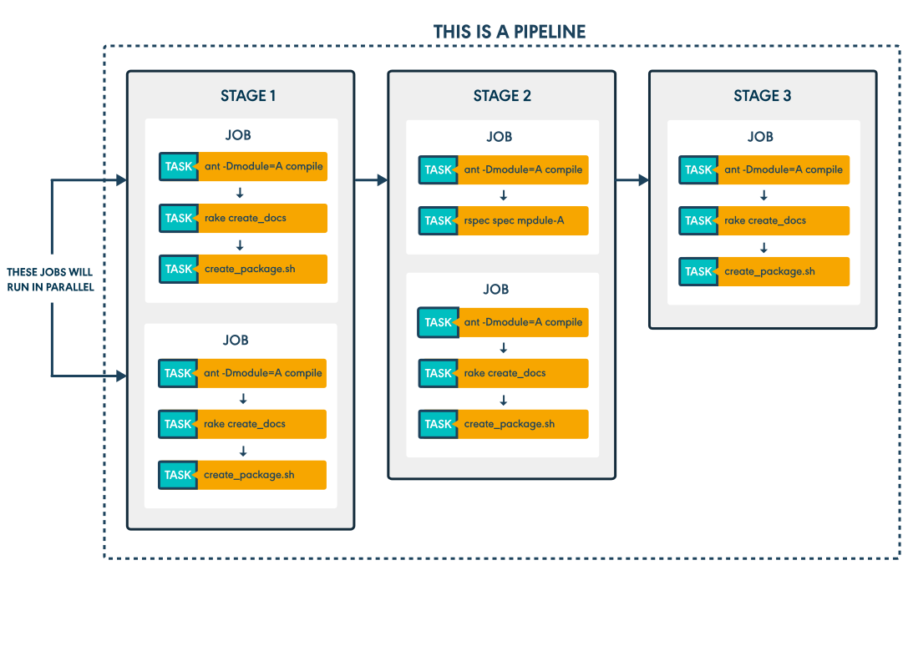
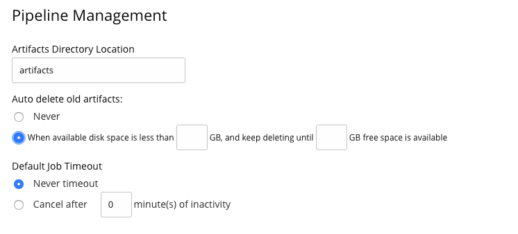
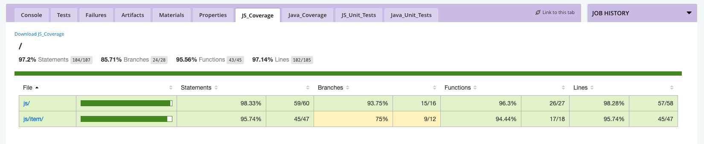
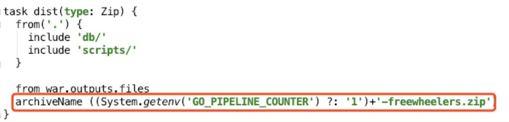
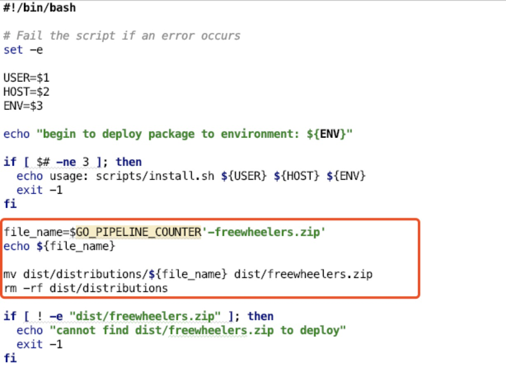
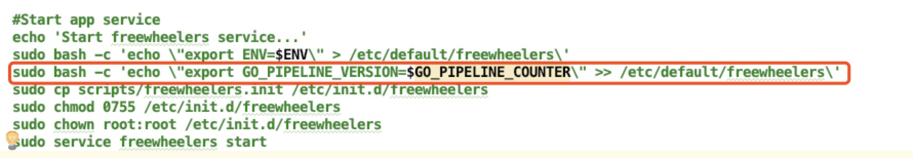
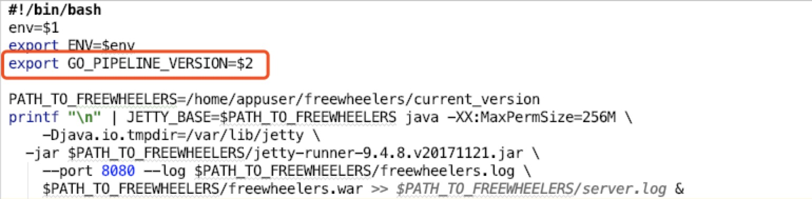

<!--more-->

# Agenda

1. Part1 - Create your own pipeline muannually and automatically
2. Part2 - If zip file store on a seperately repository, such as Nexus, how to package and deploy?
3. Part3 - Show the deployed version on your application.

-----

# Part1
## Agent

GoCD Agents are the workers in the GoCD ecosystem. All tasks configured in the system run on GoCD Agents. The GoCD Server polls for changes in material (this happens on the GoCD Server itself) and then, when a change is detected and a pipeline needs to be triggered, the corresponding jobs are assigned to the agents, for them to execute the tasks.

## installation 

1. [download server and agent for mac](https://www.gocd.org/download/#osx), click `show old releases` button to choose **version 19.3.0**
2. unzip
3. Managing the GoCD server process

	|Script | Description|
	|------| --------|
	|./bin/go-server console | The GoCD server will be started in the foreground|
	|./bin/go-server start | The GoCD server will be started as a daemon in the background|
	|./bin/go-server stop | The GoCD server will be stopped|
	|./bin/go-server restart| The GoCD server will be restarted|
	
4. `http://localhost:8153/go` or `https://localhost:8154/go`
5. Location of GoCD server files

	
	|Location | Description|
	|------| --------|
	|${INSTALL_DIR}/db | the GoCD server database|
	|${INSTALL_DIR}/artifacts | the GoCD server artifacts|
	|${INSTALL_DIR}/plugins | the GoCD server plugins|
	|${INSTALL_DIR}/config| the GoCD server configuration|
	|${INSTALL_DIR}/logs | the GoCD server log files|
	|${INSTALL_DIR}/{lib,wrapper} | the GoCD server binaries and startup scripts|
	|${INSTALL_DIR}/wrapper-config/wrapper-properties.conf| the configuration file to alter GoCD server properties|
	
6. Managing the GoCD agent process

	|Script | Description|
	|------| --------|
	|./bin/go-agent console | The GoCD agent will be started in the foreground|
	|./bin/go-agent start | The GoCD agent will be started as a daemon in the background|
	|./bin/go-agent stop | The GoCD agent will be stopped|
	|./bin/go-agent restart| The GoCD agent will be restarted|

7. `./bin/go-agent console -serverUrl https://localhost:8154/go`
8. check the agent on the page

## Create a pipeline 

### Concepts:



#### 1. Stage

> A stage is a collection of jobs, but the jobs are not sequential. 
> 
> Assuming that you have enough agents started and not busy, then every job in a stage can run on a different agent at the same time, potentially speeding up your build by a lot.

#### 2. Jobs

> A job is a sequential collection of tasks. you can be guaranteed that all tasks in a job run on the same agent.

#### 3. Tasks

> A task is typically a command which is configured to run as a part of the job it is in.

### example step1: manually create

1. Clicking on the **Admin -> pipelines** 


	```
	stage1: unit	 
		job1: run
			task1: ./gradlew clean test  
	```

	```
	stage2: integration	 
		job1: run  
			task1: ./gradlew integrationTest  
	```	
	
	```
	stage3: package	 
		job1: run  
			task1: ./gradlew clean dist  
	```		

#### 4. Artifacts

> An artifact in GoCD is a **file or directory** which is most often produced during the run of a pipeline. 
> 
> Typically, artifacts are created during a job run, by one of the tasks. Some examples of artifacts are: Test reports, coverage reports, and anything else that needs to be stored after a pipeline has finished.
> 
> These artifacts are moved from the Agent where it is created, to the Server and stored there, so that it can be retrieved at any time.
> 
> These artifacts, published by a job, can be fetched and used by any downstream pipeline or any stage after the one that produced the artifact in the same pipeline, using a special task called a **"Fetch Artifact"** task. But, jobs are independent of each other. So, a job in the same stage as another job that produced an artifact cannot use that artifact. It needs to be used in a stage after that one.



"Test Artifact" means that GoCD will try and parse the file as a test report and if it can, it will use it in the test aggregation reporting it does. 

"Build Artifact" for installers, binaries, documentation, etc.

#### 5. Custom Tabs

> A custom tab in GoCD is a way of showing an artifact as a user-defined tab at the job level. Any file which is published as an artifact by a job can be shown. Usually, these are HTML files, with images. The GoCD Server will serve these files from its internal artifact repository.



### example step2: manually create

1. edit the pipeline


	```
	stage1: unit	 
		job1: run
			task1: ./gradlew clean test  
			artifacts: type:build src:build/reports dest:/
			tabs: "JS_Coverage": "reports/coverage/js/index.html".  
            		"Java_Coverage": "reports/coverage/unit/index.html"
	           	"JS_Unit_Tests": "reports/tests/jsTest/index.html"
	           	"Java_Unit_Tests": "reports/tests/test/index.html"
	```

	```
	stage2: integration	 
		job1: run  
			task1: ./gradlew integrationTest  
			artifacts: type:test src:build/reports/tests/integrationTest dest:reports/tests/
			tabs:  "test_report": "reports/tests/integrationTest/index.html"
	```	
	
	```
	stage3: package	 
		job1: run  
			task1: ./gradlew clean dist  
			artifacts: type:build src:build/distributions/freewheelers.zip 
	```		
			
	```
	stage4: deploy-to-ci 
		job1: deploy-to-ci  
			task1: fetch
					"is_source_a_file": true,
			task2: sh -c ./scripts/install.sh $REMOTE_DEPLOY_USER $CI_ENV_HOSTNAME $GO_ENVIRONMENT_NAME
			
	```	

2. Then add environment variables.			
	
### pipeline as code

1. clicking on the **Admin -> Config Repositories** 
2. you will find the pipeline can not find agent. Because the pipeline need to run on a agent whose environments is `freewheelers_env`

## Appendix

run it in docker

`docker run -d -p8153:8153 -p8154:8154 -v /path/to/godata:/godata gocd/gocd-server:v19.3.0`


------
## Part2

### How can you revert to previous version in product environment?

In our current pipeline, we can just click the redeploy button. Because we save our zip file in the artifact, the next stage can use fetch task to get from previous package stage. This will be saved on the server. 

All the zip files are installed in `{go-server}/artifact/`


### If we use a central reporsitory to store these file? 

1. we can track the gocd deployed version number to our zip file.
	- gocd provides some standared environment variables.

		|Environment Variable	    | Description | Example contents |
		|--------------------------| ------------|------------------|
		| `GO_PIPELINE_COUNTER` | How many times the current pipeline has been run| 2345|
		| `GO_REVISION`         | The current source control revision being run (when using only one material)| 123 |
		| `GO_SERVER_URL` | Base URL for the GoCD server (including the context root)| https://127.0.0.1:8154/go |
	
	- when you package the code to zip, name it with the variable
		
		
		
2. Then change your deploy script to fetch that zip file. 
	eg: in the `install.sh`, we also need to rename the zip file.

	
	
-----
# Part3
## show the deploy version in the application

1. we get the `$GO_PIPELINE_COUNTER` in the `install.sh`, and export it to the server. Such as we already did in the `install.sh` about the `env` variable. 

	

	

2. Add a `/about` controller to get the value from the environment then show this variable on the page -- `$GO_PIPELINE_COUNTER`

	```
	@RestController
	public class AboutController {
	
	    private Environment environment;
	    private ZonedDateTime deployTime = ZonedDateTime.now();
	
	    public AboutController(Environment environment) {
	        this.environment = environment;
	    }
	
	    @GetMapping(value = "/about")
	    public String aboutInfo() {
	        return environment.getProperty("GO_PIPELINE_VERSION")
	            +  " at:   " + this.deployTime.toString()
	            + " in: " + environment.getProperty("ENV");
	    }
	}
	```


	


	


