<!--more-->

## 1.1 整体架构
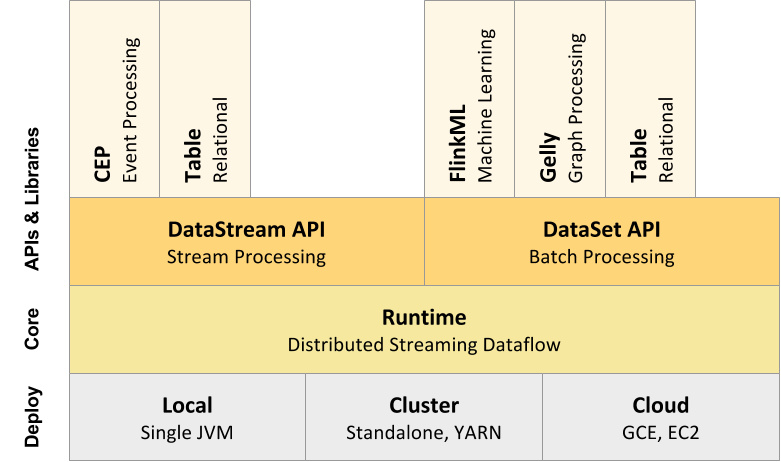
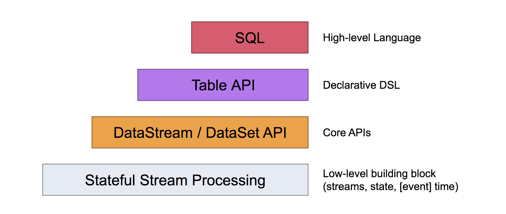

## 1.3 分布式运行流程


## 1.4 与其他框架的对比

与storm的对比
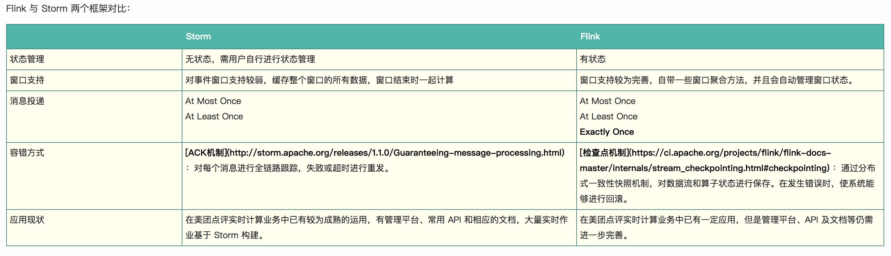

## 1.5 流批统一处理

在执行引擎这一层，流处理系统与批处理系统最大不同在于节点间的数据传输方式。对于一个流处理系统，其节点间数据传输的标准模型是：当一条数据被处理完成后，序列化到缓存中，然后立刻通过网络传输到下一个节点，由下一个节点继续处理。而对于一个批处理系统，其节点间数据传输的标准模型是：当一条数据被处理完成后，序列化到缓存中，并不会立刻通过网络传输到下一个节点，当缓存写满，就持久化到本地硬盘上，当所有数据都被处理完成后，才开始将处理后的数据通过网络传输到下一个节点。这两种数据传输模式是两个极端，对应的是流处理系统对低延迟的要求和批处理系统对高吞吐量的要求。Flink的执行引擎采用了一种十分灵活的方式，同时支持了这两种数据传输模型。Flink以固定的缓存块为单位进行网络数据传输，用户可以通过缓存块超时值指定缓存块的传输时机。如果缓存块的超时值为0，则Flink的数据传输方式类似上文所提到流处理系统的标准模型，此时系统可以获得最低的处理延迟。如果缓存块的超时值为无限大，则Flink的数据传输方式类似上文所提到批处理系统的标准模型，此时系统可以获得最高的吞吐量。同时缓存块的超时值也可以设置为0到无限大之间的任意值。缓存块的超时阈值越小，则Flink流处理执行引擎的数据处理延迟越低，但吞吐量也会降低，反之亦然。通过调整缓存块的超时阈值，用户可根据需求灵活地权衡系统延迟和吞吐量。

## 1.6 [内存管理](http://wuchong.me/blog/2016/04/29/flink-internals-memory-manage/)


Flink TaskManager 是由几个内部组件组成的：actor 系统（负责与 Flink master 协调）、IOManager（负责将数据溢出到磁盘并将其读取回来）、MemoryManager（负责协调内存使用）。

### 积极的内存管理

Flink 并不是将大量对象存在堆上，而是将对象都序列化到一个预分配的内存块上，这个内存块叫做 MemorySegment，它代表了一段固定长度的内存（默认大小为 32KB），也是 Flink 中最小的内存分配单元，并且提供了非常高效的读写方法。你可以把 MemorySegment 想象成是为 Flink 定制的 java.nio.ByteBuffer。它的底层可以是一个普通的 Java 字节数组（byte[]），也可以是一个申请在堆外的 ByteBuffer。每条记录都会以序列化的形式存储在一个或多个MemorySegment中。

taskmanager的堆内存被分成三个部分：
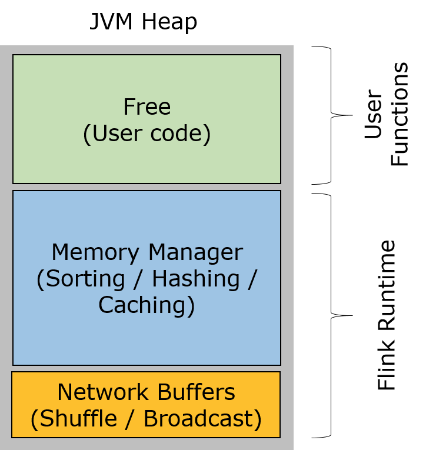

- **Network Buffers:** 一定数量的32KB大小的 buffer，主要用于数据的网络传输。在 TaskManager 启动的时候就会分配。默认数量是 2048 个，可以通过 taskmanager.network.numberOfBuffers 来配置。
- **Memory Manager Pool:** 这是一个由 MemoryManager 管理的，由众多MemorySegment组成的超大集合。Flink 中的算法（如 sort/shuffle/join）会向这个内存池申请 MemorySegment，将序列化后的数据存于其中，使用完后释放回内存池。默认情况下，池子占了堆内存的 70% 的大小。
- **Remaining (Free) Heap:** 这部分的内存是留给用户代码以及 TaskManager 的数据结构使用的。因为这些数据结构一般都很小，所以基本上这些内存都是给用户代码使用的。从GC的角度来看，可以把这里看成的新生代，也就是说这里主要都是由用户代码生成的短期对象。

*注意：Memory Manager Pool 主要在Batch模式下使用。在Steaming模式下，该池子不会预分配内存，也不会向该池子请求内存块。也就是说该部分的内存都是可以给用户代码使用的。不过社区是打算在 Streaming 模式下也能将该池子利用起来。*

## 1.7 task vs subtask vs operator vs node vs job

- job -- client向集群提交job，job是应用运行实例。
- task -- 是一个抽象表示，代表了在一个线程中的chained operators，当执行像keyBy这种会导致网络shuffle，导致stream分区，或者是改变了并行度的操作，都会导致算子独立成单独的task。
- subtask -- 是并行task中的一个
- taskmanager -- 运行dataflow中的subtask, buffer和传输stream

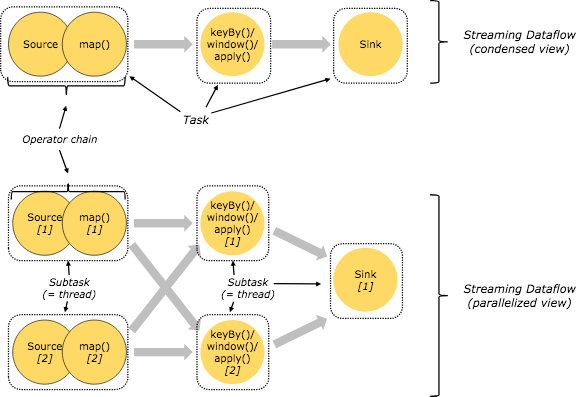
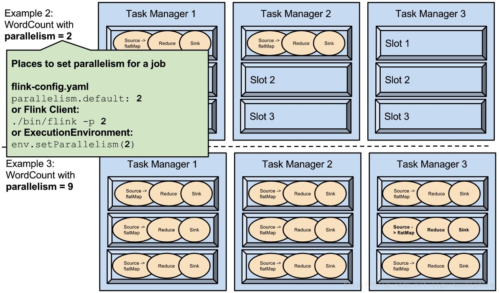

## 1.8 并行度


最大并行度的默认设置大致operatorParallelism + (operatorParallelism / 2)为下限127和上限32768。

注意将最大并行度设置为非常大的值可能对性能有害，因为某些状态后台必须保持内部数据结构随Keys组的数量（这是可重新缓存状态的内部实现机制）进行扩展。

## 1.9 重启策略

- 固定延迟重启
- 故障率重启
- 不重启
- 回退重启

默认重启策略是通过Flink的配置文件设置的flink-conf.yaml。配置参数restart-strategy定义采用的策略。如果未启用检查点，则使用“无重启”策略。如果激活了检查点并且尚未配置重启策略，则固定延迟策略将用于 Integer.MAX_VALUE重启尝试。

除了定义默认重启策略之外，还可以为每个Flink作业定义特定的重启策略。通过调用setRestartStrategyon上的方法以编程方式设置此重新启动策略ExecutionEnvironment。请注意，这也适用于StreamExecutionEnvironment。

## 1.10 批处理容错
DataSet API中程序的容错能力通过重试失败的执行来实现。Flink在作业声明为失败之前重试执行的时间可通过执行重试参数进行配置。值0有效意味着禁用容错。

要激活容错，请将执行重试次数设置为大于零的值。常见的选择是值为3。

## 2.1 包含三种时间

1. Processing Time   

	事件被处理时机器的系统时间。这个也是默认值。
2. Event Time

	事件发生的时间，一般就是数据本身携带的时间。
3. Ingestion Time

	事件进入 Flink 的时间。Ingestion Time 程序无法处理任何无序事件或延迟数据，但程序不必指定如何生成水印。
	
## 2.2 window

**Keyed Windows**

```
stream
       .keyBy(...)               <-  keyed versus non-keyed windows
       .window(...)              <-  required: "assigner"
      [.trigger(...)]            <-  optional: "trigger" (else default trigger)
      [.evictor(...)]            <-  optional: "evictor" (else no evictor)
      [.allowedLateness(...)]    <-  optional: "lateness" (else zero)
      [.sideOutputLateData(...)] <-  optional: "output tag" (else no side output for late data)
       .reduce/aggregate/fold/apply()      <-  required: "function"
      [.getSideOutput(...)]      <-  optional: "output tag"
```

**Non-Keyed Windows**

```
stream
       .windowAll(...)           <-  required: "assigner"
      [.trigger(...)]            <-  optional: "trigger" (else default trigger)
      [.evictor(...)]            <-  optional: "evictor" (else no evictor)
      [.allowedLateness(...)]    <-  optional: "lateness" (else zero)
      [.sideOutputLateData(...)] <-  optional: "output tag" (else no side output for late data)
       .reduce/aggregate/fold/apply()      <-  required: "function"
      [.getSideOutput(...)]      <-  optional: "output tag"
```
所有的窗口逻辑都会在一个task中执行，并行度是1.


### window lifecycle
第一个元素进入窗口 -> 时间大于窗口结束时间+允许的时延

只有基于时间的窗口会被删除


### window assigners

1. 基于时间窗口
2. 基于时间的滑动窗口
3. 基于事件数量窗口
4. 基于事件数量滑动窗口
5. 基于会话时间窗口 -- 可是设置静态或者动态的gap   
	因为session window没有固定的起止时间，所以它和固定和滑动窗口不一样，session window算子对每个到达的record创建一个新的window，并且如何小于gap时间会合并相应window，为了可合并，该算子要求一个合并触发器和一个合并window function，比如ReduceFunction, AggregateFunction, or ProcessWindowFunction (FoldFunction cannot merge.)
	
6. 自定义窗口
7. global window--把所有相同key的元素放到一个global window中，只有指定了自定义trigger才能使用，否则没有计算会被执行。

### window function
会对窗口中的元素进行的计算

- ReduceFunction, 
- AggregateFunction, 
- FoldFunction -- 不可以用于session window或者其他可以合并的窗口
- ProcessWindowFunction. -- 这个效率最低，因为它在触发执行前缓存所有的元素再进行计算，而前两个是递增地聚合到达的元素。所以可以通过组合改函数与前三个来得到递增聚合元素，以及额外的窗口源数据。但是它有一个上下文对象可以获取到时间和状态信息，所以灵活性相比其他更多。所以如果不是需要获取上下文信息，尽量不使用。

	[ProcessWindowFunction with Incremental Aggregation](https://ci.apache.org/projects/flink/flink-docs-release-1.10/dev/stream/operators/windows.html#processwindowfunction-with-incremental-aggregation)
	
### triggers
触发窗口进行计算，比如当水印超过了窗口结束时间，或者元素大于4个
### evictors
触发之后，计算之前，从窗口中驱逐出某些元素
### allowed lateness
### working with window results

## 2.3 watermark

有两种水印：

1. With Periodic Watermarks

	周期性的（一定时间间隔或者达到一定的记录条数）产生一个Watermark。在实际的生产中Periodic的方式必须结合时间和积累条数两个维度继续周期性产生Watermark，否则在极端情况下会有很大的延时。

	对于乱序以及正常数据而言的触发条件：
	watermark = currentMaxTimestamp - maxLateTime
	watermark >= windowEndTime 触发窗口
	
	
	默认情况下，当watermark通过end-of-window之后，再有之前的数据到达时，这些数据会被删除。为了避免有些迟到的数据被删除，因此产生了allowedLateness的概念。
	
	*注意：对于trigger是默认的EventTimeTrigger的情况下，allowedLateness会再次触发窗口的计算，而之前触发的数据，会buffer起来，直到watermark>end-of-window + allowedLateness（），窗口的数据及元数据信息才会被删除。再次计算就是DataFlow模型中的Accumulating的情况。sessionWindow由于存在窗口的merge，所以对于late element，并不是来一条就重新触发一次窗口。*


2. With Punctuated Watermarks

	数据流中每一个递增的EventTime都会产生一个Watermark。
在实际的生产中Punctuated方式在TPS很高的场景下会产生大量的Watermark在一定程度上对下游算子造成压力，所以只有在实时性要求非常高的场景才会选择Punctuated的方式进行Watermark的生成。

### 多流的Watermark处理

在实际的流计算中往往一个job中会处理多个Source的数据，对Source的数据进行GroupBy分组，那么来自不同Source的相同key值会shuffle到同一个处理节点，并携带各自的Watermark，Apache Flink内部要保证Watermark要保持单调递增，当Apache Flink内部实现每一个边上只能有一个递增的Watermark， 当出现多流携带Eventtime汇聚到一起(GroupBy or Union)时候，Apache Flink会选择所有流入的Eventtime中最小的一个向下游流出。从而保证watermark的单调递增和保证数据的完整性.如下图:

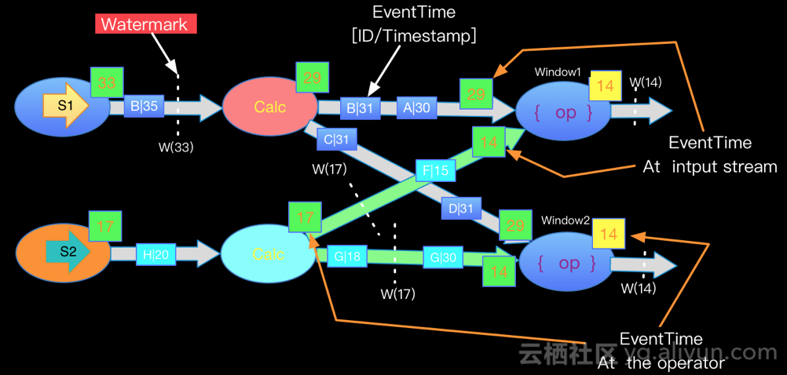

## 2.4 [DataStream API](https://ci.apache.org/projects/flink/flink-docs-stable/dev/stream/operators/)

Operators

- DataStream Transformations
	- Map
	- FlatMap
	- Filter
	- KeyBy (DataStream -> KeyedStream) -- 通过hash来分区，所以如果对象没有实现hashCode()则不能作为key
	- Reduce (KeyedStream -> DataStream) 
	- Fold (KeyedStream -> DataStream) 
	- Aggregations (KeyedStream -> DataStream) 
		
		```keyedStream.sum(0);
			keyedStream.sum("key");
			keyedStream.min(0);
			keyedStream.min("key");
			keyedStream.max(0);
			keyedStream.max("key");
			keyedStream.minBy(0);
			keyedStream.minBy("key");
			keyedStream.maxBy(0);
			keyedStream.maxBy("key");
    
		```
	- Window (KeyedStream -> WindowedStream)
	- WindowAll (DataStream -> AllWindowedStream)
	- Window Apply (WindowedStream → DataStream, AllWindowedStream → DataStream)
	- Window Reduce (WindowedStream → DataStream)
	- Window Fold (WindowedStream → DataStream)
	- Aggregations on windows (WindowedStream → DataStream)
	
		```
		windowedStream.sum(0);
		windowedStream.sum("key");
		windowedStream.min(0);
		windowedStream.min("key");
		windowedStream.max(0);
		windowedStream.max("key");
		windowedStream.minBy(0);
		windowedStream.minBy("key");
		windowedStream.maxBy(0);
		windowedStream.maxBy("key");
		```
	- Union (DataStream* → DataStream)
	- Window Join (DataStream,DataStream → DataStream)
	- Interval Join (KeyedStream,KeyedStream → DataStream) -- `key1 == key2 && leftTs - 2 < rightTs < leftTs + 2`
	- Window CoGroup (DataStream,DataStream → DataStream)--Cogroups two data streams on a given key and a common window.
	- Connect (DataStream,DataStream → ConnectedStreams)
	- CoMap, CoFlatMap (ConnectedStreams → DataStream)
	- Split (DataStream → SplitStream)
	- Select (SplitStream → DataStream)
	- Iterate (DataStream → IterativeStream → DataStream)--创建一个反馈回环，把一个算子的某个输出回传到前一个算子. 在定义需要持续更新模型的算法时特别有用.
	- Extract Timestamps（DataStream → DataStream）
	- Project (DataStream → DataStream) -- 用于tuples流,从事件流中选择属性子集，并仅将所选元素发送到下一个处理流。
	
- Physical partitioning
	- Custom partitioning（DataStream → DataStream）
	- Random partitioning（DataStream → DataStream）-- .shuffle()
	- Rebalancing (Round-robin partitioning) (DataStream → DataStream) --.rebalance()
	- Rescaling （DataStream → DataStream）
	- Broadcasting （DataStream → DataStream）
- Task chaining and resource groups
	- Start new chain--`someStream.filter(...).map(...).startNewChain().map(...);`
	- Disable chaining -- `someStream.map(...).disableChaining();`或者全局禁止`StreamExecutionEnvironment.disableOperatorChaining()`
	- Set slot sharing group -- `someStream.filter(...).slotSharingGroup("name");`

## 2.5 connector
Flink 中你可以使用 `StreamExecutionEnvironment.addSource(sourceFunction)` 来为你的程序添加数据来源。

Flink 已经提供了若干实现好了的 source functions，当然你也可以通过实现 SourceFunction 来自定义非并行的 source 或者实现 ParallelSourceFunction 接口或者扩展 RichParallelSourceFunction 来自定义并行的 source。总体可分为一下几类：

1. 基于集合--有界数据集，更偏向于本地测试用
	- fromCollection(Collection)
	- fromCollection(Iterator, Class)
	- fromElements(T …)
	- fromParallelCollection(SplittableIterator, Class)
	- generateSequence(from, to) - 创建一个生成指定区间范围内的数字序列的并行数据流。
2. 基于文件--适合监听文件修改并读取其内容
	- readTextFile(path)
	- readFile(fileInputFormat, path) 
	- readFile(fileInputFormat, path, watchType, interval, pathFilter, typeInfo) - 这是上面两个方法内部调用的方法。
3. 基于socket--监听主机的 host port，从 Socket 中获取数据
	- socketTextStream(String hostname, int port) 
4. 自定义
	- addSource - 添加一个新的 source function。

SourceFunction 接口，它是所有 stream source 的根接口，它继承自一个标记接口（空接口）Function。

SourceFunction 定义了两个接口方法：

1. run ： 启动一个 source，即对接一个外部数据源然后 emit 元素形成 stream（大部分情况下会通过在该方法里运行一个 while 循环的形式来产生 stream）。
2. cancel ： 取消一个 source，也即将 run 中的循环 emit 元素的行为终止。

## 3.1 [State](https://yq.aliyun.com/articles/225623)
Flink 中有两种基本的状态：Keyed State 和 Operator State。

**Keyed State**

顾名思义，就是基于KeyedStream上的状态。这个状态是跟特定的key绑定的，对KeyedStream流上的每一个key，可能都对应一个state。

**Operator State**

与Keyed State不同，Operator State跟一个特定operator的一个并发实例绑定，整个operator只对应一个state。相比较而言，在一个operator上，可能会有很多个key，从而对应多个keyed state。

举例来说，Flink中的Kafka Connector，就使用了operator state。它会在每个connector实例中，保存该实例中消费topic的所有(partition, offset)映射。

Keyed State 和 Operator State 分别有两种存在形式：managed(托管状态) and raw(原始状态).

托管状态由 Flink 运行时控制的数据结构表示，比如内部的 hash table 或者 RocksDB。 比如 ValueState, ListState, MapState等。Flink runtime 会对这些状态进行编码并写入 checkpoint。

Raw State 则保存在算子自己的数据结构中，由用户自行管理状态具体的数据结构。checkpoint 的时候，Flink 并不知晓具体的内容，仅仅写入一串字节序列到 checkpoint。

通常在DataStream上的状态推荐使用托管的状态，当实现一个用户自定义的operator时，会使用到原始状态。由于 Flink 可以在修改并发时更好的分发状态数据，并且能够更好的管理内存，因此建议使用 managed state（而不是 raw state）。

#### 使用 Managed Keyed State
managed keyed state 接口提供不同类型状态的访问接口，这些状态都作用于当前输入数据的 key 下。换句话说，这些状态仅可在 KeyedStream 上使用，可以通过 stream.keyBy(...) 得到 KeyedStream.

1. ValueState<T>: 这个状态与对应的key绑定，是最简单的状态了。它可以通过update方法更新状态值，通过value()方法获取状态值。
2. ListState<T>: 即key上的状态值为一个列表。可以通过add方法往列表中附加值；也可以通过get()方法返回一个Iterable<T>来遍历状态值。
3. ReducingState<T>: 这种状态通过用户传入的reduceFunction，每次调用add方法添加值的时候，会调用reduceFunction，最后合并到一个单一的状态值。
4. AggregatingState<IN, OUT>: 
5. MapState<UK, UV>: 即状态值为一个map。用户通过put或putAll方法添加元素。

以上所有的状态类型，都有一个clear方法，可以清除当前key对应的状态。

*需要注意的是，以上所述的State对象，仅仅用于与状态进行交互（更新、删除、清空等），而真正的状态值，有可能是存在内存、磁盘、或者其他分布式存储系统中。相当于我们只是持有了这个状态的句柄(state handle)。*

接下来看下，我们如何得到这个状态句柄。Flink通过StateDescriptor来定义一个状态。这是一个抽象类，内部定义了状态名称、类型、序列化器等基础信息。与上面的状态对应，从StateDescriptor派生了ValueStateDescriptor, ListStateDescriptor等descriptor。

具体如下：

- ValueState getState(ValueStateDescriptor)
- ReducingState getReducingState(ReducingStateDescriptor)
- ListState getListState(ListStateDescriptor)
- MapState getMapState(MapStateDescriptor)

```
public class CountWindowAverage extends RichFlatMapFunction<Tuple2<Long, Long>, Tuple2<Long, Long>> {

    /**
     * ValueState状态句柄. 第一个值为count，第二个值为sum。
     */
    private transient ValueState<Tuple2<Long, Long>> sum;

    @Override
    public void flatMap(Tuple2<Long, Long> input, Collector<Tuple2<Long, Long>> out) throws Exception {

        // access the state value
        Tuple2<Long, Long> currentSum = sum.value();

        // update the count
        currentSum.f0 += 1;

        // add the second field of the input value
        currentSum.f1 += input.f1;

        // update the state
        sum.update(currentSum);

        // if the count reaches 2, emit the average and clear the state
        if (currentSum.f0 >= 2) {
            out.collect(new Tuple2<>(input.f0, currentSum.f1 / currentSum.f0));
            sum.clear();
        }
    }

    @Override
    public void open(Configuration config) {
        ValueStateDescriptor<Tuple2<Long, Long>> descriptor =
                new ValueStateDescriptor<>(
                        "average", // the state name
                        TypeInformation.of(new TypeHint<Tuple2<Long, Long>>() {}), // type information
                        Tuple2.of(0L, 0L)); // default value of the state, if nothing was set
        sum = getRuntimeContext().getState(descriptor);
    }
}

// this can be used in a streaming program like this (assuming we have a StreamExecutionEnvironment env)
env.fromElements(Tuple2.of(1L, 3L), Tuple2.of(1L, 5L), Tuple2.of(1L, 7L), Tuple2.of(1L, 4L), Tuple2.of(1L, 2L))
        .keyBy(0)
        .flatMap(new CountWindowAverage())
        .print();

// the printed output will be (1,4) and (1,5)
```

由于状态需要从RuntimeContext中创建和获取，因此如果要使用状态，必须使用RichFunction。普通的Function是无状态的。

#### 使用 Managed Operator State
用户可以通过实现 CheckpointedFunction 或 ListCheckpointed<T extends Serializable> 接口来使用 managed operator state。

CheckpointedFunction 接口提供了访问 non-keyed state 的方法，需要实现如下两个方法：

```
void snapshotState(FunctionSnapshotContext context) throws Exception;

void initializeState(FunctionInitializationContext context) throws Exception;
```

进行 checkpoint 时会调用 snapshotState()。 用户自定义函数初始化时会调用 initializeState()，初始化包括第一次自定义函数初始化和从之前的 checkpoint 恢复。 因此 initializeState() 不仅是定义不同状态类型初始化的地方，也需要包括状态恢复的逻辑。

当前，managed operator state 以 list 的形式存在。这些状态是一个 可序列化 对象的集合 List，彼此独立，方便在改变并发后进行状态的重新分派。 换句话说，这些对象是重新分配 non-keyed state 的最细粒度。根据状态的不同访问方式，有如下几种重新分配的模式：

- Even-split redistribution: 每个operator都保存一个列表形式的状态集合，整个状态由所有的列表拼接而成。当作业恢复或重新分配的时候，整个状态会按照operator的并发度进行均匀分配。 比如说，operator A 的并发度为 1，包含两个元素 element1 和 element2，当并发度增加为 2 时，element1 会被分到并发 0 上，element2 则会被分到并发 1 上。

- Union redistribution: 每个operator保存一个列表形式的状态集合。整个状态由所有的列表拼接而成。当作业恢复或重新分配时，每个operator都将获得所有的状态数据。

- Broadcast State[使用广播状态的注意事项](http://wuchong.me/blog/2018/11/28/flink-tips-broadcast-state-pattern-flink-considerations/):当一条流的数据需要被广播到下游的所有tasks时，它会本地存储，然后在其他流中处理所有到来的元素。

	broadcast state differs from the rest of operator states in that:

		- it has a map format,
		- it is only available to specific operators that have as inputs a broadcasted stream and a non-broadcasted one, and 
		- such an operator can have multiple broadcast states with different names.

	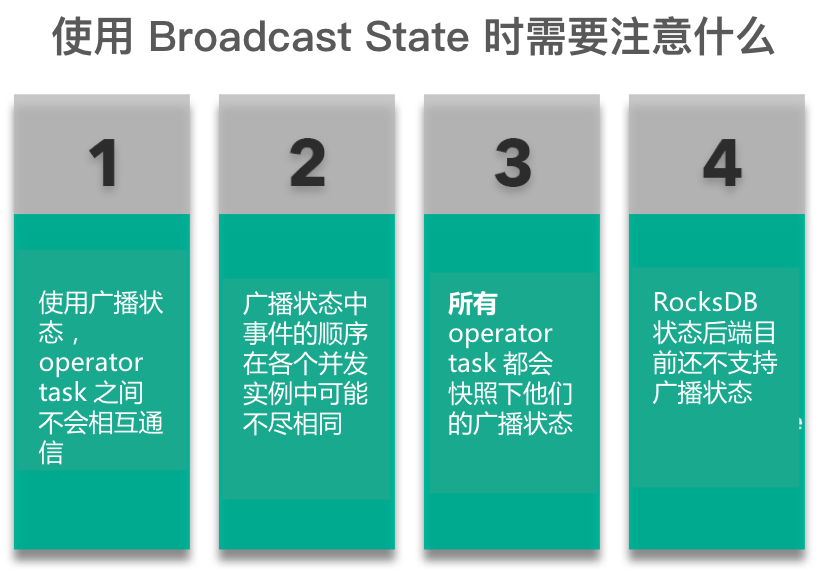

#### Queryable State	
简单来说，这个feature暴露flink的managed keyed state到外部，并且允许用户从flink的外部查询job的状态。在某些场景，queryable state 消除了对与外部系统进行分布式操作/事物的需求，比如key-value stores，经常是瓶颈所在。另外，这个feature对于debug也很有用。

简单来说，当用户在job中定义了queryable state之后，就可以在外部，通过QueryableStateClient，通过job id, state name, key来查询所对应的状态的实时的值。

queryable state目前支持两种方法来定义：

- 通过KeyedStream.asQueryableState方法，生成一个QueryableStream，需要注意的是，这个stream类似于一个sink，是不能再做transform的。 实现上，生成QueryableStream就是为当前stream加上一个operator：QueryableAppendingStateOperator，它的processElement方法，每来一个元素，就会调用state.add去更新状态。因此这种方式有一个限制，只能使用ValueDescriptor, FoldingStateDescriptor或者ReducingStateDescriptor，而不能是ListStateDescriptor，因为它可能会无限增长导致OOM。此外，由于不能在stream后面再做transform，也是有一些限制。
- 通过managed keyed state。

	```
	ValueStateDescriptor<Tuple2<Long, Long>> descriptor =
	new ValueStateDescriptor<>(
	      "average", // the state name
	      TypeInformation.of(new TypeHint<Tuple2<Long, Long>>() {}),
	      Tuple2.of(0L, 0L)); 
	  descriptor.setQueryable("query-name"); // queryable state name
	```
	
	这个只需要将具体的state descriptor标识为queryable即可，这意味着可以将一个pipeline中间的operator的state标识为可查询的。
	
首先根据state descriptor的配置，会在具体的TaskManager中创建一个KvStateServer，用于state查询，它就是一个简单的netty server，通过KvStateServerHandler来处理请求，查询state value并返回。

但是一个partitionable state，可能存在于多个TaskManager中，因此需要有一个路由机制，当QueryableStateClient给定一个query name和key时，要能够知道具体去哪个TaskManager中查询。

为了做到这点，在Job的ExecutionGraph（JobMaster）上会有一个用于定位KvStateServer的KvStateLocationRegistry，当在TaskManager中注册了一个queryable KvStateServer时，就会调用JobMaster.notifyKvStateRegistered，通知JobMaster。

具体流程如下图：

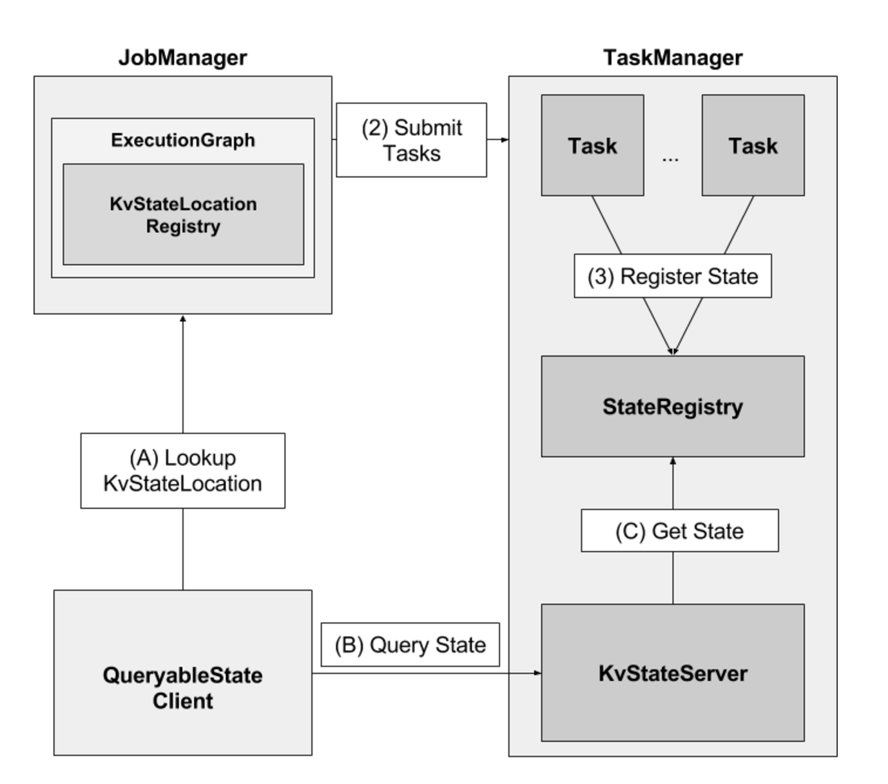

这个设计看起来很美好，通过向流计算实时查询状态数据，免去了传统的存储等的开销。但实际上，除了上面提到的状态类型的限制之外，也会受netty server以及state backend本身的性能限制，因此并不适用于高并发的查询。

注意：当查询一个state对象时，那个对象在当前线程可访问，不需要同步或者复制。这是一个设计选择，因为任何一个都会增加job延迟，我们希望避免。因为任何state backend使用Java堆，比如MemoryStateBackend或者FsStateBackend，当获取values通过copies时是不会工作的，但是直接引用存储的values，read-modify-write模式是不安全的，因为并发修改可能会导致queryable state server失败。RocksDBStateBackend对于这个问题是安全的。

Queryable State feature由三部分组成：
1. QueryableStateClient: 运行在flink集群之外，提交用户的请求。
2. QueryableStateClientProxy：运行在每个TaskManager，负责接收用户的请求，从相应的TaskManager获取请求的state，并返回给client。
3. QueryableStateServer：运行在每个TaskManager上，负责提供本地存储的state。

Client连接到任意一个proxy，发送指定key k的state请求。keyed state组织在Key Groups中，每个TaskManager被分配一些key groups. 为了找到哪个TaskManager负责含有k 的key group, proxy会询问JobManager，然后proxy查询对应的TaskManager上的QueryableStateServer，然后转发收到的恢复到client端。

## 3.2 [如何选择后端状态](http://wuchong.me/blog/2018/11/21/flink-tips-how-to-choose-state-backends/)

**何时使用 MemoryStateBackend：**

本地开发或调试时建议使用 MemoryStateBackend，因为这种场景的状态大小的是有限的。
MemoryStateBackend 最适合小状态的应用场景。例如 Kafka consumer，或者一次仅一记录的函数 （Map, FlatMap，或 Filter）。

**何时使用 FsStateBackend：**

FsStateBackend 适用于处理大状态，长窗口，或大键值状态的有状态处理任务。
FsStateBackend 非常适合用于高可用方案。

**何时使用 RocksDBStateBackend：**

RocksDBStateBackend 最适合用于处理大状态，长窗口，或大键值状态的有状态处理任务。
RocksDBStateBackend 非常适合用于高可用方案。
RocksDBStateBackend 是目前唯一支持增量 checkpoint 的后端。增量 checkpoint 非常使用于超大状态的场景。

当使用 RocksDB 时，状态大小只受限于磁盘可用空间的大小。这也使得 RocksDBStateBackend 成为管理超大状态的最佳选择。使用 RocksDB 的权衡点在于所有的状态相关的操作都需要序列化（或反序列化）才能跨越 JNI 边界。与上面提到的堆上后端相比，这可能会影响应用程序的吞吐量。

## 3.3 整个CheckPoint执行过程如下

1. JobManager端的 CheckPointCoordinator向 所有SourceTask发送CheckPointTrigger，Source Task会在数据流中安插CheckPoint barrier

2. 当task收到所有的barrier后，向自己的下游继续传递barrier，然后自身执行快照，并将自己的状态异步写入到持久化存储中

	- 增量CheckPoint只是把最新的一部分更新写入到 外部存储
	- 为了下游尽快做CheckPoint，所以会先发送barrier到下游，自身再同步进行快照
3. 当task完成备份后，会将备份数据的地址（state handle）通知给JobManager的CheckPointCoordinator

	- 如果CheckPoint的持续时长超过 了CheckPoint设定的超时时间，CheckPointCoordinator 还没有收集完所有的 State Handle，CheckPointCoordinator就会认为本次CheckPoint失败，会把这次CheckPoint产生的所有 状态数据全部删除
4. 最后 CheckPoint Coordinator 会把整个 StateHandle 封装成 completed CheckPoint Meta，写入到hdfs


### 3.3.1 barrier对齐

- 一旦Operator从输入流接收到CheckPoint barrier n，它就不能处理来自该流的任何数据记录，直到它从其他所有输入接收到barrier n为止。否则，它会混合属于快照n的记录和属于快照n + 1的记录
- 接收到barrier n的流暂时被搁置。从这些流接收的记录不会被处理，而是放入输入缓冲区。
- 一旦最后所有输入流都接收到barrier n，Operator就会把缓冲区中pending 的输出数据发出去，然后把CheckPoint barrier n接着往下游发送
	- 这里还会对自身进行快照
- 之后，Operator将继续处理来自所有输入流的记录，在处理来自流的记录之前先处理来自输入缓冲区的记录

什么时候会出现barrier对齐？

- 首先设置了Flink的CheckPoint语义是：Exactly Once
- Operator实例必须有多个输入流才会出现barrier对齐

这里有个问题需要注意：程序中Flink的CheckPoint语义设置了 Exactly Once，但是我的mysql中看到数据重复了？程序中设置了1分钟1次CheckPoint，但是5秒向mysql写一次数据，并commit

答：Flink要求end to end的精确一次都必须实现TwoPhaseCommitSinkFunction。如果你的chk-100成功了，过了30秒，由于5秒commit一次，所以实际上已经写入了6批数据进入mysql，但是突然程序挂了，从chk100处恢复，这样的话，之前提交的6批数据就会重复写入，所以出现了重复消费。Flink的精确一次有两种情况，一个是Flink内部的精确一次，一个是端对端的精确一次。

不同点 |checkpoint|savepoint
------|----------|---------
目标|充当 Flink 中的恢复机制，确保能从潜在的故障中恢复|充当手动备份、恢复暂停作业的方法
实现|Checkpoint 被设计成轻量和快速的机制。它们可能（但不一定必须）利用底层状态后端的不同功能尽可能快速地恢复数据。例如，基于 RocksDB 状态后端的增量检查点，能够加速 RocksDB 的 checkpoint 过程，这使得 checkpoint 机制变得更加轻量。|Savepoint 旨在更多地关注数据的可移植性，并支持对作业做任何更改而状态能保持兼容，这使得生成和恢复的成本更高。
生命周期|Checkpoint 是自动和定期的，它们由 Flink 自动地周期性地创建和删除，无需用户的交互。|Savepoint 是由用户手动地管理（调度、创建、删除）的。

Savepoint 可以在以下情况下使用：

- 部署流应用的一个新版本，包括新功能、BUG 修复、或者一个更好的机器学习模型
- 引入 A/B 测试，使用相同的源数据测试程序的不同版本，从同一时间点开始测试而不牺牲先前的状态
- 在需要更多资源时扩容应用程序
- 迁移流应用程序到 Flink 的新版本上，或者迁移到另一个集群

## 4 Table API 和 SQL
Apache Flink具有两个关系API - Table API和SQL - 用于统一流和批处理。 

-  Table API是Scala和Java语言集成查询API，允许以非常直观的方式组合来自关系 算子的查询，例如选择，过滤和连接。
-  Flink的SQL支持基于实现SQL标准的Apache Calcite。无论输入是批输入（DataSet）还是流输入（DataStream），任一接口中指定的查询都具有相同的语义并指定相同的结果。

Table API和SQL接口彼此紧密集成，以及Flink的DataStream和DataSet API。您可以轻松地在基于API构建的所有API和库之间切换。例如，您可以使用CEP库从DataStream中提取模式，然后使用 Table API分析模式，或者可以在预处理上运行Gelly图算法之前使用SQL查询扫描，过滤和聚合批处理表数据。

## 8.1 backpressure
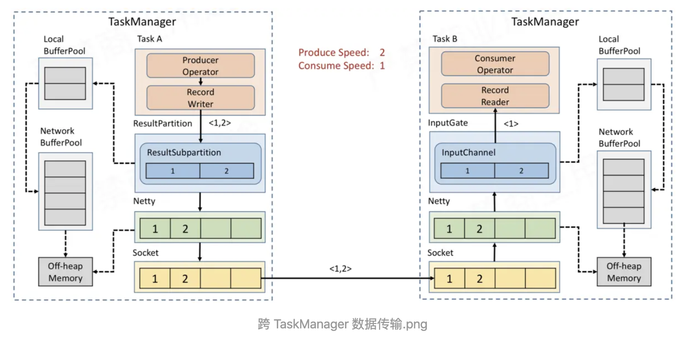

Task 内部，反压如何向上游传播
假如 Task A 的下游所有 Buffer 都占满了，那么 Task A 的 Record Writer 会被 block，Task A 的 Record Reader、Operator、Record Writer 都属于同一个线程，所以 Task A 的 Record Reader 也会被 block。

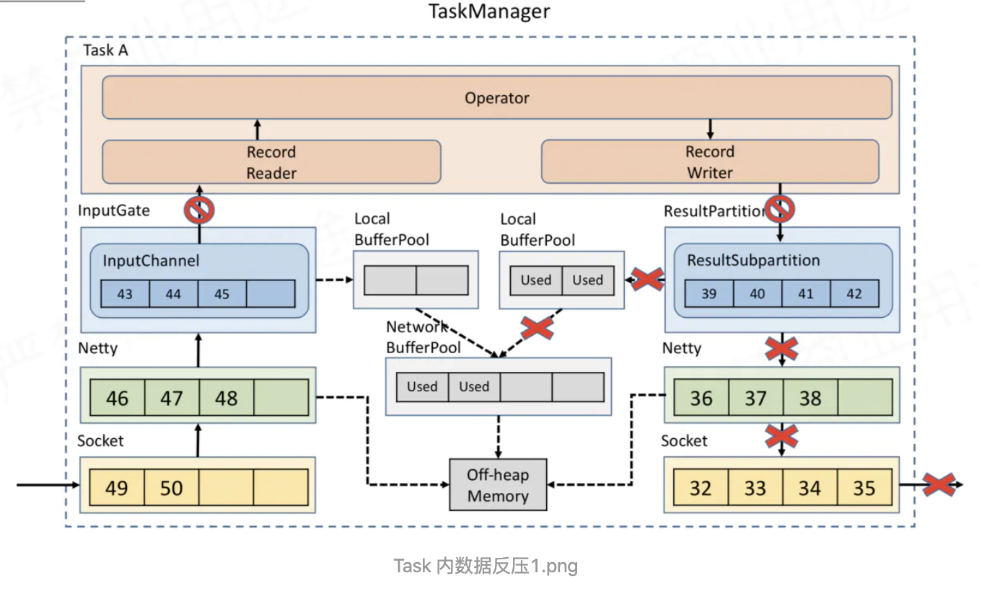

Flink 1.5之前并没有特殊的机制来处理反压，因为 Flink 中的数据传输相当于已经提供了应对反压的机制。但是
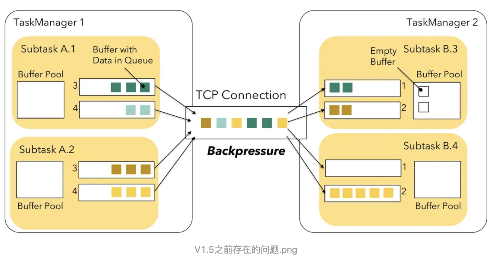

借助了credit思想让下游随时反馈自己的接收能力，这样上游可以有针对性的选择有能力的下游发送对应的数据，即之前的上游盲目push模式变成了下游基于credit的pull模式。


### Flink 如何在吞吐量和延迟之间做权衡？
Flink 天然支持流式处理，即每来一条数据就能处理一条，而不是像 Spark Streaming 一样，完全是微批处理。但是为了提高吞吐量，默认使用的 Flink 并不是每来一条数据就处理一条。那这个到底是怎么控制的呢？

我们分析了上述的网络传输后，知道每个 SubTask 输出的数据并不是直接输出到下游，而是在 ResultSubPartition 中有一个 Buffer 用来缓存一批数据后，再 Flush 到 Netty 发送到下游 SubTask。那到底哪些情况会触发 Buffer Flush 到 Netty 呢？

- Buffer 变满时
- Buffer timeout 时
- 特殊事件来临时，例如：CheckPoint 的 barrier 来临时

Flink 在数据传输时，会把数据序列化成二进制然后写到 Buffer 中，当 Buffer 满了，需要 Flush（默认为32KiB，通过taskmanager.memory.segment-size设置）。但是当流量低峰或者测试环节，可能1分钟都没有 32 KB的数据，就会导致1分钟内的数据都积攒在 Buffer 中不会发送到下游 Task 去处理，从而导致数据出现延迟，这并不是我们想看到的。所以 Flink 有一个 Buffer timeout 的策略，意思是当数据量比较少，Buffer 一直没有变满时，后台的 Output flusher 线程会强制地将 Buffer 中的数据 Flush 到下游。Flink 中默认 timeout 时间是 100ms，即：Buffer 中的数据要么变满时 Flush，要么最多等 100ms 也会 Flush 来保证数据不会出现很大的延迟。当然这个可以通过 env.setBufferTimeout(timeoutMillis) 来控制超时时间。

- timeoutMillis > 0 表示最长等待 timeoutMillis 时间，就会flush
- timeoutMillis = 0 表示每条数据都会触发 flush，直接将数据发送到下游，相当于没有Buffer了(避免设置为0，可能导致性能下降)
- timeoutMillis = -1 表示只有等到 buffer满了或 CheckPoint的时候，才会flush。相当于取消了 timeout 策略

## 8.2 operator chain
将operators链接成task是非常有效的优化：它能减少线程之间的切换，减少消息的序列化/反序列化，减少数据在缓冲区的交换，减少了延迟的同时提高整体的吞吐量。

可以chain的条件如下：

1. 上下游的并行度一致
2. 下游节点的入度为1 （也就是说下游节点没有来自其他节点的输入）
3. 上下游节点都在同一个 slot group 中（下面会解释 slot group）
4. 下游节点的 chain 策略为 ALWAYS（可以与上下游链接，map、flatmap、filter等默认是ALWAYS）
5. 上游节点的 chain 策略为 ALWAYS 或 HEAD（只能与下游链接，不能与上游链接，Source默认是HEAD）
6. 两个节点间数据分区方式是 forward（参考理解数据流的分区）
7. 用户没有禁用 chain

比如除source，其他并行度为2

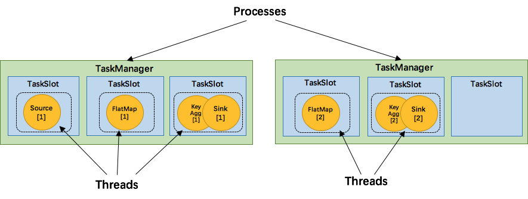

**为了资源更充分的利用，Flink又提出了SlotSharingGroup，尽可能地让多个task共享一个slot。
**

比如除source，其他并行度为6
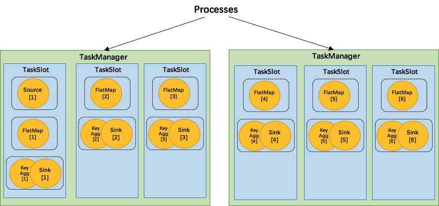
SlotSharingGroup是Flink中用来实现slot共享的类，它尽可能地让subtasks共享一个slot。相应的，还有一个 CoLocationGroup 类用来强制将 subtasks 放到同一个 slot 中。CoLocationGroup主要用于迭代流中，用来保证迭代头与迭代尾的第i个subtask能被调度到同一个TaskManager上。这里我们不会详细讨论CoLocationGroup的实现细节。

怎么判断operator属于哪个 slot 共享组呢？默认情况下，所有的operator都属于默认的共享组default，也就是说默认情况下所有的operator都是可以共享一个slot的。

详细可参看[链接](http://wuchong.me/blog/2016/05/09/flink-internals-understanding-execution-resources/)


## 9.1 测试 user-defined Functions

- 单元测试无状态，无时间 UDF

	```
	public class IncrementMapFunction implements MapFunction<Long, Long> {

	    @Override
	    public Long map(Long record) throws Exception {
	        return record + 1;
	    }
	}
	
	public class IncrementMapFunctionTest {

	    @Test
	    public void testIncrement() throws Exception {
	        // instantiate your function
	        IncrementMapFunction incrementer = new IncrementMapFunction();
	
	        // call the methods that you have implemented
	        assertEquals(3L, incrementer.map(2L));
	    }
	}
	
	public class IncrementFlatMapFunctionTest {

	    @Test
	    public void testIncrement() throws Exception {
	        // instantiate your function
	        IncrementFlatMapFunction incrementer = new IncrementFlatMapFunction();
	
	        Collector<Integer> collector = mock(Collector.class);
	
	        // call the methods that you have implemented
	        incrementer.flatMap(2L, collector);
	
	        //verify collector was called with the right output
	        Mockito.verify(collector, times(1)).collect(3L);
	    }
	}
	```

	
- 单元测试有状态或者及时的UDF，以及自定义算子
	这种因为使用了managed state或者timer，所以需要包括用户code与flink runtime的交互，flink有一组test harnesses，可以用于UDF以及自定义算子测试:
	- OneInputStreamOperatorTestHarness (for operators on DataStreamss)
	- KeyedOneInputStreamOperatorTestHarness (for operators on KeyedStreams)
	- TwoInputStreamOperatorTestHarness (for operators of ConnectedStreams of two DataStreams)
	- KeyedTwoInputStreamOperatorTestHarness (for operators on - ConnectedStreams of two KeyedStreams)
	
	需要配置依赖
	
	```
	<dependency>
	  <groupId>org.apache.flink</groupId>
	  <artifactId>flink-test-utils_2.11</artifactId>
	  <version>1.10.0</version>
	  <scope>test</scope>
	</dependency>
	<dependency>
	  <groupId>org.apache.flink</groupId>
	  <artifactId>flink-runtime_2.11</artifactId>
	  <version>1.10.0</version>
	  <scope>test</scope>
	  <classifier>tests</classifier>
	</dependency>
	<dependency>
	  <groupId>org.apache.flink</groupId>
	  <artifactId>flink-streaming-java_2.11</artifactId>
	  <version>1.10.0</version>
	  <scope>test</scope>
	  <classifier>tests</classifier>
	</dependency>
	```

	```
public class StatefulFlatMapTest {
    private OneInputStreamOperatorTestHarness<Long, Long> testHarness;
    private StatefulFlatMap statefulFlatMapFunction;

    @Before
    public void setupTestHarness() throws Exception {

        //instantiate user-defined function
        statefulFlatMapFunction = new StatefulFlatMapFunction();

        // wrap user defined function into a the corresponding operator
        testHarness = new OneInputStreamOperatorTestHarness<>(new StreamFlatMap<>(statefulFlatMapFunction));

        // optionally configured the execution environment
        testHarness.getExecutionConfig().setAutoWatermarkInterval(50);

        // open the test harness (will also call open() on RichFunctions)
        testHarness.open();
    }

    @Test
    public void testingStatefulFlatMapFunction() throws Exception {

        //push (timestamped) elements into the operator (and hence user defined function)
        testHarness.processElement(2L, 100L);

        //trigger event time timers by advancing the event time of the operator with a watermark
        testHarness.processWatermark(100L);

        //trigger processing time timers by advancing the processing time of the operator directly
        testHarness.setProcessingTime(100L);

        //retrieve list of emitted records for assertions
        assertThat(testHarness.getOutput(), containsInExactlyThisOrder(3L));

        //retrieve list of records emitted to a specific side output for assertions (ProcessFunction only)
        //assertThat(testHarness.getSideOutput(new OutputTag<>("invalidRecords")), hasSize(0))
    }
}
	```
## 9.2 测试job

- JUnit Rule MiniClusterWithClientResource