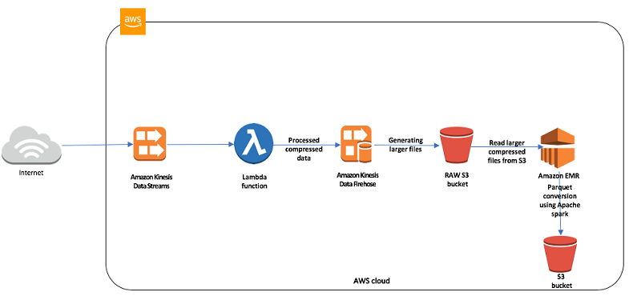
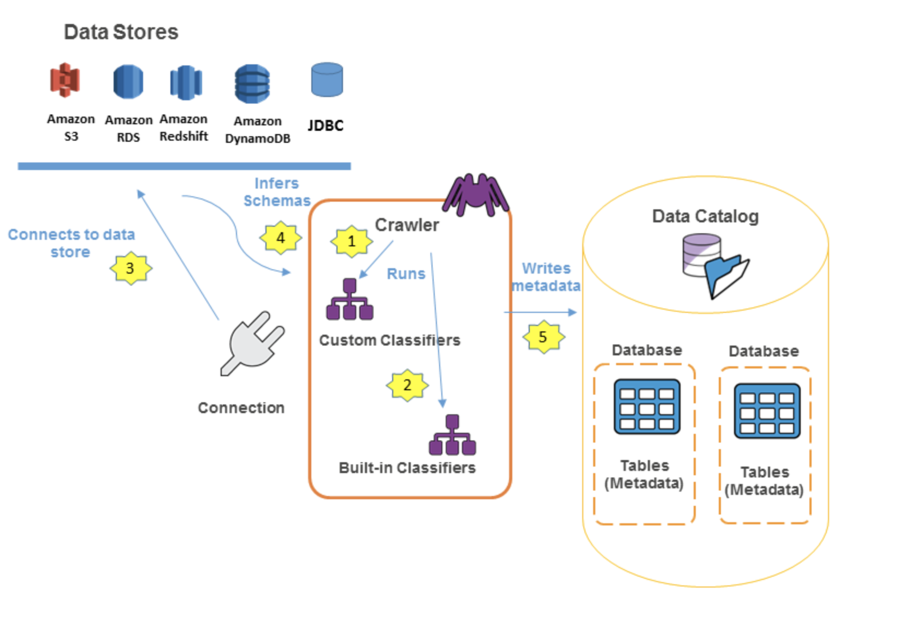

	
	
<!--more-->
	
## BDS
	
Domain| % of Examination
------|-----------------
Collection: Kinesis Firehose, SQS，IoT，Data Pipeline |17%
Storage: Kinesis Stream, Glacier, DynamoDB， GSI/LSI， Steams and Replcation and performance deep dive |17%
Processing: EMR， Apache Haddoop，Hue，Hive，HBase，Presto， Spark，EMR 文件存储和压缩， Lambda.|17%
Analysis: Redshift的所有东西，包括架构，列存储， 表设计，分布式，Sort key，数据类型，压缩，限制，workload，data load，运维和操作，Machine Learning, ElasticSearch |17%
Visualization: QuickSight实现可视化报表，Bigdata Visualization， Microstrategy |12%
Data Security: EMR Security， Redshift Security |20%
	
	
	
## Linux academy 
	
### Collection(Kinesis Firehose, SQS，IoT，Data Pipeline)
- 给Kinesis Stream 打标签可以有分开收费
- Kinesis的Single shard has 1Mb limit.
- each Kinesis shard invoke a separate Lambda.
- SQS不能处理payload 大小
- SQS minimum message size is 1,024 bytes (1 KB). The maximum is 262,144 bytes (256 KB). While Kinesis can store upload 1MB
- IoT 认证选项： X.509,Cognito,IAM or federated identities
- IoT Rules give your devices the ability to interact with AWS services. Rules are analyzed and actions are performed based on the MQTT topic stream. You can use rules to support tasks like these:

	- Augment or filter data received from a device.
	- Write data received from a device to an Amazon DynamoDB database.
	- Save a file to Amazon S3.
	- Send a push notification to all users using Amazon SNS.
	- Publish data to an Amazon SQS queue.
	- Invoke a Lambda function to extract data.
	- Process messages from a large number of devices using Amazon Kinesis.
	- Send data to the Amazon Elasticsearch Service.
	- Capture a CloudWatch metric.
	- Change a CloudWatch alarm.
	- Send the data from an MQTT message to Amazon Machine Learning to make predictions based on an Amazon ML model.
	- Send a message to a Salesforce IoT Input Stream.
	- Send message data to an AWS IoT Analytics channel.
	- Start execution of a Step Functions state machine.
	- Send message data to an AWS IoT Events input.
- KPL它的重试机制是依靠：当调用addUserRecord()时，record会打一个时间戳，并且带着RecordMaxBufferedTime()分配的deadline添加到一个buffer中，按照以下优先级从buffer中flush出去：
	- Buffer priority
	- Aggregation configuration：AggregationMaxCount；AggregationMaxSize
	- Collection configuration：CollectionMaxCount；CollectionMaxSize
	然后通过调用PutRecords()将records从flush到Kinesis data stream，如果失败了则自动添加到KPL buffer，新的deadline取以下较小的一个值：
	- Half the current RecordMaxBufferedTime configuration
	- The record’s time-to-live value（所以强制带有这个值）
- The request rate for the stream is too high, or the requested data is too large for the available throughput. Reduce the frequency or size of your requests. For more information, see Streams Limits in the Amazon Kinesis Data Streams Developer Guide, and Error Retries and Exponential Backoff in AWS in the AWS General Reference.
- Each PutRecords request can support up to 500 records. Each record in the request can be as large as 1 MiB, up to a limit of 5 MiB for the entire request, including partition keys. Each shard can support writes up to 1,000 records per second, up to a maximum data write total of 1 MiB per second.
- 对于Amazon Kinesis Data Streams application，KCL 使用唯一的 Amazon DynamoDB table to keep track of the application's state. 因为 KCL 使用 Amazon Kinesis Data Streams application 的名字来创建表, 所以每个应用名必须唯一.可以在应用运行时通过DynamoDB 控制台进行查看。
	吞吐：如果你的Amazon Kinesis Data Streams application 收到了provisioned-throughput exceptions, 你应该增加 DynamoDB table的provisioned throughput. The KCL 创建表时预置的吞吐是10 reads per second and 10 writes per second, 但是很可能是不够的。比如，如果你的 Amazon Kinesis Data Streams application 频繁进行 checkpointing 或者一个流操作由多个分片构成,你就需要更多的吞吐.	
- FireHose和Kinesis Stream 的区别：whether managed services or not. fh 支持自动扩容，最小时延60s；kinesis streams需要手动操作,更加实时. You can configure buffer size and buffer interval while creating your delivery stream. Buffer size is in MBs and ranges from 1MB to 128MB for Amazon S3 destination and 1MB to 100MB for Amazon Elasticsearch Service destination. 
- Kinesis Firehose does not support Lambda or Spark Streaming as a consumer
- 如果Kinesis上面的lambda超时（超过5分钟），那么应该减小Batch Size。因为对于 Lambda, 我们可以调节--Memory，Batch-size，Timeout. 用不同的batch和record大小测试，每个事件源的polling频率和你的function能多快完成任务相关的。 BatchSize控制了发送到function的record的最大数量。一个大的batchsize通常可以更好地吸收到调用的花销, 增大吞吐量。默认，当record可用时Lambda立即调用函数。如果读取的批只有一条记录，那么lambda只发送一条记录到function。为避免小数据量也调用function，你可以配置数据源缓存record高达5分钟. lambda会一直读取记录直到batch满了或者时间到了，再调用function。
- Kinesis data stream cannot emit data directly to DynamoDB table
- Kinesis support Server Side Encryption with which the data can be encrypted at rest.

```
We recommend Amazon Kinesis Data Streams for use cases with requirements that are similar to the following:

1. Routing related records to the same record processor (as in streaming MapReduce). For example, counting and aggregation are simpler when all records for a given key are routed to the same record processor.
2. Ordering of records. For example, you want to transfer log data from the application host to the processing/archival host while maintaining the order of log statements.
3. Ability for multiple applications to consume the same stream concurrently. For example, you have one application that updates a real-time dashboard and another that archives data to Amazon Redshift. You want both applications to consume data from the same stream concurrently and independently.
4. Ability to consume records in the same order a few hours later. For example, you have a billing application and an audit application that runs a few hours behind the billing application. Because Amazon Kinesis Data Streams stores data for up to 7 days, you can run the audit application up to 7 days behind the billing application.

We recommend Amazon SQS for use cases with requirements that are similar to the following:

1. Messaging semantics (such as message-level ack/fail) and visibility timeout. For example, you have a queue of work items and want to track the successful completion of each item independently. Amazon SQS tracks the ack/fail, so the application does not have to maintain a persistent checkpoint/cursor. Amazon SQS will delete acked messages and redeliver failed messages after a configured visibility timeout.
2. Individual message delay. For example, you have a job queue and need to schedule individual jobs with a delay. With Amazon SQS, you can configure individual messages to have a delay of up to 15 minutes.
3. Dynamically increasing concurrency/throughput at read time. For example, you have a work queue and want to add more readers until the backlog is cleared. With Amazon Kinesis Data Streams, you can scale up to a sufficient number of shards (note, however, that you'll need to provision enough shards ahead of time).
4. Leveraging Amazon SQS’s ability to scale transparently. Forf example, you buffer requests and the load changes as a result of occasional load spikes or the natural growth of your business. Because each buffered request can be processed independently, Amazon SQS can scale transparently to handle the load without any provisioning instructions from you.
```

- You can collaborate with an owner of a different AWS account and receive their log events on your AWS resources, such as a Amazon Kinesis stream (this is known as cross-account data sharing). For example, this log event data can be read from a centralized Amazon Kinesis stream to perform custom processing and analysis. Custom processing is especially useful when you collaborate and analyze data across many accounts. For example, a company's information security group might want to analyze data for real-time intrusion detection or anomalous behaviors so it could conduct an audit of accounts in all divisions in the company by collecting their federated production logs for central processing. A real-time stream of event data across those accounts can be assembled and delivered to the information security groups who can use Kinesis to attach the data to their existing security analytic systems.
- Snowball device only supports usable 72TB of data and would
- AWS Snowball Edge is an AWS service that provides an Edge device that you can use to transfer data to the cloud at faster-than-network speeds. An Edge device is an AWS-owned appliance. It can hold up to 100 TB of data. It uses 256-bit encryption and an industry-standard Trusted Platform Module (TPM) to ensure both security and full chain of custody for your data.

	Amazon S3 is an AWS storage and retrieval service. To store an object in Amazon S3, you upload the file you want to store to a bucket. When you upload a file, you can set permissions for the object and also for any metadata.

	When you're using an Edge device, the data migration process has the following stages:


	- You use the AWS Schema Conversion Tool (AWS SCT) to extract the data locally and move it to an Edge device.
	- You ship the Edge device or devices back to AWS.
	- After AWS receives your shipment, the Edge device automatically loads its data into an Amazon S3 bucket.
	- AWS DMS takes the files and migrates the data to the target data store. If you are using change data capture (CDC), those updates are written to the Amazon S3 bucket and then applied to the target data store.
	
### Storage
- 'Server-Side Encryption with Amazon S3-Managed Keys (SSE-S3)'- Each object is encrypted with a unique key employing strong encryption. As an additional safeguard, it encrypts the key itself with a master key that it regularly rotates.
- 存储事件日志数据供EMR，选择S3而不是DynamoDB，因为不是实时处理，而是批处理即可，所以S3更好。
- DynamoDB is not ideal for batch analytics.
- GSI 会增加RCU
- DynamoDB没有外键的说法
- In DynamoDB, you have the option to specify conditions when granting permissions using an IAM policy (see Access Control). For example, you can:

		- Grant permissions to allow users read-only access to certain items and attributes in a table or a secondary index.
		- Grant permissions to allow users write-only access to certain attributes in a table, based upon the identity of that user.
- 10GB data size per partition key for tables with LSI index
-  DynamoDB的主要查询能力是围绕primary key的查找. 然而，它有时也需要丰富的查询能力. 基于ES 构建DynamoDB的内容索引可以允许全文搜索.DynamoDB tables -> DynamoDB Streams -> Lambda -> ES
-  Partitions are usually throttled when they are accessed by your downstream applications much more frequently than other partitions (that is, a "hot" partition), or when workloads rely on short periods of time with high usage (a "burst" of read or write activity). To avoid hot partitions and throttling, you must optimize your table and partition structure.

	Distribute your read operations and write operations as evenly as possible across your table. A "hot" partition can degrade the overall performance of your table.

	**Write Capacity Units** - When an item in a table is added, updated, or deleted, updating the local secondary indexes will consume provisioned write capacity units for the table. The total provisioned throughput cost for a write is the sum of write capacity units consumed by writing to the table and those consumed by updating the local secondary indexes.


	How can I determine how much of my provisioned throughput is being used?	
	You can monitor ConsumedReadCapacityUnits or ConsumedWriteCapacityUnits over the specified time period, to track how much of your provisioned throughput is being used.
- Amazon DynamoDB is a key-value and document database that delivers single-digit millisecond performance at any scale. It's a fully managed, multiregion, multimaster database with built-in security, backup and restore, and in-memory caching for internet-scale applications. **DynamoDB can handle more than 10 trillion requests per day and support peaks of more than 20 million requests per second.**
- 为了降低成本，可以使用S3静态网页的方式访问地图。
- Amazon S3 Glacier (S3 Glacier) vault有基于资源的 vault access policy and one Vault Lock policy attached to it. Vault Lock policy 上锁后在指定时间到达前不能删除修改数据；如果是控制用户访问，则应该使用vault access policy，任何时候你都可以修改Vault access policy 的权限。you use a vault access policy to implement access controls that are not compliance related, temporary, and subject to frequent modification
- 如果存储小对象并且按月存储, DynamoDB 更便宜，S3更适合大对象和每月存储量都更大的情况。因为需要考虑到put api cost   
 
	```
	Total Storage = 2KB * 1M/hour = 2GB/hour * 24 * 30 = 1440 GB = 1.4TB
   DynamoDB : 1M/hour = 277 Writes per Second * 2KB = 554 WCU = ~$623 (with Storage)
	S3 : 1M/hour * 24 * 30 = 720 Million PUT request = ~ $3633.12 (with Storage)
	```

- 比较S3里的两对象方法：比较S3的源和目标对象的Etags.（实体tag是对象的hash结果，反应对象本身的内容，而不是它的metadata）
- LSI共享table的 provisioned throughput settings for read and write activity . GSI 有它自己的 provisioned throughput settings for read and write activity ，是和table分开的.二期LSI有它的限制，10GB data size per partition key for tables with LSI index
- 把数据导入S3，对每个导入的文件记录唯一的日志文件 -- 对每次导入，在导入/导出manifest文件前使用日志文件前缀来生成唯一的日志文件。   
	Amazon S3 服务器访问日志记录：    
	服务器访问日志记录详细地记录对存储桶提出的各种请求。对于许多应用程序而言，服务器访问日志很有用。例如，访问日志信息可能在安全和访问权限审核方面很有用。它还可以帮助您了解您的客户群并了解您的 Amazon S3 账单。   
	我们建议您将访问日志保存在不同的存储桶中，以方便管理这些日志。如果您选择将访问日志保存在源存储桶中，我们建议您为所有日志对象键指定前缀，以便对象名称以通用字符串开头，且日志对象更易于识别。

	当源存储桶和目标存储桶是同一存储桶时，将为写入该存储桶的日志创建额外的日志。此行为对于您的使用案例而言可能并不理想，因为它会导致您的存储账单金额小幅增加。此外，有关日志的额外日志可能会导致更难以找到您所查找的日志。

	当多个存储桶登录到同一目标存储桶时，键前缀也可用于区分源存储桶。
- providing ec2 user permissions to use DAX application client to secure the ec2 instance instead of assuming a role or service role
- Amazon S3 Transfer Acceleration enables fast, easy, and secure transfers of files over long distances between your client and an S3 bucket. Transfer Acceleration takes advantage of Amazon CloudFront’s globally distributed edge locations. As the data arrives at an edge location, data is routed to Amazon S3 over an optimized network path.


### Processing(EMR， Apache Haddoop，Hue，Hive，HBase，Presto， Spark)
- You need to be able to access resources in S3 and then write data to tables in S3. You also need to be able to load table partitions automatically from Amazon S3. Which Big Data tool enables you to do so?B(Hive支持UDF。EMR对于Hive做了很多的提高, 包含与DynamooDB和S3的直接集成. 比如, 通过EMR你可以直接加载S3的数据分区, 你可以直接写数据到S3的table，而不用临时文件, 而且你可以获取S3的资源, 比如用户map和reduce操作的脚本和额外的库. )
	- A EMR and Pig
	- B EMR, Hive, and Redshift Spectrum.
	- C Redshift and SQL
	- D Redshift and Athena
- Presto是一个facebook开源的分布式SQL查询引擎，适用于交互式分析查询，数据量支持GB到PB字节。既支持非关系型源，比如HDFS，S3, Cassandra, MongoDB, and HBase, 也支持关系型数据源，比如MySQL, PostgreSQL, Amazon Redshift, Microsoft SQL Server, and Teradata。
	一个query可以有多个数据源.
	Presto比Spark and Impala的另一个优点是： it can be ready in just a few minutes.而且Presto可以直接连接S3，而不需要额外的ETL转换.
- Presto适合交互式join查询，而Pig适合批处理
- Presto would be most appropriate answer due to following phrase in the question “interactive joins and then display results quickly”
Pig is more suitable for batch processing and Presto for interactive queries.
- Presto与Hive对比
	- Hive是一个数据仓库，是一个交互式比较弱一点的查询引擎，交互式没有presto那么强，而且只能访问hdfs的数据；
	- Presto是一个交互式查询引擎，可以在很短的时间内返回查询结果，秒级，分钟级，能访问很多数据源；
	- Hive在查询100Gb级别的数据时，消耗时间已经是分钟级了；
	- 但是Presto是取代不了Hive的，因为Presto全部的数据都是在内存中，限制了在内存中的数据集大小，比如多个大表的join，这些大表是不能完全放进内存的，实际应用中，对于在Presto的查询是有一定规定条件的，比如说一个查询在Presto查询超过30分钟（经常会遇到这种问题，此时适合在SparkSQL运行，后面会讲到），那就kill掉吧，说明不适合在Presto上使用，主要原因是，查询过大的话，会占用整个集群的资源，这会导致你后续的查询是没有资源进行查询的，这跟Presto的设计理念是冲突的，就像是你进行一个查询，但是要等个5分钟才有资源继续查询，这是很不合理的，交互式就变得弱了很多。
- 基于EMR的ML workflow由很多S3上的快速循环read-write-read组成，为了避免之后循环的读会丢失之前循环的数据，可以采用开启EMRFS一致性读。
- 对于Redshift的row-level-security	应该用view而不是IAM
- 通过S3DistCp可以高效地从S3上复制大量数据到HDFS。S3Distcp天然具备组合很多小文件为大文件，而且不需要任何编码。您还可以使用 S3DistCp 在 Amazon S3 存储桶之间或从 HDFS 向 Amazon S3 复制数据。若要在存储桶之间和 AWS 账户之间并行复制大量对象，S3DistCp 可扩展性更强，也更高效。
- Schedule a daily AWS Data Pipeline process that aggregates content into larger files using S3DistCp.([Seven Tips for Using S3DistCp on Amazon EMR to Move Data Efficiently Between HDFS and Amazon S3](https://aws.amazon.com/blogs/big-data/seven-tips-for-using-s3distcp-on-amazon-emr-to-move-data-efficiently-between-hdfs-and-amazon-s3/))	
- EMR获取数据的方式有很多种，最常见的是S3，也可以使用Hadoop的分布式缓存特性从分布式文件系统上传到本地文件系统，AWS EMR的hive就提供DynamoDB和EMR集群间的导入导出。如果本地集群有大量的数据，可以使用AWS Direct Connect.
- EMR处理压缩数据：
	- GZIP 压缩相比Snappy or LZO较使用更多的CPU资源, 但它有更高的压缩率。所以GZip经常用于压缩cold data.
	- Snappy or LZO 对于热数据是更好的选择.
	- BZip2相比较GZIP对于一些文件类型有更多压缩, 只是在解压缩的速度上有一定的代价.
	- 对于MapReduce, 如果你需要压缩的数据是可分的，那么BZip2, LZO, and Snappy 是可分的, but GZip不是.
	- etween 500 MB to 1 GB, GZIP compression is an acceptable data compression type. However, if your data aggregation creates files larger than 1 GB, its best to pick a compression algorithm that supports splitting.
- Amazon EMR 提供了可以使用多种文件系统作为输入、输出和中间数据. 比如说，你可选择运行在master和core nodes上的HDFS来处理数据。你可能选择EMRFS来使用S3作为你应用运行的数据层，这样你可以分离计算和存储。
- Amazon EMR and Hadoop提供了不同的文件系统，你需要通过URI前缀指定使用哪种. 比如, s3://aws-s3-bucket1/path references an Amazon S3 bucket using EMRFS. 包含以下四种
	- HDFS	-- hdfs:// (or no prefix)
	- EMRFS--s3://	
	- local file system
	- (Legacy) Amazon S3 block file system -- s3bfs://
- EMR来处理ETL中的steps，为了保证上游数据一定会被下游处理到的高效的方式选择：HDFS -> EMR -> S3。 不选择EMRFS，因为它提供一致性。然而，复制中间数据到S3并不是高效方式；data pipelines activity for each step只是编排，而不保证高效；使用HDFS作为中间步骤存储保证数据备份，而且通过EMR core节点存储是高效的方式。
- Configuring an External Metastore for Hive--暴露 HCatalog 到其他集群：externalizing the Hive Catalog into RDS 或者创建一个Amazon Glue catalog table ，这样区域里的所有集群都可以访问.
- EMRFS Consistent View Metadata--如果是为了集群访问一致性，Amazon EMR 使用Amazon DynamoDB 来存储对象元信息并且追踪一致性 Amazon S3. 如果一致性视图发现在文件系统操作过程中S3不一致, 它按照指定的规则会进行重试.
	> EMRFS consistent view is an optional feature available when using Amazon EMR release version 3.2.1 or later. Consistent view allows EMR clusters to check for list and read-after-write consistency for Amazon S3 objects written by or synced with EMRFS. Consistent view addresses an issue that can arise due to the Amazon S3 Data Consistency Model. For example, if you add objects to Amazon S3 in one operation and then immediately list objects in a subsequent operation, the list and the set of objects processed may be incomplete. This is more commonly a problem for clusters that run quick, sequential steps using Amazon S3 as a data store, such as multi-step extract-transform-load (ETL) data processing pipelines.
	
	>When you create a cluster with consistent view enabled, Amazon EMR uses an Amazon DynamoDB database to store object metadata and track consistency with Amazon S3. If consistent view determines that Amazon S3 is inconsistent during a file system operation, it retries that operation according to rules that you can define.

	>With consistent view enabled, EMRFS returns the set of objects listed in an EMRFS metadata store and those returned directly by Amazon S3 for a given path. Because Amazon S3 is still the “source of truth” for the objects in a path, EMRFS ensures that everything in a specified Amazon S3 path is being processed regardless of whether it is tracked in the metadata. However, EMRFS consistent view only ensures that the objects in the folders that you track are checked for consistency.
- 查询Hive的高效方式（基于IP地址查询）：Query on a HIVE table that covers an index, avoids table scan. HIVE checks the index first and then goes to the particular column and performs the operation.
Using “Store the Amazon S3 objects with the following naming scheme: bucket_name/source=ip_address/ year=yy/month=mm/day=dd/hour=hh/filename.” will require queries to specify all the column partitions in every where clause。
- Hive on EMR can just use Aruro-RDS or Glue as external metastore. two options for metastore one is AWS GLUE Data Catalog and second is RDS for External Metastore for Hive。为 Hive 配置外部元存储，默认情况下，Hive 会在主节点的文件系统上的 MySQL 数据库中记录元存储信息。元存储包含表以及在其上构建表的基础数据的描述，包括分区名称、数据类型等。当集群终止时，所有集群节点都会关闭，包括主节点。当发生此情况时，本地数据会丢失，因为节点文件系统使用的是短暂存储。如果您需要保留元存储，则必须创建一个存在于集群外部的外部元存储。
对于外部元存储，您有两个选项：1. AWS Glue Data Catalog（仅 Amazon EMR 版本 5.8.0 或更高版本）。2. Amazon RDS 或者 Amazon Aurora。

- **Optimize downstream data processing with Amazon Kinesis Data Firehose and Amazon EMR running Apache Spark**：很多信息都天然适合存储在S3上，但存储方式不同对于接下来的数据处理的效率会有很大的不同。特别是spark，它基于很多小文件的操作会比几个大文件的操作效率低很多，因为很多花销都用在了打开，读取元信息，关闭文件上面。可以使用Amazon Kinesis Data Firehose来合并小文件为大文件再存储在S3上面。和Kinesis Datastream一样，Kinesis Data Firehose接收最大消息体1M，如果一条消息大于1M，可以先压缩再加入stream，

	
	
- Use AWS Direct Connect to connect your data center with AWS resources. Once connected, you can use Amazon EMR to process your data stored in your own data center and store the results on AWS or back in your data center. This approach gives you 1 or 10 gigabit-per-second link connectivity to AWS at all time. And directconnect outbound bandwidth costs less than public Internet outbound cost. So in cases where you expect great amount of traffic exported to your own data center, having direct connect in place can reduce your bandwidth charges.
- AWS Data Pipeline does not capture real time data. AWS Data Pipeline is a web service that helps you reliably process and move data between different AWS compute and storage services, as well as on-premises data sources, at specified intervals.
- Use Amazon Simple Workflow (SWF) to manage assessments, movement of data & meta-data. Use an autoscaling group of G2 instances in a placement group.
- Apache Phoenix is used for OLTP and operational analytics, allowing you to use standard SQL queries and JDBC APIs to work with an Apache HBase backing store.
- EMR节点类型：
	The master node controls and directs the cluster. When it terminates, the cluster ends, so you should only launch the master node as a Spot Instance if you are running a cluster where sudden termination is acceptable. This might be the case if you are testing a new application, have a cluster that periodically persists data to an external store such as Amazon S3, or are running a cluster where cost is more important than ensuring the cluster’s completion.

	Core nodes process data and store information using HDFS. Terminating a core instance risks data loss. For this reason, you should only run core nodes on Spot Instances when partial HDFS data loss is tolerable.

	The task nodes process data but do not hold persistent data in HDFS. If they terminate because the Spot price has risen above your maximum Spot price, no data is lost and the effect on your cluster is minimal.

- AWS Glue
	

### Analysis(Redshift, ML, ES)
- Redshift COPY 命令带上NOLOAD参数会校验copy处理过程的任何失败，并且不需要任何清理机制，因为它没有load数据.NLOAD ENCRYPTED 命令会自动将数据通过client side encryption加密后存储并使用 HTTPS 来保证传输到S3时加密。
- Redshift可以通过security group进行访问控制
- S3 COPY是最快速的从S3到Redshift的加载机制
-  ???Your company needs to design a data warehouse for a client in the retail industry. The data warehouse will store historic purchases in Amazon Redshift. To comply with PCI:DSS requirements and meet data protection standards, the data must be encrypted at rest and have keys managed by a corporate on-premises HSM. How can you meet these requirements in a cost-effective manner?B
	- Use AWS Import/Export to import a company HSM device into AWS alongside the Amazon Redshift cluster, and configure Redshift to use the imported HSM.(KMS can't do this and even if it could it violates the requirement that the keys are managed on-premises)
	- Create a VPN connection between a VPC you create in AWS and an on-premises network. Then launch the Redshift cluster in the VPC, and configure it to use your corporate HSM.(Redshift can leverage on-premises HSMs for key management using VPN. This meets the requirements by making sure the encryption keys are locally managed.)
	- Use the AWS CloudHSM service to establish a trust relationship between the CloudHSM and the corporate HSM over a Direct Connect connection. Configure Amazon Redshift to use the CloudHSM device.
	- Configure the AWS Key Management Service to point to the corporate HSM device, and then launch the Amazon Redshift cluster with the KMS managing the encryption keys.
- A global shoemaker has over a thousand retail stores which they manage themselves, sell through brokers in other discounted stores, and sell online. These channels are completely independent. There is no system that merges these data sets to allow the COO to have comprehensive insight. You need to provide a company-wide picture of its channels and be able to do ad-hoc analytics when required. How can you configure this? -- First, get all of the data into Amazon S3, then use Amazon Redshift to load, sort, distribute, and compress the data into its tables so that analytical queries can execute efficiently and in parallel. Then, for visualizing the analytics, Amazon QuickSight can be used, or one of the many partner visualization platforms via the ODBC/JDBC connection to Amazon Redshift.
- ML限制

	Limit Type | System Limit
	-----|-----
	Size of each observations | 100 KB
	Size of training data *|100 GB
	Size of batch prediction input|1 TB
	Size of batch prediction input (number of records)|100 million
	Number of variables in a data file (schema)|1,000
	Recipe complexity (number of processed output variables)|10,000
	TPS for each real-time prediction endpoint|200
	Total TPS for all real-time prediction endpoints|10,000
	Total RAM for all real-time prediction endpoin|10 GB
	Number of simultaneous jobs|2
	Longest run time for any job|7 days
	Number of classes for multiclass ML models|100
	ML model size|Minimum of 1 MB, maximum of 2 GB
	Number of tags per object|50
- 随机森林通过反复二分数据进行分类或回归，随机森林既可以处理属性为离散值的量，比如ID3算法，也可以处理属性为连续值的量，比如C4.5算法。另外，随机森林还可以用来进行无监督学习聚类和异常点检测。
- Redshift选择key-based分布的原因：(优化一个大规模、变化慢的维表 ALL)（优化事实表，公平分配分片数 EVEN）
	- 减少跨节点流量；
	- 利用数据位置在本地node，for join and aggregation；
	- 平衡数据分布和分配数据。   
	选择even-based分布的原因：
	- is largely denormalized而且不参与join；
	- 没有明确的其它分布倾向。
- 每小时100个文件发送到S3，然后加载文件到Redshift，用户允许最大时延是5m，架构师应该选择哪种方案 -- Load the cluster when the administrator has an event multiple of files relative to Cluster Slice Count, or 5 minutes, whichever comes first.
- 提高Redshift的查询效率：workload management (WLM) 定义多个查询队列，当同时有多个查询会话或者用户时，有些耗时长，而耗时短的仍旧需要等待。那么可以配置Amazon Redshift WLM to run with either automatic WLM or manual WLM.
	如果是有不同的租户有不同的负载，为了大租户干扰小租户，那么应该采取Silo Model，也就是分离cluster的方式。
	Redshift一个集群的查询并发上限是15.查询按队列执行, 默认一个查询集群一个队列，最高5个并发.用户可以修改一个队列并发为15，最大8个队列.跨队列的并发上限是15，且不能修改.
	如果是长短平衡可以选择WLM，如果是大小平衡，则最好考虑多租户的3种模式。
- Redshift可以通过snapshot重建。
- An interleaved sort gives equal weight to each column, or subset of columns, in the sort key. If multiple queries use different columns for filters, then you can often improve performance for those queries by using an interleaved sort style. When a query uses restrictive predicates on secondary sort columns, interleaved sorting significantly improves query performance as compared to compound sorting.
- 找到 "peak thresholds" 需要：创建一个ML model 并通过lambda调用。对每一个ML model你需要determine the threshold for inference confidence that equates to a predicted failure condition. For example, if an inference for a machine you are monitoring indicates with high confidence (let’s say a level of 90%), then you would take appropriate action.
- redshift 集群从小节点开始：Using compression ratio of 3 as per the link. The 50TB/3= 16TB.      
	The calculation 50TB/3=16.66 * (1.25) =20.83 ~21TB. 21TB/2 =10.5 ~11 ds2.xlarge nodes      
	The calculation 50TB/3=16.66 * (1.25) =20.83 ~21TB. 21TB/16 =1.3125 ~2 ds2.8xlarge nodes.      
	从小节点开始可以有助于数据的分布，and query processing across 11 nodes with a sizable compute power considering there are many joins in the query and will cost way less than using 2 Ds2.8xlarge nodes. It will be about $2500 /month cheaper to operate 11 xlarge nodes than operating 2 8xlarge nodes.
- Copying AWS KMS–encrypted snapshots to another AWS Region：1. configure a grant for Amazon Redshift to use a master key in the destination AWS Region. This grant enables Amazon Redshift to encrypt snapshots in the destination AWS Region. The process to configure the grant for copying snapshots is as follows：
	- In the destination AWS Region, create a snapshot copy grant by doing the following:
		- If you do not already have an AWS KMS key to use, create one. 
		- Specify a name for the snapshot copy grant. 
		- Specify the AWS KMS key ID for which you are creating the grant. If you do not specify a key ID, the grant applies to your default key.
	- In the source AWS Region, enable copying of snapshots and specify the name of the snapshot copy grant that you created in the destination AWS Region.
- 使用EMR处理非结构化数据，在存入S3或者Redshift前变成结构化数据。
- Amazon Redshift Spectrum uses external tables to query data that is stored in Amazon S3. 你可以使用跟查询redshift其他table一样的语义，SELECT 语义查询 external table。 External tables是只读的。
- unstructured data in s3 could be the external table of redshift。
- 基于数据流的异常检测： Random Cut Forest
- Amazon Redshift uses a hierarchy of encryption keys to encrypt the database. You can use either AWS Key Management Service (AWS KMS) or a hardware security module (HSM) to manage the top-level encryption keys in this hierarchy. The process that Amazon Redshift uses for encryption differs depending on how you manage keys. Amazon Redshift automatically integrates with AWS KMS but not with an HSM. When you use an HSM, you must use client and server certificates to configure a trusted connection between Amazon Redshift and your HSM.
		
### Visualization
- QuickSight 可以直接读取 XLSX 
- You need to visualize data from Spark and Hive running on an EMR cluster. Which of the options is best for an interactive and collaborative notebook for data exploration? -- Zeppelin	
- BI工具：Tableau、PowerBI、MicroStrategy、Qlikview、FineBI
- R作为一种用于统计分析、绘图的自由、免费、源代码开放的软件。

### Security	
- 从EC2实例访问本地集群，除了需要Direct Connect,还需要VPN和Direct Connect partner
- KMS, HSM
-. You have to design an EMR system where you will be processing highly confidential data. What can you do to ensure encryption of data at rest?AD
	- A SSE-KMS
	- B VPN
	- C TLS(TLS is transit-layer encryption, so it isn't suited to encrypting data at rest.)
	- D LUKS(Linux Unified Key Setup, or LUKS, is a disk encryption specification that can help encrypt sensitive data at rest.)
- 获取控制框架的细节的方式是 请求AWS三方审计报告，或者AWS质量附录，映射AWS的职责到必须提供控制。
- **Working with Stories**：You can use a story to preserve multiple iterations of an analysis and then play them sequentially to provide a narrative about the analysis data. For example, you might want to see several versions of the analysis, all with the same charts but with different filters applied.

	A captured iteration of an analysis is called a scene. A scene preserves the visuals that are in the analysis at the time you create it, including such things as filtering and sort order. The data in the visuals is not captured as part of the scene. When you play the story, visuals will reflect the current data in the data set.
- Does CloudHSM work with on-premises HSMs? - Yes. While CloudHSM does not interoperate directly with on-premises HSMs, you can securely transfer exportable keys between CloudHSM and most commercial HSMs using one of several supported RSA key wrap methods.
- PCI DSS (Payment Card Industry Data Security Standard) -- PCI DSS helps ensure that companies maintain a secure environment for storing, processing, and transmitting credit card information.
- A histogram is used for continuous data, where the bins represent ranges of data, while a bar chart is a plot of categorical variables.
- Identity Federation allows organizations to associate temporary credentials to users authenticated through an external identity provider such as Microsoft Active Directory (AD). These temporary credentials are linked to AWS IAM roles that grant access to the S3 bucket.

```
A retailer exports data daily from its transactional databases into an S3 bucket in the Sydney region. The retailer's Data Warehousing team wants to import this data into an existing Amazon Redshift cluster in their VPC at Sydney. Corporate security policy mandates that data can only be transported within a VPC. What combination of the following steps will satisfy the security policy? Choose 2 answers

A.  Enable Amazon Redshift Enhanced VPC Routing.
B.  Create a Cluster Security Group to allow the Amazon Redshift cluster to access Amazon S3.
C.  Create a NAT gateway in a public subnet to allow the Amazon Redshift cluster to access Amazon S3.
D.  Create and configure an Amazon S3 VPC endpoint.（AD）

>Explanation
Correct answer are A & D as Redshift Enhanced VPC Routing helps access AWS services including S3 through VPC, without having to route any traffic through internet. Also, note the region is the same.

>Refer AWS documentation - Redshift Enhanced VPC Routing


>When you use Amazon Redshift Enhanced VPC Routing, Amazon Redshift forces all COPY and UNLOAD traffic between your cluster and your data repositories through your Amazon VPC. You can now use standard VPC features, such as VPC security groups, network access control lists (ACLs), VPC endpoints, VPC endpoint policies, Internet gateways, and Domain Name System (DNS) servers, to tightly manage the flow of data between your Amazon Redshift cluster and other resources. When you use Enhanced VPC Routing to route traffic through your VPC, you can also use VPC flow logs to monitor COPY and UNLOAD traffic.

>If Enhanced VPC Routing is not enabled, Amazon Redshift routes traffic through the Internet, including traffic to other services within the AWS network.

>VPC Endpoints – For traffic to an Amazon S3 bucket in the same region as your cluster, you can create a VPC endpoint to direct traffic directly to the bucket. When you use VPC endpoints, you can attach an endpoint policy to manage access to Amazon S3.

>Option B is wrong as Redshift cannot directly access S3 without internet

>Option C is wrong as NAT enables connectivity to services via Internet only or other AWS services.

>NAT gateway – To connect to an Amazon S3 bucket in another region or to another service within the AWS network, or to access a host instance outside the AWS network, you can configure a network address translation (NAT) gateway.
```					

### 其他
- For memory-intensive applications, prefer R & I & D type instances over the other instance types. For compute-intensive applications, prefer C type instances. For applications balanced between memory and compute, prefer M & T type general-purpose instances.
	 
### 要看
	
1. [白皮书](https://d0.awsstatic.com/whitepapers/aws-overview.pdf) 
2. [大神博客](http://jayendrapatil.com/)
2. [Acloudguru SAA Course Practice Exam](https://www.udemy.com/aws-certified-solutions-architect-associate/?ranMID=39197&ranEAID=l7C703x9gqw&ranSiteID=l7C703x9gqw-OBQzbxwujxsit8HqYvrEfA&LSNPUBID=l7C703x9gqw)（Unit Exam和 Practice Exam各刷3遍）
3. [Linuxacademy SAA Course Practice Exam](https://www.udemy.com/aws-certified-solutions-architect-associate/) （Unit Exam和 Practice Exam各刷3遍）
4. [zijie的博客](https://www.jianshu.com/c/e6b4b10df4bd)
5. [Qwiklabs](https://www.qwiklabs.com/home?locale=en) 在线实验
	
	
	
	
	
	
	
	
	
	
	
	
	
