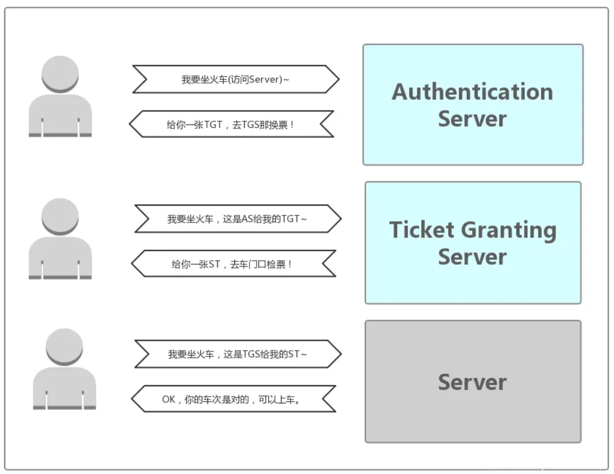

	
	
<!--more-->
	
## 1 Kerberos概述

**Kerberos is an authentication protocol for trusted hosts on untrusted networks** —— Kerberos' strategies are useless if someone who obtains privileged access to a server, can copy the file containing the secret key. Indeed, the intruder will put this key on another machine, and will only have to obtain a simple spoof DNS or IP address for that server to appear to clients as the authentic server.

用户需要能够可靠地 “识别” 自己，然后在整个 Hadoop 集群中传播该身份。除了用户之外，Hadoop 集群资源本身（例如主机和服务）需要相互进行身份验证，以避免潜在的恶意系统或守护程序 “冒充” 受信任的集群组件来获取数据访问权限。

Hadoop 使用 Kerberos 作为用户和服务的强身份验证和身份传播的基础。Kerberos 是一种计算机网络认证协议，它允许某实体在非安全网络环境下通信，向另一个实体以一种安全的方式证明自己的身份。 Kerberos 是第三方认证机制，其中用户和服务依赖于第三方（Kerberos 服务器）来对彼此进行身份验证。 Kerberos服务器本身称为密钥分发中心或 KDC。 在较高的层面上，它有三个部分：

- 它知道的用户和服务（称为主体）及其各自的 Kerberos 密码的数据库。
- 一个认证服务器（Authentication Server，简称 AS）：验证Client端的身份（确定你是身份证上的本人），验证通过就会给一张票证授予票证（Ticket Granting Ticket，简称 TGT）给 Client。
- 一个票据授权服务器（Ticket Granting Server，简称 TGS）：通过 TGT（AS 发送给 Client 的票）获取访问 Server 端的票（Server Ticket，简称 ST）。ST（Service Ticket）也有资料称为 TGS Ticket。

## 2 目标

1. 	用户的密码不能在网络上传输;
2. 用户的密码不能以任何形式存储在客户机上: 必须在使用之后立马丢弃;
3. 用户的密码不能以非加密的形式存储在authentication server database;
4. 用户在每个work会话中要求输入一次密码. 因此客户在本次会话中可以透明地获取所有的授权服务，即SSO;
5. 认证信息管理是集中式的，存储在authentication server. application servers 不能包用户的认证信息. 这对于获得以下结果至关重要:
	1. 管理员可以在一个地方disable一个账号，而不用到多个服务上去配置;
	2. 当一个用户修改密码的时候，可以多所有服务都生效;
	3. 没有认证信息的冗余;
6. 不仅用户需要说明它们是谁，the application servers 也必须证明它们对于用户的认证——Mutual authentication;
7. 紧接着认证和授权，用户和服务器需要建立加密连接. 为了这个目的, Kerberos提供了产生和交换密钥用于加密数据的支持.

## 3 组件和术语定义

### 3.1 Realm
an authentication administrative domain. 建立authentication server可以授权去认证一个用户、主机或服务的边界。并不是说用户与服务必须属于同一个域，如果跨域，那么会有Cross-Authentication。基本上，一个用户/服务属于一个域，只有它们共享一个secret (password/key) with the authentication server of that realm.

它是大小写敏感的。通常是大写，与DNS同名的大写是一个好的实践。

### 3.2 Principal

是引用authentication server database 中条目的名字. 它与每个用户、主机或者服务关联.比如：

`component1/component2/.../componentN@REALM` (实际上，最多两个组件)

引用用户的principal：

`Name[/Instance]@REALM`

引用服务的principal：

`Service/Hostname@REALM`
	

	

	
	
	
	
	
	
	
	
	
	
	
	
	
	
			