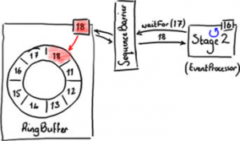
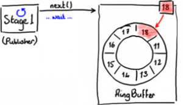
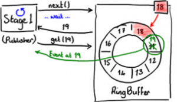
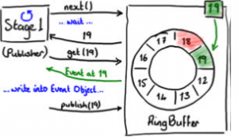
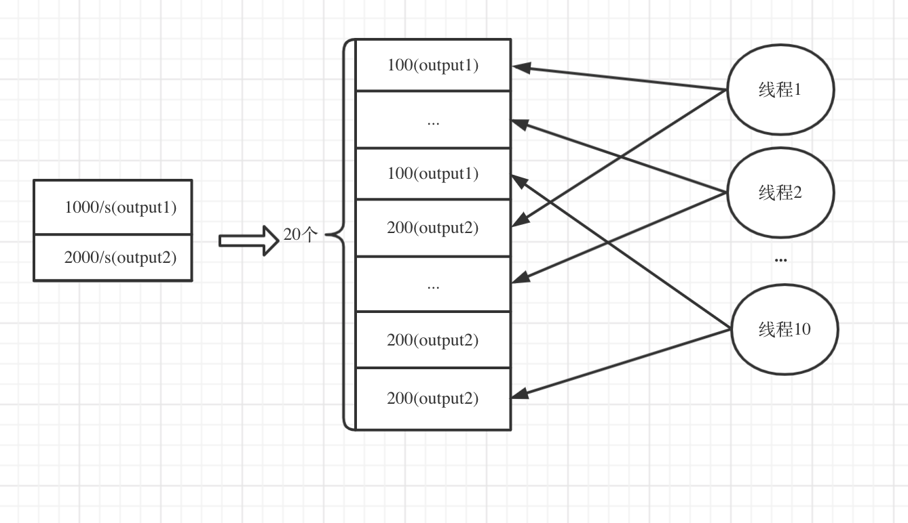
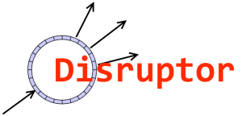

	
	
<!--more-->
	
最近一个项目是关于大数据组件测试平台的，作为测试平台，应该包含以下几部分：数据生成器、测试框架、大数据组件的负载、报告展示和导出。这里想先聊聊数据生成器，是因为我们项目上在数据生成器用到的一个框架是我当初面试TW与面试官分享的一个开源框架，也就是Disruptor，触发了我想写这篇文章。

### 1 先聊聊Disruptor框架
第一次看到这个框架是研究生时候读技术论文时，那时候就觉得这个框架实在是提升性能利器，有兴趣的可以参看[这篇论文](http://svn.wso2.org/repos/wso2/scratch/apaas/dependencies/disruptor/2.10.4-wso2v1/docs/Disruptor.docx)，所以当时就印象深刻。

#### 1.1 概述

首先简单说一下它是什么——引用它的介绍：
> The Disruptor has significantly less write contention, a lower concurrency overhead and is more cache friendly than comparable approaches, all of which results in greater throughput with less jitter at lower latency.

Disruptor 是一个用于在线程间通信的高效低延时的消息组件，可以理解为一个增强的队列。  
 
然后是它的起源——LMAX 是一种新型零售金融交易平台，它能够以很低的延迟(latency)产生大量交易(吞吐量)。这个系统是建立在 JVM 平台上，核心是一个业务逻辑处理器，它能够在一个线程里每秒处理 6 百万订单。而让 LMAX Exchange 跑的如此之快的一个关键创新就是Disruptor，该公司也在几年前将这个核心组件开源了出来。论文里的很多类名都是1.0版本，现已更新到2.0版本。

#### 1.2 并发编程的复杂性
##### 1.2.1 锁的开销

锁提供临界区的互斥，并且确保更改的可见性以有序的方式发生。锁之所以昂贵，是因为它们在争用时需要仲裁。仲裁是通过上下文切换到操作系统内核实现的，该操作系统内核将挂起等待锁的线程，直到释放它为止。在这样的上下文切换期间，以及将控制权释放给可能决定在执行其他控制任务的操作系统时，执行上下文可能会丢失先前缓存的数据和指令。这可能会对现代处理器产生严重的性能影响。可以使用futex（fast Userspace mutexes），但是只有在没有竞争的情况下，futex的开销才和CAS相当。

##### 1.2.2 内存屏障

出于性能原因，现代处理器会无序执行指令，并在内存和执行单元之间无序数据的load和store。处理器只需要保证程序逻辑产生相同的结果，而不管执行顺序如何。对于单线程程序，这不是问题。但是，当线程共享状态时，所有内存更改应按顺序在所需的点出现是很重要的，以使数据交换成功。处理器使用内存屏障来指示内存更新顺序非常重要的代码段，它们是在线程之间实现硬件排序和更改可见性的方法。

内存屏障提供了两个功能。首先，它们通过确保从另一个CPU来看屏障的两边的所有指令都是正确的程序顺序，而保持程序顺序的外部可见性；其次它们可以实现内存数据可见性，确保内存数据会同步到CPU缓存子系统。

Store Barrier，强制所有在store屏障指令之前的store指令，都在该store屏障指令执行之前被执行，并把store缓冲区的数据都刷到CPU缓存。这会使得程序状态对其它CPU可见，这样其它CPU可以根据需要介入。一个实际的好例子是Disruptor中的BatchEventProcessor。当序列Sequence被一个消费者更新时，其它消费者(Consumers)和生产者（Producers）知道该消费者的进度，因此可以采取合适的动作。所以屏障之前发生的内存更新都可见了。 
  
Load Barrier，强制所有在load屏障指令之后的load指令，都在该load屏障指令执行之后被执行，并且一直等到load缓冲区被该CPU读完才能执行之后的load指令。这使得从其它CPU暴露出来的程序状态对该CPU可见，这之后CPU可以进行后续处理。一个好例子是上面的BatchEventProcessor的sequence对象是放在屏障后被生产者或消费者使用。

##### 1.2.3 伪共享

操作系统的内存有如下：CPU 有三级缓存，依次 L1 L2 L3 ，最后是主内存 ，越接近CPU的速度越快,则L1速度>L2>L3>主内存。

CPU缓存(Cache)有很多缓存行(cache line)组成,一个缓存行占64个字节。Java的long类型是8个字节，则一个缓存行能容纳8个long类型的数据。CPU从主内存拉取数据的时候，相邻的数据，会优先放入同一个缓存行中。Long数组的其中一个数据，则其他7个也会被放在同一个缓存行中。当然，读取同一个缓存行的数据，效率非常高。

当多线程修改互相独立的变量时，如果这些变量共享同一个缓存行，就会无意中影响彼此的性能，这就是伪共享。缓存行上的写竞争是运行在 SMP 系统中并行线程实现可伸缩性最重要的限制因素。有人将伪共享描述成无声的性能杀手，因为从代码中很难看清楚是否会出现伪共享。

##### 1.2.4 队列存在的问题

线程之间共享内存的一种替代方法是消息传递模式--communicating，比如使用Java中的传统队列，如LinkedBlockingQueue或ArrayBlockingQueue。但是，它不能解决并发性问题，因为即使队列也必须确保相互排斥和变更可见性。

LMAX团队注意到，通常，由于消费者和生产者之间的速度差异，队列往往总是接近满或接近空。此观察结果导致高level的竞争和/或昂贵的缓存管理。如果队列接近满，它将导致生产者之间的竞争，从而导致上下文切换，并可能丢失缓存的数据和指令。而且，一般情况下，生产者获取队列的head，而消费者获取队列的tail。如果队列接近空，则很可能head，tail和size都属于同一高速缓存行，这可能导致上述伪共享问题。

#### 1.3 Disruptor的设计
##### 1.3.1 RingBuffer

让我对该框架印象最深刻的就是RingBuffer，Disruptor的精髓就是RingBuffer以及更重要的对RingBuffer的访问控制策略。

RingBuffer，顾名思义就是环形缓冲区。要找到数组中当前序号指向的元素，可以通过 mod 操作，通常我们会把槽的个数设定为 2 的 N 次方，更有利于基于二进制的计算机进行计算（按位与的方式）。只维护了一个指向下一个可用位置的序号，没有普通环形数组的尾指针，而且不删除 buffer 中的数据，也就是说这些数据一直存放在 buffer 中，直到新的数据覆盖他们。采用这样的数据结构有以下几点好处：

1. 它是数组，所以要比链表快，而且有一个容易预测的访问模式，数组中的元素是会被预加载的。
2. 可以为数组预先分配内存，使得数组对象一直存在（除非程序终止）。这就意味着不需要花大量的时间用于垃圾回收。

了解了该数据结构的实现后，再来看看对RingBuffer的读取和写入，这也是Disruptor最重要的一点。

##### 1.3.2 RingBuffer的读取

事件处理器(EventProcesser)是一个想从 Ring Buffer 里读取数据的线程，它可以访问 SequenceBarrie 对象——这个对象由 RingBuffer 创建并且代表事件处理器与 RingBuffer 进行交互。就像 Ring Buffe 显然需要一个序号才能找到下一个可用节点一样，事件处理器也需要知道它将要处理的序号——每个事件处理器都需要找到下一个它要访问的序号。在上面的例子中，事件处理器处理完了 Ring Buffer 里序号16之前（包括 16）的所有数据，那么它期待访问的下一个序号是 17。

事件处理器可以调用 SequenceBarrier 对象的 waitFor(17) 方法，传递它所需要的下一个序号。

final long availableSeq = consumerBarrier.waitFor(nextSequence);
SequenceBarrier 返回 RingBuffer 的最大可访问序号——在上面的例子中是 18。ConsumerBarrier 有一个 WaitStrategy 方法来决定它如何等待这个序号。接下来，消费者会一直原地停留，等待更多数据被写入Ring Buffer。并且，一旦数据写入后消费者会收到通知——节点 17，18已写入。现在序号 18 到了，事件处理器可以让 SequenceBarrier 去拿这些序号节点里的数据了。函数返回值会告诉它有多少个新的节点可以读取数据了。因为这些新的节点的确已经写入了数据（Ring Buffer 本身的序号已经更新），而且事件处理器对这些节点的唯一操作是读而不是写，因此访问不用加锁。

BatchEventProcesser 代码是一个事件处理器的例子。如果你实现了EventHandler, 你可以用 BatchEventProcesser 来完成上面复杂工作。它很容易对付那些需要成批处理的节点（例如上文中要处理的 17-18 节点）而不用单独地去读取每一个节点。

##### 1.3.3 RingBuffer的写入

写入 Ring Buffer 的过程涉及到两阶段提交 (two-phase commit)。首先，Stage 1 线程即发布者必须确定 RingBuffer 中下一个可以插入的格,如图所示。RingBuffer 持有最近写入格的序号（18），从而确定下一个插入格的序号。

RingBuffer 通过检查所有事件处理器正在从 RingBuffe 中读取的当前序号来判断下一个插入格是否空闲。

当发布者得到下一个序号后，它可以获得该格中的对象，并可以对该对象进行任意操作。你可以把格想象成一个简单的可以写入任意值的容器。

 
 

同时，在发布者处理 19 格数据的时候，RingBuffer 的序号依然是 18，所以其他事件处理器将不会读到19格中的数据。

最终，发布者最终将数据写入19 格后，通知 RingBuffer 发布 19 格的数据。这时，RingBuffer 更新序号并且所有从 RingBuffer 读数据的事件处理器都可以看到 19 格中的数据。

更多的内容可以参加[这篇文章](https://wiki.jikexueyuan.com/project/disruptor-getting-started/disruptor-share.html)

了解了Disruptor的设计及使用后，接下来看看数据生成器的一般实现方式。

### 2 数据生成器的一般实现
我们要设计的数据生成器是一个适用于测试多种大数据组件的工具，首先我们调研了业界已有的数据生成器，是否可以直接集成进来，比如像JMeter，DataFactory，Generatedata等，它们大都以生成测试数据到数据库为准，或者生成网络请求数据。因此我们无法直接复用，但是我们可以借鉴它们已有的数据生成规则，看看它们都生成了哪些规则的数据。

因此我们对于数据生成器抽象出了以下三个模块：

1.  数据生成的规则。常见的数据生成规则：

	- UUID
	- 自增ID
	- 定长随机字符
	- 从有限数据中随机选择
	- 数字范围及包含小数位数中的随机选择
	- key之间的引用
	- 支持UDF的扩展实现
2. 数据生成的格式。常见的格式：
	
	- JSON
	- TXT 
	- 支持Format的扩展实现
3. 数据的输出组件

	- Hafka
	- HDFS 
	- 支持Output的扩展实现

#### 数据生成方式

数据生成方式一般会从定量（批）和定速（流）进行考量。

- 定量：生成指定条数的数据。数据生成线程尽自己最大努力生成目标数量的数据。
	
- 定速：单位时间内生成指定条数的数据。一般有两种实现方式：

	1. 数据生成线程通过计算生成每条记录应该花费的时间，如果小于目标时间，则进行睡眠等待；如果大于目标时间，则认为数据生成线程的能力不足，应该报错然后进行扩容。这里有很大一个问题是，对于每条记录花费的时间的计量是采用的系统当前时间，并不是那么准确；而且机器的使用是存在浮动的，有可能有些时候能力富余，有些时候能力不足，所以直接因为某一次的能力不足就报错是不友好的。那么代码里就要去处理允许3次左右的追赶问题，又进一步增加了系统实现的复杂性。
	2. 按照定量的方式尽力地生成1s内指定的数量，如果用时少于1s则睡眠等待，如果大于1s则说明能力不足。但这样的方式有个小问题是，数据生成可能不是那么地均匀，但因为很多场景并没有那么严格地要求，所以这个实现方式也是存在的。

通过上面的实现方式，我们测量发现数据生成器的单台性能并不是那么理想。我们测试大数据组件，设计了数据生成器分布式部署方案，但是如果单台机器的性能真的就那么低了，我们需要的机器数可能还不够支持我们的小集群的测试，因此必须考虑如何提升单台节点的生成性能。

### 3 数据生成器与Disruptor的结合

因为我们的数据生成器经常会同时支持多个任务的数据生成，比如测试flink的多流场景，我们会同时向Kafka写两个topic；测某些需要预置数据的场景，我们会需要先向Redis写入定量数据，然后向kafka写入数据。我们需要对任务进行排队，如果是批任务，则会优先完成，然后处理流任务。如果都是流任务，则需要同时处理。如果按照上面的实现方式，我们需要在分发的时候就确定每个任务使用多少个线程，然后每个线程按照上面讲述的睡眠等待的方式进行执行。可想而知这样浪费了很多的资源。

经过spike，项目的TL玉山提出了一个方案，在每个slave节点上的数据生成方式不是按照上面的周期睡眠，而是通过一下方案：

1. 一个分发线程不停地遍历流任务列表
2. 然后按照数据生成线程数均匀拆分数据，生成相应的执行任务插入待生成列表
3. 右侧的数据生成线程不停地消费列表中的执行任务，尽力生成数据即可。
如下图所示，有两个并发流生成任务，一个是1000条/s，另一个条2000条/s。数据生成线程有10个，那么会生成20个执行任务到队列。这里会选择无界列表，因为允许新的流任务增加进来。右侧的10个数据生成执行线程会获取执行任务，按照规则和格式输出到对应的output。通过这种方式，减少了上面的睡眠时间，大大提高了生成效率。

	
	

这样的场景，自然就想到了Disruptor了，从它的图标可以看出，它表达出的一生产者多消费者正适应我们这个场景。

所以这里的 执行任务 -> Disruptor中的Event；   
数据生成执行线程 -> EventHandler；
分发线程 -> EventProducer（Disruptor中并没有这个类，通过自行通过RingBuffer实现）

可以看出，通过Disruptor框架，我们可以很容易的实现这个方案。
其中在RingBuffer的waitStrategy的选取上，

- BlockingWaitStrategy: 这是默认的策略，它使用锁和条件变量来处理线程的唤醒。因为涉及到线程的切换，它是最慢的一种方式，但是是最节省cpu。
- SleepingWaitStrategy: 这个策略类似BlockingWaitStrategy也是对CPU的使用率非常保守的。它会在循环中不断等待数据，它会先进行自旋等待，并且使用LockSupport.parkNanos(1)在循环中进行线程休眠。如果不成功，则使用Thread.yield()让出CPU，以确保不占用太多的CPU资源。因此这个策略会产生比较高的平均延时。典型的应用场景就是异步日志.
- YieldingWaitStrategy: 这个策略是用于低延时的场合的两个策略之一，有一个选项可以消耗CPU周期来提高延时。它会自旋等待序列号增加到合适的值，在循环内部使用Thread.yield()让出CPU给别的线程执行。如果需要一个高性能的系统，并且对延时比较有严格的要求，并且事件处理线程数量少于逻辑cpu数量(比如开启了超线程），可以考虑这种策略。
- BusySpinWaitStrategy: 性能最高的等待策略，但对部署环境设置了上限约束，物理cpu数量必须大于事件处理线程数量，比如超线程应该被禁用。对延时非常苛刻的场景可以使用该策略。

经过调试，即使我们系统使用BlockingWaitStrategy也比之前的实现方案性能提高很多，由于我们平台大多数会采用预置数据的形式，对时延要求并不是太高，我们选择了BlockingWaitStrategy。

### 4 总结

对于该框架的引入数据生成器最大的感受是，自己以前的学习可能更多的是去学习、模仿优秀的框架的设计思路和实现方式，而很少思考为什么会出现这样的设计，所以很难在实现过程中快速地应用某些成熟的框架。

写这篇文章是想提醒自己，学习框架的过程中也要关注到该框架产生的背景和发展过程，这是一个引导思考的过程；在具体模块实现过程中，应该跳脱出已有的方案，尽量在不参考已有方案的基础上先思考出一个自己的想法，然后再去参考成熟的实现，找出差异和优劣。这样渐渐的应该会形成自己的思考体系。
