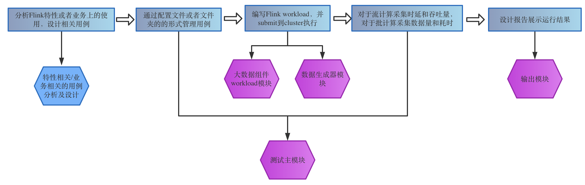
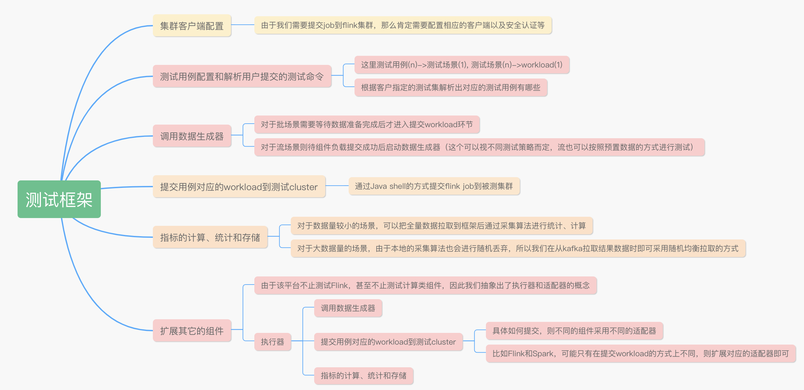
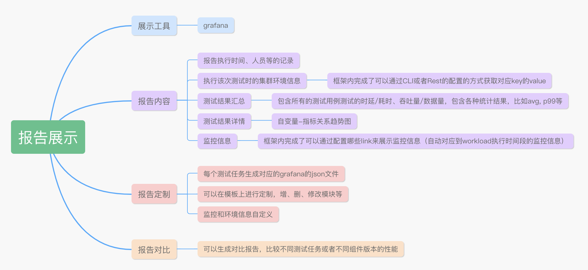

	
	
<!--more-->
	
刚结束的一个项目是关于大数据组件性能测试平台的，第一次做测试平台类的项目，希望借此总结梳理出相关经验，以供有类似项目可以借鉴。

## 0 大数据组件性能测试平台总览

### 0.1 背景介绍

大家可能对于传统服务端的自动化性能测试做得比较多，比如像Jmeter、Locust等非常成熟的工具都可以帮助我们实现测试自动化，再搭配上Jprofiler或者Prometheus+grafana分析资源使用情况等，都可以帮助我们定位问题和进行优化。

那对于像大数据组件的性能测试，我们应该如何实现自动化，并呈现相应的结果进行性能瓶颈定位呢？

测试平台，通常包含以下几部分：

对应到传统的服务器端性能测试，可以映射如下：

既然传统服务器端的性能测试有发展成熟的工具，那大数据组件的性能测试是否也有拿来即用的benchmark工具呢？

通过调研，其实业界也有很多大数据组件的benchmark工具，比如：

- 计算类组件(Flink, Spark等)-- Hibench, yahoo的Streaming-benchmarks等
- 存储类组件(Hbase, ES等) -- YCSB
- 通道类(Kafka) -- OpenMessaging

下面我们以Hibennch为例。在使用Hibench的过程中，我们发现它存在以下问题：

1. 测试场景单一，对于Flink只有流计算中的四个场景：Identity, FixedWindow, WordCount, Repartition。
2. 对于用例的调度单一，配置文件内指定跑哪些组件的哪些用例。
3. 数据生成单一，由于场景较为简单和通用，所以设计的数据都是比较通用的，但是如果和业务相关了，该部分的复用性也会很低。
4. 测试报告内容只包含时延、吞吐量等指标数据。
5. 扩展性有限。基于Hibench进行场景或者组件的扩展都是比较困难˙的。
6. 部署繁杂，需要按照步骤一步一步安装启动相应的组件。

### 0.2 平台组成
因此，我们采取借鉴Hibench的设计、实现思路，比如像指标收集算法，整体测试的执行流程等，分析出来我们自己的平台应该包含的模块。其实和通用性能测试模块类似，这里以Flink为例（整篇文章都会按照测试Flink组件进行分析）：

其中在运行用例阶段，对于流、批计算都需要测试数据，所以在上面的环节之外，还需要一个数据准备--数据生成器模块。将上面的每个环节和我们的设计模块对应，如下所示：

接下来会对每个模块进行设计，我们先从相对独立的模块进行分析，首先是用例分析模块，然后是workload，数据生成器，最后是测试框架和报告展示。

## 1 平台设计及详解
### 1.1 workload模块

对于Flink的用例分析，我们分为两个模块：

1. Flink特性相关 -- 分析Flink的流、批以及提供的Lib相关的功能特性，cover住每个功能点。比如window相关、join相关、watermark相关等等。对于Flink SQL场景，可以采用业界成熟的TPC-DS测试集。
2. 业务使用 -- 分析业务上对Flink的哪些功能特性的使用，分析可能存在瓶颈的功能点，进行模拟，而不是百分百复刻业务。比如flink sql自定义算子(加解密)等等。

对于上面的每个特性，我们都分析出了相应的场景。这里没有把场景直接说为用例，是因为这里与普通测试不同，对于Flink组件，不同参数配置对性能会有很大的影响，比如不同的并行度、不同的网络内存占比等，所以即使同一个场景我们也可以通过调整参数得出很多的测试用例。因此我们设计出了test-case和test-scene两个概念，一个test-scene可以对应多个test-case，test-case内部也设计了参数自增等的变化，比如：

`parallelism=range(min=4,max=20,step=2)`

这种存在自变量的场景，我们在报告展示模块也可以通过折线趋势图的形式进行直观的可视化展示。

workload 这个模块是最清晰和确定的模块，即按照上面分析出的场景和用例，将其转化为对应的workload即可。跟Hibench的workload类似，这里就不进行赘述了。

### 1.2 数据生成器模块

考虑到是大数据组件的性能测试，数据量可想而知应该不小，所以单台机器肯定是受限的，因为我们从一开始设计的时候就采取主从分布式的方式，多台机器一起生成。如果大家对于多个slave生成的数据间没有依赖或者约束关系，那么这里可以考虑引入分布式jmeter，因为对于数据量的监控也有对应的成熟的metrics和grafana展示面板，这些在某些场景还是很有用的。

由于我们考虑到业务可能有id自增的场景，所以我们从一开始就直接采用Java实现master-slave的方式，便于自己控制数据的生成。

对于master主要是负责管理slave的状态，以及与测试框架的通信。slave主要负责真正的生成数据到对应的组件。具体的讲解可以参看[我的这篇文章](https://466300750.github.io/multi-thread/2020/06/09/%E6%95%B0%E6%8D%AE%E7%94%9F%E6%88%90%E5%99%A8%E4%BD%BF%E7%94%A8disruptor%E5%AE%9E%E7%8E%B0/)

### 1.3 测试主模块

最不确定和不停改进的就是测试框架这个模块了，我们在做的过程中，不停地发现哪些是应该如何提取和配置才是最便于使用的。它需要完成的工作和对应的设计如下：

### 1.4 输出模块

对于使用该平台的测试人员来说，最重要的就是报告展示了。因为只能通过报告展示出的内容进行组件的性能分析，给出开发人员相应的结果。开发人员也需要通过给到的报告内容进行瓶颈分析、问题定位，所以在这份报告上面，不仅需要包含测试的结果，也需要当前测试的环境信息和资源使用情况等等。因此我们对于报告的设计如下：

## 2 一键式部署

通过前面的分析，我们可以自动化地运行指定的测试集，并展示测试结果了。但对于第一次安装使用该平台工具的人来说，还需要一份自动化安装部署脚本，避免繁杂的人为操作。因此我们需要一键式部署：

1. 数据生成器（master & slave）的安装和启动
2. grafana 的安装和启动
3. influxDB或者ES 的安装和启动
4. Prometheus 的安装和启动
5. 框架解压缩即可用

## 3 总结

通过上面的分析，大家对于大数据组件测试平台应该有了一个大概的理解，接下来分享一下我们在项目上踩的一些坑。

### 3.1 报告导出

报告归档这个功能肯定是不可避免的。报告展示我们选择了grafana（客户倾向以及和监控展示的统一），但是在报告导出这里却遇到了一个接一个的坑。

首先是免费版的grafana是没有导出这个功能的，只有企业付费版才提供。但是网上对于dashboard的exporter的开源工具很多，我们spike阶段就定了采用了一个golang的exporter，它是通过下载grafana自带的image render将每个panel渲染成的图片，然后通过LaTex进行排版。这里遇到的问题接踵而来：
1. 对于long table和wide table 由于image render没有感知到panel里的滚动条，因此会被截图。我们采用golang直接读取后端数据，LaTex直接渲染long table和wide table
2. 解决了LaTex展示long & wide table问题以后，LaTex的安装又是一大问题，由于测试环境并没有外部网络，不同环境安装方式也不同，因此我们换用了排版工具，由于PDF等都有长表截断的问题，所以我们直接采用了HTML
3. 导出报告的时候，折线图的渲染耗时较长，特别当测试集特别大的时候，图片数量增多，即使开启多线程图片加载也较慢。所以只能把grafana可以帮助我们完成的图片渲染工作也丢掉，选择用echart直接读取数据进行展示。这种导出耗时是最低的。

这里遇到这些问题，在spike阶段没有避免掉，有以下几点原因：

1. spike阶段还没有测试环境，大家在mac上spike，LaTex安装问题没有遇到。
2. Spike阶段构造的dashboard较小，panel数不够多。
3. Spike阶段没有想到长、宽表的情况，也就没有构造出来。

总结：spike阶段的环境需要尽可能与实现一致，时间也不能压缩，而是需要尽量多的模拟真实情况进行方案可行性验证。

### 3.2 平台适配

在客户给我们的多套测试环境都没有基于ARM平台的操作系统，因此我们所有的工作开展都按照X86进行得很顺利。到项目后期，客户试用我们的平台工具时才发现influxDB启动不成功，因为他们的试用环境是基于ARM的。这时候客户提出必须要适配两个平台，我们的测试框架和数据生成器等都是基于Java开发的，没有兼容性这个问题，但是我们依赖的三方工具，比如influxDB，却存在兼容性问题。因此我们在arm平台上安装arm版的influxDB，却只有高版本的beta版，我们把X86平台的influxDB也升级到高版本，测试框架相应的API也做了调整，可是却存在写入、读取不及时的问题，同时与grafana的适配也存在问题。又是一个一环套一环的坑，因此最终我们通过调研grafana能适配的数据源，换成了轻量级的ES，它不存在兼容性的问题。

总结：做开发前，一定要跟客户首先确认好组件版本以及测试环境平台等问题，不要以为客户给的环境就是需要支持的环境。