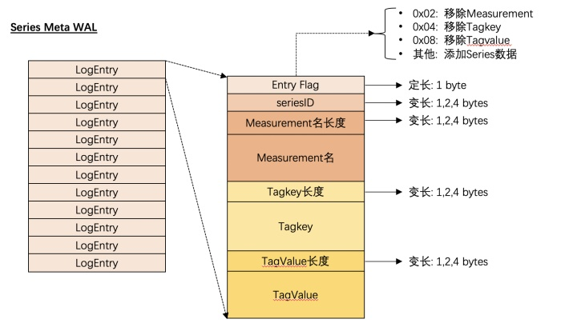
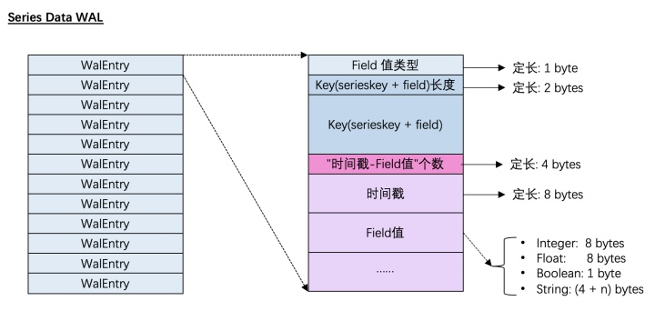
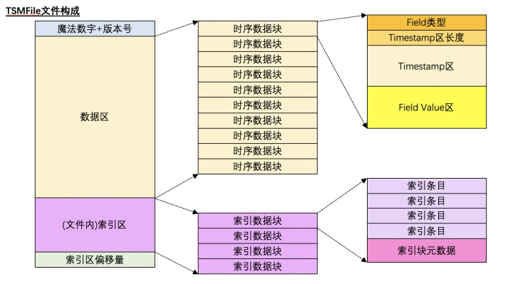
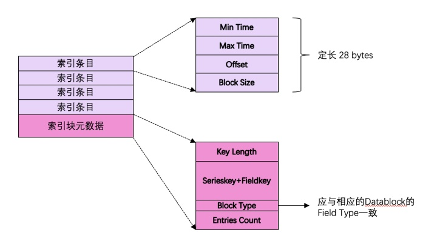

*  目录
{:toc}
	
	
<!--more-->

## 2 InfluxDB的数据模型

- measurement:指标对象，也即一个数据源对象。每个measurement可以拥有一个或多个指标值，也即下文所述的field。在实际运用中，可以把一个现实中被检测的对象（如：“cpu”）定义为一个measurement
- tags:概念等同于大多数时序数据库中的tags, 通常通过tags可以唯一标示数据源。每个tag的key和value必须都是字符串。
- field:数据源记录的具体指标值。每一种指标被称作一个“field”，指标值就是 “field”对应的“value”
- timestamp:数据的时间戳。在InfluxDB中，理论上时间戳可以精确到 纳秒（ns）级别

在InfluxDB中，measurement的概念之上还有一个对标传统DBMS的 Database 的概念，逻辑上每个Database下面可以有多个measurement。在单机版的InfluxDB实现中，每个Database实际对应了一个文件系统的 目录。

### 2.1 Serieskey的概念
InfluxDB中的SeriesKey的概念就是通常在时序数据库领域被称为 时间线 的概念, 一个SeriesKey在内存中的表示即为下述字符串(逗号和空格被转义)的 字节数组
`{measurement名}{tagK1}={tagV1},{tagK2}={tagV2},...`其中，SeriesKey的长度不能超过 65535 字节

### 2.2 支持的Field类型

DataType|size in mem
--------|-----------
float|8 bytes
integer|8 bytes
string|0-64KB
boolean|1 bytes


在InfluxDB中，Field的数据类型在以下范围内必须保持不变，否则写数据时会报错 类型冲突。-- 同一Serieskey + 同一field + 同一shard

### 2.3 Shard的概念
在InfluxDB中， 能且只能 对一个Database指定一个 Retention Policy (简称:RP)。通过RP可以对指定的Database中保存的时序数据的留存时间(duration)进行设置。而 Shard 的概念就是由duration衍生而来。一旦一个Database的duration确定后, 那么在该Database的时序数据将会在这个duration范围内进一步按时间进行分片从而使数据分成以一个一个的shard为单位进行保存。shard分片的时间 与 duration之间的关系如下:

duration of RP|Shard Duration
--------------|--------------
`< 2h`|1 h
`2h<= & <=6 month`|1day
`\> 6month`|7days


新建的Database在未显式指定RC的情况下，默认的RC为 数据的Duration为永久，Shard分片时间为7天

## 3. InfluxDB的存储引擎分析
时序数据库的存储引擎主要需满足以下三个主要场景的性能需求:

1. 大批量的时序数据写入的高性能
2. 直接根据时间线(即Influxdb中的 Serieskey )在指定时间戳范围内扫描数据的高性能
3. 间接通过measurement和部分tag查询指定时间戳范围内所有满足条件的时序数据的高性能

InfluxDB在结合了1.2所述考量的基础上推出了他们的解决方案，即下面要介绍的 WAL + TSMFile + TSIFile的方案

### 3.1 WAL解析
InfluxDB写入时序数据时为了确保数据完整性和可用性，与大部分数据库产品一样，都是会先写WAL,再写入缓存，最后刷盘。对于InfluxDB而言，写入时序数据的主要流程如同下图所示：

InfluxDB对于时间线数据和时序数据本身分开，分别写入不同的WAL中：

- 索引数据的WAL

	由于InfluxDB支持对Measurement，TagKey，TagValue的删除操作，当然随着时序数据的不断写入，自然也包括 增加新的时间线，因此索引数据的WAL会区分当前所做的操作具体是什么，它的WAL的结构如下图所示
	
- 时序数据的WAL

	由于InfluxDB对于时序数据的写操作永远只有单纯写入，因此它的Entry不需要区分操作种类，直接记录写入的数据即可
	
	
### 3.2 TSMFile解析
TSMFile是InfluxDB对于时序数据的存储方案。在文件系统层面，每一个TSMFile对应了一个 Shard。

TSMFile的存储结构如下图所示:


其特点是在一个TSMFile中将 时序数据（i.e Timestamp + Field value）保存在数据区；将Serieskey 和 Field Name的信息保存在索引区，通过一个基于 Serieskey + Fieldkey构建的形似B+tree的文件内索引快速定位时序数据所在的 数据块

- 索引块的构成
	
	
	其中 索引条目 在InfluxDB的源码中被称为directIndex。在TSMFile中，索引块是按照 Serieskey + Fieldkey 排序 后组织在一起的。明白了TSMFile的索引区的构成，就可以很自然地理解InfluxDB如何高性能地在TSMFile扫描时序数据了：
	
	1. 根据用户指定的时间线（Serieskey）以及Field名 在 索引区 利用二分查找找到指定的Serieskey+FieldKey所处的 索引数据块
	2. 根据用户指定的时间戳范围在 索引数据块 中查找数据落在哪个（或哪几个）索引条目
	3. 将找到的 索引条目 对应的 时序数据块 加载到内存中进行进一步的Scan
- 时序数据的存储

	即同一个 Serieskey + Fieldkey 的 所有时间戳 - Field值对被拆分开，分成两个区：Timestamps区和Value区分别进行存储。它的目的是：实际存储时可以分别对时间戳和Field值按不同的压缩算法进行存储以减少时序数据块的大小
	
### 3.3 TSIFile解析
有了TSMFile，本章开头所说的三个主要场景中的场景1和场景2都可以得到很好的解决。但是如果查询时用户并没有按预期按照Serieskey来指定查询条件，而是指定了更加复杂的条件，该如何确保它的查询性能？

通常情况下，这个问题的解决方案是依赖倒排索引(Inverted Index)。InfluxDB的倒排索引依赖于下述两个数据结构
```
map<SeriesID, SeriesKey>
map<tagkey, map<tagvalue, List<SeriesID>>>
```

但是在实际生产环境中，由于用户的时间线规模会变得很大，因此会造成倒排索引使用的内存过多，所以后来InfluxDB又引入了 TSIFileTSIFile的整体存储机制与TSMFile相似，也是以 Shard 为单位生成一个TSIFile。具体的存储格式就在此不赘述了。


