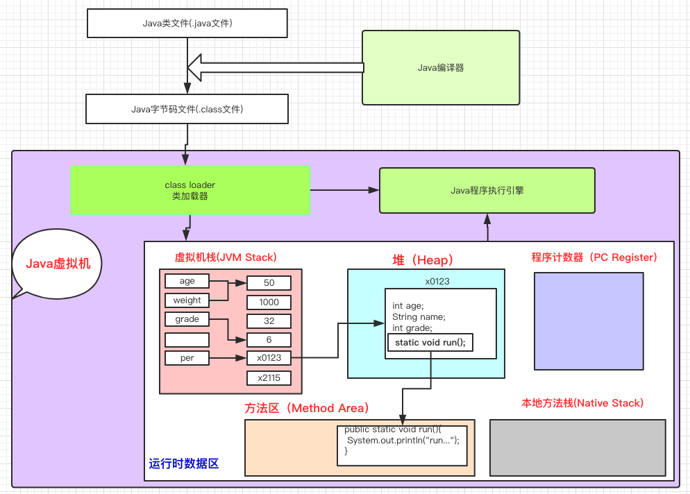
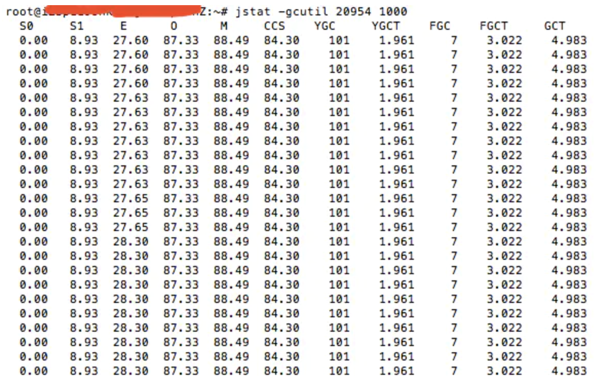
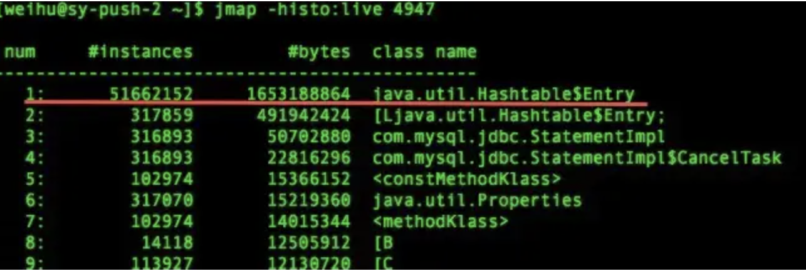
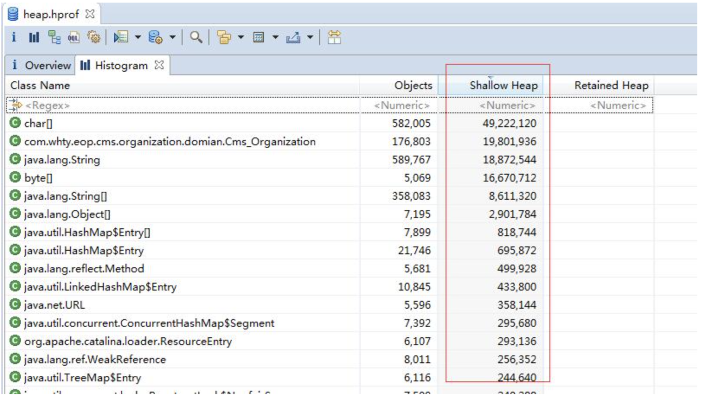
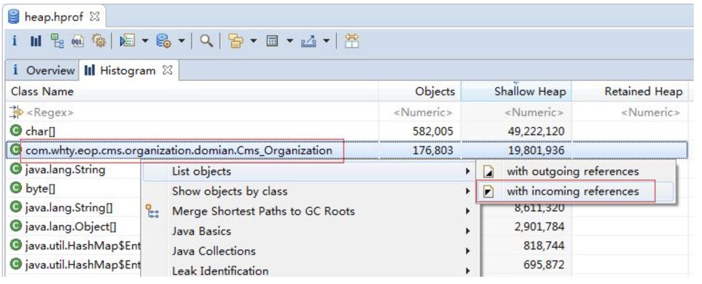
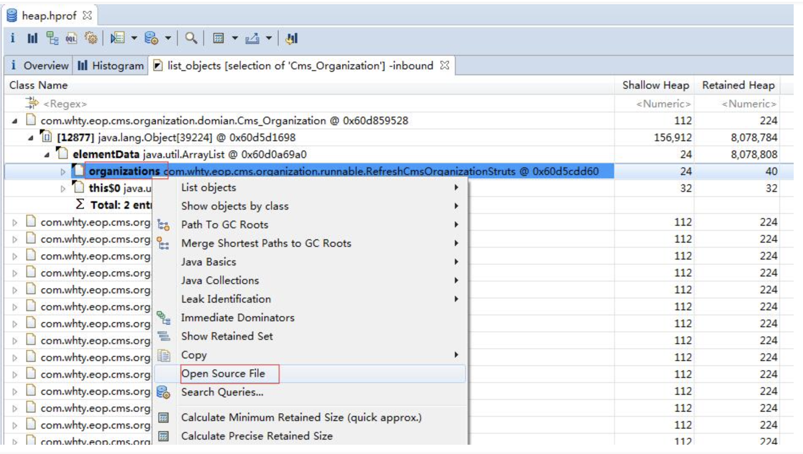

*  目录
{:toc}
	
	
<!--more-->


### 运行时数据区域



- 程序计数器
- Java虚拟机栈（栈帧--局部变量表(包含方法执行过程中的所有变量)、操作数栈（入栈、出栈、复制、交换、产生消费变量，局部变量表是为操作数栈提供必要的支撑）、动态链接、方法出口）
- 本地方法栈
- Java堆
- 方法区（已被虚拟机加载的类信息、常量、静态变量、JIT编译后的代码）-> 元空间
- 运行时常量池（class文件中的常量池，用于存放编译器生成的各种字面量(文本字符串、声明为final的常量值)和符号引用(类和接口的全限定名；字段的名称和描述符；方法的名称和描述符)）
- 直接内存

Java7及以前的版本的Hotspot中方法区位于永久代中。同时，永久代和堆是相互隔离的，但它们使用的物理内存是连续的。Java8中，Hotspot取消了永久代，元空间（Metaspace）登上舞台，它不再与堆连续，而是存在与本地内存。

Java7之前，字符串常量池在方法区，为了减少方法区内存溢出的风险，之后就转移到了Java堆中。类的静态变量也转移到了Java堆中。符号引用转移到了直接内存。

元空间（Metaspace）和永久代的区别：元空间使用本地内存，而永久代使用的是JVM的内存，避免了OOM.

元空间相比于永久代的优势：

1. 字符串常量池存在永久代中，容易出现性能问题和内存溢出
2. 类和方法的大小难以确定，给永久代的大小指定带来困难
3. 永久代会为GC带来不必要的复杂性，并且回收效率偏低。
4. 方便Hotspot和其他JVM如JRockit的集成

### TLAB
在Java中，典型的对象不再堆上分配的情况有两种：TLAB和栈上分配（通过逃逸分析）。JVM在内存新生代Eden Space中开辟了一小块线程私有的区域，称作TLAB（Thread-local allocation buffer）。默认设定为占用Eden Space的1%。在Java程序中很多对象都是小对象且用过即丢，它们不存在线程共享也适合被快速GC，所以对于小对象通常JVM会优先分配在TLAB上，并且TLAB上的分配由于是线程私有所以没有锁开销。因此在实践中分配多个小对象的效率通常比分配一个大对象的效率要高。也就是说，Java中每个线程都会有自己的缓冲区称作TLAB（Thread-local allocation buffer），每个TLAB都只有一个线程可以操作，TLAB结合bump-the-pointer技术可以实现快速的对象分配，而不需要任何的锁进行同步，也就是说，在对象分配的时候不用锁住整个堆，而只需要在自己的缓冲区分配即可。

### Java对象分配的过程
1. 编译器通过逃逸分析，确定对象是在栈上分配还是在堆上分配。如果是在堆上分配，则进入2.
2. 如果tlab_top + size <= tlab_end，则在TLAB上直接分配对象并增加tlab_top 的值，如果现有的2. TLAB不足以存放当前对象则3.
3. 重新申请一个TLAB，并再次尝试存放当前对象。如果放不下，则4。
4. 在Eden区加锁（这个区是多线程共享的），如果eden_top + size <= eden_end则将对象存放在Eden区，增加eden_top 的值，如果Eden区不足以存放，则5。
5. 执行一次Young GC（minor collection）
6. 经过Young GC之后，如果Eden区任然不足以存放当前对象，则直接分配到老年代。

### 对象内存分配的两种方法
1. 指针碰撞(Serial、ParNew等带Compact过程的收集器) ：假设Java堆中内存是绝对规整的，所有用过的内存都放在一边，空闲的内存放在另一边，中间放着一个指针作为分界点的指示器，那所分配内存就仅仅是把那个指针向空闲空间那边挪动一段与对象大小相等的距离，这种分配方式称为“指针碰撞”（Bump the Pointer）。
2. 空闲列表(CMS这种基于Mark-Sweep算法的收集器) ：如果Java堆中的内存并不是规整的，已使用的内存和空闲的内存相互交错，那就没有办法简单地进行指针碰撞了，虚拟机就必须维护一个列表，记录上哪些内存块是可用的，在分配的时候从列表中找到一块足够大的空间划分给对象实例，并更新列表上的记录，这种分配方式称为“空闲列表”（Free List）。

### 堆和栈的区别
1. 管理方式：栈是由编译器自动管理，堆的释放工作由程序员控制，容易产生内存泄漏，即使jvm有垃圾回收机制，也有内存泄漏的可能。
2. 空间大小：通常在32位系统上，堆内存可以接近4G空间，栈一般是以M为单位的。
3. 生长方向：堆是向上生长的，也就是向着内存地址增加的方向，栈是向下生长的。
4. 分配方式：堆都是动态分配的，没有静态分配的堆；栈有两种方式：静态分配是编译器完成的，动态分配是由allocate()函数进行分配的，但是栈的动态分配与堆是不同的，它的动态分配是由编译器进行释放的。
5. 碎片问题：堆中进行频繁的分配释放，内存空间是不连续的，会形成大量碎片；而栈是先进后出的队列，不会出现内存碎片问题。
6. 分配效率：栈是机器系统提供的数据结构，计算机会在底层分配专门的reg存放栈的地址，因此效率高；堆是由函数去实现的，机制较复杂，还有可能存在内存不够，再申请更大内存的可能，效率低。

### Java中的垃圾回收机制
从以下3个方面考虑

1. 哪些内存需要回收？
2. 	什么时候回收？
3. 如何回收？

- 知道了Java内存运行时区域的各个部分，其中程序计数器、虚拟机栈、本地方法栈3个区域随线程而生、而灭，因此不需要考虑，只考虑Java堆和方法区。首先通过可达性分析算法判断对象是否可达。可作为GC Roots的对象: 
		
	- 全局性的引用 
		- 类静态属性引用的对象            
		- 常量引用的对象   
	- 执行上下文 - 栈中引用的对象（虚拟机栈和本地方法栈）
	
	接着进行二次标记过程：如果不可达，标记一次并进行筛选，条件是此对象是否有必要执行finalize()方法。如果有必要执行则将对象放到F-Queue队列中，待Finalizer去执行。GC会对F-Queue中的对象进行第二次小规模的标记。
	
- 内存空间不足：CMS由于会存在浮动垃圾，因此在老年代使用了68%的空间后就会被激活。

#### safepoint

比如GC的时候必须要等到Java线程都进入到safepoint的时候VMThread才能开始执行GC，

1. 循环的末尾 (防止大循环的时候一直不进入safepoint，而其他线程在等待它进入safepoint)
2. 方法返回前
3. 调用方法的call之后
4. 抛出异常的位置比如GC的时候必须要等到Java线程都进入到safepoint的时候VMThread才能开始执行GC，

### 垃圾收集算法：

- 标记-清除 -- 效率低；同时产生大量空间碎片，导致需要分配较大对象时，无法找到连续的内存而提前触发另一次GC
- 复制 -- 为了提高效率，它将内存按容量划分为大小想等的两块，每次只使用其中的一块。每次都对整个半区进行GC，不存在碎片问题，但是可使用内存缩小了。   
	现代商业虚拟机都采用采用这种算法来回收新生代，所以可以按照 4. 对象的内存分配
- 标记-整理  -- 适合老年代，在标记清除的基础上，将所有存活的对象都移向一端，然后直接清理掉边界以外的内存。
- 分代收集

### 对象的内存分配（-XX:NewRatio 新生代：老年代 = 2：1）
对象主要分配在新生代的Eden区，如果启动了本地线程分配缓冲，将按线程优先在TLAB上分配。

对象在新生代Eden区中分配，当Eden区没有足够空间进行分配时，虚拟机将发起一次Minor GC. -xx:SurvivorRatio=8决定了新生代中Eden区与一个Survivor区的空间比例是8：1，新生代总可用空间为Eden区+1个Survivor区的总容量。当Minor GC后新生代空间还不够为对象分配内存时则选用通过分配担保机制将Eden区中无法放入Survivor区的对象直接转移到老年代去，然后再在Eden区中分配内存给对象。

大对象直接进入老年代，大对象是指需要连续内存空间的Java对象，最典型的大对象就是那种很长的字符串以及数组。

长期存活的对象将进入老年代。当它的年龄增加到一个年龄阈值就会被晋升到老年代中。


### 垃圾收集器

新生代：

- Serial -- （复制）单线程，有停顿时间，但实际上，它依然是虚拟机运行在client模式下的默认新生代收集器，优点是：简单而高效（相比较其他收集器的单线程）
- ParNew -- （复制）Serial的多线程版本，不同点只是多线程。有停顿时间，但它是server模型下的首选，而且只有它能和CMS收集器配合工作。
- Parallel Scanvenge -- （复制）它的关注点和其它收集器不同，它的目标是达到可控制的吞吐量（`运行用户代码时间/(运行用户代码时间+垃圾收集时间)`）。停顿时间越短就越适合需要与用户交互的程序，而高效吞吐量则可以高效率地利用CPU时间，尽快完成程序的运算任务，主要适合在后台运算而不需要太多交互的任务。
- G1

老年代：

- Serial Old -- (标记整理)serial 的老年代版本,简单高效它依然是虚拟机运行在client模式下的默认老年代收集器
- Parallel Old -- Parallel Scanvenge的老年代版本。因为JDK1.6之前，Parallel Scanvenge只能和Serial Old搭配使用，这样就达不到吞吐量优先的效果，直到该收集器出现。
- CMS（Concurrent Mark Sweep） -- 获取最短停顿时间为目标，

	- 初始标记 (Stop) -- 只是标记一下GC Roots 能直接关联到的对象，速度很快
	- 并发标记 -- GC Roots Tracing的过程
	- 并发预清理 -- 查找执行并发标记阶段从年轻代晋升到老年代的对象，通过重新扫描，减少下一个阶段"重新标记"的工作，因为下一个阶段会Stop The World。
	- 重新标记 (Stop) -- 修正并发标记的结果，暂停虚拟机，扫码CMS堆中剩余对象
	- 并发清除 -- 清理垃圾对象，程序不会停顿
	- 并发重置 -- 重置CMS收集器的数据结构

	缺点：
	
	- 对CPU资源敏感。会占用应用程序的一部分线程，(cpu 数量 + 3)/4 个
	- 无法处理浮动垃圾。最后一次并发清除时产生的垃圾，同时，为了在并发清除时应用程序还能运行，需要预留一部分空间，所以不能等满了再收集。JDK5上默认68%, JDK6中92%，如果预留的不够，则会出现Concurrent Mode Failure, 这是虚拟机启动后备预案--启用Serial Old。
	- 标记-清除算法，产生碎片
- G1 -- 它的使命是替换掉CMS
	- 标记阶段：首先是初始标记(Initial-Mark),这个阶段也是停顿的(stop-the-word)，并且会稍带触发一次young GC。
	- 并发标记：这个过程在整个堆中进行，并且和应用程序并发运行。并发标记过程可能被young GC中断。在并发标记阶段，如果发现区域对象中的所有对象都是垃圾，那个这个区域会被立即回收(图中打X)。同时，并发标记过程中，每个区域的对象活性(区域中存活对象的比例)被计算。
	- 再标记：这个阶段是用来补充收集并发标记阶段产新的新垃圾。与之不同的是，G1中采用了更快的算法:SATB。
	- 清理阶段：选择活性低的区域(同时考虑停顿时间)，等待下次young GC一起收集，这个过程也会有停顿(STW)。
	- 回收/完成：新的yong GC清理被计算好的区域。但是有一些区域还是可能存在垃圾对象，可能是这些区域中对象活性较高，回收不划算，也肯能是为了迎合用户设置的时间，不得不舍弃一些区域的收集。

	
	特点如下：
	
	1. 并行与并发：使用多个cpu缩短STW的时间，与用户线程并发执行
	2. 分代收集：
	3. 空间整合，整体上看是标记-整理，局部上是复制
	4. 可预测的停顿 -- 因为它有计划地避免在整个堆中进行全局域的GC。G1跟踪各个region的GC价值，在后台维护一个优先列表，根据允许的收集时间，优先回收价值最大的region。

	它将整个Java堆划分为多个大小相等的独立区域(Region), 虽然还保留了新生代和老年代的概念，但是物理上都是Region的集合。年轻代和老年代不再物理隔离
	
#### G1和CMS的比较
1. CMS收集器是获取最短回收停顿时间为目标的收集器，因为CMS工作时，GC工作线程与用户线程可以并发执行，以此来达到降低停顿时间的目的（只有初始标记和重新标记会STW）。但是CMS收集器对CPU资源非常敏感。在并发阶段，虽然不会导致用户线程停顿，但是会占用CPU资源而导致引用程序变慢，总吞吐量下降。
2. CMS仅作用于老年代，是基于**标记清除**算法，所以清理的过程中会有大量的空间碎片。
3. CMS收集器无法处理浮动垃圾，由于CMS并发清理阶段用户线程还在运行，伴随程序的运行自热会有新的垃圾不断产生，这一部分垃圾出现在标记过程之后，CMS无法在本次收集中处理它们，只好留待下一次GC时将其清理掉。
4. G1是一款面向服务端应用的垃圾收集器，适用于多核处理器、大内存容量的服务端系统。G1能充分利用CPU、多核环境下的硬件优势，使用多个CPU（CPU或者CPU核心）来缩短STW的停顿时间，它满足短时间停顿的同时达到一个高的吞吐量。
5. 从JDK 9开始，G1成为默认的垃圾回收器。当应用有以下任何一种特性时非常适合用G1：Full GC持续时间太长或者太频繁；对象的创建速率和存活率变动很大；应用不希望停顿时间长(长于0.5s甚至1s)。
6. G1将空间划分成很多块（Region），然后他们各自进行回收。堆比较大的时候可以采用，**采用复制算法**，碎片化问题不严重。**整体上看属于标记整理算法,局部(region之间)属于复制算法**。
7. G1 需要记忆集来记录新生代和老年代之间的引用关系，这种数据结构在 G1 中需要占用大量的内存，可能达到整个堆内存容量的 20% 甚至更多。而且 G1 中维护记忆集的成本较高，带来了更高的执行负载，影响效率。所以 CMS 在小内存应用上的表现要优于 G1，而大内存应用上 G1 更有优势，大小内存的界限是6GB到8GB。（Card Table（CMS中）的结构是一个连续的byte[]数组，扫描Card Table的时间比扫描整个老年代的代价要小很多！G1也参照了这个思路，不过采用了一种新的数据结构 Remembered Set 简称Rset。RSet记录了其他Region中的对象引用本Region中对象的关系，属于points-into结构（谁引用了我的对象）。而Card Table则是一种points-out（我引用了谁的对象）的结构，每个Card 覆盖一定范围的Heap（一般为512Bytes）。G1的RSet是在Card Table的基础上实现的：每个Region会记录下别的Region有指向自己的指针，并标记这些指针分别在哪些Card的范围内。 这个RSet其实是一个Hash Table，Key是别的Region的起始地址，Value是一个集合，里面的元素是Card Table的Index。每个Region都有一个对应的Rset。）
	
JDK11:

1. Epsilon GC
2. ZGC

### 动态年龄计算
Hotspot在遍历所有对象时，按照年龄从小到大对其所占用的大小进行累积，当累积的某个年龄大小超过了survivor区的一半时，取这个年龄和MaxTenuringThreshold中更小的一个值，作为新的晋升年龄阈值。

JVM引入动态年龄计算，主要基于如下两点考虑：

1. 如果固定按照MaxTenuringThreshold设定的阈值作为晋升条件： a）MaxTenuringThreshold设置的过大，原本应该晋升的对象一直停留在Survivor区，直到Survivor区溢出，一旦溢出发生，Eden+Svuvivor中对象将不再依据年龄全部提升到老年代，这样对象老化的机制就失效了。 b）MaxTenuringThreshold设置的过小，“过早晋升”即对象不能在新生代充分被回收，大量短期对象被晋升到老年代，老年代空间迅速增长，引起频繁的Major GC。分代回收失去了意义，严重影响GC性能。
2. 相同应用在不同时间的表现不同：特殊任务的执行或者流量成分的变化，都会导致对象的生命周期分布发生波动，那么固定的阈值设定，因为无法动态适应变化，会造成和上面相同的问题。

### 哪些对象会被存放到⽼年代？
1. 新生代对象每次经历一次minor gc，年龄会加1，当达到年龄阈值（默认为15岁）会直接进⼊老年代；
2. ⼤对象直接进⼊⽼年代；
3. 新⽣代复制算法需要一个survivor区进⾏轮换备份，如果出现⼤量对象在minor gc后仍然存活的情况时，就需要⽼年代进⾏分配担保，让survivor⽆法容纳的对象直接进入⽼年代；
4. 如果在Survivor空间中相同年龄所有对象⼤小的总和⼤于Survivor空间的一半，年龄大于或等于该年龄的对象就可以直接进⼊年老代。

### 触发full gc的场景及应对策略：
1. System.gc()⽅法的调⽤，应对策略：通过-XX:+DisableExplicitGC来禁止调⽤用System.gc ;
2. ⽼年代代空间不足，应对策略：让对象在Minor GC阶段被回收，让对象在新⽣代多存活一段时间，不要创建过大的对象及数组;
3. 永⽣区空间不足，应对策略：增大PermGen空间；
4. GC时出现promotionfailed和concurrent mode failure，应对策略：增⼤survivor space；
5. Minor GC后晋升到旧生代的对象⼤小⼤于⽼年代的剩余空间，应对策略：增⼤Tenured space 或下调CMSInitiatingOccupancyFraction=60；
6. 内存持续增涨达到上限导致Full GC，应对策略：通过dumpheap 分析是否存在内存泄漏。

### Object的finalize()方法的作用是否与c++的析构函数作用相同：

1. 析构函数调用确定，而它是不确定的
2. 将未被引用的对象放置于F-Queue队列
3. 方法执行随时可能会被终止
4. 给予对象最后一次重生的机会，但是它的执行是不确定的。

### Java中的强引用、软引用、弱引用、虚引用有什么用？

软引用：

1. 对象处在有用但非必须的状态
2. 只有当内存空间不足时，GC会回收该引用的对象的内存
3. 可以用来实现高速缓存

```
String str = new String("abc") // 强引用
SoftReference<String> sofRef = new SoftReference<>(str) // 软引用
```

弱引用：

1. 非必须的对象，比软引用更弱一些
2. GC时会被回收
3. 被回收的概率也不大，因为GC线程优先级较低
4. 适用于引用偶尔被使用且不影响垃圾收集的对象

```
String str = new String("abc") // 强引用
WeakReference<String> sofRef = new WeakReference<>(str); 
```

虚引用：

1. 不会决定对象的声明周期
2. 任何时候都可能被垃圾回收器回收
3. 跟踪对象被垃圾回收器回收的活动，起哨兵作用
4. 必须和引用队列ReferenceQueue联合使用，因为直接调用get时直接返回null

```
String str = new String("abc") // 强引用
ReferenceQueue queue = new ReferenceQueue();
PhantomReference<String> sofRef = new PhantomReference<>(str, queue); 
```

引用类型|被垃圾回收时间|用途|生存时间
-------|-----------|----|------
强引用|从来不会|对象的一般用途|JVM停止运行时终止
软引用|在内存不足时|对象缓存|内存不足时终止
弱引用|在垃圾回收时|对象缓存|gc运行后终止
虚引用|unknown|标记、哨兵|unknown

引用队列ReferenceQueue：

1. 无实际存储结构，存储逻辑依赖于内部节点之间的关系来表达
2. 存储关联的且被GC的软引用，弱引用以及虚引用

### 如何判断一个类是无用的类?
方法区主要回收的是无用的类，那么如何判断一个类是无用的类的呢？
类需要同时满足下面3个条件才能算是 “无用的类” ：

1. 该类所有的实例都已经被回收，也就是 Java 堆中不存在该类的任何实例。
2. 加载该类的 ClassLoader 已经被回收。
3. 该类对应的 java.lang.Class 对象没有在任何地方被引用，无法在任何地方通过反射访问该类的方法。

虚拟机可以对满足上述3个条件的无用类进行回收，这里说的仅仅是“可以”，而并不是和对象一样不使用了就会必然被回收。

### 如何判断一个常量是废弃常量：
如果当前没有任何String对象引用该字符串常量的话，就说明常量"abc"就是废弃常量
	
### JVM参数的分类

1. JVM标准参数 -- JVM的标准参数是指的在各个JDK版本中都比较稳定的，不会变动的参数，一般是针对jdk全局的参数。比如
	
	```
	-help
	-server -client
	-version -showversion
	-cp -classpath
	```
2. JVM非标准化参数 -- JVM非标准化参数指的是在各个jdk版本中会有略微变化的参数

	- -X参数
		
		```
		-Xint : 解释执行
		-Xcomp ：第一次使用就编译成本地代码（java不是严格的解释性或者编译性执行的语言）
		-Xmixed : 上面两种混合模式，有编译器自己去优化选择。
		```
	- -XX参数
		
		```
		Boolean类型
		-XX:+UseConcMarkSweepGC表示启用了CMS垃圾回收器
​		-XX:+UseG1GC 表示启用了G1垃圾回收器
​		-XX:+PrintGC,表示打印gc日志;
​		-XX:-PrintGCDetails 减号,关闭详细gc日志;
		-XX:+PrintGCDateStamps  加号,打开gc日志日期;
		-Xloggc:<LOG_DIR>/gc.log 指定gc日志路径;
​		
​		非Boolean(Key-Value类型)
​		-XX:MaxGCPauseMills=500表示GC最大的停顿时间是500
​ 		-XX:GCTimeRatio=19
​ 		
​ 		-Xms 等价于-XX:InitialHeapSize 表示初始化堆大小
		-Xmx 等价于-XX:MaxHeapSize 表示最大堆的大小
		-Xss 等价于 -XX:ThreadStackSize 线程堆栈的大小
		```
	可以使用 jinfo -falg <参数名称> 命令行工具去查看当前java进程的JVM参数。比如 `jinfo -flag MaxHeapSize pid`
	
### jvm中哪些地⽅会出现oom？分别说说oom的可能原因？
1. java堆溢出（heap）：
	1. Java堆内存主要⽤来存放运⾏过程中所有的对象，该区域OOM异常⼀般会有如下错误信息：`java.lang.OutofMemoryError:Java heap space`
	2. 此类错误⼀般通过Eclipse Memory Analyzer分析OOM时dump的内存快照就能分析出来，到底是由于程序原因导致的内存泄露，还是由于没有估计好JVM内存的⼤小导致的内存溢出。
	3. 另外，Java堆常⽤用的JVM参数：
		- -Xms：初始堆⼤小，默认值为物理内存的1/64(<1GB)，默认(MinHeapFreeRatio参数可以调整)空余堆内存小于40%时，JVM就会增大堆直到
		- -Xmx：最⼤堆⼤小，默认值为物理内存的1/4(<1GB)，默认(MaxHeapFreeRatio参数可以调整)空余堆内存大于70%时，JVM会减少堆直到
		- -Xmn：年轻代⼤小(1.4or lator)，此处的⼤小是（eden +2 survivor space)，与jmap -heap中显示的New gen是不同的。
2. 栈溢出（stack）：
	1. 栈⽤来存储线程的局部变量表、操作数栈、动态链接、⽅法出⼝等信息。如果请求栈的深度不足时抛出的错误会包含类似下⾯的信息：`java.lang.StackOverflowError`。
	2. 另外，由于每个线程占的内存⼤概为1M，因此线程的创建也需要内存空间。操作系统可⽤内存-Xmx-MaxPermSize即是栈可⽤的内存，如果申请创建的线程比较多超过剩余内存的时候，也会抛出如下类似错误：`java.lang.OutofMemoryError: unableto create new native thread`
	3. 相关的JVM参数有：
		- -Xss:每个线程的堆栈⼤小,JDK5.0以后每个线程堆栈⼤小为1M,以前每个线程堆栈⼤小为256K.
		- 在相同物理内存下,减⼩这个值能⽣成更多的线程.但是操作系统对一个进程内的线程数还是有限制的,不能⽆限生成,经验值在3000~5000
		- 可能原因：i. 递归：递归用到的局部变量存储在堆栈中，堆栈的访问效率高，速度快，但空间有限，递归太多变量需要⼀直⼊栈⽽不出栈，导致需要的内存空间⼤于堆栈的空间，栈空间是2M，堆空间内存空间。
3. 运⾏时常量溢出（constant）：
	1. 运⾏时常量保存在方法区，存放的主要是编译器生成的各种字⾯量和符号引⽤，但是运⾏期间也可能将新的常量放⼊池中，⽐如String类的intern⽅法。如果该区域OOM，错误结果会包含类似下面的信息`java.lang.OutofMemoryError: PermGen space`
	2. 相关的JVM参数有：
		- -XX:PermSize：设置持久代(perm gen)初始值，默认值为物理内存的1/64
		- -XX:MaxPermSize：设置持久代最⼤值，默认为物理内存的1/4
4. ⽅法区溢出：
	1. 方法区主要存储被虚拟机加载的类信息，如类名、访问修饰符、常量池、字段描述、⽅法描述等。理理论上在JVM启动后该区域⼤小应该⽐较稳定，但是目前很多框架，⽐如Spring和Hibernate等在运⾏过程中都会动态⽣成类，因此也存在OOM的⻛险。如果该区域OOM，错误结果会包含类似下⾯的信息`java.lang.OutofMemoryError: PermGen space`
	2. 相关的JVM参数有：
		- -XX:PermSize：设置持久代(perm gen)初始值，默认值为物理内存的1/64
		- -XX:MaxPermSize：设置持久代最⼤值，默认为物理内存的1/4

### 如何定位jvm内存信息？
1. 打印日志：
	- -XX:+PrintGC：输出形式:
	
		```
		[GC118250K->113543K(130112K),0.0094143 secs]
		[Full GC121376K->10414K(130112K),0.0650971 secs]
		```
	- -XX:+PrintGCDetails：输出形式:
		
		```
		[GC[DefNew:8614K->781K(9088K),0.0123035 secs]118250K->113543K(130112K),0.0124633 secs]
		[GC[DefNew:8614K->8614K(9088K),0.0000665 secs][Tenured:112761K->10414K(121024K),0.0433488 secs
		```
	- -XX:+PrintGCTimeStamps：打印GC停顿耗时
	- -XX:+PrintGCApplicationStoppedTime：打印垃圾回收期间程序暂停的时间.
	- -XX:+PrintHeapAtGC：打印GC前后的详细堆栈信息
	- -Xloggc:filename：把相关⽇日志信息记录到⽂文件以便便分析.
2. 错误调试：
	- -XX:ErrorFile=./hs_err_pid<pid>.log：如果JVM crashed，将错误⽇志输出到指定文路径。
	- -XX:HeapDumpPath=./java_pid<pid>.hprof：堆内存快照的存储⽂件路径。
	- -XX:-HeapDumpOnOutOfMemoryError：在OOM时，输出一个dump.core⽂件，记录当时的堆内存快照
3. 类状态器相关：
	- -XX:-TraceClassLoading：打印class装载信息到stdout。记Loaded状态。
	- -XX:-TraceClassUnloading：打印class的卸载信息到stdout。记Unloaded状态。

### 内存溢出的可能原因、分析方式、解决⽅法
1. 数据加载过多，如1次从数据库中取出过多数据
2. 集合类中有对象的引⽤，⽤完后没有清空或者集合对象未置空导致引用存在等，使的JVM⽆法回收
3. 死循环，过多重复对象
4. 第三方软件的bug
5. 启动参数内存值设定的过⼩。

分析方式：

1. 查找进程ID，`jps -l`或`ps aux | grep tomat`
2. 利用“虚拟机统计信息监视工具：jstat”监视虚拟机各种运行状态信息`jstat -gcutil 20954 1000`意思是每1000毫秒查询一次，一直查。gcutil的意思是已使用空间站总空间的百分比。
结果如下图：
	
	
	查询结果表明：这台服务器的新生代Eden区（E，表示Eden）使用了28.30%（最后）的空间，两个Survivor区（S0、S1，表示Survivor0、Survivor1）分别是0和8.93%，老年代（O，表示Old）使用了87.33%。程序运行以来共发生Minor GC（YGC，表示Young GC）101次，总耗时1.961秒，发生Full GC（FGC，表示Full GC）7次，Full GC总耗时3.022秒，总的耗时（GCT，表示GC Time）为4.983秒。
3. 找出导致频繁Full GC的原因	.分析方法通常有两种：
	1. 把堆dump下来再用MAT等工具进行分析，但dump堆要花较长的时间，并且文件巨大，再从服务器上拖回本地导入工具，这个过程有些折腾，不到万不得已最好别这么干。
	2. 更轻量级的在线分析，使用“Java内存影像工具：jmap”生成堆转储快照（一般称为headdump或dump文件）。`jmap -histo:live 20954`可以看出HashTable中的元素有5000多万，占用内存大约1.5G的样子。这肯定不正常
		
4. 定位到代码.定位带代码，有很多种方法，比如前面提到的通过MAT查看Histogram即可找出是哪块代码。
		
	
	Shllow Heap排序后发现 Cms_Organization 这个类占用的内存比较多（没有得到及时GC），查看引用：
	
	分析引用栈，找到无效引用，打开源码：
	
	
	有问题的源码如下：
	
	```
	public class RefreshCmsOrganizationStruts implements Runnable{  
  
    private final static Logger logger = Logger.getLogger(RefreshCmsOrganizationStruts.class);  
      
    private List<Cms_Organization> organizations;  
  
    private OrganizationDao organizationDao = (OrganizationDao) WebContentBean  
            .getInstance().getBean("organizationDao");  
    public RefreshCmsOrganizationStruts(List<Cms_Organization> organizations) {  
        this.organizations = organizations;  
    }  
  
    public void run() {  
        Iterator<Cms_Organization> iter = organizations.iterator();  
        Cms_Organization organization = null;  
        while (iter.hasNext()) {  
            organization = iter.next();  
            synchronized (organization) {  
                try {  
	                    organizationDao.refreshCmsOrganizationStrutsInfo(organization.getOrgaId());  
	                    organizationDao.refreshCmsOrganizationResourceInfo(organization.getOrgaId());  
	                    organizationDao.sleep();  
	                } catch (Exception e) {  
	                    logger.debug("RefreshCmsOrganizationStruts organization = " + organization.getOrgaId(), e);  
	                }  
	            }  
	        }  
	    }  
	  
	}  
	```
	
	分析源码，定时任务定时调用，每次调用生成10个线程处理，而它又使用了非线程安全的List对象，导致List对象无法被GC收集，所以这里将List替换为CopyOnWriteArrayList 。

解决⽅法：修改JVM启动参数，加内存(-Xms，-Xmx)；错日志，是否还有其他错误；代码走查
	
### 类加载的过程
装载、链接（验证、准备、解析和初始化）

- 装载：虚拟机需要完成以下3件事情
	1. 通过一个类的全限定名来获取定义此类的二进制字节流。
	2. 将这个字节流所代表的静态存储结构转化为方法区的运行时数据结构。
	3. 在内存中生成一个代表这个类的java.lang.Class对象，作为方法区这个类的各种数据的访问入口。   
	
	相对于类加载过程的其他阶段，一个非数组类的加载阶段是开发人员可控性最强的，因为加载阶段既可以使用系统提供的引导类加载器来完成，也可以由用户自定义的类加载器去完成。  
	 
	对于数组类而言，情况有所不同，数据类本身不通过类加载器创建，它是由Java虚拟机直接创建的。但数据类与类加载进仍然有密切的关系，因为数组类的元素类型最终要靠类加载器去创建，规则如下：
	
		1. 如果数组的组件类型是引用类型，那就递归采用本节中定义的加载过程去加载这个组件类型，数据C将在加载该组件类型的类加载器的类名称空间上被标识。
		2. 如果组件类型不是引用类型，JVM将会把数据C标记为与引导类加载器关联。
		3. 数组类的可见性与它的组件类型的可见性一致，如果组件类型不是引用类型，那数组类的可见性将默认为public。

- 验证主要包括：文件格式验证 -> 元数据验证（语义校验）-> 字节码验证 -> 符号引用验证
- 准备是正式为类变量分配内存并设置类变量初始值，这些变量所使用的内存都将在方法区中进行分配。如果类字段的字段属性表中存在ConstantValue属性，那在准备阶段变类value就会被初始化为属性对应的值。static对象会被设置默认值，static final对象会被赋上给予的值。
- 解析：JVM将常量池内的符号引用转换为直接引用
- 初始化是执行类构造器<clinit>()方法的过程。包含类变量的赋值动作和静态语句块的执行。

加载方法|区别|场景
------|----|----
loadClass|ClassLoader.loadClass得到的class是还没有链接的。|比如spring的延迟加载技术，则是采用loadClass
forName|Class.forName得到的class是已经初始化完成的| 比如对于MySQL driver的加载，是需要执行它里面的静态块代码生成driver的，Class.forName("com.mysql.jdbc.Driver")

### 类加载器

1. BootStrap ClassLoader 启动ClassLoader（sun.boot.class.path）：最顶层的加载类，主要加载jdk中的核心库，%JRE_HOME%\lib下的rt.jar、resources.jar、charsets.jar和class等。
	> Bootstrap ClassLoader不继承自ClassLoader，因为它不是一个普通的Java类，底层由C++编写，已嵌入到了JVM内核当中，当JVM启动后，Bootstrap ClassLoader也随着启动，负责加载完核心类库后，并构造Extension ClassLoader和App ClassLoader类加载器。

2. Extension ClassLoader 扩展ClassLoader（java.ext.dirs）：扩展的类加载器，加载目录%JRE_HOME%\lib\ext⽬录下的jar包和class文件。还可以加载-D java.ext.dirs选项指定的⽬目录。
3. App ClassLoader 应⽤ClassLoader/系统ClassLoader（java.class.path）：也称为SystemAppClass 加载当前应⽤的classpath的所有类

#### 双亲委派机制：
1. 定义：当一个ClassLoader实例需要加载某个类时，它会试图亲⾃搜索某个类之前，先把这个任务委托给它的⽗类加载器，这个过程是由上至下依次检查的，⾸先由最顶层的类加载器Bootstrap ClassLoader试图加载，如果没加载到，则把任务转交给Extension ClassLoader试图加载，如果也没加载到，则转交给App ClassLoader 进⾏加载，如果它也没有加载得到的话，则返回给委托的发起者，由它到指定的⽂件系统或⽹网络等URL中加载该类。如果它们都没有加载到这个类时，则抛出ClassNotFoundException异常。否则将这个找到的类生成一个类的定义，并将它加载到内存当中，最后返回这个类在内存中的Class实例例对象
2. 作⽤：
	- 避免重复加载；
	- 考虑到安全因素，避免⾃自定义的类去替代系统类，如String。
3. jvm如何判定两个class是否相同？JVM在判定两个class是否相同时，不仅要判断两个类名是否相同，⽽且要判断是否由同⼀个类加载器实例加载的。只有两者同时满⾜的情况下，JVM才认为这两个class是相同的。

#### 引起类加载的五个⾏为：
1. 遇到new、getstatic、putstatic或invokestatic这四条字节码指令
2. 反射调⽤的时候，如果类没有进⾏过初始化，则需要先触发其初始化
3. ⼦类初始化的时候，如果其⽗类还没初始化，则需先触发其⽗类的初始化
4. 虚拟机执⾏主类的时候(有 main(string[] args))
5. JDK1.7 动态语⾔支持

#### java对象创建时机：
1. 使⽤new关键字创建对象
2. 使用Class类的newInstance⽅法(反射机制)
3. 使⽤Constructor类的newInstance方法(反射机制)
4. 使⽤Clone⽅法创建对象
5. 使⽤(反)序列化机制创建对象

### 类执行时的动作
首先试图访问main()方法，于是加载器开始启动并找出main所在类的编译代码。在对它进行加载的过程中，编译器注意到它有一个基类（由extends得知），于是它继续进行加载，即使不打算产生一个该基类的对象，这也要发生。如果基类自身还有基类，则递归下去。

接下来，根基类中的static初始化被执行，然后是导出类，以此类推。

类加载完毕后，对象就可以被创建了。首先初始化变量为默认值；然后基类的构造器被调用，实例变量按其次序被初始化。最后，构造器其余部分被执行。

调用构造器要遵照下面的顺序：

1. 调用基类构造器
2. 按声明顺序调用成员的初始化方法
3. 调用导出类构造器主体

### String类型的深度解析

String是值不可变(immutable)的常量，是线程安全的(can be shared)。

接下来，String类使用了final修饰符，表明了String类的第二个特点：String类是不可继承的。

```
@Test
    public void test() {
        String s1 = "abc";
        String s2 = "abc";

        String s3 = new String("abc");
        String s4 = new String("abc");

        System.out.println(s1 == s2);     // true
        System.out.println(s3 == s4);     // false
        System.out.println(s1 == s3);     // false
    }
```
String s = "abc" 方式创建的对象，存储在字符串常量池中，在创建字符串对象之前，会先在常量池中检查是否存在 abc 对象。如果存在，则直接返回常量池中 abc对象的引用，不存在会创建该对象，并将该对象的引用返回给对象 s。

以 HotSpot 虚拟机为例，在 jdk1.8 之前，字符串常量池在方法区中，为了减小方法区内存溢出的风险，在 jdk1.8 之后就把字符串常量池转移到 java 堆中了。

String s = new String("abc") 这种方式，实际上 abc 本身就是字符串池中的一个对象，在运行 new String() 时，把字符串常量池中的字符串 abc 复制到堆中，因此该方式不仅会在堆中，还会在常量池中创建 abc 字符串对象。 最后把 java 堆中对象的引用返回给 s。

```
@Test
    public void test() {
        String s1 = "abc";
        String s2 = "a";
        String s3 = new String("abc");
        String s4 = s3.intern();
        
        System.out.println(s1 == ("a" + "bc"));    // true 字符串常量重载 "+"
        System.out.println(s1 == (s2 + "bc"));     // false 字符串引用重载 "+"  s2 + "bc" 在被编译器执行的时候，会自动引入 StringBuilder 对象，调用其 append() 方法，最终调用 toString() 方法返回其在堆中对象的引用。
        System.out.println(s1 == s4); // true intern()方法能使一个位于堆中的字符串在运行期间动态地加入到字符串常量池中（字符串常量池的内容是程序启动的时候就已经加载好了），如果字符串常量池中有该对象对应的字面量，则返回该字面量在字符串常量池中的引用，否则，创建复制一份该字面量到字符串常量池并返回它的引用。
    }
```

JDK6与JDK6之后的intern()方法的区别：

Java7之前，字符串常量池在方法区，为了减少方法区内存溢出的风险，之后就转移到了Java堆中。JDK6是如果字符串常量池中有该对象对应的字面量，则返回该字面量在字符串常量池中的引用，否则，创建复制一份该字面量到字符串常量池并返回它的引用。JDK6之后如果字符串常量池中有该对象对应的字面量，则返回该字面量在字符串常量池中的引用。否则，如果该字符串对象已经存在于Java堆中，则将堆中对此对象的引用添加到字符串常量池，并且返回该引用；如果堆中不存在，则在池中创建该字符串并返回其引用。

比如：

```
String s = new String("a");
s.intern()
String s2 = "a";
System.out.println(s == s2);    // false(JDK6), false(JDK7)

String s3 = new String("a") + new String("a");
s3.intern()
String s4 = "aa";
System.out.println(s3 == s4);    // false(JDK6), true(JDK7)
 

```

### jvm调优：
1. 调优时机：
	1. heap 内存（⽼年代）持续上涨达到设置的最大内存值；
	2. Full GC 次数频繁；
	3. GC 停顿时间过长（超过1秒）；
	4. 应⽤出现OutOfMemory 等内存异常；
	5. 应⽤中有使用本地缓存且占⽤大量内存空间；
	6. 系统吞吐量与响应性能不高或下降。
2. 调优原则：
	1. 多数的Java应⽤不需要在服务器器上进行JVM优化；
	2. 多数导致GC问题的Java应⽤，都不是因为我参数设置错误，而是代码问题；
	3. 在应⽤上线之前，先考虑将机器的JVM参数设置到最优（最适合）；
	4. 减少创建对象的数量量；
	5. 减少使⽤全局变量和大对象；
	6. JVM优化是到最后不得已才采用的手段；
	7. 在实际使⽤中，分析GC情况优化代码⽐优化JVM参数更好；
3. 调优目标：
	1. GC低停顿；
	2. GC低频率；
	3. 低内存占⽤用；
	4. ⾼吞吐量；
4. 调优步骤：
	1. 分析GC⽇日志及dump⽂件，判断是否需要优化，确定瓶颈问题点；
	2. 确定jvm调优量化目标；
	3. 确定jvm调优参数（根据历史jvm参数来调整）；
	4. 调优一台服务器，对⽐观察调优前后的差异；
	5. 不断的分析和调整，直到找到合适的jvm参数配置；
	6. 找到最合适的参数，将这些参数应用到所有服务器，并进⾏后续跟踪。

### jvm调优参数：
1. 设定堆内存⼤小，这是最基本的。
2. -Xms：启动JVM时的堆内存空间。
3. -Xmx：堆内存最大限制。
4. 设定新生代⼤小。
5. 新生代不宜太小，否则会有大量对象涌入老年代。
6. -XX:NewRatio：新⽣代和⽼年代的占⽐。
7. -XX:NewSize：新生代空间。
8. -XX:SurvivorRatio：伊甸园空间和幸存者空间的占比。
9. -XX:MaxTenuringThreshold：对象进⼊入⽼年代的年龄阈值。
10. 设定垃圾回收器年轻代：-XX:+UseParNewGC。⽼年代：-XX:+UseConcMarkSweepGC。CMS可以将STW时间降到最低，但是不对内存进⾏行压缩，有可能出现“并⾏模式失败”。⽐如⽼年代空间还有300MB空间，但是一些10MB的对象⽆法被顺序的存储。这时候会触发压缩处理，但是CMS GC模式下的压缩处理时间要⽐Parallel GC⻓很多。G1采⽤”标记-整理“算法，解决了内存碎片问题，建立了可预测的停顿时间类型，能让使用者指定在⼀个⻓度为M毫秒的时间段内，消耗在垃圾收集上的时间不得超过N毫秒


