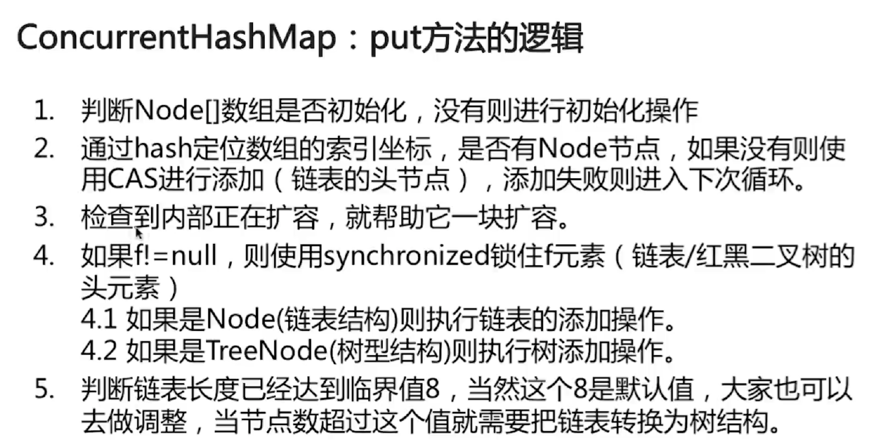
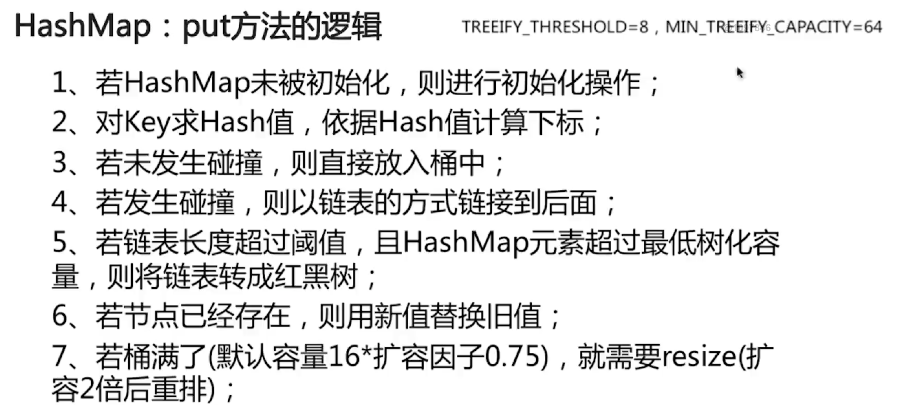
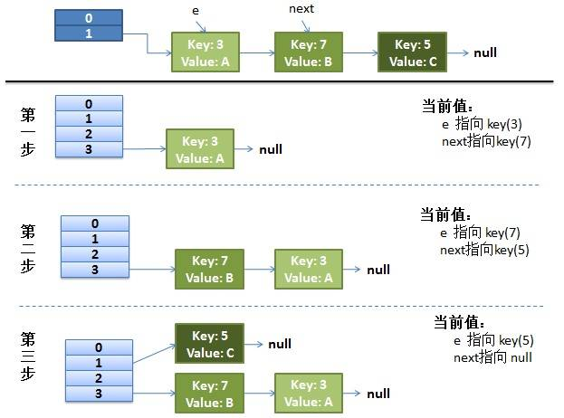
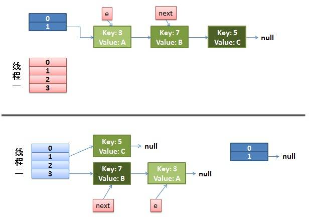
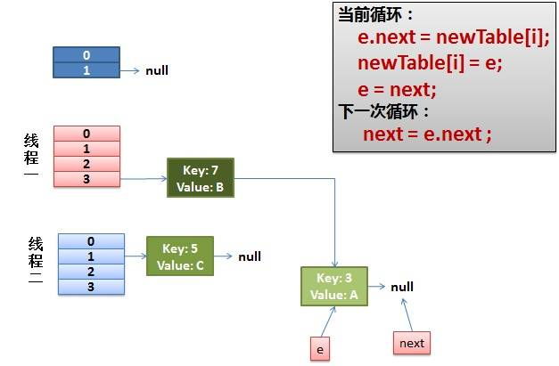
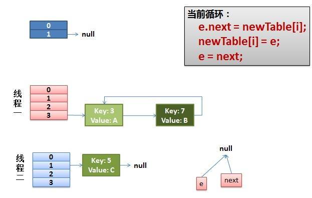

*  目录
{:toc}	
	
<!--more-->

## 谈谈你对Java的理解
1. 平台无关性 -- 一次编译，到处运行
2. GC
3. 语言特性
4. OO
5. 类库
6. 异常处理

### 如何⽤用java分配⼀一段连续的1G的内存空间?需要注意些什什么？
`ByteBuffer.allocateDirect(1024*1024*1024);`要注意内存溢出问题。
	
### ArrayList和LinkedList源码解析？
1. ArrayList
	- ArrayList是动态增长的数组，默认数组大小为10.
	- add()方法先调用ensureCapacityInternal()方法增加自身容量，如果扩容的容量比默认的10小，那么list的容量更改为10，如果需要的容量大于数组的长度则执行grow操作，新容量为旧容量的1.5倍。
	- modCount()的作用，防止一个线程正在迭代遍历，另一个线程修改了列表的结构（从结构上修改此列表的次数+1）
2. LinkedList底层使用双向链表结构，有个内部类Node，作为实际的节点，其中包含的属性字段只有一个头节点，尾节点和节点个数。

### 如何处理Hash冲突？
1. 开放地址法
	- 线性探测再散列
	- 二次探测再散列
	- 伪随机探测再散列
2. 再hash法
3. 链地址法

### 编码相关问题？
	
1. GB2312是对ASCLL的中文扩展，一个小于127的字符意义与原来相同，但两个大于127的字符连在一起时就表示一个汉字。
2. GBK标注，不再要求低字节一定127号之后的内码。
3. 为了统一全世界各国的编码出现了Unicode，用两个字节，也就是16位来统一表示所有的字符。
4. Unicode太浪费空间了，因此出现了UTF，UTF-8就是每次8个位传输数据，而UTF-16就是每次16个位。UTF-8就是在互联网上使用最广的一种Unicode的实现方式，这是为了传输而设计的编码，并使编码无国界，这样就可以显示全世界上所有文化的字符了。-- UTF-8最大的一个特定，它是变长的编码方式，它可以使用1-4字节表示一个符号。UTF-16每2个字节表示一个字符。
5. 在java中⼀一个字符能否表示⼀一个汉字：在java中,⼀一个字符表示16位,相当于2个字节,⼀一个汉字正好是2个字节

### <? extends T> 和 <? super T> 的概念
<? extends T>上界通配符；<? super T>下界通配符。

1. 为什么要用通配符和边界？
	因为`Plate<Fruit> p = new Plate<Apple>(new Apple());`会编译错误，容器里面装的东西之间有继承关系，但容器之间没有继承关系，所以为了让他们之间有关系就产生了边界。
2. `Plate<? extends Fruit> p = new Plate<Apple>(new Apple());`定义了一个能放水果以及一切水果派生类的盘子。
3. 下界通配符`Plate<? super Fruit>`一个能放水果以及一切水果基类的盘子
4. 上下界通配符的副作用：
	- 上界只能取不能存：因为编译器看到后面Plate<Apple>赋值以后，盘子没有标上Apple，反而标了一个占位符CAP#1表示捕获到Fruit或Fruit的子类，具体是什么不知道。
	- 下界只能存，往外取只能放在Object对象里
5. PECS原则，频繁往外读取，适合用Extends; 经常往里插入，适合用Super。

### HashTable和ConcurrentHashMap的区别
ConcurrentHashMap引入了分割(Segment)，上面代码中的最后一行其实就可以理解为把一个大的Map拆分成N个小的HashTable，在put方法中，会根据hash(paramK.hashCode())来决定具体存放进哪个Segment，如果查看Segment的put操作，我们会发现内部使用的同步机制是基于lock操作的，这样就可以对Map的一部分（Segment）进行上锁，这样影响的只是将要放入同一个Segment的元素的put操作，保证同步的时候，锁住的不是整个Map（HashTable就是这么做的），相对于HashTable提高了多线程环境下的性能，因此HashTable已经被淘汰了。



Java8之后，对每个桶都单独加锁，CAS+synchronized使锁更细化。结构也跟hashmap类型--数组+链表+红黑树

比起segment，锁拆的更细：

1. 首先使用无锁操作CAS插入头节点，失败则循环重试
2. 若头结点已存在，则尝试获取头结点的同步锁，再进行操作。

若链表长度超过阈值TREEIFY_THRESHHOLD，且hashmap元素超过最低最低树化容量MIN_TREEIFY_CAPACITY，则将链表转成红黑树。


**hashmap在jdk1.8中的改动?**

1. Jdk1.8以前是进⾏四次扰动计算，可能从速度功效各方面考虑，jdk1.8变成扰动一次，低16位和⾼高16位进⾏异或计算。取模的时候考虑取模运算的速度⽐较慢，改⽤用与操作优化效率，很巧妙，hash table就没设计的这么好。
2. JDK1.8⾥对hashmap最⼤的改变是引⼊了了红⿊树，这一点在hash不均匀并且元素个数很多的情况时，对hashmap的性能提升非常大。Hashmap的底层实现是使用一个entry数组存储，默认初始⼤⼩16，不过jdk8换了名字叫node，可能是因为引⼊了树，叫node更合适吧。Node⾥有next引⽤用指向下⼀个节点，因为hashmap解决冲突的思路是拉链法。
3. 另外变化⽐较⼤的还有扩容机制，也就是resize⽅法。java8之前是头插法，就是说新来的值会取代原有的值，原有的值就顺推到链表中去，就像上面的例子一样，因为写这个代码的作者认为后来的值被查找的可能性更大一点，提升查找的效率。但是，在java8之后，都是所用尾部插入了。使用头插会改变链表的上的顺序，但是如果使用尾插，在扩容时会保持链表元素原本的顺序，就不会出现链表成环的问题了。

**HashMap在高并发下如果没有处理线程安全会有怎样的安全隐患，具体表现是什么？** 

1. put时key相同导致其中一个线程的value被覆盖；        
2. 多个线程同时扩容，造成数据丢失；        
3. 多线程扩容时导致Node链表形成环形结构造成.next()死循环，导致CPU利⽤率接近100% 
	
	正常的ReHash的过程:
	
	
	1.假设我们有两个线程。我用红色和浅蓝色标注了一下。
	
	2.线程一被调度回来执行:
	先是执行 newTalbe[i] = e
	然后是e = next，导致了e指向了key(7)
	而下一次循环的next = e.next导致了next指向了key(3)
	3.一切安好
线程一接着工作。把key(7)摘下来，放到newTable[i]的第一个，然后把e和next往下移。
	
	4.环形链接出现
	e.next = newTable[i] 导致 key(3).next 指向了 key(7) 注意：此时的key(7).next 已经指向了key(3)， 环形链表就这样出现了。
	
	
#### 为什么HashMap的长度是2的整数次幂？
1. 加快哈希计算

	我们都知道为了找到 KEY 的位置在哈希表的哪个槽里面，需要计算 hash(KEY) % 数组长度，但是% 计算比 & 慢很多。如果length为2的N次方，取模运算可以变成位与运算，效率显著提高！但是要浪费一些空间。
2. 减少哈希冲突

	假设现在数组的长度 length 可能是偶数也可能是奇数length 为偶数时，length-1 为奇数，奇数的二进制最后一位是 1，这样便保证了 hash &(length-1) 的最后一位可能为 0，也可能为 1（这取决于 h 的值），即 & 运算后的结果可能为偶数，也可能为奇数，这样便可以保证散列的均匀性。


### Java里的多态

1. 要有继承关系
2. 子类要重写父类的方法
3. 父类引用指向子类对

### final关键
final关键字可以用来修饰类、方法和变量（包括成员变量和局部变量）。下面就从这三个方面来了解一下final关键字的基本用法。

修饰类|修饰方法|修饰变量
-----|-------|-------
表明这个类不能被继承。|把方法锁定，以防任何继承类修改它的含义|如果是基本数据类型的变量，则其数值一旦在初始化之后便不能更改；如果是引用类型的变量，则在对其初始化之后便不能再让其指向另一个对象

### 异常

ClassNotFoundException|NoClassDefFoundError
-----------------------|-------------------
受检异常|error
原因大多是因为使用 Class.forName() 方法动态的加载类信息，但是这个类在类路径中并没有被找到|成因：1. 类依赖的class或者jar不存在</hr>2.类文件存在，但是存在不同的域中，比如同一个class被多个类加载器加载</hr>3.大小写问题，javac编译的时候是无视大小写的，很有可能编译出来的class文件就与相应的不一样

**finally会在Catch的return语句之前执行。**

**java 异常处理消耗性能的地方：**

1. try-catch块影响JVM的优化
2. 异常对象实例需要保存栈快照等信息，开销较大

## 动态代理
动态代理是对于传入的方法调用进行包装，比如增加一些功能。动态代理允许一个类一个方法服务于任一类的多个方法调用。

### JDK动态代理例子

```
public class TimingDynamicInvocationHandler implements InvocationHandler {
 
    private static Logger LOGGER = LoggerFactory.getLogger(
      TimingDynamicInvocationHandler.class);
     
    private final Map<String, Method> methods = new HashMap<>();
 
    private Object target;
 
    public TimingDynamicInvocationHandler(Object target) {
        this.target = target;
 
        for(Method method: target.getClass().getDeclaredMethods()) {
            this.methods.put(method.getName(), method);
        }
    }
 
    @Override
    public Object invoke(Object proxy, Method method, Object[] args) 
      throws Throwable {
        long start = System.nanoTime();
        Object result = methods.get(method.getName()).invoke(target, args);
        long elapsed = System.nanoTime() - start;
 
        LOGGER.info("Executing {} finished in {} ns", method.getName(), 
          elapsed);
 
        return result;
    }
}
```

```
// 方法的3个参数：动态代理类的加载器，要实现的接口数组，代理上所有方法调用转发到的InvocationHandler
Map mapProxyInstance = (Map) Proxy.newProxyInstance(
  DynamicProxyTest.class.getClassLoader(), new Class[] { Map.class }, 
  new TimingDynamicInvocationHandler(new HashMap<>()));
 
mapProxyInstance.put("hello", "world");
 
CharSequence csProxyInstance = (CharSequence) Proxy.newProxyInstance(
  DynamicProxyTest.class.getClassLoader(), 
  new Class[] { CharSequence.class }, 
  new TimingDynamicInvocationHandler("Hello World"));
 
csProxyInstance.length()
```

### CGLib 动态代理 
```
public class TimingMethodInterceptor implements MethodInterceptor {

    public <T> T getProxy(Class<T> cls) {
        T t = (T) Enhancer.create(cls, this);
        return t;
    }

    @Override
    public Object intercept(Object o, Method method, Object[] args, MethodProxy methodProxy) throws Throwable {
        long start = System.nanoTime();
        Object rs = methodProxy.invokeSuper(o, args);
        long elapsed = System.nanoTime() - start;

        System.out.printf("Executing %s finished in %d ns", method.getName(), elapsed);
        return rs;
    }

    public static void main(String[] args) {
        TimingMethodInterceptor timingMethodInterceptor = new TimingMethodInterceptor();
        HashMap hashMap = timingMethodInterceptor.getProxy(HashMap.class);
        hashMap.put(0, 0);
        hashMap.get(0);
    }
}
```

### JDK动态代理和cglib动态代理有什么区别？

JDK动态代理只能对实现了接口的类生成代理对象；

cglib可以对任意类生成代理对象，它的原理是对目标对象进行继承代理，如果目标对象被final修饰，那么该类无法被cglib代理。


Spring框架的一大特点就是AOP，SpringAOP的本质就是动态代理，那么Spring到底使用的是JDK代理，还是cglib代理呢？

混合使用。如果被代理对象实现了接口，就优先使用JDK代理，如果没有实现接口，就用cglib代理。


## 动态代理使用场景

1. 数据库连接和事物管理
2. 单元测试中动态mock对象
3. 或者其它类AOP方法拦截目的

## 缓存 -- EHCache
EHCache是来自sourceforge（http://ehcache.sourceforge.net/） 的开源项目，也是纯Java实现的简单、快速的Cache组件。EHCache支持内存和磁盘的缓存，支持LRU、LFU和FIFO多种淘汰算法，支持分 布式的Cache，可以作为Hibernate的缓存插件。同时它也能提供基于Filter的Cache，该Filter可以缓存响应的内容并采用 Gzip压缩提高响应速度。

首先介绍CacheManager类。它主要负责读取配置文件，默认读取CLASSPATH下的ehcache.xml，根据配置文件创建并管理Cache对象。

在Spring Boot中通过@EnableCaching注解自动化配置合适的缓存管理器（CacheManager），Spring Boot根据下面的顺序去侦测缓存提供者：

1. Generic
2. JCache (JSR-107) (EhCache 3, Hazelcast, Infinispan, and others)
3. EhCache 2.x
4. Hazelcast
5. Infinispan
6. Couchbase
7. Redis
8. Caffeine
9. Simple
除了按顺序侦测外，我们也可以通过配置属性spring.cache.type来强制指定。

	