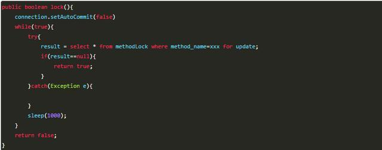

*  目录
{:toc}	
	
<!--more-->

# 概述
首先，按照业务的架构层次栈，我自底向上按照资源、通信、数据与计算的维度，梳理出了 4 个技术层次：分布式资源池化、分布式通信、分布式数据存储与管理、分布式计算。这样的划分符合业务架构设计的一般规律，即“在一定资源上，进行一定通信，通过一定计算，完成一定数据的加工和处理，从而对外提供特定的服务”。另一方面，这样的划分也整合了零散的知识点，具有完备性。


## 分布式系统的指标
1. 性能（Performance）
	- 吞吐量（Throughput）   
		- QPS，即查询数每秒，用于衡量一个系统每秒处理的查询数。
		- TPS，即事务数每秒，用于衡量一个系统每秒处理的事务数。
		- BPS，即比特数每秒，用于衡量一个系统每秒处理的数据量。对于一些网络系统、数据管理系统，我们不能简单地按照请求数或事务数来衡量其性能。因为请求与请求、事务与事务之间也存在着很大的差异，比方说，有的事务大需要写入更多的数据。那么在这种情况下，BPS 更能客观地反映系统的吞吐量。
	- 响应时间（Response Time）
	- 完成时间（Turnaround Time）
2. 资源占用（Resource Usage）
	- 空载资源占用
	- 满载资源占用
3. 可用性（Availability）
	- 系统的可用性可以用系统停止服务的时间与总的时间之比衡量。
	- 系统的可用性还可以用某功能的失败次数与总的请求次数之比来衡量
4. 可扩展性（Scalability）
	- 可扩展性，指的是分布式系统通过扩展集群机器规模提高系统性能 (吞吐量、响应时间、 完成时间)、存储容量、计算能力的特性，是分布式系统的特有性质。


## 一致性协议

### 2PC

阶段|功能
---|----
阶段一：提交事务请求|1. 事务询问<br> 2. 执行事务<br>  3. 各参与者向协调者反馈事务询问的响应
阶段二：执行事务提交|1. 发送提交请求<br> 2. 事务提交<br> 3. 反馈事务提交结果<br> 4. 完成事务<br>
阶段二：中断事务| 1. 发送回滚请求<br> 2. 事务回滚<br> 3. 反馈事务回滚结果<br> 4. 中断事务

存在的问题：

1. 全流程的同步阻塞：不管是第一阶段还是第二阶段，所有参与节点都是事务阻塞型。当参与者占有公共资源时，其他第三方访问公共资源可能不得不处于阻塞状态。
2. TM单点故障：由于全流程依赖TM的协调，一旦TM发生故障。参与者会一直阻塞下去。尤其在第二阶段，TM发生故障，那么所有的参与者还都处于锁定事务资源的状态中，而无法继续完成事务操作。所有参与者必须等待TM重新上线(TM重新选举)后才能继续工作。
3. TM脑裂引起数据不一致：在第二阶段中，当TM向参与者发送commit请求之后，发生了局部网络异常或者在发送commit请求过程中TM发生了故障，这会导致只有一部分参与者接受到了commit请求。而在这部分参与者接到commit请求之后就会执行commit操作。但是其他部分未接到commit请求的机器则无法执行事务提交。于是整个分布式系统便出现了数据不一致性的现象。
4. TM脑裂引起事务状态不确定：TM再发出commit消息之后宕机，而接收到这条消息的参与者同时也宕机了。那么即使通过选举协议产生了新的TM，这条事务的状态也是不确定的，没人知道事务是否被已经提交。


### 3PC

阶段|功能
---|----
阶段一：CanCommit|1. 事务询问<br> 2. 各参与者向协调者反馈事务询问的响应
阶段二：PreCommit:执行事务预提交|1. 发送预提交请求<br> 2. 事务预提交<br> 3. 各参与者向协调者反馈事务执行的响应
阶段二：PreCommit：中断事务|1. 发送中断请求<br> 2. 中断事务 
阶段三：doCommit：执行提交|1. 发送提交请求<br> 2. 事务提交<br> 3. 反馈事务提交结果<br> 4. 完成事务
阶段三：doCommit：中断事务|1. 发送中断请求<br> 2. 事务回滚<br> 3. 反馈事务回滚结果<br> 4. 中断事务

### 优缺点

比较|2PC|3PC
---|---|---
优点|原理简单、实现方便|相较于二阶段提交协议，三阶段提价协议最大的有点是降低了参与者的阻塞范围，并且能够在出现单点故障后继续达成一致（避免了无限期等待的问题。）
缺点|同步阻塞（当协调者崩溃时，参与者不能做出最后的选择，就会一直保持阻塞锁定资源）、单点问题、脑裂、太过保守|2PC 中只有协调者有超时机制，3PC 在协调者和参与者中都引入了超时机制。三阶段提交协议在去除阻塞的同时也引入了新的问题，那就是在参与者接收到preCommit消息后，如果网络出现分区，此时协调者所在的节点和参与者无法进行正常的网络通信，在这种情况下，该参与者依然会进行事务的提交，这必然出现数据的不一致性。


对于数据一致性，Google Chubby的作者Mike Burrows说过："世上只有一种一致性算法，那就是Paxos，所有其他一致性算法都是Paxos算法的不完整版。"

### Paxos算法
#### 阶段一：

1. Proposer选择一个提案编号Mn，然后向Acceptor的某个超过半数的子集成员发送编号为Mn的Prepare请求。
2. 如果一个Acceptor收到一个编号为Mn的Prepare请求，且编号Mn大于该Acceptor已经响应的所有Prepare请求的编号，那么它就会将它已经批准过的最大编号的提案作为响应反馈给Proposer，同时该Acceptor会承诺不会再批准任何编号小于Mn的提案。

	举个例子来说，假定一个Acceptor已经响应过所有Prepare请求对应的提案编号分别为1、2、...、5、7，那么该Acceptor在接收到一个编号为8的Prepare请求后，就会将编号为7的提案作为响应反馈给Proposer。
	
#### 阶段二：

1. 如果Proposer收到来自半数以上的Acceptor对于其发出的编号为Mn的Prepare的请求响应，那么它就会发送一个针对[Mn，Vn]提案的Accept请求给Acceptor。注意，Vn的值就是收到的响应中编号最大的提案的值，如果响应中不包含任何提案，那么它就是任意值。
2. 如果Acceptor收到这个针对[Mn，Vn]提案的Accept请求，只要该Acceptor尚未对编号大于Mn的Prepare请求作出任何响应，它就可以通过这个提案。

Paxos算法引入了“过半”的理念，通俗地讲就是少数服从多数的原则。同时，Paxos算法支持分布式节点角色之间的轮换，这极大地避免了分布式单点的出现，因此Paxos算法既解决了无限期等待的问题，也解决了“脑裂”问题，是目前最优秀的分布式一致性协议之一。


### Paxos的工程实践

#### 1. Google Chubby
有名的分布式锁服务，GFS和Big Table等大型系统都用它来解决分布式协作、元数据存储和Master选举等一系列与分布式锁服务相关的问题。

对于Chubby的设计，有的人认为作为Paxos算法的实现者，它应该构建成一个包含Paxos算法的协议库，从而使应用程序能够便捷地使用Paxos算法。但是，Chubby的最初设计者并没有选择这样做，而是将Chubby设计成一个需要访问中心化节点的分布式锁服务。之所以这样选择，是因为锁服务具备以下四个传统算法库所不具备的优点：

1. 对上层应用程序的引入性更小
2. 便于提供数据的发布与订阅

### Chubby 与 Zookeeper的比较
#### 相同点

- Chubby的文件相当于ZooKeeper的znode。Chubby的文件和znode都是用来存储少量数据。 
- 都只提供文件的全部读取和全部写入。
- 都提供类似UNIX文件系统的API。
- 都提供接收数据更新的通知，Chubby提供event机制，ZooKeeper提供watch机制。
- 它们的客户端都通过一个session和服务器端进行交互。 
- 写操作都是通过leader/master来进行。
- 都支持持久性和临时性数据。
- 都使用复制状态机来做容错。

#### 不同点

|Chubby|ZooKeeper|
|------|---------|
|Chubby 内置对分布式锁的支持。|ZooKeeper 本身不提供锁，但是可以基于 ZooKeeper 的基本 操作来实现锁。|
|读操作也必须通过 master 节点来执行。相应的，Chubby 保证 的数据一致性强一些，不会有读到旧数据的问题。|读操作可以通过任意节点来执行。相应的，ZooKeeper 保证的 数据一致性弱一些，有读到旧数据的问题。|
|Chubby 提供一个保证数据一致性的 cache 。有文件句柄的概念。|ZooKeeper 不支持文件句柄，也不支持 cache，但是可以通过 watch 机制来实现 cache 。但是这样实现的 cache 还是有返回 旧数据的问题。|
|Chubby 基本操作不如 ZooKeeper 的强大。|ZooKeeper 提供更强大的基本操作，例如对顺序性节点的支持， 可以用来实现更多的协同服务。|
|Chubby 使用 Paxos 数据一致性协议。|ZooKeeper 使用 Zab 数据一致性协议。|

## 分布式事务
### 柔性事务
通常所说的柔性事务分为：

- **两阶段型**: 就是分布式事务两阶段提交，对应技术上的XA、JTA/JTS。这是分布式环境下事务处理的典型模式。(XA是规范，Java Transaction Api是对规范的实现，spring JTA有两种实现方式：1. 使用JBoss之类的应用服务器提供的JTA事务管理器；2. 可以使用Atomikos，Bitronix等库提供的JTA事务管理器)

	优点：两阶段提交（2PC），对业务侵⼊很小，它最⼤的优势就是对使⽤⽅透明，用户可以像使⽤本地事务⼀样使⽤基于 XA 协议的分布式事务，能够严格保障事务 ACID 特性。
	
	缺点：它是一个强一致性的同步阻塞协议，事务执⾏过程中需要将所需资源全部锁定，也就是俗称的 刚性事务。所以它比较适⽤于执⾏时间确定的短事务，整体性能比较差。一旦事务协调者宕机或者发生网络抖动，会让参与者一直处于锁定资源的状态或者只有一部分参与者提交成功，导致数据的不一致。因此，在⾼并发性能⾄上的场景中，基于 XA 协议的分布式事务并不是最佳选择。
- **补偿型**: TCC型事务（Try/Confirm/Cancel）可以归为补偿型。所谓的 TCC 编程模式，也是两阶段提交的一个变种，不同的是 TCC 为在业务层编写代码实现的两阶段提交。
	其核心思想是：针对每个操作，都要注册一个与其对应的确认和补偿（撤销）操作。它分为三个阶段：
	- Try 阶段主要是对业务系统做检测及资源预留
	- Confirm 阶段主要是对业务系统做确认提交，Try阶段执行成功并开始执行 Confirm阶段时，默认 Confirm阶段是不会出错的。即：只要Try成功，Confirm一定成功。
	- Cancel 阶段主要是在业务执行错误，需要回滚的状态下执行的业务取消，预留资源释放。

	举个例子，假入 Bob 要向 Smith 转账，思路大概是：
	我们有一个本地方法，里面依次调用
	
	1. 首先在 Try 阶段，要先调用远程接口把 Smith 和 Bob 的钱给冻结起来。
	2. 在 Confirm 阶段，执行远程调用的转账的操作，转账成功进行解冻。
	3. 如果第2步执行成功，那么转账成功，如果第二步执行失败，则调用远程冻结接口对应的解冻方法 (Cancel)。
	TCC 不存在资源阻塞的问题，因为每个方法都直接进行事务的提交，一旦出现异常通过则 Cancel 来进行回滚补偿，这也就是常说的补偿性事务。

	原本一个方法，现在却需要三个方法来支持（Rest或者Service都可以），可以看到 TCC 对业务的侵入性很强，而且这种模式并不能很好地被复用，会导致开发量激增。还要考虑到网络波动等原因，为保证请求一定送达都会有重试机制，所以考虑到接口的幂等性。协调器的开发比较复杂，需要保证各种出错情况下的最终一致性；协调器监控事务：事务及其参数、返回值保存在数据库中。

	优点： 跟2PC比起来，实现以及流程相对简单了一些，但数据的一致性比2PC也要差一些
	
	缺点： 缺点还是比较明显的，在2,3步中都有可能失败。TCC属于应用层的一种补偿方式，所以需要程序员在实现的时候多写很多补偿的代码，在一些场景中，一些业务流程可能用TCC不太好定义及处理。
- **本地消息表(异步确保型)**: 本地消息表这种实现方式应该是业界使用最多的，其核心思想是将分布式事务拆分成本地事务进行处理.通过将一系列同步的事务操作变为基于消息执行的异步操作, 避免了分布式事务中的同步阻塞操作的影响。
	
	基本思路就是：

	消息生产方，需要额外建一个消息表，并记录消息发送状态。消息表和业务数据要在一个事务里提交，也就是说他们要在一个数据库里面。然后消息会经过MQ发送到消息的消费方。如果消息发送失败，会进行重试发送。

	消息消费方，需要处理这个消息，并完成自己的业务逻辑。此时如果本地事务处理成功，表明已经处理成功了，如果处理失败，那么就会重试执行。如果是业务上面的失败，可以给生产方发送一个业务补偿消息，通知生产方进行回滚等操作。

	生产方和消费方定时扫描本地消息表，把还没处理完成的消息或者失败的消息再发送一遍。如果有靠谱的自动对账补账逻辑，这种方案还是非常实用的。

	这种方案遵循BASE理论，采用的是最终一致性，笔者认为是这几种方案里面比较适合实际业务场景的，即不会出现像2PC那样复杂的实现(当调用链很长的时候，2PC的可用性是非常低的)，也不会像TCC那样可能出现确认或者回滚不了的情况。

	优点： 一种非常经典的实现，避免了分布式事务，实现了最终一致性。
	缺点： 消息表会耦合到业务系统中，如果没有封装好的解决方案，会有很多杂活需要处理。

- **MQ 事务消息**
	有一些第三方的MQ是支持事务消息的，比如RocketMQ，他们支持事务消息的方式也是类似于采用的二阶段提交，但是市面上一些主流的MQ都是不支持事务消息的，比如 RabbitMQ 和 Kafka 都不支持。

	以阿里的 RocketMQ 中间件为例，其思路大致为：

	第一阶段Prepared消息，会拿到消息的地址。
	第二阶段执行本地事务，第三阶段通过第一阶段拿到的地址去访问消息，并修改状态。

	也就是说在业务方法内要想消息队列提交两次请求，一次发送消息和一次确认消息。如果确认消息发送失败了RocketMQ会定期扫描消息集群中的事务消息，这时候发现了Prepared消息，它会向消息发送者确认，所以生产方需要实现一个check接口，RocketMQ会根据发送端设置的策略来决定是回滚还是继续发送确认消息。这样就保证了消息发送与本地事务同时成功或同时失败。
	
- **Sagas 事务模型**:该模型其核心思想就是拆分分布式系统中的长事务为多个短事务，或者叫多个本地事务，然后由 Sagas 工作流引擎负责协调，如果整个流程正常结束，那么就算是业务成功完成，如果在这过程中实现失败，那么Sagas工作流引擎就会以相反的顺序调用补偿操作，重新进行业务回滚。

	比如我们一次关于购买旅游套餐业务操作涉及到三个操作，他们分别是预定车辆，预定宾馆，预定机票，他们分别属于三个不同的远程接口。可能从我们程序的角度来说他们不属于一个事务，但是从业务角度来说是属于同一个事务的。
	
	
	他们的执行顺序如上图所示，所以当发生失败时，会依次进行取消的补偿操作。

	因为长事务被拆分了很多个业务流，所以 Sagas 事务模型最重要的一个部件就是工作流或者你也可以叫流程管理器（Process Manager），工作流引擎和Process Manager虽然不是同一个东西，但是在这里，他们的职责是相同的。在选择工作流引擎之后，最终的代码也许看起来是这样的

	```
	SagaBuilder saga = SagaBuilder.newSaga("trip")
	    .activity("Reserve car", ReserveCarAdapter.class) 
	    .compensationActivity("Cancel car", CancelCarAdapter.class) 
	    .activity("Book hotel", BookHotelAdapter.class) 
	    .compensationActivity("Cancel hotel", CancelHotelAdapter.class) 
	    .activity("Book flight", BookFlightAdapter.class) 
	    .compensationActivity("Cancel flight", CancelFlightAdapter.class) 
	    .end()
	    .triggerCompensationOnAnyError();

	camunda.getRepositoryService().createDeployment() 
	    .addModelInstance(saga.getModel()) 
	    .deploy();
    ```
- **Seata**：也是从两段提交演变而来的一种分布式事务解决方案，提供了 AT、TCC、SAGA 和 XA 等事务模式，这里重点介绍 AT模式。
	以下单扣库存、扣余额举例。	
		
	先介绍 Seata 分布式事务的几种角色：		
	- Transaction Coordinator(TC): 全局事务协调者，用来协调全局事务和各个分支事务（不同服务）的状态， 驱动全局事务和各个分支事务的回滚或提交。
	- Transaction Manager™: 事务管理者，业务层中用来开启/提交/回滚一个整体事务（在调用服务的方法中用注解开启事务）。
	- Resource Manager(RM): 资源管理者，一般指业务数据库代表了一个分支事务（Branch Transaction），管理分支事务与 TC 进行协调注册分支事务并且汇报分支事务的状态，驱动分支事务的提交或回滚。
	
	> Seata 实现分布式事务，设计了一个关键角色 `UNDO_LOG` （回滚日志记录表），我们在每个应用分布式事务的业务库中创建这张表，这个表的核心作用就是，将业务数据在更新前后的数据镜像组织成回滚日志，备份在 `UNDO_LOG` 表中，以便业务异常能随时回滚。
	
	1. 第一个阶段:
		比如：下边我们更新 user 表的 name 字段。
	
		`update user set name = '小富最帅' where name = '程序员内点事'`
		
		首先 Seata 的 JDBC 数据源代理通过对业务 SQL 解析，提取 SQL 的元数据，也就是得到 SQL 的类型（UPDATE），表（user），条件（where name = '程序员内点事'）等相关的信息。
		
		先查询数据前镜像，根据解析得到的条件信息，生成查询语句，定位一条数据。
	
		`select  name from user where name = '程序员内点事'`
		
		紧接着执行业务 SQL，根据前镜像数据主键查询出后镜像数据
	
		`select name from user where id = 1`
		
		把业务数据在更新前后的数据镜像组织成回滚日志，将业务数据的更新和回滚日志在同一个本地事务中提交，分别插入到业务表和 UNDO_LOG 表中。
	
		回滚记录数据格式如下：包括 afterImage 前镜像、beforeImage 后镜像、 branchId 分支事务ID、xid 全局事务ID
		
		```
		{
		    "branchId":641789253,
		    "xid":"xid:xxx",
		    "undoItems":[
		        {
		            "afterImage":{
		                "rows":[
		                    {
		                        "fields":[
		                            {
		                                "name":"id",
		                                "type":4,
		                                "value":1
		                            }
		                        ]
		                    }
		                ],
		                "tableName":"product"
		            },
		            "beforeImage":{
		                "rows":[
		                    {
		                        "fields":[
		                            {
		                                "name":"id",
		                                "type":4,
		                                "value":1
		                            }
		                        ]
		                    }
		                ],
		                "tableName":"product"
		            },
		            "sqlType":"UPDATE"
		        }
		    ]
		}
		```
		
		这样就可以保证，任何提交的业务数据的更新一定有相应的回滚日志。
		> 在本地事务提交前，各分支事务需向 全局事务协调者 TC 注册分支 ( Branch Id) ，为要修改的记录申请 全局锁 ，要为这条数据加锁，利用 SELECT FOR UPDATE 语句。而如果一直拿不到锁那就需要回滚本地事务。TM 开启事务后会生成全局唯一的 XID，会在各个调用的服务间进行传递。
		
		有了这样的机制，本地事务分支（Branch Transaction）便可以在全局事务的第一阶段提交，并马上释放本地事务锁定的资源。相比于传统的 XA 事务在第二阶段释放资源，Seata 降低了锁范围提高效率，即使第二阶段发生异常需要回滚，也可以快速 从UNDO_LOG 表中找到对应回滚数据并反解析成 SQL 来达到回滚补偿。
	
		最后本地事务提交，业务数据的更新和前面生成的 UNDO LOG 数据一并提交，并将本地事务提交的结果上报给全局事务协调者 TC。
	2. 第二个阶段

		第二阶段是根据各分支的决议做提交或回滚：

		如果决议是全局提交，此时各分支事务已提交并成功，这时 全局事务协调者（TC） 会向分支发送第二阶段的请求。收到 TC 的分支提交请求，该请求会被放入一个异步任务队列中，并马上返回提交成功结果给 TC。异步队列中会异步和批量地根据 Branch ID 查找并删除相应 UNDO LOG 回滚记录。
		
		如果决议是全局回滚，过程比全局提交麻烦一点，RM 服务方收到 TC 全局协调者发来的回滚请求，通过 XID 和 Branch ID 找到相应的回滚日志记录，通过回滚记录生成反向的更新 SQL 并执行，以完成分支的回滚。
		

- **最大努力通知型**: 这是分布式事务中要求最低的一种, 也可以通过消息中间件实现, 与前面异步确保型操作不同的一点是, 在消息由MQ  Server投递到消费者之后,允许在达到最大重试次数之后正常结束事务。

### NWR

- N：在分布式存储系统中，有多少份备份数据
- W：代表一次成功的更新操作要求至少有w份数据写入成功
- R：代表一次成功的读数据操作要求至少有R份数据成功读取

NWR值的不同组合会产生不同的一致性效果，当W+R>N的时候，整个系统对于客户端来讲能保证强一致性。而如果R+W<=N，则无法保证数据的强一致性。以常见的N=3、W=2、R=2为例：N=3，表示，任何一个对象都必须有三个副本（Replica），W=2表示，对数据的修改操作（Write）只需要在3个Replica中的2个上面完成就返回，R=2表示，从三个对象中要读取到2个数据对象，才能返回。


## ZooKeeper

### CAP定理：
一个分布式系统不可能在满足分区容错性（P）的情况下同时满足一致性（C）和可用性（A）。在此ZooKeeper保证的是CP，ZooKeeper不能保证每次服务请求的可用性，在极端环境下，ZooKeeper可能会丢弃一些请求，消费者程序需要重新请求才能获得结果。另外在进行leader选举时集群都是不可用，所以说，ZooKeeper不能保证服务可用性。

### BASE理论
BASE理论是基本可用，软状态，最终一致性三个短语的缩写。BASE理论是对CAP中一致性和可用性（CA）权衡的结果，其来源于对大规模互联网系统分布式实践的总结，是基于CAP定理逐步演化而来的，它大大降低了我们对系统的要求。

- 基本可用：基本可用是指分布式系统在出现不可预知故障的时候，允许损失部分可用性。但是，这绝不等价于系统不可用。比如正常情况下，一个在线搜索引擎需要在0.5秒之内返回给用户相应的查询结果，但由于出现故障，查询结果的响应时间增加了1~2秒。
- 软状态：软状态指允许系统中的数据存在中间状态，并认为该中间状态的存在不会影响系统的整体可用性，即允许系统在不同节点的数据副本之间进行数据同步的过程存在延时。
- 最终一致性：最终一致性强调的是系统中所有的数据副本，在经过一段时间的同步后，最终能够达到一个一致的状态。因此，最终一致性的本质是需要系统保证最终数据能够达到一致，而不需要实时保证系统数据的强一致性。


### ZooKeeper特点
- 顺序一致性：同一客户端发起的事务请求，最终将会严格地按照顺序被应用到 ZooKeeper 中去。
- 原子性：所有事务请求的处理结果在整个集群中所有机器上的应用情况是一致的，也就是说，要么整个集群中所有的机器都成功应用了某一个事务，要么都没有应用。
- 单一系统映像：无论客户端连到哪一个 ZooKeeper 服务器上，其看到的服务端数据模型都是一致的。
- 可靠性：一旦一次更改请求被应用，更改的结果就会被持久化，直到被下一次更改覆盖。

### ZAB协议：
ZAB协议包括两种基本的模式：崩溃恢复和消息广播。当整个 Zookeeper 集群刚刚启动或者Leader服务器宕机、重启或者网络故障导致不存在过半的服务器与 Leader 服务器保持正常通信时，所有服务器进入崩溃恢复模式，首先选举产生新的 Leader 服务器，然后集群中 Follower 服务器开始与新的 Leader 服务器进行数据同步。当集群中超过半数机器与该 Leader 服务器完成数据同步之后，退出恢复模式进入消息广播模式，Leader 服务器开始接收客户端的事务请求生成事物提案（超过半数同意）来进行事务请求处理。

### 选举算法和流程：FastLeaderElection(默认提供的选举算法)
目前有5台服务器，每台服务器均没有数据，它们的编号分别是1,2,3,4,5,按编号依次启动，它们的选择举过程如下：

1. 服务器1启动，给自己投票，然后发投票信息，由于其它机器还没有启动所以它收不到反馈信息，服务器1的状态一直属于Looking。
2. 服务器2启动，给自己投票，同时与之前启动的服务器1交换结果，由于服务器2的编号大所以服务器2胜出，但此时投票数没有大于半数，所以两个服务器的状态依然是LOOKING。
3. 服务器3启动，给自己投票，同时与之前启动的服务器1,2交换信息，由于服务器3的编号最大所以服务器3胜出，此时投票数正好大于半数，所以服务器3成为leader，服务器1,2成为follower。
4. 服务器4启动，给自己投票，同时与之前启动的服务器1,2,3交换信息，尽管服务器4的编号大，但之前服务器3已经胜出，所以服务器4只能成为follower。
5. 服务器5启动，后面的逻辑同服务器4成为follower。

### zk中的监控原理
zk类似于linux中的目录节点树方式的数据存储，即分层命名空间，zk并不是专门存储数据的，它的作用是主要是维护和监控存储数据的状态变化，通过监控这些数据状态的变化，从而可以达到基于数据的集群管理，zk中的节点的数据上限是1M。

client端会对某个znode建立一个watcher事件，当该znode发生变化时，这些client会收到zk的通知，然后client可以根据znode变化来做出业务上的改变等。

#### Zookeeper实现服务注册与发现
利用 Znode 和 Watcher，可以实现分布式服务的注册和发现。最著名的应用就是阿里的分布式 RPC 框架 Dubbo

### zk实现分布式锁
zk实现分布式锁主要利用其临时顺序节点，实现分布式锁的步骤如下：

1. 创建一个目录mylock
2. 线程A想获取锁就在mylock目录下创建临时顺序节点
3. 获取mylock目录下所有的子节点，然后获取比自己小的兄弟节点，如果不存在，则说明当前线程顺序号最小，获得锁
4. 线程B获取所有节点，判断自己不是最小节点，设置监听比自己次小的节点
5. 线程A处理完，删除自己的节点，线程B监听到变更事件，判断自己是不是最小的节点，如果是则获得锁


## 分布式锁的三种实现方法及对比
接下来，我带你看看实现分布式锁的 3 种主流方法，即：

- 基于数据库实现分布式锁，这里的数据库指的是关系型数据库；

	两种实现方式：
	
	1. 基于数据库表--因为我们对method_name做了唯一性约束，这里如果有多个请求同时提交到数据库的话，数据库会保证只有一个操作可以成功，那么我们就可以认为操作成功的那个线程获得了该方法的锁，可以执行方法体内容。
	2. 基于数据库排他锁--在查询语句后面增加for update，数据库会在查询过程中给数据库表增加排他锁（这里再多提一句，InnoDB引擎在加锁的时候，只有通过索引进行检索的时候才会使用行级锁，否则会使用表级锁。这里我们希望使用行级锁，就要给method_name添加索引，值得注意的是，这个索引一定要创建成唯一索引，否则会出现多个重载方法之间无法同时被访问的问题。重载方法的话建议把参数类型也加上。）。当某条记录被加上排他锁之后，其他线程无法再在该行记录上增加排他锁。但是要注意：使用数据库的行级锁并不一定靠谱，尤其是当我们的锁表并不大的时候。
	
	
	
	缺点：
	
	1. 这把锁强依赖数据库的可用性，数据库是一个单点，一旦数据库挂掉，会导致业务系统不可用。
	2. 这把锁没有失效时间，一旦解锁操作失败，就会导致锁记录一直在数据库中，其他线程无法再获得到锁。
	3. 这把锁只能是非阻塞的，因为数据的insert操作，一旦插入失败就会直接报错。没有获得锁的线程并不会进入排队队列，要想再次获得锁就要再次触发获得锁操作。
	4. 这把锁是非重入的，同一个线程在没有释放锁之前无法再次获得该锁。因为数据中数据已经存在了。

	当然，我们也可以有其他方式解决上面的问题。

	1. 数据库是单点？搞两个数据库，数据之前双向同步。一旦挂掉快速切换到备库上。
	2. 没有失效时间？只要做一个定时任务，每隔一定时间把数据库中的超时数据清理一遍。
	3. 非阻塞的？搞一个while循环，直到insert成功再返回成功。
	4. 非重入的？在数据库表中加个字段，记录当前获得锁的机器的主机信息和线程信息，那么下次再获取锁的时候先查询数据库，如果当前机器的主机信息和线程信息在数据库可以查到的话，直接把锁分配给他就可以了。
- 基于缓存实现分布式锁；
- 基于 ZooKeeper 实现分布式锁。	

### 基于缓存实现分布式锁
数据库的性能限制了业务的并发量，那么对于双 11、双 12 等需求量激增的场景是否有解决方法呢？

基于缓存实现分布式锁的方式，非常适合解决这种场景下的问题。所谓基于缓存，也就是说把数据存放在计算机内存中，不需要写入磁盘，减少了 IO 读写。接下来，我以 Redis 为例与你展开这部分内容。

相对于基于数据库实现分布式锁的方案来说，基于缓存实现的分布式锁的优势表现在以下几个方面：

- 性能更好。数据被存放在内存，而不是磁盘，避免了频繁的 IO 操作。
- 很多缓存可以跨集群部署，避免了单点故障问题。
- 很多缓存服务都提供了可以用来实现分布式锁的方法，比如 Redis 的 setnx 方法等。
- 可以直接设置超时时间来控制锁的释放，因为这些缓存服务器一般支持自动删除过期数据。

这个方案的不足是，通过超时时间来控制锁的失效时间，并不是十分靠谱，因为一个进程执行时间可能比较长，或受系统进程做内存回收等影响，导致时间超时，从而不正确地释放了锁。
为了解决基于缓存实现的分布式锁的这些问题，我们再来看看基于 ZooKeeper 实现的分布式锁吧。

### 基于 ZooKeeper 实现分布式锁
ZooKeeper 基于树形数据存储结构实现分布式锁，来解决多个进程同时访问同一临界资源时，数据的一致性问题。ZooKeeper 的树形数据存储结构主要由 4 种节点构成：

- 持久节点。这是默认的节点类型，一直存在于 ZooKeeper 中。
- 持久顺序节点。也就是说，在创建节点时，ZooKeeper 根据节点创建的时间顺序对节点进行编号。
- 临时节点。与持久节点不同，当客户端与 ZooKeeper 断开连接后，该进程创建的临时节点就会被删除。
- 临时顺序节点，就是按时间顺序编号的临时节点。

根据它们的特征，ZooKeeper 基于临时顺序节点实现了分布锁。

每个客户端对某个方法加锁时，在zookeeper上的与该方法对应的指定节点的目录下，生成一个唯一的瞬时有序节点。 判断是否获取锁的方式很简单，只需要判断有序节点中序号最小的一个。 当释放锁的时候，只需将这个瞬时节点删除即可。

若本进程对应的临时节点编号不是最小的，则分为两种情况：

-  本进程为读请求，如果比自己序号小的节点中有写请求，则等待；
-  本进程为写请求，如果比自己序号小的节点中有读请求，则等待。

例如，用户 B 也想要买吹风机，但在他之前，用户 C 想看看吹风机的库存量。因此，用户 B 只能等用户 A 买完吹风机、用户 C 查询完库存量后，才能购买吹风机。

来看下Zookeeper能不能解决前面提到的问题：

1. 锁无法释放？使用Zookeeper可以有效的解决锁无法释放的问题，因为在创建锁的时候，客户端会在ZK中创建一个临时节点，一旦客户端获取到锁之后突然挂掉（Session连接断开），那么这个临时节点就会自动删除掉。其他客户端就可以再次获得锁。
2. 非阻塞锁？使用Zookeeper可以实现阻塞的锁，客户端可以通过在ZK中创建顺序节点，并且在节点上绑定监听器，一旦节点有变化，Zookeeper会通知客户端，客户端可以检查自己创建的节点是不是当前所有节点中序号最小的，如果是，那么自己就获取到锁，便可以执行业务逻辑了。
3. 不可重入？使用Zookeeper也可以有效的解决不可重入的问题，客户端在创建节点的时候，把当前客户端的主机信息和线程信息直接写入到节点中，下次想要获取锁的时候和当前最小的节点中的数据比对一下就可以了。如果和自己的信息一样，那么自己直接获取到锁，如果不一样就再创建一个临时的顺序节点，参与排队。
4. 单点问题？使用Zookeeper可以有效的解决单点问题，ZK是集群部署的，只要集群中有半数以上的机器存活，就可以对外提供服务。

虽然 ZooKeeper 实现的分布式锁，几乎能涵盖所有分布式锁的特性，且易于实现，但需要频繁地添加和删除节点，所以性能不如基于缓存实现的分布式锁。

其实，使用Zookeeper也有可能带来并发问题，只是并不常见而已。考虑这样的情况，由于网络抖动，客户端可ZK集群的session连接断了，那么zk以为客户端挂了，就会删除临时节点，这时候其他客户端就可以获取到分布式锁了。就可能产生并发问题。这个问题不常见是因为zk有重试机制，一旦zk集群检测不到客户端的心跳，就会重试，Curator客户端支持多种重试策略。多次重试之后还不行的话才会删除临时节点。（所以，选择一个合适的重试策略也比较重要，要在锁的粒度和并发之间找一个平衡。）


### 三种实现方式对比

|理解的容易程度（从易到难）| 数据库 > 缓存 > ZooKeeper|
|----------------------|------------------------|
|实现的复杂性（从低到高）  | Zookeeper <= 缓存 < 数据库|
|性能（从高到低）        | 缓存 > ZooKeeper >= 数据库|
|可靠性（从高到低）      |ZooKeeper > 缓存 > 数据库  |
