*  目录
{:toc}
	
	
<!--more-->

# 概述

### 如何给run()方法传参：

1. 构造函数传参
2. 成员变量传参
3. 回调函数传参

### 如何实现处理线程的返回值：

1. 主线程等待法
2. 通过Thread类的join()阻塞当前线程以等待子线程处理完毕
3. 通过callable接口实现：通过FutureTask or 线程池获取

### sleep vs wait

sleep|wait
-----|----
sleep是thread类中的方案|wait是object中的方法
sleep可以在任意地方使用|wait只能在synchronize方法或者synchronized块中使用（因为只有获取锁了才需要释放）
Tread.sleep 只会让出CPU，不会导致锁行为|Object.wait不仅会让出CPU，还会释放已经占有的同步资源锁

notify|notifyall
-----|----
notify只会随机选一个处于等待池中的线程进入锁池去竞争获取锁的机会 | notifyall会让所有处于等待池的线程全部进入锁池去竞争获取锁的机会
sleep可以在任意地方使用|wait只能在synchronize方法或者synchronized块中使用（因为只有获取锁了才需要释放）
Tread.sleep 只会让出CPU，不会导致锁行为|Object.wait不仅会让出CPU，还会释放已经占有的同步资源锁

yield：

当调用Thread.yiedl()函数时，会给线程调度器一个当前线程愿意让出CPU使用的暗示，但是线程调度器可能会忽略这个暗示。但是它是不会对锁有任何的影响。

### 如何中断线程：

调用interrupt()，通知线程应该中断了：

1. 如果线程处于被阻塞状态，那么线程将立即退出被阻塞状态，并抛出一个InterruptedException异常。
2. 如果线程处于正常活动状态，那么会将该线程的中断标志位设置为true，被设置中断标志位的线程将会继续正常运行，不受影响。

需要被调用的线程配合中断：

在正常运行任务时，经常检查本线程的中断标志位，如果被设置了中断标志位就自行停止线程。

### 怎么唤醒一个阻塞的线程？
如果线程是因为调用了wait()、sleep()或者join()方法而导致的阻塞，可以中断线程，并且通过抛出InterruptedException来唤醒它；如果线程遇到了IO阻塞，无能为力，因为IO是操作系统实现的，Java代码并没有办法直接接触到操作系统。

### Thread.sleep(0)的作用是什么？
由于Java采用抢占式的线程调度算法，因此可能会出现某条线程常常获取到CPU控制权的情况，为了让某些优先级比较低的线程也能获取到CPU控制权，可以使用Thread.sleep(0)手动触发一次操作系统分配时间片的操作，这也是平衡CPU控制权的一种操作。

### 为什么wait/notify/notifyAll这些方法不在thread类里面？
这是个设计相关的问题，它考察的是面试者对现有系统和一些普遍存在但看起来不合理的事物的看法。回答这些问题的时候，你要说明为什么把这些方法放在Object类里是有意义的，还有不把它放在Thread类里的原因。一个很明显的原因是JAVA提供的锁是对象级的而不是线程级的，每个对象都有锁，通过线程获得。如果线程需要等待某些锁那么调用对象中的wait()方法就有意义了。如果wait()方法定义在Thread类中，线程正在等待的是哪个锁就不明显了。简单的说，由于wait，notify和notifyAll都是锁级别的操作，所以把他们定义在Object类中因为锁属于对象。

### synchronize底层实现原理:  

虚拟机位数|头对象结构| 说明
-----|----|----
`32/64bit`|Mark Word|默认存储对象的hashcode,分代年龄，锁类型，锁标志位等信息
`32/64bit`|Class Metadata Address|类型指针指向对象的类元数据，JVM通过这个指针确定该对象是哪个类的数据

Mark Word:

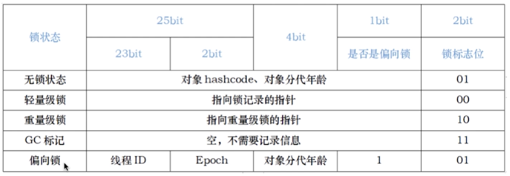

Monitor：每个Java对象天生自带了一把看不见的锁

synchronized即为重量级锁，上面指向重量级锁的指针指向monitor对象的起始地址，每个对象都存在一个monitor与之关联。对象与monitor的关系存在多种实现方式：如monitor可以和对象一起创建销毁，或当线程试图获取对象锁时自动生成。但当monitor被某个线程持有之后，它便处于锁定状态。

Java中是由Hotspot中的ObjectMonitor实现的，即[ObjectMonitor.hpp](https://hg.openjdk.java.net/jdk8/jdk8/hotspot/file/87ee5ee27509/src/share/vm/runtime/objectMonitor.hpp)

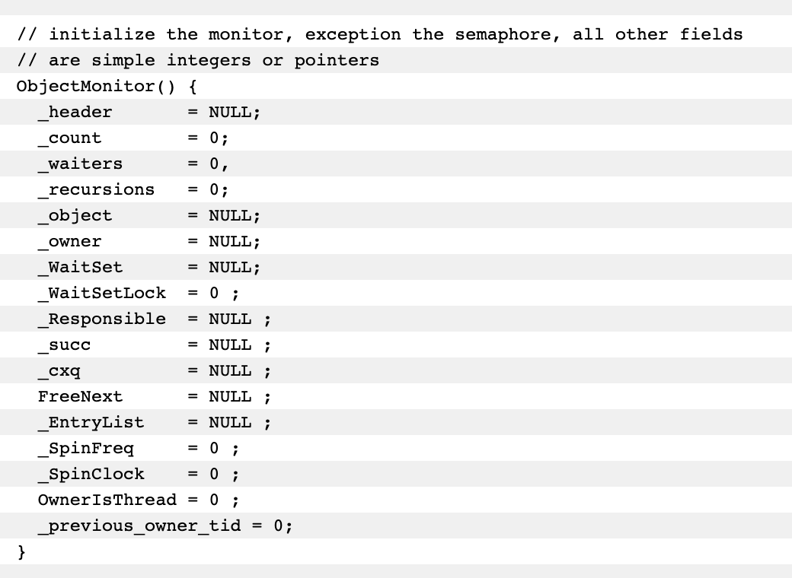

为什么会对monitor嗤之以鼻 -- 早期版本中，synchronized属于重量级锁，它依赖于操作系统底层的Mutex Lock实现，而操作系统之间的线程切换时需要从用户态转换到内核态，开销较大

Java6之后，synchronized性能得到了很大的提升：

- adaptive spinning 
- lock eliminate -- JIT编译时，对运行上下文进行扫描，去除不可能存在竞争的锁
- lock coarsening
- lightweight locking 
- biased locking 

synchronized的四种状态：

1. 无锁
2. 偏向锁
3. 轻量级锁
4. 重量级锁

偏向锁：减少同一线程获取锁的代价

大多数情况下，锁不存在多线程竞争，总是由同一线程多次获得。不适合锁竞争比较激烈的多线程场合。

核心思想：

如果一个线程获得了锁，那么锁就进入偏向模式，此时Mark word的结构也变为偏向锁结构，当该线程再次请求锁时，无需再做任何同步操作，即获取锁的过程只需要检查Mark Word的锁标记位为偏向锁以及当前线程Id等于Mark Word的treadId即可，这样就省去了有关锁申请的操作（比如CAS的操作）。 

轻量级锁：轻量级锁是由偏向锁升级来的，偏向锁运行在一个线程进入同步块的情况下，当第二个线程加入锁争用的时候，偏向锁就会升级为轻量级锁。适应于线程交替执行同步块。

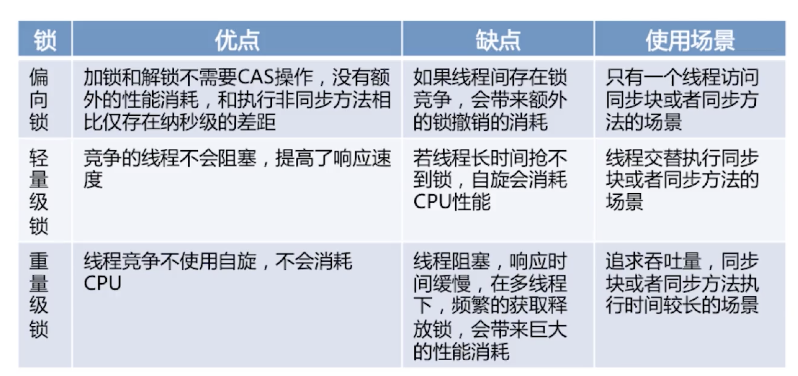


## 受保护资源和锁之间合理的关联关系应该是 N:1 的关系
1. 保护没有关联关系的多个资源   
	相关的示例代码如下，账户类 Account 有两个成员变量，分别是账户余额 balance 和账户密码 password。取款 withdraw() 和查看余额 getBalance() 操作会访问账户余额 balance，我们创建一个 final 对象 balLock 作为锁（类比球赛门票）；而更改密码 updatePassword() 和查看密码 getPassword() 操作会修改账户密码 password，我们创建一个 final 对象 pwLock 作为锁（类比电影票）。不同的资源用不同的锁保护，各自管各自的，很简单。
	
	```
	class Account {
	  private final Object balLock = new Object();
	  private Integer balance;
	  private final Object pwLock = new Object();
	  private String password;

	  void withdraw(Integer amt) {
	    synchronized(balLock) {
	      if (this.balance > amt){
	        this.balance -= amt;
	      }
	    }
	  } 

	  Integer getBalance() {
	    synchronized(balLock) {
	      return balance;
	    }
	  }
	

	  void updatePassword(String pw){
	    synchronized(pwLock) {
	      this.password = pw;
	    }
	  } 

	  String getPassword() {
	    synchronized(pwLock) {
	      return password;
	    }
	  }
	}
	```
	当然，我们也可以用一把互斥锁来保护多个资源，例如我们可以用 this 这一把锁来管理账户类里所有的资源：账户余额和用户密码。具体实现很简单，示例程序中所有的方法都增加同步关键字 synchronized 就可以了，这里我就不一一展示了。但是用一把锁有个问题，就是性能太差，会导致取款、查看余额、修改密码、查看密码这四个操作都是串行的。而我们用两把锁，取款和修改密码是可以并行的。**用不同的锁对受保护资源进行精细化管理，能够提升性能。这种锁还有个名字，叫细粒度锁。**
	
2. 保护有关联关系的多个资源   
	例如银行业务里面的转账操作，账户 A 减少 100 元，账户 B 增加 100 元。这两个账户就是有关联关系的。那对于像转账这种有关联关系的操作，我们应该怎么去解决呢？先把这个问题代码化。我们声明了个账户类：Account，该类有一个成员变量余额：balance，还有一个用于转账的方法：transfer()，然后怎么保证转账操作 transfer() 没有并发问题呢？
	
	```
	class Account {
	  private int balance;

	  void transfer(Account target, int amt){
	    if (this.balance > amt) {
	      this.balance -= amt;
	      target.balance += amt;
	    }
	  } 
	}
	```
	用 synchronized 关键字修饰一下 transfer() 方法就可以了?问题就出在 this 这把锁上，this 这把锁可以保护自己的余额 this.balance，却保护不了别人的余额 target.balance，就像你不能用自家的锁来保护别人家的资产，也不能用自己的票来保护别人的座位一样。
	
	一种简单的解决方案就是让两个对象共享同一把锁，比如：
	
	```	
	class Account {
	  private Object lock；
	  private int balance;
	  private Account();
	  // 创建Account时传入同一个lock对象
	  public Account(Object lock) {
	    this.lock = lock;
	  } 

	  void transfer(Account target, int amt){
	    synchronized(lock) {
	      if (this.balance > amt) {
	        this.balance -= amt;
	        target.balance += amt;
	      }
	    }
	  }
	}
	```
	- 改进1   
	但是该方案缺乏实践的可行性。一种更好的方案是用 Account.class 作为共享的锁。Account.class 是所有 Account 对象共享的，而且这个对象是 Java 虚拟机在加载 Account 类的时候创建的，所以我们不用担心它的唯一性。
	- 改进2   
		虽然上述方案不存在并发问题，但是所有账户的转账操作都是串行的。用两把锁就实现了，转出账本一把，转入账本另一把。在 transfer() 方法内部，我们首先尝试锁定转出账户 this（先把转出账本拿到手），然后尝试锁定转入账户 target（再把转入账本拿到手），只有当两者都成功时，才执行转账操作。
		
		```
		class Account {
		  private int balance;

		  void transfer(Account target, int amt){
		    synchronized(this) {              
		      synchronized(target) {           
		        if (this.balance > amt) {
		          this.balance -= amt;
		          target.balance += amt;
		        }
		      }
		    }
		  } 
		}
		```
	- 改进3   
		使用细粒度锁是有代价的，这个代价就是可能会导致死锁。如何预防死锁？只有以下这四个条件都发生时才会出现死锁：
		1. 互斥，共享资源 X 和 Y 只能被一个线程占用；
		2. 占有且等待，线程 T1 已经取得共享资源 X，在等待共享资源 Y 的时候，不释放共享资源 X；
		3. 不可抢占，其他线程不能强行抢占线程 T1 占有的资源；
		4. 循环等待，线程 T1 等待线程 T2 占有的资源，线程 T2 等待线程 T1 占有的资源，就是循环等待。  
		 
		也就是说只要我们破坏其中一个，就可以成功避免死锁的发生。互斥这个条件我们没有办法破坏，因为我们用锁为的就是互斥。不过其他三个条件都是有办法破坏掉的，到底如何做呢？
		
		1. 对于“占用且等待”这个条件，我们可以一次性申请所有的资源，这样就不存在等待了。账户 Account 类里面持有一个 Allocator 的单例（必须是单例，只能由一个人来分配资源）。当账户 Account 在执行转账操作的时候，首先向 Allocator 同时申请转出账户和转入账户这两个资源，成功后再锁定这两个资源；当转账操作执行完，释放锁之后，我们需通知 Allocator 同时释放转出账户和转入账户这两个资源。具体的代码实现如下。
			
			```
			
			class Allocator {
			  private List<Object> als =
			    new ArrayList<>();
			  // 一次性申请所有资源
			  synchronized boolean apply(Object from, Object to){
			    if(als.contains(from) || als.contains(to)){
			      return false;  
			    } else {
			      als.add(from);
			      als.add(to);  
			    }
			    return true;
			  }
			  // 归还资源
			  synchronized void free(
			    Object from, Object to){
			    als.remove(from);
			    als.remove(to);
			  }
			}
			
			class Account {
			  // actr应该为单例
			  private Allocator actr;
			  private int balance;
			  // 转账
			  void transfer(Account target, int amt){
			    // 一次性申请转出账户和转入账户，直到成功
			    while(!actr.apply(this, target))
			      ；
			    try{
			      // 锁定转出账户
			      synchronized(this){              
			        // 锁定转入账户
			        synchronized(target){           
			          if (this.balance > amt){
			            this.balance -= amt;
			            target.balance += amt;
			          }
			        }
			      }
			    } finally {
			      actr.free(this, target)
			    }
			  } 
			}
			```
			但是如果 apply() 操作耗时长，或者并发冲突量大的时候，循环等待这种方案就不适用了，因为在这种场景下，可能要循环上万次才能获取到锁，太消耗 CPU 了。进一步改进：**用 synchronized 实现等待 - 通知机制**    
			wait()、notify()、notifyAll() 方法操作的等待队列是互斥锁的等待队列，所以如果 synchronized 锁定的是 this，那么对应的一定是 this.wait()、this.notify()、this.notifyAll()；如果 synchronized 锁定的是 target，那么对应的一定是 target.wait()、target.notify()、target.notifyAll() 。而且 wait()、notify()、notifyAll() 这三个方法能够被调用的前提是已经获取了相应的互斥锁，所以我们会发现 wait()、notify()、notifyAll() 都是在 synchronized{}内部被调用的。如果在 synchronized{}外部调用，或者锁定的 this，而用 target.wait() 调用的话，JVM 会抛出一个运行时异常：java.lang.IllegalMonitorStateException。
		2. 对于“不可抢占”这个条件，占用部分资源的线程进一步申请其他资源时，如果申请不到，可以主动释放它占有的资源，这样不可抢占这个条件就破坏掉了。   
			synchronized 没有办法解决。原因是 synchronized 申请资源的时候，如果申请不到，线程直接进入阻塞状态了，而线程进入阻塞状态，啥都干不了，也释放不了线程已经占有的资源。但我们希望的是：对于“不可抢占”这个条件，占用部分资源的线程进一步申请其他资源时，如果申请不到，可以主动释放它占有的资源，这样不可抢占这个条件就破坏掉了。   
			如果我们重新设计一把互斥锁去解决这个问题，那该怎么设计呢？我觉得有三种方案。
			1. 能够响应中断。synchronized 的问题是，持有锁 A 后，如果尝试获取锁 B 失败，那么线程就进入阻塞状态，一旦发生死锁，就没有任何机会来唤醒阻塞的线程。但如果阻塞状态的线程能够响应中断信号，也就是说当我们给阻塞的线程发送中断信号的时候，能够唤醒它，那它就有机会释放曾经持有的锁 A。这样就破坏了不可抢占条件了。
			2. 支持超时。如果线程在一段时间之内没有获取到锁，不是进入阻塞状态，而是返回一个错误，那这个线程也有机会释放曾经持有的锁。这样也能破坏不可抢占条件。
			3. 非阻塞地获取锁。如果尝试获取锁失败，并不进入阻塞状态，而是直接返回，那这个线程也有机会释放曾经持有的锁。这样也能破坏不可抢占条件。
			
			```
			// 支持中断的API
			void lockInterruptibly() throws InterruptedException;
			// 支持超时的API
			boolean tryLock(long time, TimeUnit unit) throws InterruptedException;
			// 支持非阻塞获取锁的API
			boolean tryLock();
			```
		3. 对于“循环等待”这个条件，可以靠按序申请资源来预防。所谓按序申请，是指资源是有线性顺序的，申请的时候可以先申请资源序号小的，再申请资源序号大的，这样线性化后自然就不存在循环了。
		
			```
			class Account {
			  private int id;
			  private int balance;
			  // 转账
			  void transfer(Account target, int amt){
			    Account left = this        ①
			    Account right = target;    ②
			    if (this.id > target.id) { ③
			      left = target;           ④
			      right = this;            ⑤
			    }                          ⑥
			    // 锁定序号小的账户
			    synchronized(left){
			      // 锁定序号大的账户
			      synchronized(right){ 
			        if (this.balance > amt){
			          this.balance -= amt;
			          target.balance += amt;
			        }
			      }
			    }
			  } 
			}
			```
我们可以总结出这样一个基本的原则：**锁，应是私有的、不可变的、不可重用的。**

```
// 普通对象锁
private final Object 
  lock = new Object();
// 静态对象锁
private static final Object
  lock = new Object(); 
```	
## synchronized 与 lock的区别，使用场景


Lock与内置加锁机制不同的是，lock提供了一种无条件的、可轮询的、定时的以及可中断的锁获取操作，所有加锁和解锁的方法都是显式的。

相同点：

- 提供了与synchronized相同的互斥性和内存可见性。
- 有着与进入同步代码块和退出同步代码块相同的内存语义。
- 也提供了可重入的加锁语义。

区别：

- lock优点：
	- 可定时和可轮询的锁获取模式
	- 可中断的锁获取操作
	- 非块结构的加锁
	- 可实现公平锁
	- 锁绑定多个条件
	
- synchronized优点：
	- 内置锁为很多开发人员所熟悉，并且简单紧凑
	- 在线程转储中能给出在哪些调用帧中获得了哪些锁
	- 未来更可能提升synchronized而不是ReentrantLock的性能。因为synchronized是JVM的内置属性，它能执行一些优化。

## 自旋锁和一般锁的区别是什么？为什么要使用自旋锁？

从线程状态来看，自旋锁的状态是运行-运行-运行。而非自旋锁的状态是运行---阻塞---运行，所以自旋锁会更高效。

> 那么在Java中如何去实现一个自旋锁

```
public class SpinLock {
    private AtomicReference<Thread> cas = new AtomicReference<Thread>();
    public void lock() {
        Thread current = Thread.currentThread();
        // 利用CAS
        while (!cas.compareAndSet(null, current)) {
            // DO 
        }
    }
    public void unlock() {
        Thread current = Thread.currentThread();
        cas.compareAndSet(current, null);
    }
}
```

**自旋锁有哪些优点？**

1. 因为运行在用户态，没有上下文的线程状态切换，线程一直处于active，减少了不必要的上下文切换，从而执行速度较快
2. 因为非自旋锁在没有获取锁的情况下会进入阻塞状态，从而进入内核态，此时就需要线程的上下文切换，因为阻塞后进入内核调度状态，会导致用户态和内核态之间的切换，影响锁的性能。

#### 8 volatile关键字的作用，与synchronized关键字的不同

volatile保证线程可见性。当一个线程修改了变量的值，新的值会立刻同步到主内存中。而其他线程读取这个变量的时候，也会从主内存中拉取最新的变量值。这得益于Java的happens-before原则。定义：在计算机科学中，先行发生原则是两个事件的结果之间的关系，如果一个事件发生在另一个事件之前，结果必须反映，即使这些事件实际上是乱序执行的（通常是优化程序流程）。

先行发生原则作用于很多场景下，包括同步锁、线程启动、线程终止、volatile。

我们这里只列举出volatile相关的规则：

对于一个volatile变量的写操作先行发生于后面对这个变量的读操作。

但volatile只能保证变量的可见性，并不能保证变量的原子性。

什么时候适合用volatile呢?

1. 运行结果并不依赖变量的当前值，或者能够确保只有单一的线程修改变量的值。（比如10个线程自增100次，值并不是1000，很可能小于1000）
2. 变量不需要与其他的状态变量共同参与不变约束。

	```
	volatile static int start = 3;
	volatile static int end = 6;
	
	
	线程A执行如下代码：
	
	while (start < end){
	//do something
	}
	
	线程B执行如下代码：
	start+=3;
	end+=3;
	
	这种情况下，一旦在线程A的循环中执行了线程B，start有可能先更新成6，造成了一瞬间 start == end，从而跳出while循环的可能性。
	```
	
什么是指令重排？
指令重排是指JVM在编译Java代码的时候，或者CPU在执行JVM字节码的时候，对现有的指令顺序进行重新排序。指令重排的目的是为了在不改变程序执行结果的前提下，优化程序的运行效率。需要注意的是，这里所说的不改变执行结果，指的是不改变单线程下的程序执行结果。

在一个变量被volatile修饰后，JVM会为我们做两件事：

1. 在每个volatile写操作前插入StoreStore屏障，在写操作后插入StoreLoad屏障。
2. 在每个volatile读操作前插入LoadLoad屏障，在读操作后插入LoadStore屏障。

内存屏障和happens-before规则之间的关系是什么？

happens-before是JSR-133规范之一，内存屏障是CPU指令。可以简单认为前者是最终目的，后者是实现手段。

volatile特性之一：保证变量在线程之间的可见性。可见性的保证是基于CPU的内存屏障指令，被JSR-133抽象为happens-before原则。

volatile特性之二：阻止编译时和运行时的指令重排。编译时JVM编译器遵循内存屏障的约束，运行时依靠CPU屏障指令来阻止重排。

## 线程池的理解

### 线程池原理
线程池做的工作主要是控制运行的线程的数量，处理过程中将任务放入队列，然后在线程创建后启动这些任务，如果线程数量超过了最大数量超出数量的线程排队等候，等其它线程执行完毕，再从队列中取出任务来执行。他的主要特点为：

- 线程复用--通过重复利用已创建的线程降低线程创建和销毁造成的消耗；
- 管理线程, 控制最大并发数--线程是稀缺资源，如果无限制的创建，不仅会消耗系统资源，还会降低系统的稳定性， 使用线程池可以进行统一的分配，调优和监控；
- 提高响应速度--当任务到达时，任务可以不需要的等到线程创建就能立即执行。**

### 线程复用
每一个Thread 的类都有一个start 方法。当调用start启动线程时Java虚拟机会调用该类的run 方法。那么该类的run() 方法中就是调用了Runnable 对象的run() 方法。我们可以继承重写Thread 类，在其start 方法中添加不断循环调用传递过来的Runnable 对象。这就是线程池的实现原理。循环方法中不断获取Runnable 是用Queue 实现的，在获取下一个Runnable 之前可以是阻塞的

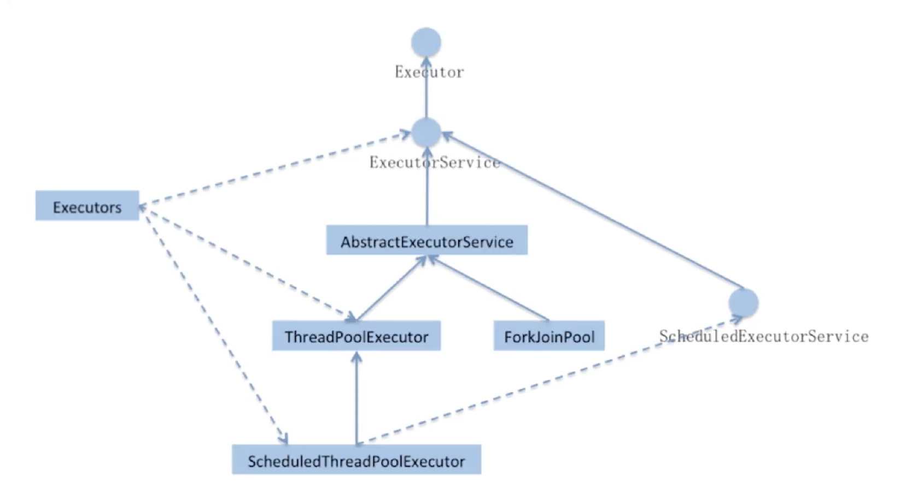
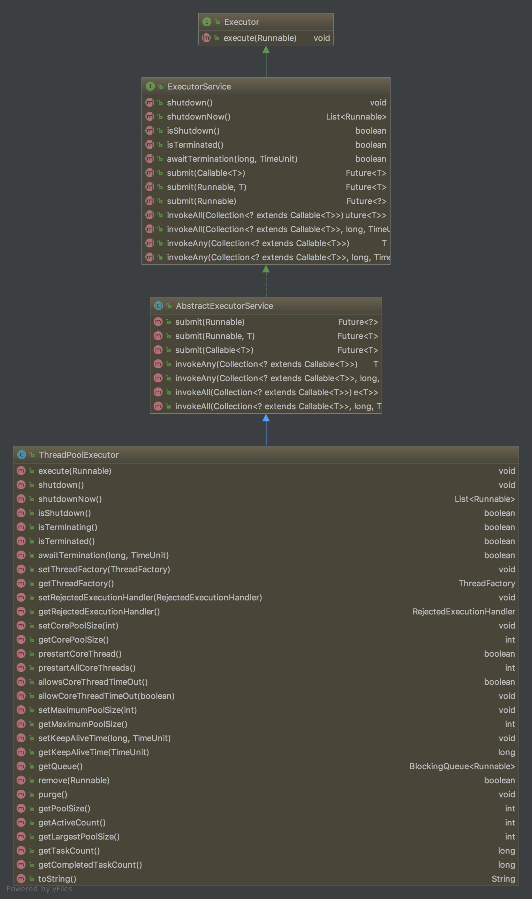

1. Executor: 运行新任务的简单接口，将任务提交和任务执行细节解耦
2. ExecutorService: 具备管理执行器和和任务生命周期的方法，提交任务机制更完善
3. AbstractExecutorService
	
	```
	public Future<?> submit(Runnable task) {
        if (task == null) throw new NullPointerException();
        RunnableFuture<Void> ftask = newTaskFor(task, null);
        execute(ftask);
        return ftask;
    }
	```

4. **ThreadPoolExecutor的execute()**方法的执行逻辑（任务提交给线程池后被执行的整个过程）:

	1. 如果当前线程池中的数目小于corePoolSize,则每来一个任务创建线程，即使线程池中的其他线程是闲置的。
	2. 如果>=corePooleSize,则尝试将其添加到任务缓冲队列中，若添加成功，则该任务会等待空闲线程将其取出执行；若添加失败，则会尝试创建新的线程去执行。
	3. 如果当前线程池中的线程数据达到maximumPoolSize, 则会采取任务拒绝策略。
	4. 如果线程池中的线程数目大于corePoolSize时，如果某线程空闲时间超过keepAliveTime，线程将被终止，直至<=corePoolSize.如果允许为核心线程池设置存活时间，那么核心池中的线程空闲时间超过KeepAliveTime，线程也会被终止。

5. ScheduledExecutorService: 支持Future和定期执行任务

任务缓存队列及排队策略：
- ArrayBlockingQueue: 队列创建时必须指明大小
- LinkedBlockingQueue: 创建时没有指定队列大小，则默认为Integer.MAX_VALUE
- synchronousQueue: 它不会保存提交的任务，而是直接新建一个线程来执行新来的任务。

任务拒绝策略：

- ThreadPoolExecutor.AbortPolicy
- ThreadPoolExecutor.DiscardPolicy
- hreadPoolExecutor.DiscardOldestPolicy
- hreadPoolExecutor.CallerRunsPolicy--用调用者所在的线程来执行任务 

在ThreadPoolExecutor类中有几个非常重要的方法：

- execute()实际上是Executor中声明的方法，它向线程池提交一个任务，交由线程池去执行

《阿里巴巴Java开发手册》中强制线程池不允许使用 Executors 去创建，而是通过 ThreadPoolExecutor 的方式，这样的处理方式让写的同学更加明确线程池的运行规则，规避资源耗尽的风险:
> Executors 返回线程池对象的弊端如下:
FixedThreadPool 和 SingleThreadExecutor : 允许请求的队列长度为 Integer.MAX_VALUE,可能堆积 大量的请求，从而导致OOM。   
CachedThreadPool 和 ScheduledThreadPool : 允许创建的线程数量为 Integer.MAX_VALUE ，可能 会创建大量线程，从而导致OOM。

### 线程池的大小如何选择

1. CPU密集型:线程数=按照核数或者核数+1
2. IO密集型：线程数=CPU核数*（1+平均等待时间/平均工作时间）

### 什么是FutureTask?
1. FutureTask可⽤于异步获取执⾏结果或取消执⾏任务的场景。通过传⼊Runnable或者Callable的任务给FutureTask，直接调⽤其run⽅法或者放入线程池执⾏，之后可以在外部通过FutureTask的get方法异步获取执⾏结果，因此，FutureTask⾮常适合⽤于耗时的计算，主线程可以在完成⾃己的任务后，再去获取结果。另外，FutureTask还可以确保即使调⽤了多次run⽅法，它都只会执⾏一次Runnable或者Callable任务，或者通过cancel取消FutureTask的执⾏等。2、futuretask可⽤于执⾏多任务、以及避免⾼并发情况下多次创建数据机锁的出现。

## 进程 线程 协程

### 进程和线程的区别

进程是资源分配的最小单位，线程是CPU调度的最小单位

1. 所有与进程有关的资源，都被记录在PCB中
2. 进程是抢占处理机的调度单位，线程属于某个进程，共享其资源
3. 线程只由堆栈寄存器、程序计数器和TCB组成

区别总结：

1. 线程不能看做独立的应用，而进程可以看做独立应用
2. 进程有独立的地址空间，相互不影响，线程只是进程的不同执行路径
3. 线程没有独立的地址空间，多进程的程序比多线程程序更健壮
4. 进程切换比线程的切换开销大。

并发

一个cpu上能同时执行多项任务，在很短时间内，cpu来回切换任务执行(在某段很短时间内执行程序a，然后又迅速得切换到程序b去执行)，有时间上的重叠（宏观上是同时的，微观仍是顺序执行）,这样看起来多个任务像是同时执行，这就是并发。

并行

当系统有多个CPU时,每个CPU同一时刻都运行任务，互不抢占自己所在的CPU资源，同时进行，称为并行。

进程

cpu在切换程序的时候，如果不保存上一个程序的状态（也就是我们常说的context--上下文），直接切换下一个程序，就会丢失上一个程序的一系列状态，于是引入了进程这个概念，用以划分好程序运行时所需要的资源。因此进程就是一个程序运行时候的所需要的基本资源单位（也可以说是程序运行的一个实体）。

线程

cpu切换多个进程的时候，会花费不少的时间，因为切换进程需要切换到内核态，而每次调度需要内核态都需要读取用户态的数据，进程一旦多起来，cpu调度会消耗一大堆资源，因此引入了线程的概念，线程本身几乎不占有资源，他们共享进程里的资源，内核调度起来不会那么像进程切换那么耗费资源。

协程

协程拥有自己的寄存器上下文和栈。协程调度切换时，将寄存器上下文和栈保存到其他地方，在切回来的时候，恢复先前保存的寄存器上下文和栈。因此，协程能保留上一次调用时的状态（即所有局部状态的一个特定组合），每次过程重入时，就相当于进入上一次调用的状态，换种说法：进入上一次离开时所处逻辑流的位置。线程和进程的操作是由程序触发系统接口，最后的执行者是系统；协程的操作执行者则是用户自身程序. 支持协程的语言有：Golang, Python, Lua, Kotlin。下面我们看看Golang 中的goroutine。

调度模型简介
groutine能拥有强大的并发实现是通过GPM调度模型实现，下面就来解释下goroutine的调度模型。

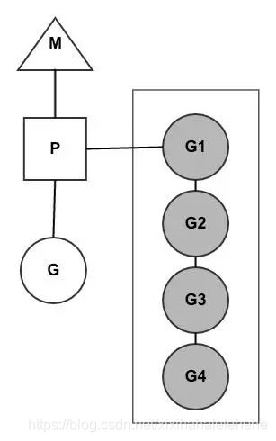

支撑整个调度器的主要有4个重要结构，分别是M、G、P、Sched，前三个定义在runtime.h中，Sched定义在proc.c中

- M：是内核线程
- P : 是调度协调，用于协调M和G的执行，内核线程只有拿到了P才能对goroutine继续调度执行，一般都是通过限定P的个数来控制golang的并发度，P的数量可以通过GOMAXPROCS()来设置，它其实也就代表了真正的并发度，即有多少个goroutine可以同时运行。   
图中灰色的那些goroutine并没有运行，而是出于ready的就绪态，正在等待被调度。P维护着这个队列（称之为runqueue），Go语言里，启动一个goroutine很容易：go function 就行，所以每有一个go语句被执行，runqueue队列就在其末尾加入一个   	
goroutine，在下一个调度点，就从runqueue中取出（如何决定取哪个goroutine？）一个goroutine执行。
- G : 是待执行的goroutine，包含这个goroutine的栈空间
- Gn : 灰色背景的Gn 是已经挂起的goroutine，它们被添加到了执行队列中，然后需要等待网络IO的goroutine，当P通过 epoll查询到特定的fd的时候，会重新调度起对应的，正在挂起的goroutine。
Golang为了调度的公平性，在调度器加入了steal working 算法 ，在一个P自己的执行队列，处理完之后，它会先到全局的执行队列中偷G进行处理，如果没有的话，再会到其他P的执行队列中抢G来进行处理。

当一个OS线程M0陷入阻塞时（如下图)，P转而在运行M1，图中的M1可能是正被创建，或者从线程缓存中取出。

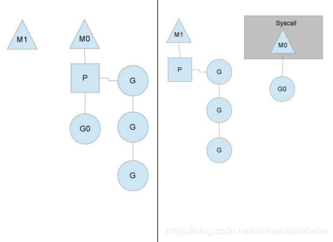

当MO返回时，它必须尝试取得一个P来运行goroutine，一般情况下，它会从其他的OS线程那里拿一个P过来，
如果没有拿到的话，它就把goroutine放在一个global runqueue里，然后自己睡眠（放入线程缓存里）。所有的P也会周期性的检查global runqueue并运行其中的goroutine，否则global runqueue上的goroutine永远无法执行。

另一种情况是P所分配的任务G很快就执行完了（分配不均），这就导致了这个处理器P很忙，但是其他的P还有任务，此时如果global runqueue没有任务G了，那么P不得不从其他的P里拿一些G来执行。一般来说，如果P从其他的P那里要拿任务的话，一般就拿run queue的一半，这就确保了每个OS线程都能充分的使用，如下图：	

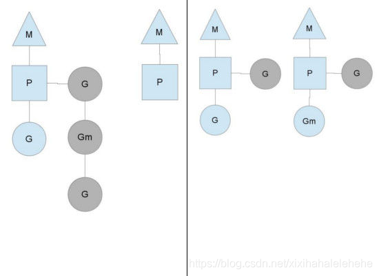

goroutine相比于线程，有个特点，那就是非抢占式，如果一个协程占据了线程，不主动释放或者没有发生阻塞的话，那么永远不会交出线程的控制权

Printf其实是个io操作，io操作会阻塞，阻塞的时候goroutine就会自动的释放出对线程的占有，所以其他的goroutine才有执行的机会，除了io阻塞，golang还提供了一个api，让我们可以手动交出控制权，那就是Gosched()，当我们调用这个方法时，goroutine就会主动释放出对线程的控制权

常见的触发goroutine切换，有一下几种情况

1. I/O,select
2. channel
3. 等待锁
4. 函数调用（是一个切换的机会，是否会切换由调度器决定）
5. runtime.Gosched()

### CSP模型
说完了goroutine的基本用法，接下来我们说一下goroutine之间的通信，Go中通信的理念是**“不要通过共享数据来通信，而是通过通信来共享数据“**，Go中实现通信主要通过channel，它类似于unix shell中的双向管道，可以接受和发送数据，我们来看个例子，

```
package main
  
import(
        "fmt"
        "time"
)

func main(){
        c := make(chan int)
        go func(){
           for{
                n := <-c;
                fmt.Printf("%d",n)
              }
        }()

        c <- 1;
        c <- 2;
        time.Sleep(time.Millisecond);


}
```

打印结果为12,我们通过make来创建channel类型，并指明存放的数据类型，通过 <-来接收和发送数据，c <- 1为向channel c发送数据1，n := <-c;表示从channel c接收数据，默认情况下，发送数据和接收数据都是阻塞的，这很容易让我们写出同步的代码，因为阻塞，所以会很容易发生goroutine的切换，并且，数据被发送后一定要被接收，不然会一直阻塞下去，程序会报错退出

本例中，首先向c发送数据1，main goroutine阻塞，执行开辟的协程，从而读到数据，打印数据，然后main协程阻塞完成，向c发送第二个数据2，开辟的协程还在阻塞读取数据，成功读取到数据2时，打印2，一秒钟后，主函数退出，所有goroutine销毁，程序退出

我们仔细看这份代码，其实有个问题，在开辟的goroutine中，我们一直再循环阻塞的读取c中的数据，并不知道c什么时候写入完成，不再写入，如果c不再写入我们完全可以销毁这个goroutine，不必占有资源，通过close api我们可以完成这一任务，

```
package main
  
import (
        "fmt"
        "time"
)

func main(){
        c := make(chan int);
        go func(){
            for{
                p,ok := <-c;
                if(!ok){
                        fmt.Printf("jieshu");
                        return
                }
                fmt.Printf("%d",p);
               }
        }()
        for i := 0;i<10;i++{
                c<-i
        }
        close(c);
}
```
当我们对channel写入完成后，可以调用close方法来显式的告诉接收方对channel的写入已经完毕，这是，在接收的时候我们可以根据接收的第二个值，一个boolean值来判断是否完成写入，如果为false的话，表示此channel已经关闭，我们没有必要继续对channel进行阻塞的读，
除了判断第二个boolean参数，go还提供了range来对channel进行循环读取，当channel被关闭时就会退出循环，

```
package main
  
import (
        "fmt"
        "time"
)

func main(){
        c := make(chan int);
        go func(){
        //    for{
        //      p,ok := <-c;
        //      if(!ok){
        //              fmt.Printf("jieshu");
        //              return
        //      }
                for p := range c{
                        fmt.Printf("%d",p);
                }
                fmt.Printf("jieshu");
        //   }
        }()
        for i := 0;i<10;i++{
               c<-i
        }
        close(c);
        time.Sleep(time.Millisecond);

}
```
两种方式打印的都是123456789jieshu

另外，通过Buffered Channels我们可以创建带缓存的channel，使用方法为创建channel时传入第二个参数，指明缓存的数量，

```
package main

import "fmt"

func main() {
    c := make(chan int, 2)//修改2为1就报错，修改2为3可以正常运行
    c <- 1
    c <- 2
    fmt.Println(<-c)
    fmt.Println(<-c)
}
```
例子中，我们创建channel时，传入参数2，便可以存储两个两个数据，前两个数据的写入可以无阻塞的，不需要等待数据被读出，如果我们连续写入三个数据，就会报错，阻塞在第三个数据的写入出无法进行下一步

最后，我们说一下select，这个和操作系统io模型中的select很像，先执行先到达的channel我们看个例子

```
package main
  
import (
        "fmt"
        "time"
)

func main(){

        c := make(chan int);
        c2:= make(chan int);

        go func(){
         for{
                select{
                        case p := <- c : fmt.Printf("c:%d\n",p);
                        case p2:= <- c2: fmt.Printf("c2:%d\n",p2);
                }
            }
        }()

        for i :=0;i<10;i++{
                go func(i int){
                        c <- i
                }(i)
                go func (i int){
                        c2 <-i
                }(i)
        }
        time.Sleep(5*time.Millisecond);
}
```
打印结果为

```
c:0
c2:1
c:1
c:2
c2:0
c:3
c:4
c:5
c:7
c2:2
c:6
c:8
c:9
c2:3
c2:5
c2:4
c2:6
c2:7
c2:8
c2:9
```
可以看到，c和c2的接收完全是随机的，谁先接收到执行谁的回调，当然这不仅限于接收，发送数据时也可以使用select函数，另外，和switch语句一样，golang中的select函数也支持设置default，当没有接收到值的时候就会执行default回调，如果没有设置default，就会阻塞在select函数处，直到某一个发送或者接收完成。

golang中 goroutine的基本使用就是这些，大家可以根据上面goroutine运行机制的文章和本文一起来体会golang的运行过程。

**补充一个runtime包的几个处理函数**

- Goexit
	退出当前执行的goroutine，但是defer函数还会继续调用
- Gosched
	让出当前goroutine的执行权限，调度器安排其他等待的任务运行，并在下次某个时候从该位置恢复执行。
- NumCPU
	返回 CPU 核数量
- NumGoroutine
	返回正在执行和排队的任务总数
- GOMAXPROCS
	用来设置可以并行计算的CPU核数的最大值，并返回之前的值。
	
## J.U.C
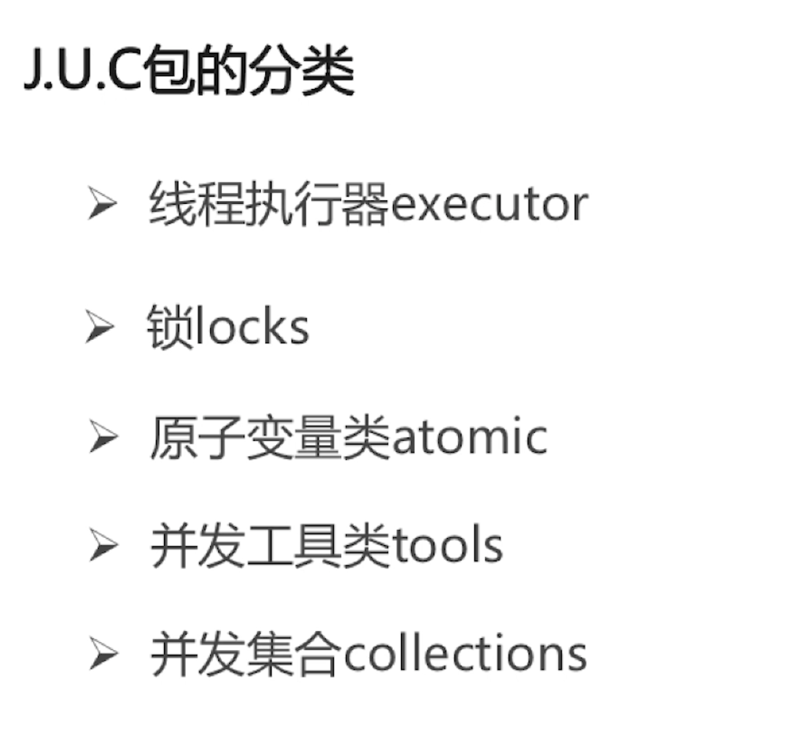

### AQS 
AQS的全称为(AbstractQueuedSynchronizer)，这个类在java.util.concurrent.locks包下面。

AQS是一个用来构建锁和同步器的框架，使用AQS能简单且高效地构造出应用广泛的大量的同步器，比如我们提到的 ReentrantLock，Semaphore，其他的诸如ReentrantReadWriteLock，SynchronousQueue，FutureTask等等皆是 基于AQS的。当然，我们自己也能利用AQS非常轻松容易地构造出符合我们自己需求的同步器。

#### AQS 框架


它维护了一个volatile int state（代表共享资源）和一个FIFO线程等待队列（多线程争用资源被阻塞时会进入此队列）。这里volatile是核心关键词，具体volatile的语义，在此不述。state的访问方式有三种:

- getState()
- setState()
- compareAndSetState()

AQS定义两种资源共享方式：Exclusive（独占，只有一个线程能执行，如ReentrantLock）和Share（共享，多个线程可同时执行，如Semaphore/CountDownLatch）。

不同的自定义同步器争用共享资源的方式也不同。自定义同步器在实现时只需要实现共享资源state的获取与释放方式即可，至于具体线程等待队列的维护（如获取资源失败入队/唤醒出队等），AQS已经在顶层实现好了。自定义同步器实现时主要实现以下几种方法：

- isHeldExclusively()：该线程是否正在独占资源。只有用到condition才需要去实现它。
- tryAcquire(int)：独占方式。尝试获取资源，成功则返回true，失败则返回false。
- tryRelease(int)：独占方式。尝试释放资源，成功则返回true，失败则返回false。
- tryAcquireShared(int)：共享方式。尝试获取资源。负数表示失败；0表示成功，但没有剩余可用资源；正数表示成功，且有剩余资源。
- tryReleaseShared(int)：共享方式。尝试释放资源，如果释放后允许唤醒后续等待结点返回true，否则返回false。

以ReentrantLock为例，state初始化为0，表示未锁定状态。A线程lock()时，会调用tryAcquire()独占该锁并将state+1。此后，其他线程再tryAcquire()时就会失败，直到A线程unlock()到state=0（即释放锁）为止，其它线程才有机会获取该锁。当然，释放锁之前，A线程自己是可以重复获取此锁的（state会累加），这就是可重入的概念。但要注意，获取多少次就要释放多么次，这样才能保证state是能回到零态的。

再以CountDownLatch以例，任务分为N个子线程去执行，state也初始化为N（注意N要与线程个数一致）。这N个子线程是并行执行的，每个子线程执行完后countDown()一次，state会CAS减1。等到所有子线程都执行完后(即state=0)，会unpark()主调用线程，然后主调用线程就会从await()函数返回，继续后余动作。

一般来说，自定义同步器要么是独占方法，要么是共享方式，他们也只需实现tryAcquire-tryRelease、tryAcquireShared-tryReleaseShared中的一种即可。但AQS也支持自定义同步器同时实现独占和共享两种方式，如ReentrantReadWriteLock。
　　
#### AQS 源码详解

依照acquire-release、acquireShared-releaseShared的次序来

##### 结点状态waitStatus

Node结点是对每一个等待获取资源的线程的封装，其包含了需要同步的线程本身及其等待状态，如是否被阻塞、是否等待唤醒、是否已经被取消等。变量waitStatus则表示当前Node结点的等待状态，共有5种取值CANCELLED、SIGNAL、CONDITION、PROPAGATE、0: 

- CANCELLED(1)：表示当前结点已取消调度。当timeout或被中断（响应中断的情况下），会触发变更为此状态，进入该状态后的结点将不会再变化。

- SIGNAL(-1)：表示后继结点在等待当前结点唤醒。后继结点入队时，会将前继结点的状态更新为SIGNAL。

- CONDITION(-2)：表示结点等待在Condition上，当其他线程调用了Condition的signal()方法后，CONDITION状态的结点将从等待队列转移到同步队列中，等待获取同步锁。

- PROPAGATE(-3)：共享模式下，前继结点不仅会唤醒其后继结点，同时也可能会唤醒后继的后继结点。

- 0：新结点入队时的默认状态。

注意，负值表示结点处于有效等待状态，而正值表示结点已被取消。所以源码中很多地方用>0、<0来判断结点的状态是否正常。

##### acquire(int)
此方法是独占模式下线程获取共享资源的顶层入口。如果获取到资源，线程直接返回，否则进入等待队列，直到获取到资源为止，且整个过程忽略中断的影响。这也正是lock()的语义，当然不仅仅只限于lock()。获取到资源后，线程就可以去执行其临界区代码了。下面是acquire()的源码：

```
public final void acquire(int arg) {
    if (!tryAcquire(arg) &&
        acquireQueued(addWaiter(Node.EXCLUSIVE), arg))
        selfInterrupt();
}

protected boolean tryAcquire(int arg) {
    throw new UnsupportedOperationException();
}

private Node addWaiter(Node mode) {
	//以给定模式构造结点。mode有两种：EXCLUSIVE（独占）和SHARED（共享）
    Node node = new Node(Thread.currentThread(), mode);
    //尝试快速方式直接放到队尾。
    Node pred = tail;
    if (pred != null) {
        node.prev = pred;
        if (compareAndSetTail(pred, node)) {
            pred.next = node;
            return node;
        }
    }
    //上一步失败则通过enq入队。
    enq(node);
    return node;
}

private Node enq(final Node node) {
	//CAS"自旋"，直到成功加入队尾
    for (;;) {
        Node t = tail;
        if (t == null) { // 队列为空，创建一个空的标志结点作为head结点，并将tail也指向它。
            if (compareAndSetHead(new Node()))
                tail = head;
        } else {//正常流程，放入队尾
            node.prev = t;
            if (compareAndSetTail(t, node)) {
                t.next = node;
                return t;
            }
        }
    }
}

final boolean acquireQueued(final Node node, int arg) {
    boolean failed = true;//标记是否成功拿到资源
    try {
        boolean interrupted = false;//标记等待过程中是否被中断过
        //又是一个“自旋”！
        for (;;) {
            final Node p = node.predecessor();//拿到前驱
            //如果前驱是head，即该结点已成老二，那么便有资格去尝试获取资源（可能是老大释放完资源唤醒自己的，当然也可能被interrupt了）。
            if (p == head && tryAcquire(arg)) {
                setHead(node);//拿到资源后，将head指向该结点。所以head所指的标杆结点，就是当前获取到资源的那个结点或null。
                p.next = null; // setHead中node.prev已置为null，此处再将head.next置为null，就是为了方便GC回收以前的head结点。也就意味着之前拿完资源的结点出队了！
                failed = false;/ 成功获取资源
                return interrupted;//返回等待过程中是否被中断过
            }
            //如果自己可以休息了，就通过park()进入waiting状态，直到被unpark()。如果不可中断的情况下被中断了，那么会从park()中醒过来，发现拿不到资源，从而继续进入park()等待。
            if (shouldParkAfterFailedAcquire(p, node) &&
                parkAndCheckInterrupt())
                interrupted = true;//如果等待过程中被中断过，哪怕只有那么一次，就将interrupted标记为true
        }
    } finally {
        if (failed)// 如果等待过程中没有成功获取资源（如timeout，或者可中断的情况下被中断了），那么取消结点在队列中的等待。
            cancelAcquire(node);
    }
}

private static boolean shouldParkAfterFailedAcquire(Node pred, Node node) {
    int ws = pred.waitStatus;//拿到前驱的状态
    if (ws == Node.SIGNAL)
        //如果已经告诉前驱拿完号后通知自己一下，那就可以安心休息了
        return true;
    if (ws > 0) {
        /*
         * 如果前驱放弃了，那就一直往前找，直到找到最近一个正常等待的状态，并排在它的后边。
         * 注意：那些放弃的结点，由于被自己“加塞”到它们前边，它们相当于形成一个无引用链，稍后就会被保安大叔赶走了(GC回收)！
         */
        do {
            node.prev = pred = pred.prev;
        } while (pred.waitStatus > 0);
        pred.next = node;
    } else {
         //如果前驱正常，那就把前驱的状态设置成SIGNAL，告诉它拿完号后通知自己一下。有可能失败，人家说不定刚刚释放完呢！
        compareAndSetWaitStatus(pred, ws, Node.SIGNAL);
    }
    return false;
}

private final boolean parkAndCheckInterrupt() {
    LockSupport.park(this);//调用park()使线程进入waiting状态
    return Thread.interrupted();//如果被唤醒，查看自己是不是被中断的。
}
```

函数流程如下：

1. tryAcquire()尝试直接去获取资源，如果成功则直接返回（这里体现了非公平锁，每个线程获取锁时会尝试直接抢占加塞一次，而CLH队列中可能还有别的线程在等待）；
2. 没成功，addWaiter()将该线程加入等待队列的尾部，并标记为独占模式；
3. acquireQueued()使线程在等待队列中休息，有机会时（轮到自己，会被unpark()）会去尝试获取资源。获取到资源后才返回。如果在整个等待过程中被中断过，则返回true，否则返回false。
4. 如果线程在等待过程中被中断过，它是不响应的。只是获取资源后才再进行自我中断selfInterrupt()，将中断补上。

**tryAcquire之所以没有定义成abstract，是因为独占模式下只用实现tryAcquire-tryRelease，而共享模式下只用实现tryAcquireShared-tryReleaseShared。如果都定义成abstract，那么每个模式也要去实现另一模式下的接口。说到底，Doug Lea还是站在咱们开发者的角度，尽量减少不必要的工作量。**

OK，通过tryAcquire()和addWaiter()，该线程获取资源失败，已经被放入等待队列尾部了。下一步该：进入等待状态休息，直到其他线程彻底释放资源后唤醒自己，自己再拿到资源，然后就可以去干自己想干的事了。简单说就是在等待队列中排队拿号（中间没其它事干可以休息），直到拿到号后再返回。


##### release(int)
上一小节已经把acquire()说完了，这一小节就来讲讲它的反操作release()吧。此方法是独占模式下线程释放共享资源的顶层入口。它会释放指定量的资源，如果彻底释放了（即state=0）,它会唤醒等待队列里的其他线程来获取资源。这也正是unlock()的语义，当然不仅仅只限于unlock()。下面是release()的源码：

```
public final boolean release(int arg) {
    if (tryRelease(arg)) {
        Node h = head;//找到头结点
        if (h != null && h.waitStatus != 0)
            unparkSuccessor(h);//唤醒等待队列里的下一个线程
        return true;
    }
    return false;
}

protected boolean tryRelease(int arg) {
    throw new UnsupportedOperationException();
}

private void unparkSuccessor(Node node) {
     //这里，node一般为当前线程所在的结点。
    int ws = node.waitStatus;
    if (ws < 0)//置零当前线程所在的结点状态，允许失败。
        compareAndSetWaitStatus(node, ws, 0);

    //找到下一个需要唤醒的结点s
    Node s = node.next;
    if (s == null || s.waitStatus > 0) {//如果为空或已取消
        s = null;
        for (Node t = tail; t != null && t != node; t = t.prev)// 从后向前找。
            if (t.waitStatus <= 0)//从这里可以看出，<=0的结点，都是还有效的结点。
                s = t;
    }
    if (s != null)
        LockSupport.unpark(s.thread);//唤醒
}
```

tryRelease()跟tryAcquire()一样，这个方法是需要独占模式的自定义同步器去实现的。正常来说，tryRelease()都会成功的，因为这是独占模式，该线程来释放资源，那么它肯定已经拿到独占资源了，直接减掉相应量的资源即可(state-=arg)，也不需要考虑线程安全的问题。但要注意它的返回值，上面已经提到了，release()是根据tryRelease()的返回值来判断该线程是否已经完成释放掉资源了！所以自义定同步器在实现时，如果已经彻底释放资源(state=0)，要返回true，否则返回false。

#### 应用

```
class Mutex implements Lock, java.io.Serializable {
    // 自定义同步器
    private static class Sync extends AbstractQueuedSynchronizer {
        // 判断是否锁定状态
        protected boolean isHeldExclusively() {
            return getState() == 1;
        }

        // 尝试获取资源，立即返回。成功则返回true，否则false。
        public boolean tryAcquire(int acquires) {
            assert acquires == 1; // 这里限定只能为1个量
            if (compareAndSetState(0, 1)) {//state为0才设置为1，不可重入！
                setExclusiveOwnerThread(Thread.currentThread());//设置为当前线程独占资源
                return true;
            }
            return false;
        }

        // 尝试释放资源，立即返回。成功则为true，否则false。
        protected boolean tryRelease(int releases) {
            assert releases == 1; // 限定为1个量
            if (getState() == 0)//既然来释放，那肯定就是已占有状态了。只是为了保险，多层判断！
                throw new IllegalMonitorStateException();
            setExclusiveOwnerThread(null);
            setState(0);//释放资源，放弃占有状态
            return true;
        }
    }

    // 真正同步类的实现都依赖继承于AQS的自定义同步器！
    private final Sync sync = new Sync();

    //lock<-->acquire。两者语义一样：获取资源，即便等待，直到成功才返回。
    public void lock() {
        sync.acquire(1);
    }

    //tryLock<-->tryAcquire。两者语义一样：尝试获取资源，要求立即返回。成功则为true，失败则为false。
    public boolean tryLock() {
        return sync.tryAcquire(1);
    }

    //unlock<-->release。两者语文一样：释放资源。
    public void unlock() {
        sync.release(1);
    }

    //锁是否占有状态
    public boolean isLocked() {
        return sync.isHeldExclusively();
    }
}
```

### 简单介绍一下 AtomicInteger 类的原理

```
// setup to use Unsafe.compareAndSwapInt for updates(更新操作时提供“比较并替换”的作用) 
private static final Unsafe unsafe = Unsafe.getUnsafe();
private static final long valueOffset;
static { 
	try {
		valueOffset = unsafe.objectFieldOffset 		(AtomicInteger.class.getDeclaredField("value"));
    } catch (Exception ex) { throw new Error(ex); }
}
private volatile int value;
```

AtomicInteger 类主要利用 CAS (compare and swap) + volatile 和 native 方法来保证原子操作，从而避免 synchronized 的高开销，执行效率大为提升。

CAS的原理是拿期望的值和原本的一个值作比较，如果相同则更新成新的值。UnSafe 类的 objectFieldOffset() 方法 是一个本地方法，这个方法是用来拿到“原来的值”的内存地址，返回值是 valueOffset。另外 value 是一个volatile变 量，在内存中可见，因此 JVM 可以保证任何时刻任何线程总能拿到该变量的最新值。

### 开发工具类

- CountDownLatch
- CyclicBarrier
- Semaphore
- Exchanger

### collections

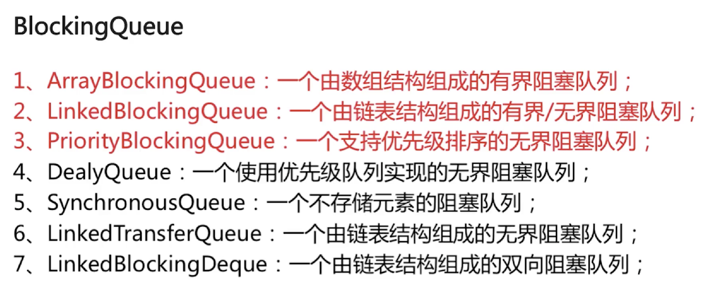

## ForkJoinPool

- ForkJoinPool 不是为了替代 ExecutorService，而是它的补充，在某些应用场景下性能比 ExecutorService 更好。
- ForkJoinPool 主要用于实现“分而治之”的算法，特别是分治之后递归调用的函数，例如 quick sort 等。
- ForkJoinPool 最适合的是计算密集型的任务，如果存在 I/O，线程间同步，sleep() 等会造成线程长时间阻塞的情况时，最好配合使用 ManagedBlocker。

<!--more-->

### demo

```
public class SumTask extends RecursiveTask {

    private static final int THRESHOLD = 100;
    private long[] array;
    private int start;
    private int end;

    public SumTask(long[] array, int start, int end) {
        this.array = array;
        this.start = start;
        this.end = end;
    }

    @Override
    protected Long compute() {
        if (end - start <= THRESHOLD) {
            long sum = 0;
            for (int i = start; i < end; i++) {
                sum += array[i];
            }
            try {
                Thread.sleep(1000);
            } catch (InterruptedException ignored) {
            }
            System.out.println(String.format("compute %d~%d = %d", start, end, sum));
            return sum;
        }

        int middle = (end + start) / 2;
        System.out.println(String.format("split %d~%d ==> %d~%d, %d~%d", start, end, start, middle, middle, end));
        SumTask subtask1 = new SumTask(this.array, start, middle);
        SumTask subtask2 = new SumTask(this.array, middle, end);
        invokeAll(subtask1, subtask2);
        Long subresult1 = (Long) subtask1.join();
        Long subresult2 = (Long) subtask2.join();
        Long result = subresult1 + subresult2;
        System.out.println("result = " + subresult1 + " + " + subresult2 + " ==> " + result);
        return result;
    }

    public static void main(String[] args) {
        long[] array = new long[400];
        fillRandom(array);

        ForkJoinPool fjp = new ForkJoinPool(4); // 最大并发数4
        ForkJoinTask<Long> task = new SumTask(array, 0, array.length);
        long startTime = System.currentTimeMillis();
        Long result = fjp.invoke(task);
        long endTime = System.currentTimeMillis();
        System.out.println("Fork/join sum: " + result + " in " + (endTime - startTime) + " ms.");
    }

    private static void fillRandom(long[] array) {
        for (int i = 0; i < array.length; i++) {
            array[i] = RandomUtils.nextInt(1, 100);
        }
    }
}
```

运行结果：

```
split 0~400 ==> 0~200, 200~400
split 0~200 ==> 0~100, 100~200
split 200~400 ==> 200~300, 300~400
compute 0~100 = 5380
compute 300~400 = 5024
compute 200~300 = 4797
compute 100~200 = 4939
result = 4797 + 5024 ==> 9821
result = 5380 + 4939 ==> 10319
result = 10319 + 9821 ==> 20140
Fork/join sum: 20140 in 1022 ms.
```

### 源码解析

ForkJoinPool在jdk1.7引入，在jdk1.8进行了优化，本文的源码基于jdk1.8最新版本。

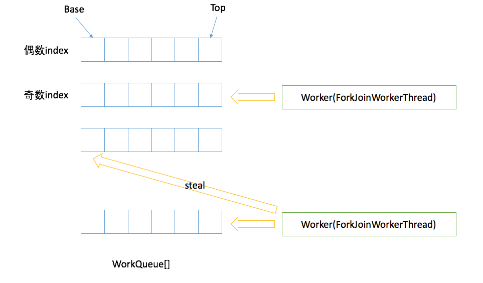

ForkJoinPool核心是work-stealing算法.

ForkJoinPool里有三个重要的角色：

- ForkJoinWorkerThread（下文简称worker）：包装Thread；
- WorkQueue：任务队列，双向；
- ForkJoinTask：worker执行的对象，实现了Future。两种类型，一种叫submission，另一种就叫task。

ForkJoinPool 中的 WorkQueue[] 偶数下标，存储的是外部提交的submission，没有worker；奇数下标，存储的是task,有自己的worker,所以在push，pop的时候不需要加锁。

worker 操作自己的WorkQueue是LIFO；steal其他WorkQueue里的任务是FIFO。

### JAVA Stream 中的parall

- 如果是CPU计算密集型的任务则推荐采用并行
- 如果是IO密集型或者是长时间执行会阻塞的任务时，则不推荐parallel。因为这样的阻塞会导致整个服务的block。

## ThreadLocal
### 原理
ThreadLocal 能在每个线程间进行隔离，其主要是靠在每个 Thread 对象中维护一个 ThreadLocalMap 来实现的。因为是线程中的对象，所以对其他线程不可见，从而达到隔离的目的。

那为什么是一个 Map 结构呢。主要是因为一个线程中可能有多个 ThreadLocal 对象，这就需要一个集合来进行存储区分，而用 Map 可以更快地查找到相关的对象。

ThreadLocalMap 是 ThreadLocal 对象的一个静态内部类，内部维护一个 Entry 数组，实现类似 Map 的 get 和 put 等操作，为简单起见，可以将其看做是一个 Map，其中 key 是 ThreadLocal 实例，value 是 ThreadLocal 实例对象存储的值。

### ThreadLocal为什么会发⽣内存泄漏？

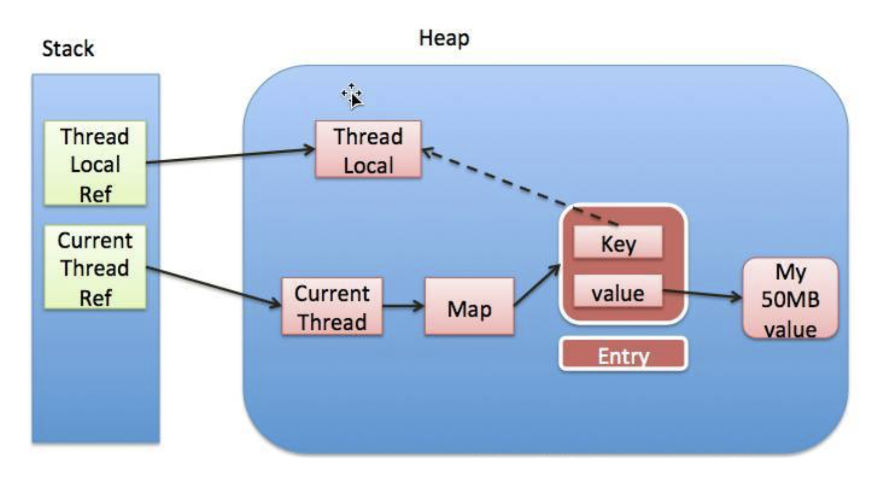

1. ThreadLocal的实现是这样的：每个Thread 维护一个 ThreadLocalMap 映射表，这个映射表的 key 是 ThreadLocal实例本身，value 是真正需要存储的 Object。
2. 也就是说 ThreadLocal 本身并不存储值，它只是作为一个 key 来让线程从 ThreadLocalMap 获取 value。值得注意的是图中的虚线，表示 ThreadLocalMap 是使用 ThreadLocal 的弱引用作为 Key 的，弱引⽤的对象在 GC 时会被回收。
3. ThreadLocalMap使⽤ThreadLocal的弱引⽤作为key，如果⼀个ThreadLocal没有外部强引用来引⽤它，那么系统 GC的时候，这个ThreadLocal势必会被回收，这样一来，ThreadLocalMap中就会出现key为null的Entry，就没有办法访问这些key为null的Entry的value，如果当前线程再迟不结束的话，这些key为null的Entry的value就会一直存在一条强引用链：Thread Ref -> Thread -> ThreaLocalMap -> Entry -> value永远无法回收，造成内存泄漏。
4. 预防办法：在ThreadLocal的get(),set(),remove()的时候都会清除线程ThreadLocalMap⾥所有key为null的value。但是这些被动的预防措施并不能保证不会内存泄漏：

	1. 使⽤static的ThreadLocal，延⻓了ThreadLocal的⽣命周期，可能导致内存泄漏。
	2. 分配使用了ThreadLocal⼜不再调get(),set(),remove()方法，那么就会导致内存泄漏，因为这块内存一直存在。


