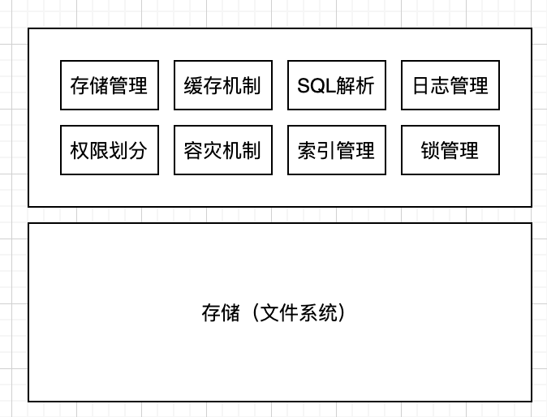
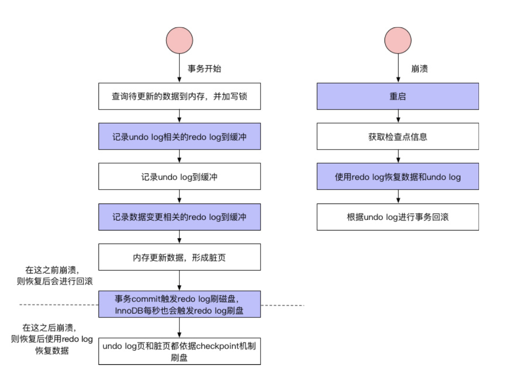
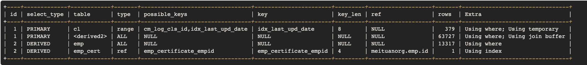
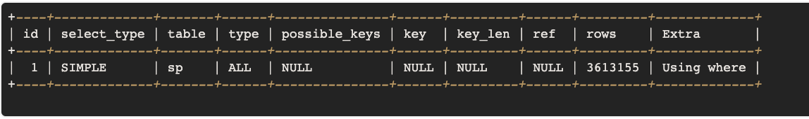
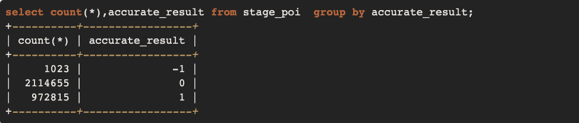
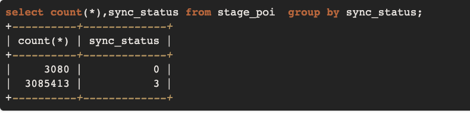

*  目录
{:toc}
	
	
<!--more-->

## 数据库架构



### 为什么要使用索引

### 覆盖索引
指一个查询语句的执行只用从索引中就能够取得，不必从数据表中读取。也可以称之为实现了索引覆盖。

### 可以存储索引的数据结构

1. 二叉查找树
2. B树
	1. 根节点至少包括两个孩子
	2. 树中每个节点最多包含有m个孩子(m>=2)
	3. 除根节点和叶节点外，其他每个节点至少有ceil(m/2)个孩子
	4. 有序性（孩子节点在父节点的开区间）
3. B+树(B数的变体)
	1. 非叶子节点的子树指针和关键字个数相同--能存储更多的关键字
	2. 非叶子节点的子树指针P[i]，指向关键字值[K[i], K[i+1])的子树
	3. 非叶子节点仅用来索引，数据都保存在叶子节点中--非叶子节点不存数据了，可以存储更多的关键字了，那树的深度会降低
	4. 所有叶子节点均有一个链指针指向下一个叶子节点--方便叶子节点做范围统计
4. hash（缺点）
	1. 仅能满足“=”,"IN", 不能使用范围查找
	2. 无法被用来避免数据的排序操作
	3. 不能利用部分索引键查询
	4. 不能避免表扫描
	5. 遇到大量hash值相等的情况后性能并不一定比B树索引高

B+树更适合用来做存储索引，原因：

1. B+树的磁盘读写代价更低--因为内部节点相比于B树更小，如果把所有关键字存放于一个盘快，那么这个盘块能容纳的关键字更多，一次读入内存中需要查找的关键字也就更多，IO次数就降低了。
2. B+树的查询效率更加稳定--因为都要查询到叶子节点，因此大家的查询时间是稳定的
3. B+树更有利于对数据库的扫描--叶子节点有链指针，便于做范围查找

### innodb使用辅助索引需要回表操作，那为什么不像myisam一样使用非聚簇索引直接就能把数据查出来？
等价于 Innodb的辅助索引为什么存主键值而不存数据所在的地址？

Innodb把表中所有数据都存放在主索引的叶子节点里，在往表里插入数据时，可能会导致主索引结构发生变化(分裂或合并的操作)，也就导致了数据地址的变化，所以为什么要再回表一次确保拿到正确的数据。而myisam的做法使得B+树结构发生变化时，还需要同步更新其他的索引。


### MVCC,redolog,undolog,binlog
- undoLog 也就是我们常说的回滚日志文件 主要用于事务中执行失败，进行回滚，以及MVCC中对于数据历史版本的查看。由引擎层的InnoDB引擎实现,是逻辑日志,记录数据修改被修改前的值,比如"把id='B' 修改为id = 'B2' ，那么undo日志就会用来存放id ='B'的记录”。当一条数据需要更新前,会先把修改前的记录存储在undolog中,如果这个修改出现异常,则会使用undo日志来实现回滚操作,保证事务的一致性。当事务提交之后，undo log并不能立马被删除,而是会被放到待清理链表中,待判断没有事物用到该版本的信息时才可以清理相应undolog。它保存了事务发生之前的数据的一个版本，用于回滚，同时可以提供多版本并发控制下的读（MVCC），也即非锁定读。
- redoLog 是重做日志文件是记录数据修改之后的值，用于持久化到磁盘中。redo log包括两部分：一是内存中的日志缓冲(redo log buffer)，该部分日志是易失性的；二是磁盘上的重做日志文件(redo log file)，该部分日志是持久的。由引擎层的InnoDB引擎实现,是物理日志,记录的是物理数据页修改的信息,比如“某个数据页上内容发生了哪些改动”。当一条数据需要更新时,InnoDB会先将数据更新，然后记录redoLog 在内存中，然后找个时间将redoLog的操作执行到磁盘上的文件上。不管是否提交成功我都记录，你要是回滚了，那我连回滚的修改也记录。它确保了事务的持久性。每个InnoDB存储引擎至少有1个重做日志文件组（group），每个文件组下至少有2个重做日志文件，如默认的ib_logfile0和ib_logfile1。为了得到更高的可靠性，用户可以设置多个的镜像日志组（mirrored log groups），将不同的文件组放在不同的磁盘上，以此提高重做日志的高可用性。在日志组中每个重做日志文件的大小一致，并以循环写入的方式运行。InnoDB存储引擎先写重做日志文件1，当达到文件的最后时，会切换至重做日志文件2，再当重做日志文件2也被写满时，会再切换到重做日志文件1中。
- MVCC多版本并发控制是MySQL中基于乐观锁理论实现隔离级别的方式，用于读已提交和可重复读取隔离级别的实现。在MySQL中，会在表中每一条数据后面添加两个字段：最近修改该行数据的事务ID，指向该行（undolog表中）回滚段的指针。Read View判断行的可见性，创建一个新事务时，copy一份当前系统中的活跃事务列表。意思是，当前不应该被本事务看到的其他事务id列表。已提交读隔离级别下的事务在每次查询的开始都会生成一个独立的ReadView,而可重复读隔离级别则在第一次读的时候生成一个ReadView，之后的读都复用之前的ReadView。

### binlog和redolog的区别
1. redolog是在InnoDB存储引擎层产生，而binlog是MySQL数据库的上层服务层产生的。
2. 两种日志记录的内容形式不同。MySQL的binlog是逻辑日志，其记录是对应的SQL语句，对应的事务。而innodb存储引擎层面的重做日志是物理日志，是关于每个页（Page）的更改的物理情况。
3. 两种日志与记录写入磁盘的时间点不同，binlog日志只在事务提交完成后进行一次写入。而innodb存储引擎的重做日志在事务进行中不断地被写入，并日志不是随事务提交的顺序进行写入的。
4. binlog不是循环使用，在写满或者重启之后，会生成新的binlog文件，redolog是循环使用。
5. binlog可以作为恢复数据使用，主从复制搭建，redolog作为异常宕机或者介质故障后的数据恢复使用。

#### InnoDB 的RR为什么可以避免幻读？
表象是：当前读和快照读--这个和记录里的DB_TRX_ID, DB_ROLL_PTR, DB_ROW_ID 和 undo日志 和 read view有关。
本质是：next key锁（行锁和gap锁）

对主键索引或者唯一索引会用GAP锁吗：

1. 如果where条件全部命中，则不会用GAP锁，只会加记录锁
2. 如果where条件部分命中或者全不命中，则会加GAP锁

Gap锁会用在非唯一索引或者不走索引的当前读中：

1. 非唯一索引
2. 不走索引（会锁住全表）

## Mysql读写分离以及主从同步
1. 原理：主库将变更写binlog日志，然后从库连接到主库后，从库有一个IO线程，将主库的binlog日志拷贝到自己本地，写入一个中继日志中，接着从库中有一个sql线程会从中继日志读取binlog，然后执行binlog日志中的内容，也就是在自己本地再执行一遍sql，这样就可以保证自己跟主库的数据一致。
2. 问题：这里有很重要一点，就是从库同步主库数据的过程是串行化的，也就是说主库上并行操作，在从库上会串行化执行，由于从库从主库拷贝日志以及串行化执行sql特点，在高并发情况下，从库数据一定比主库慢一点，是有延时的，所以经常出现，刚写入主库的数据可能读不到了，要过几十毫秒，甚至几百毫秒才能读取到。还有一个问题，如果突然主库宕机了，然后恰巧数据还没有同步到从库，那么有些数据可能在从库上是没有的，有些数据可能就丢失了。所以mysql实际上有两个机制，一个是半同步复制，用来解决主库数据丢失问题，一个是并行复制，用来解决主从同步延时问题。
3. 半同步复制：semi-sync复制，指的就是主库写入binlog日志后，就会将强制此时立即将数据同步到从库，从库将日志写入自己本地的relay log之后，接着会返回一个ack给主库，主库接收到至少一个从库ack之后才会认为写完成。
4. 并发复制：指的是从库开启多个线程，并行读取relay log中不同库的日志，然后并行重放不同库的日志，这样库级别的并行。（将主库分库也可缓解延迟问题）


## Mysql的存储引擎

特性|InnoDB|MyISAM
---|------|-----
事务|⽀持事务处理|不支持事务，回滚将造成不完全回滚，不具有原子性
外键|⽀持外键|不支持外键
MVCC、支持MVCC|不支持MVCC
表主键|如果没有设定主键或者非空唯一索引，就会自动生成一个6字节的主键(用户不可见)，数据是主索引的一部分，附加索引保存的是主索引的值。|允许没有任何索引和主键的表存在，索引都是保存行的地址。
锁|⽀持行锁|锁粒度是表级
全文索引|不⽀持FULLTEXT类型的索引（在Mysql5.6已引⼊)|⽀持全文类型索引
行数|不保存表的具体⾏数，扫描表来计算有多少⾏|保存表的具体⾏数,不带where时，直接返回保存的⾏数
对于AUTO_INCREMENT类型的字段，必须包含只有该字段的索引|AUTO_INCREMENT类型字段可以和其他字段一起建⽴立联合索引
delete|DELETE 表时，是⼀行⼀行的删除|DELETE 表时，先drop表，然后重建表
存储结构|InnoDB 把数据和索引存放在表空间⾥⾯|MyISAM 表被存放在三个文件。frm ⽂件存放表格定义。数据⽂件是MYD (MYData)。索引⽂件是MYI(MYIndex)引伸。所以在跨平台的数据转移中会很方便。在备份和恢复时可单独针对某个表进行操作。
可移植性、备份及恢复|跨平台可直接⻉使用|跨平台很难直接拷贝
压缩|表格很难被压缩|表格可以被压缩


因为MyISAM相对简单所以在效率上要优于InnoDB.如果系统读多，写少。对原子性要求低。那么MyISAM最好的选择。且MyISAM恢复速度快。可直接⽤备份覆盖恢复。如果系统读少，写多的时候，尤其是并发写⼊⾼的时候。InnoDB就是首选了

### InnoDB的关键特性
- 插入缓冲：对于非聚集索引的插入或更新操作，不是每一次直接插入到索引页中，而是先判断插入的非聚集索引页是否在缓冲池中，若在，则直接插入；若不在，则先放入到一个Insert Buffer对象中。然后再以一定的频率和情况进行Insert Buffer和辅助索引页子节点的merge（合并）操作，这时通常能将多个插入合并到一个操作中（因为在一个索引页中），这就大大提高了对于非聚集索引插入的性能。
- 两次写：两次写带给InnoDB存储引擎的是数据页的可靠性，有经验的DBA也许会想，如果发生写失效，可以通过重做日志进行恢复。这是一个办法。但是必须清楚地认识到，如果这个页本身已经发生了损坏（物理到page页的物理日志成功页内逻辑日志失败），再对其进行重做是没有意义的。这就是说，在应用（apply）重做日志前，用户需要一个页的副本，当写入失效发生时，先通过页的副本来还原该页，再进行重做。在对缓冲池的脏页进行刷新时，并不直接写磁盘，而是会通过memcpy函数将脏页先复制到内存中的doublewrite buffer，之后通过doublewrite buffer再分两次，每次1MB顺序地写入共享表空间的物理磁盘上，这就是doublewrite。
- **自适应哈希索引：InnoDB存储引擎会监控对表上各索引页的查询。如果观察到建立哈希索引可以带来速度提升，则建立哈希索引，称之为自适应哈希索引。**
- 异步IO：为了提高磁盘操作性能，当前的数据库系统都采用异步IO（AIO）的方式来处理磁盘操作。AIO的另一个优势是可以进行IO Merge操作，也就是将多个IO合并为1个IO，这样可以提高IOPS的性能。
- 刷新邻接页：当刷新一个脏页时，InnoDB存储引擎会检测该页所在区（extent）的所有页，如果是脏页，那么一起进行刷新。这样做的好处显而易见，通过AIO可以将多个IO写入操作合并为一个IO操作，故该工作机制在传统机械磁盘下有着显著的优势。

### MySQL中InnoDB引擎的行锁是通过加在什么上完成（或称实现）的？
InnoDB行锁是通过给索引上的索引项加锁来实现的，这一点MySQL与Oracle不同，后者是通过在数据块中对相应数据行加锁来实现的。InnoDB这种行锁实现特点意味着：只有通过索引条件检索数据，InnoDB才使用行级锁，否则，InnoDB将使用表锁！

### 若一张表中只有一个字段VARCHAR(N)类型，utf8编码，则N最大值为多少(精确到数量级即可)?
由于utf8的每个字符最多占用3个字节。而MySQL定义行的长度不能超过65535，因此N的最大值计算方法为：(65535-1-2)/3。减去1的原因是实际存储从第二个字节开始，减去2的原因是因为要在列表长度存储实际的字符长度，除以3是因为utf8限制：每个字符最多占用3个字节。

### 一张表，里面有ID自增主键，当insert了17条记录之后，删除了第15,16,17条记录，再把Mysql重启，再insert一条记录，这条记录的ID是18还是15
MyISAM -- 18, 因为它会把自增主键的最大ID记录到数据文件里，重启MySQL自增主键的最大ID也不会丢失。

InnoDB -- 15，因为它只是把自增主键的最大ID记录到内存里，所以重启数据库或者对表进行OPTIMIZE操作，都会导致最大ID丢失

### Mysql如何保证一致性和持久性
MySQL为了保证ACID中的一致性和持久性，使用了WAL(Write-Ahead Logging,先写日志再写磁盘)。Redo log就是一种WAL的应用。当数据库忽然掉电，再重新启动时，MySQL可以通过Redo log还原数据。也就是说，每次事务提交时，不用同步刷新磁盘数据文件，只需要同步刷新Redo log就足够了。

### InnoDB的行锁模式
- 共享锁(S)：用法lock in share mode，又称读锁，允许一个事务去读一行，阻止其他事务获得相同数据集的排他锁。若事务T对数据对象A加上S锁，则事务T可以读A但不能修改A，其他事务只能再对A加S锁，而不能加X锁，直到T释放A上的S锁。这保证了其他事务可以读A，但在T释放A上的S锁之前不能对A做任何修改。
- 排他锁(X)：用法for update，又称写锁，允许获取排他锁的事务更新数据，阻止其他事务取得相同的数据集共享读锁和排他写锁。若事务T对数据对象A加上X锁，事务T可以读A也可以修改A，其他事务不能再对A加任何锁，直到T释放A上的锁。在没有索引的情况下，InnoDB只能使用表锁。

### innodb如何实现mysql的事务？

事务进⾏过程中，每次sql语句执⾏，都会记录undo log和redo log，然后更新数据形成脏页，然后redo log按照时间或者空间等条件进⾏落盘，undo log和脏⻚按照checkpoint进⾏落盘，落盘后相应的redo log就可以删除了。此时，事务还未COMMIT，如果发⽣崩溃，则⾸先检查checkpoint记录，使⽤相应的redo log进⾏数据和undo log的恢复，然后查看undo log的状态发现事务尚未提交，然后就使用undo log进⾏事务回滚。事务执⾏COMMIT操作时，会将本事务相关的所有redo log都进⾏落盘，只有所有redo log落盘成功，才算COMMIT成功。然后内存中的数据脏页继续按照checkpoint进⾏落盘。如果此时发⽣了崩溃，则只使用redo log恢复数据。

### MySQL存储量多少到性能瓶颈

我们说 Mysql 单表适合存储的最大数据量，自然不是说能够存储的最大数据量，如果是说能够存储的最大量，那么，如果你使用自增 ID，最大就可以存储 2^32 或 2^64 条记录了，这是按自增 ID 的数据类型 int 或 bigint 来计算的；如果你不使用自增 id，且没有 id 最大值的限制，如使用足够长度的随机字符串，那么能够限制单表最大数据量的就只剩磁盘空间了。显然我们不是在讨论这个问题。

影响 Mysql 单表的最优最大数量的一个重要因素其实是索引。

Mysql 的 B+树索引存储在磁盘上，Mysql 每次读取磁盘 Page 的大小是 16KB，为了保证每次查询的效率，需要保证每次查询访问磁盘的次数，一般设计为 2-3 次磁盘访问，再多性能将严重不足。Mysql B+树索引的每个节点需要存储一个指针（8Byte）和一个键值（8Byte）。因此计算16KB/(8B+8B)=1K 16KB 可以存储 1K 个节点，3 次磁盘访问(即 B+树 3 的深度)可以存储 1K _ 1K _ 1K 即 10 亿数据。如果查询依赖非主键索引，那么还涉及二级索引。这样数据量将更小。

### 分库分表
拆分可分为垂直拆分和水平拆分。

垂直拆分是按照不同的表（或者 Schema）来切分到不同的数据库（主机）之上，水平拆分则是根据表中的数据的逻辑关系，将同一个表中的数据按照某种条件拆分到多台数据库（主机）上面或多张相同 Schema 的不同表中。

#### 垂直拆分
最大特点就是规则简单，实施也更为方便，尤其适合各业务之间的耦合度非常低，相互影响很小，业务逻辑非常清晰的系统。在这种系统中，可以很容易做到将不同业务模块所使用的表分拆到不同的数据库中。根据不同的表来进行拆分，对应用程序的影响也更小，拆分规则也会比较简单清晰。垂直拆分最直接的就是按领域拆分服务，隔离领域数据库。如此每个库所承担的数据压力就减少了。

在需要同时依赖多个服务时，我们可以通过添加门面应用来组合底层服务的数据，以提供更符合上层业务需求的接口，这些服务往往更接近真实的业务。而底层的服务则是更加内聚的资源服务。

#### 水平拆分
相对来说稍微复杂一些。因为要将同一个表中的不同数据拆分到不同的数据库中，对于应用程序来说，拆分规则本身就较根据表名来拆分更为复杂，后期的数据维护也会更为复杂一些。水平拆分就是将同一个 Schema 的数据拆分到不同的库或不同的表中，这样每个表的数据量也将减小，查询效率将更高效。水平拆分就涉及到表的分片规则问题。几种典型的分片规则包括：

- 按照用户 ID 求模，将数据分散到不同的数据库，具有相同数据用户的数据都被分散到一个库中。
- 按照日期，将不同月甚至日的数据分散到不同的库中。
- 按照某个特定的字段求摸，或者根据特定范围段分散到不同的库中。

水平拆分往往通过添加一个代理层来做这些事情，代理层对上提供虚拟表，这些虚拟表就像我们在单库上设计的单表一样；代理层对下解析和拆分执行 sql，然后按相应规则在不同的库和表执行相应的 sql 请求，再合并数据，并将合并后的结果返回给上层调用者。

**问题：**

1. 分布式事务问题：一个是因为应用的分布式造成的，一个是因为数据库本身的分布式造成的。数据库本身的分布式事务问题一般由数据库自身解决，大多数分布式数据库都可以做到一定的数据一致性保证，如 HBase 保证的强一致性，Cassandra 保证的最终一致性。应用数据的一致性事务方案我们也可以参考分布式数据库的实现原理来实现。业界也有很多分布式事务的解决思路，如：
	- XA 方案
	- TCC 方案
	- 本地消息表
	- 可靠消息最终一致性方案
	- 最大努力通知方案

2. 多表 Join 问题
3. 数据统计问题
4. ID 问题--使用分库分表之后，就无法使用 Mysql 的表自增作为 id，因为不同库和表的自增将出现冲突的 id。解决这个问题就需要引入分布式 id 生成技术。

#### 分布式全局唯一ID生成策略

1. UUID
2. MySql主键自增
3. MySQL多实例主键自增 -- 设置step，初始值（1，2，...，N），(号段模式--为了减小DB压力，每次取一段，放到内存，多个服务取的时候要加锁。可以采取双buffer，解决竞争排队耗时的问题，到了10%就去取)
4. 基于Redis实现 -- incr在单机上是原子操作，集群上使用步长的方式，可以保证唯一且递增。
5. SnowFlake方案 -- Twitter开源的
	
	long型的数字：
	
	0 - x...x(41bit的timestamp)-x...x(10bit工作机器ID)-x...x(12bit序列号) -- 可以自己写代码实现，也有很多开源框架：百度的uid-generator,美团的Leaf（同时也支持号段模式）


### 常见索引原则有

1. 选择唯一性索引：唯一性索引的值是唯一的，可以更快速的通过该索引来确定某条记录。
2. 为经常需要排序、分组和联合操作的字段建立索引
3. 为常作为查询条件的字段建立索引。
4. 限制索引的数目：越多的索引，会使更新表变得很浪费时间。尽量使用数据量少的索引
5. 如果索引的值很长，那么查询的速度会受到影响。尽量使用前缀来索引
6. 删除不再使用或者很少使用的索引
7. 最左前缀匹配原则，非常重要的原则。
8. 尽量选择区分度高的列作为索引区分度的公式是表示字段不重复的比例
9. 索引列不能参与计算，保持列“干净”：带函数的查询不参与索引。
10. 尽量的扩展索引，不要新建索引。


### 查询在什么时候不走（预期中的）索引
- 模糊查询 %like
- 索引列参与计算,使用了函数
- 非最左前缀顺序
- where对null判断
- where不等于
- or操作有至少一个字段没有索引
- 需要回表的查询结果集过大（超过配置的范围）

### explain命令概要
- id:select选择标识符
- select_type:表示查询的类型。
- table:输出结果集的表
- partitions:匹配的分区
- type:表示表的连接类型
- possible_keys:表示查询时，可能使用的索引
- key:表示实际使用的索引
- key_len:索引字段的长度
- ref:列与索引的比较
- rows:扫描出的行数(估算的行数)
- filtered:按表条件过滤的行百分比
- Extra:执行情况的描述和说明

### explain 中的 select_type（查询的类型）
- SIMPLE(简单SELECT，不使用UNION或子查询等)
- PRIMARY(子查询中最外层查询，查询中若包含任何复杂的子部分，最外层的select被标记为PRIMARY)
- UNION(UNION中的第二个或后面的SELECT语句)
- DEPENDENT UNION(UNION中的第二个或后面的SELECT语句，取决于外面的查询)
- UNION RESULT(UNION的结果，union语句中第二个select开始后面所有select)
- SUBQUERY(子查询中的第一个SELECT，结果不依赖于外部查询)
- DEPENDENT SUBQUERY(子查询中的第一个SELECT，依赖于外部查询)
- DERIVED(派生表的SELECT, FROM子句的子查询)
- UNCACHEABLE SUBQUERY(一个子查询的结果不能被缓存，必须重新评估外链接的第一行)

### explain 中的 type（表的连接类型）
- system：最快，主键或唯一索引查找常量值，只有一条记录，很少能出现
- const：PK或者unique上的等值查询
- eq_ref：PK或者unique上的join查询，等值匹配，对于前表的每一行(row)，后表只有一行命中
- ref：非唯一索引，等值匹配，可能有多行命中
- range：索引上的范围扫描，例如：between/in
- index：索引上的全集扫描，例如：InnoDB的count
- ALL：最慢，全表扫描(full table scan)

### explain 中的 Extra（执行情况的描述和说明）
- Using where:不用读取表中所有信息，仅通过索引就可以获取所需数据，这发生在对表的全部的请求列都是同一个索引的部分的时候，表示mysql服务器将在存储引擎检索行后再进行过滤
- Using temporary：表示MySQL需要使用临时表来存储结果集，常见于排序和分组查询，常见 group by ; order by
- Using filesort：当Query中包含 order by 操作，而且无法利用索引完成的排序操作称为“文件排序”
- Using join buffer：改值强调了在获取连接条件时没有使用索引，并且需要连接缓冲区来存储中间结果。如果出现了这个值，那应该注意，根据查询的具体情况可能需要添加索引来改进能。
- Impossible where：这个值强调了where语句会导致没有符合条件的行（通过收集统计信息不可能存在结果）。
- Select tables optimized away：这个值意味着仅通过使用索引，优化器可能仅从聚合函数结果中返回一行
- No tables used：Query语句中使用from dual 或不含任何from子句

### 实例1

```
select
   distinct cert.emp_id 
from
   cm_log cl 
inner join
   (
      select
         emp.id as emp_id,
         emp_cert.id as cert_id 
      from
         employee emp 
      left join
         emp_certificate emp_cert 
            on emp.id = emp_cert.emp_id 
      where
         emp.is_deleted=0
   ) cert 
      on (
         cl.ref_table='Employee' 
         and cl.ref_oid= cert.emp_id
      ) 
      or (
         cl.ref_table='EmpCertificate' 
         and cl.ref_oid= cert.cert_id
      ) 
where
   cl.last_upd_date >='2013-11-07 15:03:00' 
   and cl.last_upd_date<='2013-11-08 16:00:00';
   
53 rows in set (1.87 sec)
```



简述一下执行计划，首先mysql根据idx_last_upd_date索引扫描cm_log表获得379条记录；然后查表扫描了63727条记录，分为两部分，derived表示构造表，也就是不存在的表，可以简单理解成是一个语句形成的结果集，后面的数字表示语句的ID。derived2表示的是ID = 2的查询构造了虚拟表，并且返回了63727条记录。我们再来看看ID = 2的语句究竟做了些什么返回了这么大量的数据，首先全表扫描employee表13317条记录，然后根据索引emp_certificate_empid关联emp_certificate表，rows = 1表示，每个关联都只锁定了一条记录，效率比较高。获得后，再和cm_log的379条记录根据规则关联。从执行过程上可以看出返回了太多的数据，返回的数据绝大部分cm_log都用不到，因为cm_log只锁定了379条记录。

如何优化呢？可以看到我们在运行完后还是要和cm_log做join,那么我们能不能之前和cm_log做join呢？仔细分析语句不难发现，其基本思想是如果cm_log的ref_table是EmpCertificate就关联emp_certificate表，如果ref_table是Employee就关联employee表，我们完全可以拆成两部分，并用union连接起来，注意这里用union，而不用union all是因为原语句有“distinct”来得到唯一的记录，而union恰好具备了这种功能。如果原语句中没有distinct不需要去重，我们就可以直接使用union all了，因为使用union需要去重的动作，会影响SQL性能。

### 实例2

举这个例子的目的在于颠覆我们对列的区分度的认知，一般上我们认为区分度越高的列，越容易锁定更少的记录，但在一些特殊的情况下，这种理论是有局限性的。

```
select
   * 
from
   stage_poi sp 
where
   sp.accurate_result=1 
   and (
      sp.sync_status=0 
      or sp.sync_status=2 
      or sp.sync_status=4
   );
   
951 rows in set (6.22 sec)
```
先explain，rows达到了361万，type = ALL表明是全表扫描。



所有字段都应用查询返回记录数，因为是单表查询 0已经做过了951条。


我们看到accurate_result这个字段的区分度非常低，整个表只有-1,0,1三个值，加上索引也无法锁定特别少量的数据。

再看一下sync_status字段的情况：

找业务方去沟通，看看使用场景。业务方是这么来使用这个SQL语句的，每隔五分钟会扫描符合条件的数据，处理完成后把sync_status这个字段变成1,五分钟符合条件的记录数并不会太多，1000个左右。了解了业务方的使用场景后，优化这个SQL就变得简单了，因为业务方保证了数据的不平衡，如果加上索引可以过滤掉绝大部分不需要的数据。

根据建立索引规则，使用如下语句建立索引

`alter table stage_poi add index idx_acc_status(accurate_result,sync_status);`
观察预期结果,发现只需要200ms，快了30多倍。

`952 rows in set (0.20 sec)`

我们再来回顾一下分析问题的过程，单表查询相对来说比较好优化，大部分时候只需要把where条件里面的字段依照规则加上索引就好，如果只是这种“无脑”优化的话，显然一些区分度非常低的列，不应该加索引的列也会被加上索引，这样会对插入、更新性能造成严重的影响，同时也有可能影响其它的查询语句。所以我们第4步调差SQL的使用场景非常关键，我们只有知道这个业务场景，才能更好地辅助我们更好的分析和优化查询语句。


### 数据库优化指南
- 创建并使用正确的索引
- 只返回需要的字段
- 减少交互次数（批量提交）
- 设置合理的Fetch Size（数据每次返回给客户端的条数）