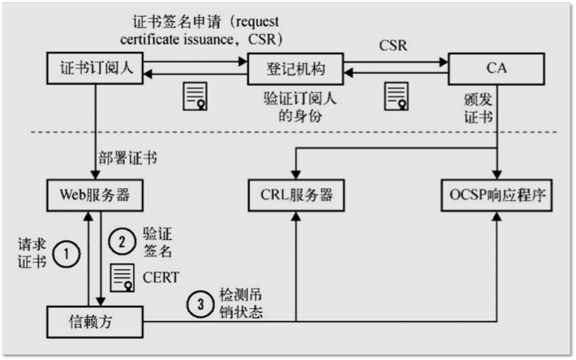
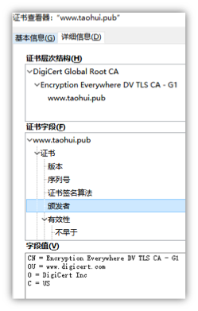
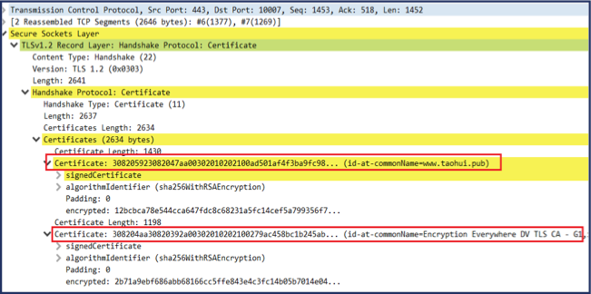
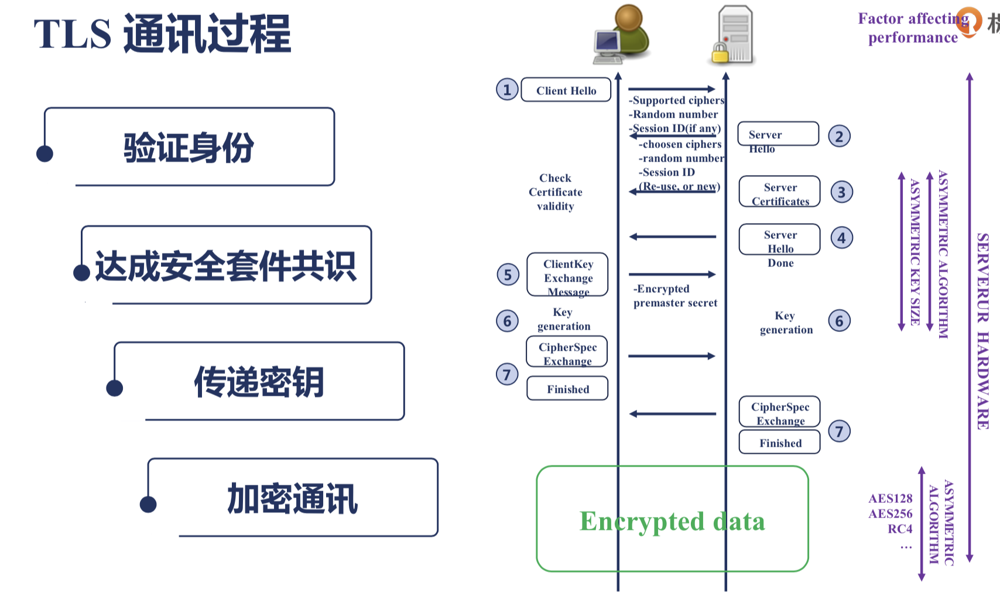

*  目录
{:toc}

<!--more-->

## 反向代理

上游服务器配置：

```
server {
   listen 127.0.0.1:8011;   //只能被本机的进程访问
	default_type text/plain;
	limit_rate 1;
        return 200 '8011 server response.\n';
}
```
反向代理服务器的配置：

```
server {
    listen       80;
    server_name  localhost;
    
    location / {
       proxy_set_header Host $host; 
       proxy_set_header X-Real-IP $remote_addr;
       proxy_set_header X-Forwarded-For $proxy_add_x_forwarded_for;
       proxy_pass http://local;
}
```

### proxy_pass指令的使用

带有URL和不带有URL的使用举例：

```
//upserver的配置
server {
   listen 127.0.0.1:8011;
   default_type text/plain;
   return 200 '8011 server response.\n';
}

server {
    listen 8012;
    default_type text/plain;
    return 200 '8012 server response. 
uri: $uri'}

//反向代理服务器
upstream proxyupstream {
	server 127.0.0.1:8012 weight=1;
}

server {
	server_name proxy.taohui.tech;
	error_log logs/myerror.log debug;
	access_log logs/upstream_access.log varups;

	location /a {
		proxy_pass http://proxyupstream;
		#proxy_method POST;

		proxy_pass_request_headers off;
		#proxy_pass_request_body off;
		proxy_set_body 'hello world!';
		proxy_set_header name '';
		proxy_http_version 1.1;
		proxy_set_header Connection "";
}

//reload之后命令行访问
# curl proxy.taohui.tech/a/b/c
8012 server response. 
uri: /a/b/c

// 如果proxy_pass http://proxyupstream/www;
# curl proxy.taohui.tech/a/b/c
8012 server response. 
uri: /www/b/c
```


### 很多时候需要用到反向代理服务器的缓存功能，缓存功能如何配置呢：

```
proxy_cache_path /tmp/nginxcache levels=1:2 keys_zone=my_cache:10m max_size=10g inactive=60m use_temp_path=off;

server {
    listen       80;
    server_name  localhost;
    
    location / {
       proxy_cache my_cache;
       proxy_cache_key $host$uri$is_args$args; //不同的用户可能返回不同的内容，所以key选择和用户相关
       proxy_cache_valid 200 304 302 1d; // 对于哪些响应不返回
       proxy_pass http://local;
}
```

## nginx的upstream容错
### nginx 判断节点失效状态
Nginx默认判断失败节点状态以connect refuse和time out状态为准，不以HTTP错误状态进行判断失败，因为HTTP只要能返回状态说明该节点还可以正常连接，所以nginx判断其还是存活状态；除非添加了proxy_next_upstream指令设置对404, 502、503、504、500和time out等错误进行转到备机处理，在next_upstream过程中，会对fails进行累加，如果备用机处理还是错误则直接返回错误信息（但404不进行记录到错误数，如果配置错误状态也不对其进行错误状态记录），综述，nginx记录错误数量只记录timeout 、connect refuse、502、500、503、504这6种状态，timeout和connect refuse是永远被记录错误状态，而502、500、503、504只有在配置proxy_next_upstream后nginx才会记录这4种HTTP错误到fails中，当fails大于等于max_fails时，则该节点失效；

### nginx 处理节点失效和恢复的触发条件
nginx可以通过设置max_fails（最大尝试失败次数）和fail_timeout（失效时间，在到达最大尝试失败次数后，在fail_timeout的时间范围内节点被置为失效，除非所有节点都失效，否则该时间内，节点不进行恢复）对节点失败的尝试次数和失效时间进行设置，当超过最大尝试次数或失效时间未超过配置失效时间，则nginx会对节点状会置为失效状态，nginx不对该后端进行连接，直到超过失效时间或者所有节点都失效后，该节点重新置为有效，重新探测；

### 通过proxy_next_upstream实现容灾和重复处理问题
确定在何种情况下请求将转发到下一个服务器：

语法: `proxy_next_upstream error | timeout | invalid_header | http_500 | http_502 | http_503 | http_504 |http_404 | off ...;`

默认值: `proxy_next_upstream error timeout;` 

上下文: http, server, location

其中：

- error   表示和后端服务器建立连接时，或者向后端服务器发送请求时，或者从后端服务器接收响应头时，出现错误。
- timeout   表示和后端服务器建立连接时，或者向后端服务器发送请求时，或者从后端服务器接收响应头时，出现超时。
- invalid_header   表示后端服务器返回空响应或者非法响应头
- http_500   表示后端服务器返回的响应状态码为500
- http_502   表示后端服务器返回的响应状态码为502
- http_503   表示后端服务器返回的响应状态码为503
- http_504   表示后端服务器返回的响应状态码为504
- http_404   表示后端服务器返回的响应状态码为404
- off   表示停止将请求发送给下一台后端服务器

### proxy_intercept_errors 
当上游服务器返回>300 的错误码时，如果该指令on的时候会返回error_page 指定的数据

## 负载均衡

### 四层负载均衡（目标地址和端口交换）
主要通过报文中的目标地址和端口，再加上负载均衡设备设置的服务器选择方式，决定最终选择的内部服务器。

以常见的TCP为例，负载均衡设备在接收到第一个来自客户端的SYN 请求时，即通过上述方式选择一个最佳的服务器，并对报文中目标IP地址进行修改(改为后端服务器IP），直接转发给该服务器。TCP的连接建立，即三次握手是客户端和服务器直接建立的，负载均衡设备只是起到一个类似路由器的转发动作。在某些部署情况下，为保证服务器回包可以正确返回给负载均衡设备，在转发报文的同时可能还会对报文原来的源地址进行修改。

实现四层负载均衡的软件有：

- F5：硬件负载均衡器，功能很好，但是成本很高。
- lvs：重量级的四层负载软件。
- nginx：轻量级的四层负载软件，带缓存功能，正则表达式较灵活。
- haproxy：模拟四层转发，较灵活。

### 七层负载均衡（内容交换）
所谓七层负载均衡，也称为“内容交换”，也就是主要通过报文中的真正有意义的应用层内容，再加上负载均衡设备设置的服务器选择方式，决定最终选择的内部服务器。

七层应用负载的好处，是使得整个网络更智能化。例如访问一个网站的用户流量，可以通过七层的方式，将对图片类的请求转发到特定的图片服务器并可以使用缓存技术；将对文字类的请求可以转发到特定的文字服务器并可以使用压缩技术。

实现七层负载均衡的软件有：

- haproxy：天生负载均衡技能，全面支持七层代理，会话保持，标记，路径转移；
- nginx：只在http协议和mail协议上功能比较好，性能与haproxy差不多；
- apache：功能较差
- Mysql proxy：功能尚可。

### 各软件的比较
- 硬件设备（例如常常听见的F5）
- 软件负载:
	- LVS:
		1. 抗负载能力强，性能高，能达到F5的60%，对内存和CPU资源消耗比较低    
		2. lvs工作在四层，基本上是不能根据请求报文做负载均衡的，纯粹是均衡流量。 
		3. 稳定，可靠性高，自身有完美的热备方案(Keepalived+lvs)    
		4. 不支持正则处理，不能做动静分离。    
		5. 支持多种负载均衡算法：rr(轮询)，wrr(带权轮询)、lc(最小连接)、wlc(带权最小连接) 
		6. 配置相对复杂，对网络依赖比较大，稳定性很高。
		7. 工作在网络4层，相对性能上较高 (网络的七层模式：物理层、数据链路层、网络层、传输层、会话层、表示层、应用层)

	- Nginx:
		1. 工作在网络7层，可以针对http应用做一些分流的策略，比如针对域名，目录结构    
		2. Nginx对网络的依赖较小，理论上能ping通就能进行负载功能    
		3. Nginx安装配置比较简单，测试起来很方便    
		4. 也可以承担较高的负载压力且稳定，nginx是为解决c10k问题而诞生的    
		5. 对后端服务器的健康检查，只支持通过端口来检测，不支持通过url来检测    
		6. Nginx对请求的异步处理可以帮助节点服务器减轻负载压力    
		7. Nginx仅能支持http、https和Email协议，这样就在适用范围较小。    
		8. 不支持Session的直接保持，但能通过ip_hash来解决。对Big request header的支持不是很好。    
		9. Nginx还能做Web服务器即Cache功能。

	- HAProxy:
		1. 支持两种代理模式：TCP（四层）和HTTP（七层），支持虚拟主机；    
		2. 能够补充Nginx的一些缺点比如Session的保持，Cookie的引导等工作  
		3. 支持url检测后端的服务器出问题的检测会有很好的帮助。    
		5. 单纯从效率上来讲HAProxy更会比Nginx有更出色的负载均衡速度。    
		6. HAProxy可以对Mysql进行负载均衡，对后端的DB节点进行检测和负载均衡。    
		7. 支持负载均衡算法：Round-robin（轮循）、Weight-round-robin（带权轮循）、source（原地址保持）、RI（请求URL）、rdp-cookie（根据cookie）    
		8. 不能做Web服务器Cache。

三大主流软件负载均衡器适用业务场景：  
  
1. 网站建设初期，可以选用Nginx、HAProxy作为反向代理负载均衡(流量不大时，可以不选用负载均衡)，因为其配置简单，性能也能满足一般业务场景。如果考虑到负载均衡器是有单点问题，可以采用Nginx+Keepalived/HAproxy+Keepalived避免负载均衡器自身的单点问题。    
2. 网站并发到达一定程度后，为了提高稳定性和转发效率，可以使用lvs，毕竟lvs比Nginx/HAProxy要更稳定，转发效率也更高。

### LVS（Linux Virtual Server）
LVS主要用于服务器集群的负载均衡。它工作在网络层，可以实现高性能，高可用的服务器集群技术。它廉价，可把许多低性能的服务器组合在一起形成一个超级服务器。它易用，配置非常简单，且有多种负载均衡的方法。它稳定可靠，即使在集群的服务器中某台服务器无法正常工作，也不影响整体效果。另外可扩展性也非常好。

目前，LVS项目已提供了一个实现可伸缩网络服务的Linux Virtual Server框架，如下图所示。在LVS框架中，提供了含有三种IP负载均衡技术的IP虚拟服务器软件IPVS，而且IP负载均衡技术是效率最高的。


#### LVS负载均衡机制
- LVS是四层负载均衡，也就是说建立在OSI模型的第四层——传输层之上，传输层上有我们熟悉的TCP/UDP，LVS支持TCP/UDP的负载均衡。因为LVS是四层负载均衡，因此它相对于其它高层负载均衡的解决办法，比如DNS域名轮流解析、应用层负载的调度、客户端的调度等，它的效率是非常高的。　　

IPVS软件实现了这三种IP负载均衡技术：

1. Virtual Server via Network Address Translation（VS/NAT）通过网络地址转换，调度器重写请求报文的目标地址，根据预设的调度算法，将请求分派给后端的真实服务器；真实服务器的响应报文通过调度器时，报文的源地址被重写，再返回给客户，完成整个负载调度过程。
2. Virtual Server via IP Tunneling（VS/TUN）采用NAT技术时，由于请求和响应报文都必须经过调度器地址重写，当客户请求越来越多时，调度器的处理能力将成为瓶颈。为了解决这个问题，调度器把请求报文通过IP隧道转发至真实服务器，而真实服务器将响应直接返回给客户，所以调度器只处理请求报文。由于一般网络服务应答比请求报文大许多，采用 VS/TUN技术后，集群系统的最大吞吐量可以提高10倍。
3. Virtual Server via Direct Routing（VS/DR）VS/DR通过改写请求报文的MAC地址，将请求发送到真实服务器，而真实服务器将响应直接返回给客户。同VS/TUN技术一样，VS/DR技术可极大地 提高集群系统的伸缩性。这种方法没有IP隧道的开销，对集群中的真实服务器也没有必须支持IP隧道协议的要求，但是要求调度器与真实服务器都有一块网卡连在同一物理网段上。

## 使用lvs作一级负载均衡，还有必要再使用nginx作二级负载均衡么？
从灵活性和安全性上考虑，感觉都是有必要的。

- 灵活性上讲，nginx工作在七层，可以实现比较灵活的负载均衡策略，lvs工作在四层，基本上是不能根据请求报文做负载均衡的，纯粹是均衡流量。
- 安全性上讲，lvs会将客户端的链接请求直接redirect到后面的一台应用服务器，应用服务器和客户端直接建立链接，如果这个服务器恰好有问题，那么就失败了。而nginx可以根据返回报文的参数决定是否要再把请求报文转发给其他服务器，理论上可以把后面的应用服务器都试一遍，只要有服务器正常工作就能成功。

**如果应用比较小型或者可靠性要求不是非常高，建议考虑单台nginx或者nginx+keepalived部署。**

## NGINX高可用集群解决方案 Nginx + Keepalived
### 1. Keepalived高可用软件
Keepalived软件起初是专为LVS负载均衡软件设计的，用来管理并监控LVS集群系统中各个服务节点的状态，后来又加入了可以实现高可用的VRRP功能。因此，keepalived除了能够管理LVS软件外，还可以作为其他服务的高可用解决方案软件。

keepalived软件主要是通过VRRP协议实现高可用功能的。VRRP是Virtual Router Redundancy Protocol（虚拟路由冗余协议）的缩写，VRRP出现的目的就是为了解决静态路由的单点故障问题的，它能保证当个别节点宕机时，整个网络可以不间断地运行。所以，keepalived一方面具有配置管理LVS的功能，同时还具有对LVS下面节点进行健康检查的功能，另一方面也可以实现系统网络服务的高可用功能。

keepalived主要是模块是VRRP Stack和Cheackers，VRRP主要实现VIP（及MAC）的高可用，下面再详细认识其实现；Cheackers主要实现各服务如ipvs、nginx等的高可用及realserver健康状态检查，其中ipvs和realserver健康状态检查通过配置文件配置就可以实现，而其他服务高可用则需要通过自己编写脚本，然后配置keepalived调用来实现。

Keepalived运行有3个守护进程。父进程主要负责读取配置文件初始化、监控2个子进程等；然后两个子进程，一个负责VRRP，另一个负责Cheackers健康检查。其中父进程监控模块为WacthDog，工作实现：每个子进程打开一个接受unix域套接字，父进程连接到那些unix域套接字并向子进程发送周期性（5s）hello包。

> VRRP（Virtual Router Redundancy Protocol，虚拟路由冗余协议）可以认为是实现路由器高可用的协议，简单的说，当一个路由器故障时可以由另一个备份路由器继续提供相同的服务。 
> 
> 即将N台提供相同功能的路由器组成一个路由器组，这个组里面有一个master和多个backup，master上面有一个对外提供服务的网关ip和虚拟mac；master会发送224.0.0.18地址组播报文，当backup收不到vrrp包时就认为master宕掉了，这时就需要根据VRRP的优先级来选举一个backup作为master对外提供服务。这样的话就可以保证路由器的高可用，对于该路由器组所在局域网内其他主机来说还是相当于一台路由器，它们就可设置静态缺省路由网关为该路由器组ip了。 虚拟mac是虚拟路由器根据虚拟路由器ID生成MAC地址，格式为：00-00-5E-00-01-{VRID}，当虚拟路由器回应ARP请求时，使用虚拟MAC地址，而不是接口的真实MAC地址。
> 
> 对于局域网中的主机，有多种方法可以实现使其知道它的第一跳路由器地址,其中包括：1、运行某种动态路由协议，比如运行RIP或者OSPF； 2、配置静态缺省路由，即配置网关。 采用动态路由协议，由于管理开销、处理开销、安全原因以及在某些平台上不支持等原因而不现实；在实际应用中， 使用配置静态缺省路由， 即在主机配置网关的方法相当普遍， 这种方法具有最小化的配置和运行开销，并且被所有基于IP的应用所支持。但是，这种方法也有缺点， 即增加了单点故障的可能性。 缺省路由器的不可用将带来灾难性的结果： 当缺省路由器失效时， 所有相连的端主机将由于不能检测到可以替换的其他可用路径而造成网络中断。 
> 
> 综合以上两种方法存在的问题，设计产生了虚拟路由器冗余协议（VRRP），采用了静态缺省路由的方法，并且很好的避免了单点故障。协议定义的选举过程提供了一个当负责转发的主路由器失效时，备份路由器可以接替负责转发的动态容错机制。VRRP协议的这一优点使得每一个端主机不用配置任何动态路由协议或者路由发现协议，就可以获得更高的可靠性。VRRP根据优先级来确定虚拟路由器中每台路由器的角色（Master路由器或Backup路由器）。VRRP优先级的取值范围为0到255（数值越大表明优先级越高），可配置的范围是1到254，优先级0为系统保留给路由器放弃Master位置时候使用，255则是系统保留给IP地址拥有者使用。优先级越高，则越有可能成为Master路由器。当两台优先级相同的路由器同时竞争Master时，比较接口IP地址大小。接口地址大者当选为Master。

### 2. Keepalived高可用故障切换转移原理
Keepalived高可用服务对之间的故障切换转移，是通过VRRP来实现的。在keepalived服务工作时，主Master节点会不断地向备节点发送（多播的方式）心跳消息，用来告诉备Backup节点自己还活着。当主节点发生故障时，就无法发送心跳的消息了，备节点也因此无法继续检测到来自主节点的心跳了。于是就会调用自身的接管程序，接管主节点的IP资源和服务。当主节点恢复时，备节点又会释放主节点故障时自身接管的IP资源和服务，恢复到原来的备用角色。

### 3. Keepalived高可用实验环境说明
如下图所示，前端有两台的Nginx负载均衡器，用来分发接收到客户端的请求。在前文已经配置好了Nginx01，Nginx02也是一样的配置。现在要在两个Nginx负载均衡器上做高可用配置，Nginx01作为主节点，Nginx02作为备节点。


### 4. 配置Keepalived
Keepalived提供了两种模式：

- 抢占式：MASTER与BACKUP节点上state配置不同，当MASTER节点宕掉后由BACKUP节点接手MASTER节点的VIP与服务，在MASTER节点恢复后重新由MASTER节点来接手VIP与服务，BACKUP节点继续回到备用状态。
- 非抢占式：MASTER与BACKUP节点上state配置都为BACKUP，且在vrrp_instance块下两个节点都增加nopreempt，表示不争抢VIP。两个节点启动后默认都为BACKUP状态，双方在发送组播信息后，会根据优先级来选举一个MASTER出来，由于两者都配置了nopreempt，所以MASTER从故障中恢复后不会抢占VIP，这样会避免VIP切换可能造成的服务延迟。

### 5. 编写Nginx Web服务的守护脚本
上面的实验测试有一个问题就是，我们是用Nginx做负载均衡分发请求的数据包的。如果主节点的Keepalived服务正常运行，而Nginx运行异常，那么将会出现Nginx负载均衡服务失灵，无法切换到Nginx负载均衡器02上，后端的Web服务器无法收到请求。所以，我们应该要检测Nginx的服务是否正常运行，如果不是正常运行，应该停掉Keepalived的服务，这样才能自动切换到备节点上。

我们可以通过检测80端口是否开启来判定Nginx的运行情况，2秒钟检测一次，脚本如下：

```
#!/bin/bash
while true
do
if [ $(netstat -tlnp|grep nginx|wc -l) -ne 1 ]
then
	/etc/init.d/keepalived stop
fi
sleep 2
done
```

## nginx 反向代理负载均衡算法
- 轮询负载均衡算法，轮询负载均衡算法是nginx 默认负载均衡算法，在upstream模块设置权重，权重越大，分发的请求到该服务器的上的数量越大。没有指明算法时，nginx使用该算法。
- 最少连接数负载均衡算法
	
	```
	upstream backend {
    server 127.0.0.1:9001 ;
    server 127.0.0.1:9002 ;
    least_conn;
    }
	```
- 最短响应时间负载均衡算法
	
	```
	upstream backend {
    server 127.0.0.1:9001 ;
    server 127.0.0.1:9002 ;
    least_time;
	}
	```
- 基于Hash负载均衡算法
	
	```
	upstream backend {
    server 127.0.0.1:9001 ;
    server 127.0.0.1:9002 ;
    hash $request_uri ;
	}
	```
- IP_Hash负载均衡算法

	```
	upstream backend {
    server 127.0.0.1:9001 ;
    server 127.0.0.1:9002 ;
    ip_hash ;
	}
	```

## 四层反向代理以及负载均衡
nginx从1.9.0开始，新增加了一个stream模块，用来实现四层协议的转发、代理或者负载均衡等。比如在内网有一个mysql服务，想暴露到公网上去使用，就可以通过nginx代理的方式通过nginx来进行内网mysql的访问。

nginx从1.9.0后引入模块ngx_stream_core_module，模块是没有编译的，需要用到编译，编译时需添加--with-stream配置参数

ngx_http_upstream_module是负载均衡模块，可以实现网站的负载均衡功能即节点的健康检查，upstream模块允许Nginx定义一组或多组节点服务器组，使用时可通过proxy_pass 代理方式把网站的请求发送到事先定义好的对应Upstream组的名字上。

upstream模块内参数|参数说明
----------------|-------
weight|服务器权重
max_fails|Nginx尝试连接后端主机失败的此时，这是值是配合proxy_next_upstream、fastcgi_next_upstream和memcached_next_upstream这三个参数来使用的。当Nginx接收后端服务器返回这三个参数定义的状态码时，会将这个请求转发给正常工作的的后端服务器。如404、503、503,max_files=1
fail_timeout|max_fails 和fail_timeout 一般会关联使用，如果某台server在fail_timeout 时间内出现了max_fails 次连接失败，那么Nginx会认为其已经挂掉，从而在fail_timeout 时间内不再去请求它，fail_timeout默认是10s，max_fails默认是1，即默认情况只要是发生错误就认为服务器挂了，如果将max_fails设置为0，则表示取消这项检查
backup|表示当前server是备用服务器，只有其它非backup后端服务器都挂掉了或很忙才会分配请求给它
down|标志服务器永远不可用，可配合ip_hash使用


### 通过nginx代理进行内网mysql的访问

```
#注意 stream和http是同级别的，不要放入http里面。
stream {
    upstream cloudsocket {
       hash $remote_addr consistent;
       server x.x.x.x:3306 weight=5 max_fails=3 fail_timeout=30s;
    }
    server {
       listen 3306;#数据库服务器监听端口
       proxy_connect_timeout 10s;
       proxy_timeout 300s;#设置客户端和代理服务之间的超时时间，如果5分钟内没操作将自动断开。
       proxy_pass cloudsocket;
    }
}
```
### Nginx实现MySQL数据库的负载均衡
```
stream{ 
    upstream mysql{ 
        server 192.168.1.101:3306 weight=1; 
        server 192.168.1.102:3306 weight=1; 
    } 
 
    server{ 
        listen 3306; 
        server_name 192.168.1.100; 
        proxy_pass mysql; 
    } 
} 
```
配置完成后，我们就可以通过如下方式来访问MySQL数据库。

`jdbc:mysql://192.168.1.100:3306/数据库名称`


## access.log

用[goaccess](http://goaccess.io)分析access日志 goaacess.io

## https协议的配置

### 证书的公信力是如何保证的呢？



### 证书的类型

1. 域名验证（DV）证书
	`https://www.**taohui.pub**`只会验证域名的归属是否正确，只要你的域名指向的是你正在申请证书那台服务器，就可以成功申请到证书。
2. 组织验证（OV）证书
	`https://www.**jd.com**`会验证我们在申请的时候填写的机构、企业名称是否正确。所以OV证书的申请往往需要几天的时间。
3. 扩展验证（EV）证书
	`https://www.**mingyou.com**`它会做更严格的验证，所以大部分浏览器会对这类证书的显示表现得非常友好，它会把申请证书时候填写的机构名称显示在地址栏的最左侧。
	
证书链：

 
 
 根证书一般是操作系统内置或者浏览器内置，所以不需要传输给NGINX。只需要传输二级证书和主域名证书。
 
### TLS通讯过程
 
 

## Nginx性能调优：    
1. 增加同时打开⽂件数open files数量；    
2. 处理大量静态⽂件的磁盘I/O时(此时worker进程是单线程的)，增加CPU核⼼数Worker Processes数量，提⾼计算能力；    
3. 如果网站流量很⾼，则可以提升worker进程连接数WorkerConnections(默认1024)；    
4. 控制keep alive在10s-20s之间，减少连接的时间开销；   
5. 合理设置open file cache时间提高处理效率；    
6. 提高⽹路带宽；    
7. 开启压缩传输数据gzip，设置压缩级别gzip_comp_level为1-2，再⾼效果不明显并且浪费CPU了；    
8. 扩展机器数量。

NGINX关于TCP的优化基本上都是修改系统内核提供的配置项，所以跟具体的Linux版本和系统配置有关。

#### sendfile

syscall, 不需要先read再write，没有context切换的代价，0拷贝技术

如果是作为静态文件服务器,sendfile可以明显加速；如果是作为反向代理，那可以不激活它。

#### tcp_nodelay

强制socket发送缓冲区的数据，不管包的大小。

为了避免网络拥塞，TCP栈实现了一个机制，为避免发送的包太小，等待0.2s再发送。（Nagle's算法——在发出去的数据还未被确认之前，新生成的小数据先存起来，凑满一个MSS或者等到收到确认后再发送）

Unix是200ms

是一个socket选项，启用后会禁用Nagle算法。

NGINX只会针对处于keepalive状态的TCP连接才会启用tcp_nodelay。

#### tcp_nopush

优化每次传输的数据包大小，数据包会累计到一定大小后才会发送，减小了额外开销，提高网络效率。

是FreeBSD的一个socket选项，对应Linux的TCP_CORK

必须设置sendfile

#### keepalive_timeout

服务端为每个TCP连接最多可以保持多长时间，NGINX的默认值是75秒，有些浏览器最多只保持60s，所以可以统一设置为60s。

#### 组合使用

1. sendfile和tcp_nopush结合，满包发送，减少网络负担，加速文件传输。
2. 可以看到TCP_NOPUSH是要等到数据包积累到一定大小才发送，TCP_NODELAY是要尽快发送，二者相互矛盾，实际上，它们可以一起使用，达到的效果是先填满包，再尽快发送。
