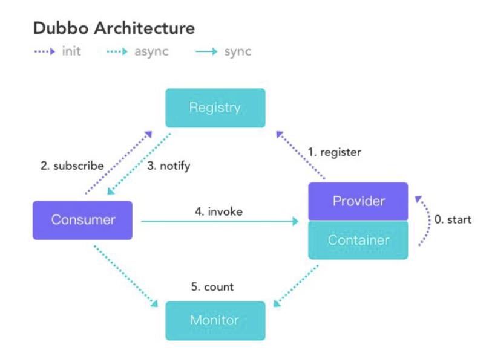

*  目录
{:toc}


<!--more-->

## springboot和springcloud认识
1. Spring Boot 是 Spring 的一套快速配置脚手架，可以基于Spring Boot 快速开发单个微服务，Spring Cloud是一个基于Spring Boot实现的云应⽤开发⼯具；
2. Spring Boot专注于快速、⽅便集成的单个微服务个体，Spring Cloud关注全局的服务治理框架；
3. Spring Boot使⽤了默认⼤于配置的理念，很多集成⽅案已经帮你选择好了，能不配置就不配置；
4. Spring Cloud很⼤的一部分是基于Spring Boot来实现，可以不基于Spring Boot吗？不可以。

## springcloud由以下⼏个核⼼组件构成：
1. Netflix Eureka：各个服务启动时，Eureka Client都会将服务注册到Eureka Server，并且Eureka Client还可以反过来从EurekaServer拉取注册表，从而知道其他服务在哪里
2. Netflix Ribbon：服务间发起请求的时候，基于Ribbon做负载均衡，从⼀个服务的多台机器中选择一台Feign：
3. Spring Cloud OpenFeign：基于Feign的动态代理机制，根据注解和选择的机器，拼接请求URL地址，发起请求
3. Netflix Hystrix：发起请求是通过Hystrix的线程池来走的，不同的服务⾛不同的线程池，实现了不同服务调⽤的隔离，避免了服务雪崩的问题。熔断器，为访问远程服务、系统提供了熔断机制，一旦外部服务超时或者发生故障，将会进行熔断，以防单个或者少数服务发生故障时引起连锁反应，导致所有服务上游或者相关服务被拖慢、甚至被拖垮。提高系统面对延迟和故障的容错能力。
4. Netflix Zuul：如果前端、移动端要调⽤后端系统，统一从Zuul⽹关进入，由Zuul网关转发请求给对应的服务
5. 如Spring Cloud Config：分布式配置中心。通过Spring Cloud Config，开发人员可以将原先放在application.yml中的配置，存储在远程服务器（Git、SVN,Valut, JDBC等）集中管理，降低应用配置的维护成本。
7. Spring Cloud Consul：
	- 服务发现，服务注册中心，同样提供了服务的注册与发现等功能。Consul与Eureka二选一即可
	- 健康检查
	- KV存储
	- 多数据中心支持
	- 安全的服务间通信
	
8. Spring Cloud Sleuth：分布式服务链路追踪客户端工具，通常是结合Zipkin、HTrace等提供分布式服务链路追踪的功能。
9. Spring Cloud Bus：事件中心，用于将服务和服务实例与分布式消息一起连接，通常用于集群间、甚至跨集群的事件传播（例如：配置变更）。所以Spring Cloud Bus通常会和Spring Cloud Config结合使用，方便应用自动获取到配置变更的动作并完成配置的更新。

## eureka和zookeeper都可以提供服务的注册与发现功能，他们的区别
a. Zookeeper保证CP

当向注册中⼼查询服务列列表时，我们可以容忍注册中⼼返回的是⼏分钟以前的注册信息，但不能接受服务直接down掉不可用。也就是说，服务注册功能对可⽤性的要求要⾼于一致性。但是zk会出现这样一种情况，当master节点因为⽹络故障与其他节点失去联系时，剩余节点会重新进⾏leader选举。问题在于，选举leader的时间太⻓长，30 ~ 120s,且选举期间整个zk集群都是不可用的，这就导致在选举期间注册服务瘫痪。在云部署的环境下，因网络问题使得zk集群失去master节点是较大概率会发生的事，虽然服务能够最终恢复，但是漫⻓的选举时间导致的注册长期不可用是不能容忍的。

b. Eureka保证AP

Eureka看明⽩了这一点，因此在设计时就优先保证可用性。Eureka各个节点都是平等的，⼏个节点挂掉不会影响正常节点的工作，剩余的节点依然可以提供注册和查询服务。⽽Eureka的客户端在向某个Eureka注册或如果发现连接失败，则会⾃动切换⾄其它节点，只要有一台Eureka还在，就能保证注册服务可用(保证可用性)，只不过查到的信息可能不是最新的(不保证强一致性)。除此之外，Eureka还有一种自我保护机制，如果在15分钟内超过85%的节点都没有正常的心跳，那么Eureka就认为客户端与注册中心出现了网络故障，此时会出现以下几种情况： 

1. Eureka不再从注册列表中移除因为⻓时间没收到心跳⽽应该过期的服务 
2. Eureka仍然能够接受新服务的注册和查询请求，但是不会被同步到其它节点上(即保证当前节点依然可⽤用) 
3. 当⽹络稳定时，当前实例新的注册信息会被同步到其它节点中 因此， Eureka可以很好的应对因网络故障导致部分节点失去联系的情况，而不会像zookeeper那样使整个注册服务瘫痪。

## eureka服务注册与发现原理
1. 每30s发送心跳检测重新进行租约，如果客户端不能多次更新租约，它将在90s内从服务器注册中心移除。
2. 注册信息和更新会被复制到其他Eureka 节点，来⾃任何区域的客户端可以查找到注册中心信息，每30s发⽣一次复制来定位他们的服务，并进⾏远程调用。
3. 客户端还可以缓存一些服务实例信息，所以即使Eureka全挂掉，客户端也是可以定位到服务地址的。

注意：

1. 如果不是AWS的环境不是很推荐eureka
2. 2.0版本也不再开源

## springcloud和dubbo有哪些区别
1. Dubbo具有调度、发现、监控、治理等功能，⽀持相当丰富的服务治理能⼒。Dubbo架构下，注册中⼼对等集群，并会缓存服务列表以备数据库失效时继续提供发现功能，本身的服务发现结构有很强的可用性与健壮性，⾜够⽀持⾼访问量的⽹站。
2. 虽然Dubbo ⽀持短连接大数据量的服务提供模式，但绝大多数情况下都是使⽤长连接小数据量的模式提供服务使用的。所以，对于类似于电商等同步调用场景多并且能⽀撑搭建Dubbo 这套⽐较复杂环境的成本的产品⽽言，Dubbo 确实是一个可以考虑的选择。但如果产品业务中由于后台业务逻辑复杂、时间⻓而导致异步逻辑比较多的话，可能Dubbo 并不合适。同时，对于⼈手不足的初创产品⽽言，这么重的架构维护起来也不是很⽅便。
3. Spring Cloud由众多子项目组成，如Spring Cloud Config、Spring Cloud Netflix、Spring Cloud Consul 等，提供了搭建分布式系统及微服务常用的工具，如配置管理、服务发现、断路器、智能路由、微代理、控制总线、一次性token、全局锁、选主、分布式会话和集群状态等，满⾜了构建微服务所需的所有解决方案。
4. dubbo的开发难度较大，原因是dubbo的jar包依赖问题很多大型工程无法解决。

## dubbo服务注册与发现原理



角色|角色说明
---|-------
Provider|暴露服务的服务提供方
Consumer|调用远程服务的服务消费方
Registry|服务注册与发现的注册中心
Monitor|统计服务的调用次调和调用时间的监控中心
Container|服务运行容器


调⽤用关系说明：

1. 服务容器负责启动,加载,运⾏服务提供者。
2. 服务提供者在启动时,向注册中心注册⾃己提供的服务。
3. 服务消费者在启动时,向注册中⼼订阅⾃己所需的服务。
4. 注册中心返回服务提供者地列表给消费者,如果有变更,注册中⼼将基于⻓连推送变更数据给消费者。
5. 服务消费者,从提供者地址列表中,基于软负载均衡算法,选一台提供者进⾏调⽤,如果调⽤失败,再选另⼀台调⽤。
6. 服务消费者和提供者,在内存中累计调用次数和调⽤时间,定时每分钟发送一次统计数据到监控中心。

### Dubbo中zookeeper做注册中心，如果注册中心集群都挂掉，发布者和订阅者之间还能通信么？
可以通信的，启动dubbo时，消费者会从zk拉取注册的生产者的地址接口等数据，缓存在本地。每次调用时，按照本地存储的地址进行调用；

注册中心对等集群，任意一台宕机后，将会切换到另一台；注册中心全部宕机后，服务的提供者和消费者仍能通过本地缓存通讯。服务提供者无状态，任一台宕机后，不影响使用；服务提供者全部宕机，服务消费者会无法使用，并无限次重连等待服务者恢复；

挂掉是不要紧的，但前提是你没有增加新的服务，如果你要调用新的服务，则是不能办到的。

### dubbo连接注册中心和直连的区别
在开发及测试环境下，经常需要绕过注册中心，只测试指定服务提供者，这时候可能需要点对点直连，
点对点直联方式，将以服务接口为单位，忽略注册中心的提供者列表，

服务注册中心，动态的注册和发现服务，使服务的位置透明，并通过在消费方获取服务提供方地址列表，实现软负载均衡和Failover， 注册中心返回服务提供者地址列表给消费者，如果有变更，注册中心将基于长连接推送变更数据给消费者。

服务消费者，从提供者地址列表中，基于软负载均衡算法，选一台提供者进行调用，如果调用失败，再选另一台调用。注册中心负责服务地址的注册与查找，相当于目录服务，服务提供者和消费者只在启动时与注册中心交互，注册中心不转发请求，服务消费者向注册中心获取服务提供者地址列表，并根据负载算法直接调用提供者，注册中心，服务提供者，服务消费者三者之间均为长连接，监控中心除外，注册中心通过长连接感知服务提供者的存在，服务提供者宕机，注册中心将立即推送事件通知消费者

注册中心和监控中心全部宕机，不影响已运行的提供者和消费者，消费者在本地缓存了提供者列表

注册中心和监控中心都是可选的，服务消费者可以直连服务提供者。

## dubbo服务集群配置（集群容错模式）
在集群调用失败时，Dubbo 提供了多种容错方案，缺省为 failover 重试。可以自行扩展集群容错策略

1. Failover Cluster(默认)
    
	失败自动切换，当出现失败，重试其它服务器。(缺省)通常用于读操作，但重试会带来更长延迟。可通过retries="2"来设置重试次数(不含第一次)。
    
   
    ```
    <dubbo:service retries="2" cluster="failover"/>
    或：
    <dubbo:reference retries="2" cluster="failover"/>
    cluster="failover"可以不用写,因为默认就是failover
    ```
2. Failfast Cluster
   快速失败，只发起一次调用，失败立即报错。通常用于非幂等性的写操作，比如新增记录。
3. Failsafe Cluster
    失败安全，出现异常时，直接忽略。通常用于写入审计日志等操作。
4. Failback Cluster
   失败自动恢复，后台记录失败请求，定时重发。通常用于消息通知操作。
5. Forking Cluster
   并行调用多个服务器，只要一个成功即返回。通常用于实时性要求较高的读操作，但需要浪费更多服务资源。可通过forks="2"来设置最大并行数。
6. 广播调用所有提供者，逐个调用，任意一台报错则报错。通常用于通知所有提供者更新缓存或日志等本地资源信息

## Dubbo有哪⼏种负载均衡策略，默认是哪种？

1. 随机
2. 轮询
3. 最少活跃调用数
4. 一致性hash

## dubbo协议适用范围和适用场景
适用范围：

- 传入传出参数数据包较小（建议小于100K），
- 消费者比提供者个数多，单一消费者无法压满提供者，
- 尽量不要用dubbo协议传输大文件或超大字符串。

适用场景：常规远程服务方法调用

dubbo协议补充：

- 连接个数：单连接
- 连接方式：长连接
- 传输协议：TCP
- 传输方式：NIO异步传输
- 序列化：Hessian二进制序列化

RMI协议
RMI协议采用JDK标准的java.rmi.*实现，采用阻塞式短连接和JDK标准序列化方式，Java标准的远程调用协议。

- 连接个数：多连接
- 连接方式：短连接
- 传输协议：TCP
- 传输方式：同步传输
- 序列化：Java标准二进制序列化

适用范围：传入传出参数数据包大小混合，消费者与提供者个数差不多，可传文件。

适用场景：常规远程服务方法调用，与原生RMI服务互操作


## 限流
1. http限流：我们使⽤nginx的limitzone来完成：
	- 限制瞬时并发数（如nginx的limit_conn模块，⽤来限制瞬时并发连接数）
	- 限制时间窗⼝内的平均速率（如Guava的RateLimiter、nginx的limit_req模块，限制每秒的平均速率）
	
	```
	//这个表示使⽤ip进⾏限流 zone名称为req_one 分配了10m 空间使⽤漏桶算法每秒钟允许1个请求
	limit_req_zone  $binary_remote_addr  zone=req_one:10m rate=1r/s;
	//这边burst表示可以瞬间超过20个请求由于没有noDelay参数因此需要排队如果超过这20个那么直接返回503
	limit_req zone=req_three burst=20;
	```
2. dubbo限流：
	
	dubbo提供了多个和请求相关的filter：
	
	- ActiveLimitFilter：
	
		`@Activate(group = Constants.CONSUMER, value = Constants.ACTIVES_KEY)`
		
		作⽤于客户端，主要作⽤是控制客户端⽅法的并发度；
		
		当超过了指定的active值之后该请求将等待前⾯的请求完成【何时结束呢？依赖于该方法timeout如果没有设置timeout的话可能就是多个请求一直被阻塞然后等待随机唤醒。
		
	- ExecuteLimitFilter：
		
		`@Activate(group = Constants.PROVIDER, value = Constants.EXECUTES_KEY)`
		
		作⽤于服务端，一旦超出指定的数目直接报错其实是指在服务端的并⾏度【需要注意这些都是指的是在单台服务上⽽不是整个服务集群】

	- TPSLimiterFilter：

		`@Activate(group = Constants.PROVIDER, value = Constants.TPS_LIMIT_RATE_KEY)`
		
		作用于服务端，控制一段时间内的请求数；默认情况下取得tps.interval字段表示请求间隔如果⽆无法找到则使⽤60s 根据tps字段表示允许调⽤次数。使⽤AtomicInteger表示允许调用的次数每次调用减少1次当结果⼩于0之后返回不允许调⽤
3. springcloud限流：

	1. 我们可以通过semaphore.maxConcurrentRequests,coreSize,maxQueueSize和queueSizeRejectionThreshold设置信号量模式下的最⼤并发量、线程池⼤小、缓冲区⼤小和缓冲区降级阈值。
	
		```
		#不设置缓冲区，当请求数超过coreSize时直接降级
		hystrix.threadpool.userThreadPool.maxQueueSize=-13
		#超时时间⼤于我们的timeout接⼝返回时间
		hystrix.command.userCommandKey.execution.isolation.thread.timeoutInMilliseconds=15000
		```
		这个时候我们连续多次请求/user/command/timeout接⼝，在第一个请求还没有成功返回时，查看输出日志可以发现只有第一个请求正常的进入到user-service的接口中，其它请求会直接返回降级信息。这样我们就实现了对服务请求的限流。
	2. 漏桶算法：⽔（请求）先进⼊到漏桶⾥，漏桶以一定的速度出水，当⽔流⼊速度过⼤会直接溢出，可以看出漏桶算法能强⾏限制数据的传输速率。
	3. 令牌桶算法：除了要求能够限制数据的平均传输速率外，还要求允许某种程度的突发传输。这时候漏漏桶算法可能就不合适了，令牌桶算法更为适合。如图2所示，令牌桶算法的原理是系统会以一个恒定的速度往桶⾥放⼊令牌，⽽如果请求需要被处理，则需要先从桶⾥获取一个令牌，当桶⾥没有令牌可取时，则拒绝服务。
	4. redis计数器限流；

4. Resilience4j也提供限流组件

## 熔断

1. 可以直接用AOP实现断路保护，比如失败3次，则直接返回默认值（fallback）。
2. Hystrix(停止维护了)
	@HystrixCommand
3. Resilience4j

### 熔断的原理，以及如何恢复？
服务的健康状况 = 请求失败数 / 请求总数.

熔断器开关由关闭到打开的状态转换是通过当前服务健康状况和设定阈值⽐较决定的.

1. 当熔断器器开关闭时,请求被允许通过熔断器. 如果当前健康状况⾼于设定阈值,开关继续保持关闭. 如果当前健康状况低于设定阈值,开关则切换为打开状态.
2. 当熔断器开关打开时,请求被禁⽌通过.
3. 当熔断器开关处于打开状态,经过一段时间后,熔断器会⾃动进⼊半开状态,这时熔断器只允许一个请求通过. 当该请求调⽤成功时,熔断器恢复到关闭状态. 若该请求失败,熔断器继续保持打开状态,接下来的请求被禁⽌通过.熔断器的开关能保证服务调⽤者在调⽤异常服务时,快速返回结果,避免⼤量的同步等待. 并且熔断器能在⼀段时间后继续侦测请求执⾏结果,提供恢复服务调⽤的可能
