*  目录
{:toc}


<!--more-->


## 1. `@RestController`和`@Controller`的差别

	@RestController告诉Spring将渲染结果直接返回给caller，不走MVC那一套；
	具体参考[链接](https://dzone.com/articles/spring-framework-restcontroller-vs-controller)
	
## 2. `@OneToMany`和`@ElementCollection`的差别

	@ElementCollection是一个标准的JPA注解，表示这不是一个entity集合，而是一些简单对象或者是embeddable的对象集合。意味着这些元素归属于某个实体，不能单独存在。当实体删除时，它也会被删除。它们没有自己的生命周期。
	
## 3. 	gradle中自动属性扩展

	```
	processResources {
		expand(project.properties)
	}
	```
	然后就可以通过占位符引用这些属性，比如：
	
	```
	app.name=${name}
	app.description=${description}
	```
	
	Gradle中的expand函数使用Groovy的`SimpleTemplateEngine`,它会翻译`${..}`，但是它与spring自己的占位符机制冲突，为了能够兼容，需要做转义，比如把spring的属性占位符转义为`\${..}`
	
	如项目实际使用时：
	gradle的配置：
	
	```
	processResources {
	    filesMatching('application.yml') { 
	        expand([
	                "buildNumber": System.getenv('GO_PIPELINE_LABEL') ?: "Local",
	                "gitRevision": System.getenv('GO_REVISION_SRC') ?: "UNKNOWN",
	                "buildTime"  : (ZonedDateTime.now((ZoneId.of("Asia/Shanghai")))).toString(),
	                "PID": "\${PID:- }"
	        ])
	    }
	    copy {
	        from 'config/git-hooks'
	        into '.git/hooks'
	    }
	}
	```
	
	项目中的引用：
	
	```
	buildNumber: ${buildNumber}
	buildTime: ${buildTime}
	gitRevision: ${gitRevision}
	
	
	logging:
	  pattern:
	    file: "%d{yyyy-MM-dd HH:mm:ss.SSS} %5p %X{requestId:--} ${PID} --- [%t] %-40.40logger{39} : %m%n%wEx"
	    console: "%d{yyyy-MM-dd HH:mm:ss.SSS} %5p %X{requestId:--} ${PID} --- [%15.15t] %-40.40logger{39} : %m %dEx%n"

	```
	
## 4. YAML文件填写外部属性

	spring boot能够解析yaml文件，是因为spring-boot-starter中自带了snakeyaml的依赖
	
## 5. 设置active spring profile

	设置操作系统环境变量`SPRING_PROFILES_ACTIVE`
	

## 6. In Spring Boot, it picks .properties or .yaml files in the following sequences :    

	```
	application-{profile}.{properties|yml}   
	application.{properties|yml}   
	```
	
## 7. spring boot的全局异常捕获

	在spring 3.2中，新增了@ControllerAdvice 注解，可以用于定义@ExceptionHandler、@InitBinder、@ModelAttribute，并应用到所有@RequestMapping中。如果全部异常处理返回json，那么可以使用 @RestControllerAdvice 代替 @ControllerAdvice ，这样在方法上就可以不需要添加 @ResponseBody。
	
	@ExceptionHandler注解可以捕获当前controller抛出的任何异常，所以同一个controller中的任何一个业务方法抛出异常，都可以交由一个异常处理方法统一处理。如果想让它捕获所有controller抛出的异常，则需要@ControllerAdvice注解，可以使一个普通的controller变成一个controller advice，即切面controller。
	
	@ControllerAdvice本身已经被@controller注解，所以被@ControllerAdvice注解的类可以被自动扫描到，无需再注解@controller了。
	
	```
	/**
     * 应用到所有@RequestMapping注解方法，在其执行之前初始化数据绑定器
     * @param binder
     */
    @InitBinder
    public void initBinder(WebDataBinder binder) {}
    
    /**
     * 把值绑定到Model中，使全局@RequestMapping可以获取到该值
     * @param model
     */
    @ModelAttribute
    public void addAttributes(Model model) {
        model.addAttribute("author", "Magical Sam");
    }
    
    @ModelAttribute：在Model上设置的值，对于所有被 @RequestMapping 注解的方法中，都可以通过 ModelMap 获取，如下：
	@RequestMapping("/home")
	public String home(ModelMap modelMap) {
	    System.out.println(modelMap.get("author"));
	}
	
	//或者 通过@ModelAttribute获取
	
	@RequestMapping("/home")
	public String home(@ModelAttribute("author") String author) {
	    System.out.println(author);
	}
	
	/**
     * 全局异常捕捉处理
     * @param ex
     * @return
     */
    @ResponseBody
    @ExceptionHandler(value = Exception.class)
    public Map errorHandler(Exception ex) {
        Map map = new HashMap();
        map.put("code", 100);
        map.put("msg", ex.getMessage());
        return map;
    }
	```
	
	总体来说，就是SpringMvc启动的时候初始化异常处理的组件，将 @ControllerAdvice标记的特殊类和@ExceptionHandler 标记的方法存入缓存中，当目标Controller出现异常的时候，就通过抛出的异常在缓存中找到对应的处理方法，然后去调用对应的异常处理方法就OK了。
	
## 8. Interceptor vs Filter

	Filter，顾名思义，过滤器，是由servlet容器为每个传入的http请求和每个http响应执行的Java类。 这样，就可以在HTTP传入请求到达资源之前对其进行管理，例如JSP页面，servlet或简单的静态页面; 以相同的方式可以在资源执行后管理HTTP出站响应。
此行为允许实现在许多不同上下文中重用的常用功能。
Filter在只在 Servlet 前后起作用。Filters 通常将请求和响应（request/response） 当做黑盒子，Filter 通常不考虑servlet的实现。

	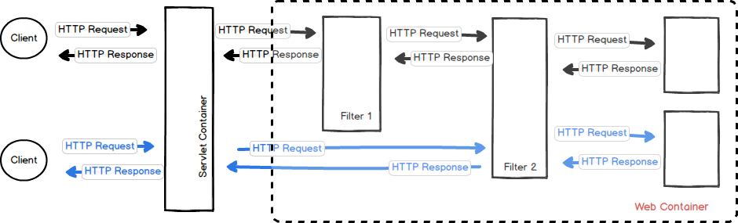
	
	> HttpRequest —-> Filter —-> Servlet —-> Controller/Action/… —-> Filter —-> HttpResponse

	Filter包括三个主要方法：
	
	- init：执行以使用过滤器定义中的init-param元素初始化过滤器
	- doFilter：为满足“url-pattern”的所有HTTP传入请求执行
	- destroy：释放过滤器使用的资源

	Filter使用场景：

	- 身份验证：根据用户身份阻止请求。
	- 记录日志和审核：跟踪Web应用程序的用户。
	- 图像转换：缩放地图等。
	- 数据压缩：使下载量更小。
	- 本地化：将请求和响应定位到特定区域设置。
	
	Request Filters 可以：
	
	- 执行安全检查
	- 重新格式化请求标头或正文
	- 请求记录与审计
	
	Response Filters 可以：
	
	- 压缩响应流
	- 追加或改变响应流
	- 完全创造一个不同的回应
	
	Spring拦截器类似于Servlet过滤器，但它们在Spring Context中起作用，因此管理HTTP请求和响应的功能非常强大，但它们可以实现更加软化的行为，因为它可以访问所有Spring上下文。
Interceptor能够深入到方法前后、异常抛出前后等，因此拦截器的使用具有更大的弹性。允许用户介入（hook into）请求的生命周期，在请求过程中获取信息，Interceptor 通常和请求更加耦合。

	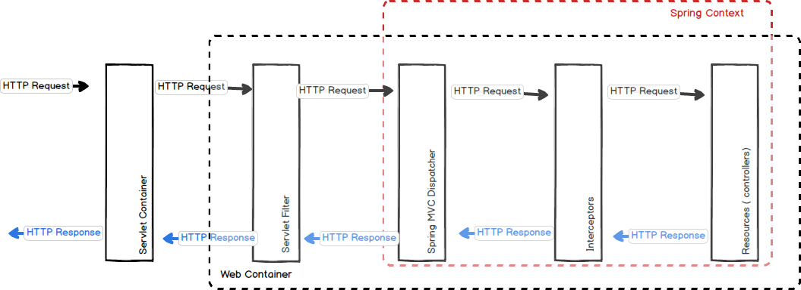
	
	> HttpRequest —-> DispactherServlet —-> HandlerInterceptor —->Controller—-> HandlerInterceptor —-> HttpResponse
	
	interceptor 的执行顺序大致为：

	- 请求到达 DispatcherServlet
	- DispatcherServlet 发送至 Interceptor ，执行 preHandle
	- 请求达到 Controller
	- 请求结束后，postHandle 执行
	
	interceptor 包含如下几个主要方法：

	- preHandle：在执行目标资源之前执行
	- afterCompletion：执行目标资源后执行（渲染视图后）
	- postHandle：拦截处理程序的执行

	|Filter |	Interceptor |	Summary|
	|-------|-------------|--------|
	|Filter 接口定义在 javax.servlet 包中|	接口 HandlerInterceptor 定义在org.springframework.web.servlet 包中||
	|Filter 定义在 web.xml 中|||	 	 
	|Filter在只在 Servlet 前后起作用。Filters 通常将请求和响应（request/response）当做黑盒子，Filter 通常不考虑servlet 的实现。|拦截器能够深入到方法前后、异常抛出前后等，因此拦截器的使用具有更大的弹性。允许用户介入（hook into）请求的生命周期，在请求过程中获取信息，Interceptor 通常和请求更加耦合。|在Spring构架的程序中，要优先使用拦截器。几乎所有 Filter 能够做的事情， interceptor 都能够轻松的实现|
	|Filter 是 Servlet 规范规定的。	|而拦截器既可以用于Web程序，也可以用于Application、Swing程序中。|使用范围不同|
	|Filter 是在 Servlet 规范中定义的，是 Servlet 容器支持的。|而拦截器是在 Spring容器内的，是Spring框架支持的。|规范不同|
	|Filter 不能够使用 Spring 容器资源|	拦截器是一个Spring的组件，归Spring管理，配置在Spring文件中，因此能使用Spring里的任何资源、对象，例如 Service对象、数据源、事务管理等，通过IoC注入到拦截器即可|	Spring 中使用 interceptor 更容易|
	|Filter 是被 Server(like Tomcat) 调用|Interceptor 是被 Spring 调用|因此 Filter 总是优先于 Interceptor 执行|

## IoC、DIP、Dependency Injection和IoC Container概念解析

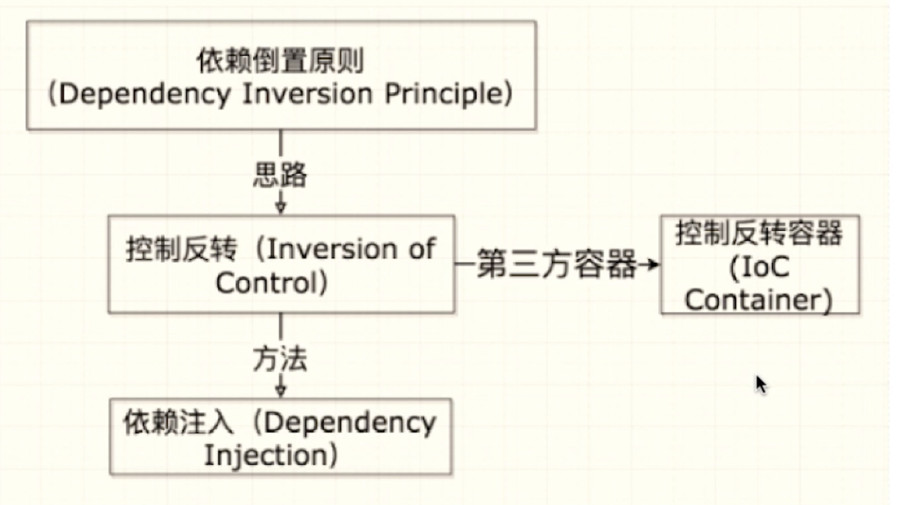


如上图所示，IoC和DIP是指导性的设计原则，Dependency Injection是一种模式、是IoC的实现方式，IoC Container是实现框架。

### 控制反转原则 (Inversion of Control, IoC)
IoC是面向对象编程中的一种设计原则，目标是降低代码的耦合度(loose coupling)。

没有IoC的程序中，客户代码需要主动创建并管理依赖的对象，而在IoC程序中，客户代码依赖的对象由框架(第三方)注入给调用者，具体生成什么对象和什么时候生成都由框架(第三方)决定。**IoC对编程带来的最大改变不是从代码上，而是从思想上，发生了“主从换位”的变化。应用程序原本是老大，要获取什么资源都是主动出击，但是在IoC/DI思想中，应用程序就变成被动的了，被动的等待IoC容器来创建并注入它所需要的资源了。**

所有的类都会在spring容器中登记，告诉spring你是个什么东西，你需要什么东西，然后spring会在系统运行到适当的时候，把你要的东西主动给你，同时也把你交给其他需要你的东西。所有的类的创建、销毁都由 spring来控制，也就是说控制对象生存周期的不再是引用它的对象，而是spring。对于某个具体的对象而言，以前是它控制其他对象，现在是所有对象都被spring控制，所以这叫控制反转。

1. 什么是控制？   
	依赖对象的创建和绑定。

2. 如何反转？   
	从调用者自己主动创建、管理依赖对象转为第三方管理，由第三方提供给调用者。
	
#### IoC的优点和缺点
优点--IoC进一步降低了代码的耦合度，IoC带来的好处也就是对代码进行解耦带来的好处：

1. 更加明确的分工，只需关注自身任务，无需关注依赖对象的功能。
2. 更容易进行测试，测试时只需提供依赖对象的Mock，TDD必须提供IoC才能实现。
3. 代码更加灵活、可配置、可复用。

缺点：

代码不够直观，增加了复杂度。

#### IoC的实现方式
在OOP中，有多种实现IoC的方法：

1. Service Locator Pattern.
2. Dependency Injection.(Constructor/Parameter/Setter).
3. Strategy Design Pattern.

#### 依赖倒置原则 (Dependency Inversion Principle, DIP)

- 高层次的模块不应该依赖于低层次的模块，两者都应该依赖于抽象接口。
- 抽象接口不应该依赖于具体实现。而具体实现则应该依赖于抽象接口。

#### DI
DI—Dependency Injection，即“依赖注入”：组件之间依赖关系由容器在运行期决定，形象的说，即由容器动态的将某个依赖关系注入到组件之中。依赖注入的目的并非为软件系统带来更多功能，而是为了提升组件重用的频率，并为系统搭建一个灵活、可扩展的平台。通过依赖注入机制，我们只需要通过简单的配置，而无需任何代码就可指定目标需要的资源，完成自身的业务逻辑，而不需要关心具体的资源来自何处，由谁实现。

IoC和DI有什么关系呢？其实它们是同一个概念的不同角度描述，由于控制反转概念比较含糊（可能只是理解为容器控制对象这一个层面，很难让人想到谁来维护对象关系），所以2004年Martin Fowler又给出了一个新的名字：“依赖注入”，相对IoC 而言，“依赖注入”明确描述了“被注入对象依赖IoC容器配置依赖对象”。

## IoC容器的实现
两个主要的容器系列：

1. 实现BeanFactory接口的简单容器系列，这系列只实现了容器的最基本功能 -- getBean()方法. 是spring框架的基础设施，面向spring本身。
2. ApplicationContext应用上下文，它作为容器的高级形态而存在。它在简单容器的基础上，增加了许多面向框架的特性。面向使用spring框架的开发者。

Spring通过定义BeanDefinition来管理基于Spring应用中的各种对象以及它们之间的依赖关系，它是依赖倒置模式中管理的对象依赖关系的数据抽象，是实现该功能的核心数据结构。

IoC容器的设计如下
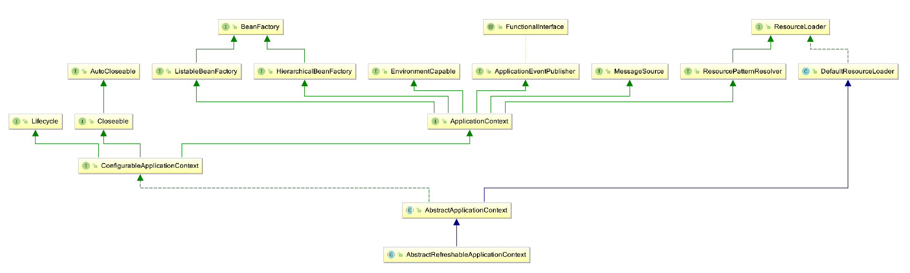

其中，DefaultListableBeanFactory是spring的一个默认的功能完整的IoC容器。
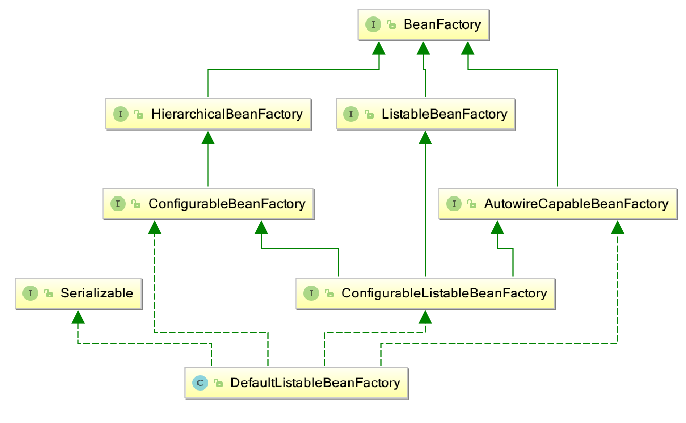

### IoC容器的启动
由AbstractApplicationContext.refresh()方法来触发的。

```
ServletWebServerApplicationContext.refresh() 
	-> AbstractApplicationContext.refresh() ->  obtainFreshBeanFactory() 
		-> AbstractRefreshableApplicationContext.refreshBeanFactory()
```

1. 为IOC容器以及bean的生命周期管理提供条件
2. 刷新spring上下文信息，定义spring上下文加载流程

bean的状态变化如下：

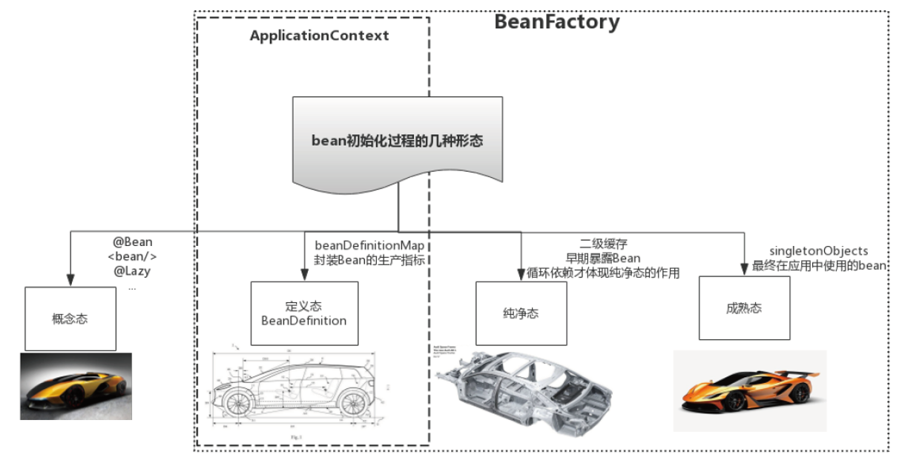
我们简单地把它分成两个过程 -- 首先是建立BeanDefinition数据映射；然后开始依赖注入：

1. IoC容器的初始化
	
	- BeanDefinition的resource定位和载入
	
	```
	@Override
	protected final void refreshBeanFactory() throws BeansException {
		if (hasBeanFactory()) {
			destroyBeans();
			closeBeanFactory();
		}
		try {
			DefaultListableBeanFactory beanFactory = createBeanFactory();
			beanFactory.setSerializationId(getId());
			customizeBeanFactory(beanFactory);
			loadBeanDefinitions(beanFactory);
			synchronized (this.beanFactoryMonitor) {
				this.beanFactory = beanFactory;
			}
		}
		catch (IOException ex) {
			throw new ApplicationContextException("I/O error parsing bean definition source for " + getDisplayName(), ex);
		}
	}
	
	-> AnnotationConfigWebApplicationContext.loadBeanDefinitions(DefaultListableBeanFactory beanFactory)
	```
	
	- BeanDefinition的注册

	```
	放入DefaultListableBeanFactory中的private final Map<String, BeanDefinition> beanDefinitionMap = new ConcurrentHashMap<>(256)中
	AnnotationConfigWebApplicationContext.loadBeanDefinitions(DefaultListableBeanFactory beanFactory)
		-> AnnotatedBeanDefinitionReader.register(Class<?>... annotatedClasses) -> doRegisterBean()
			-> BeanDefinitionReaderUtils.registerBeanDefinition(definitionHolder, this.registry);
				-> DefaultListableBeanFactory.registerBeanDefinition()
	```
	
	
2. IoC容器的依赖注入	

	```
	AbstractBeanFactory.doGetBean()
		-> AbstractAutowireCapableBeanFactory.createBean() -> doCreateBean() -- 如果有循环依赖，则在1，2之间插入addSingletonFactory()方法的调用
			-> 1. bean实例的创建：createBeanInstance() -> instantiateBean() -> SimpleInstantiationStrategy.instantiate()
          -> 2. 为bean实例设置属性：populateBean() -> applyPropertyValues()  
          -> 3. 调用bean的初始化方法：initializeBean()
          	-> 1. applyBeanPostProcessorsBeforeInitialization()
          	-> 2. invokeInitMethods() 	
          	-> 3. applyBeanPostProcessorsAfterInitialization()		
	```
	getBean方法的代码逻辑：
	
	1. 转换beanName
	2. 从缓存中加载实例
	3. 实例化Bean
	4. 检测parentBparentBeanFactory
	5. 初始化依赖的bean
	6. 创建bean

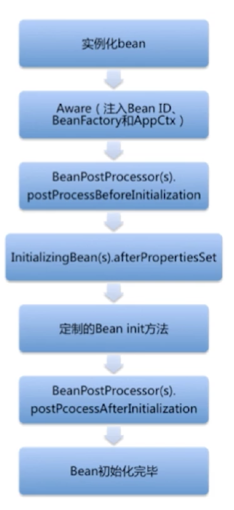
	
### 循环依赖如何解决
首先有三级缓存，分别是：

1. singletonObjects -- 放成熟的bean
2. earlySingletonObjects -- 放早期暴露bean
3. singletonFactories -- 放beanName对应的factory创建方法

比如A autowire注入了B， B autowire注入了A

```
> 首先在创建A的时候，在上节依赖注入环节的doCreateBean()的createBeanInstance()后增加addSingletonFactory("A", () -> getEarlyBeanReference(beanName, mbd, bean))
该方法会向第三级缓存中添加key，value -> this.singletonFactories.put("A", singletonFactory);

在上面的populateBean()方法中，AutowiredAnnotationBeanPostProcessor.postProcessProperties()
	-> metadata.inject()最终会调用到
		-> DefaultListableBeanFactory.resolveDependency() -> doResolveDependency() 
			-> DependencyDescriptor.resolveCandidate 
				-> beanFactory.getBean(beanName) 来创建B实例，此时B又走上面的创建过程，也会往第三级缓存中添加key，value -> this.singletonFactories.put("B", singletonFactory);
				
同样B又进入到populateBean()方法中，发现它属性注入了A，因此调用beanFactory.getBean("A"),此时走getSingleton()方法会从第三级缓存中拿到A对应的创建方法，getEarlyBeanReference()返回早期暴露bean--exposedObject放入第二级缓存中，并从第三级缓存中删除。 -- A 在第二级缓存，B在第三级缓存

完成B实例的创建、属性设置和初始化后，getSingleton()会调用addSingleton(beanName, singletonObject)把B实例从第三级缓存移动到第一级缓存 -- A 在第二级缓存，B在第一级缓存
	protected void addSingleton(String beanName, Object singletonObject) {
		synchronized (this.singletonObjects) {
			this.singletonObjects.put(beanName, singletonObject);
			this.singletonFactories.remove(beanName);
			this.earlySingletonObjects.remove(beanName);
			this.registeredSingletons.add(beanName);
		}
	}
	
返回到创建A实例的逻辑上，A继续完成属性设置、初始化，同上把A实例从第二级缓存移动到第一级缓存

通过实例化A的过程中B也成功实例化并放入第一级缓存中，所以接着遍历到B的时候则直接从第一级缓存中取。
				
```		

### Spring Bean 的作用域
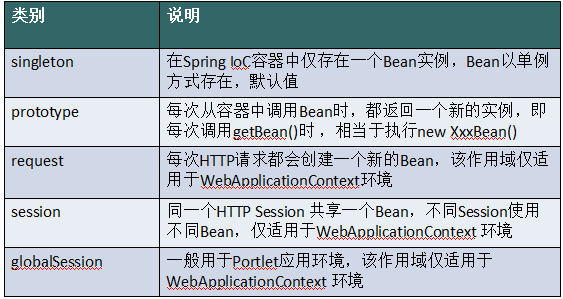

## AOP
几个概念：

1. 切⾯（Aspect）：对象操作过程中的截⾯，这可能是AOP中最为关键的术语。切⾯所要做的事就是专注于各⾃领域的逻辑实现，这样可以使得开发逻辑更加清晰，更加适合专业的分⼯合作。由于切⾯的隔离性，降低了耦合，这样就可以在不同的应⽤中将各个切⾯组合使⽤，从⽽使代码重⽤性⼤大增加。
2. 连接点：程序运⾏过程中的某个阶段点，如某个⽅法的调⽤，或者异常的抛出。
3. 处理逻辑（Advice）：在某一个连接点所采⽤的处理逻辑，处理逻辑的调⽤模式通常有三种：  
	- Around 在连接点前后插⼊预处理过程和后处理过程。
   - Before 仅在连接点前插⼊处理过程。  
   - Throw  在连接点抛出异常时进⾏异常处理。  
   - Advice有的译为“通知”，说法不一，我侧重于“处理逻辑”出⾃于Spring开发指南一⽂。
4. 切点（PointCut）：⼀系列连接点的集合，它指明处理逻辑将在何时触发。

### 动态代理的实现方式，AOP的实现方式
- JDK动态代理：利用反射机制生成一个实现代理接口的匿名类，在调用具体方法前调用InvokeHandler来处理。
- CGlib动态代理：利用ASM（开源的Java字节码编辑库，操作字节码）开源包，将代理对象类的class文件加载进来，通过修改其字节码生成子类来处理。
- 区别：JDK代理只能对实现接口的类生成代理；CGlib是针对类实现代理，对指定的类生成一个子类，并覆盖其中的方法，这种通过继承类的实现方式，不能代理final修饰的类。

## Spring 事务
### Spring 事务中的隔离级别
TransactionDefinition 接口中定义了五个表示隔离级别的常量:

- TransactionDefinition.ISOLATION_DEFAULT: 使用后端数据库默认的隔离级别，Mysql 默认采用的 REPEATABLE_READ隔离级别 Oracle 默认采用的 READ_COMMITTED隔离级别. 
- TransactionDefinition.ISOLATION_READ_UNCOMMITTED: 最低的隔离级别，允许读取尚未提交的数据变 更，可能会导致脏读、幻读或不可重复读
- TransactionDefinition.ISOLATION_READ_COMMITTED: 允许读取并发事务已经提交的数据，可以阻止脏 读，但是幻读或不可重复读仍有可能发生
- TransactionDefinition.ISOLATION_REPEATABLE_READ: 对同一字段的多次读取结果都是一致的，除非数据 是被本身事务自己所修改，可以阻止脏读和不可重复读，但幻读仍有可能发生。 - TransactionDefinition.ISOLATION_SERIALIZABLE: 最高的隔离级别，完全服从ACID的隔离级别。所有的事 务依次逐个执行，这样事务之间就完全不可能产生干扰，也就是说，该级别可以防止脏读、不可重复读以及幻 读。但是这将严重影响程序的性能。通常情况下也不会用到该级别。

### spring事务传播特性之嵌套事务

在 spring 中一共定义了六种事务传播属性,

支持当前事务的情况:

- PROPAGATION_REQUIRED -- 支持当前事务，如果当前没有事务，就新建一个事务。这是最常见的选择。 
- PROPAGATION_SUPPORTS -- 支持当前事务，如果当前没有事务，就以非事务方式执行。 
- PROPAGATION_MANDATORY -- 支持当前事务，如果当前没有事务，就抛出异常。 

不支持当前事务的情况:

- PROPAGATION_REQUIRES_NEW -- 新建事务，如果当前存在事务，把当前事务挂起。 
- PROPAGATION_NOT_SUPPORTED -- 以非事务方式执行操作，如果当前存在事务，就把当前事务挂起。 
- PROPAGATION_NEVER -- 以非事务方式执行，如果当前存在事务，则抛出异常。

其他情况：
 
- PROPAGATION_NESTED -- 如果当前存在事务，则在嵌套事务内执行。如果当前没有事务，则进行与PROPAGATION_REQUIRED类似的操作。利用sql的savepoint进行嵌套事务 

前六个策略类似于EJB CMT，第七个（PROPAGATION_NESTED）是Spring所提供的一个特殊变量。 
它要求事务管理器或者使用JDBC 3.0 Savepoint API提供嵌套事务行为（如Spring的DataSourceTransactionManager） 

- REQUIRES_NEW 在父级方法中调用，开启新的事务，回滚与否只与本方法有关，父级方法进行捕获异常操作后，可以防止父级方法回滚。
- REQUIRED 在父级方法中调用，沿用父级事务，如果本方法抛出异常，无论父级方法是否捕获，都会引起父级与本方法的回滚，因为他们属于一个事务，事务切面同时监控两个方法，出现异常即回滚。
- NESTED 在父级方法中调用，类似于REQUIRED，但如果父级方法进行捕获异常，整个事务中将只会回滚本方法中的数据库操作，父级方法可以根据异常情况进行后续操作，决定整体回滚还是部分提交；如果本方法无异常，父级方法出现异常，本方法与父级方法都会回滚。

### @Transactional注解的工作原理

```
web controller --> proxy.execute(...);
  proxy --> connection.setAutoCommit(false);
  proxy --> realAction.execute();
    realAction does database work
  proxy --> connection.commit();

```

Spring中的@Transactional注解的事务实现主要通过TransactionInterceptor拦截器来进行实现的，拦截目标方法，然后判断异常是不是目标异常，如果是目标异常就行进行回滚，否则就进行事务提交。

Spring并不会对所有类型异常都进行事务回滚操作，默认是只对Unchecked Exception(Error和RuntimeException)进行事务回滚操作。

有部分开发人员会误用这个便利，基本都是下面这两种情况：

1. A类的a1方法没有标注@Transactional，a2方法标注@Transactional，在a1里面调用a2；
2. 将@Transactional注解标注在非public方法上。

第一种为什么是错误用法，原因很简单，a1方法是目标类A的原生方法，调用a1的时候即直接进入目标类A进行调用，在目标类A里面只有a2的原生方法，在a1里调用a2，即直接执行a2的原生方法，并不通过创建代理对象进行调用，所以并不会进入TransactionInterceptor的invoke方法，不会开启事务。

@Transactional的工作机制是基于AOP实现的，而AOP是使用动态代理实现的，动态代理要么是JDK方式、要么是Cglib方式。如果是JDK动态代理的方式，根据上面的分析可以知道，目标类的目标方法是在接口中定义的，也就是必须是public修饰的方法才可以被代理。如果是Cglib方式，代理类是目标类的子类，理论上可以代理public和protected方法，但是Spring在进行事务增强是否能够应用到当前目标类判断的时候，遍历的是目标类的public方法，所以Cglib方式也只对public方法有效。

深入Class类getMethods方法，可以看到取得是public修饰的方法。


[该文章有详细的代码分析](https://juejin.im/post/59e87b166fb9a045030f32ed)

### EventBus的@Subscribe在同时被@Transactional注解时不能被解析为订阅者

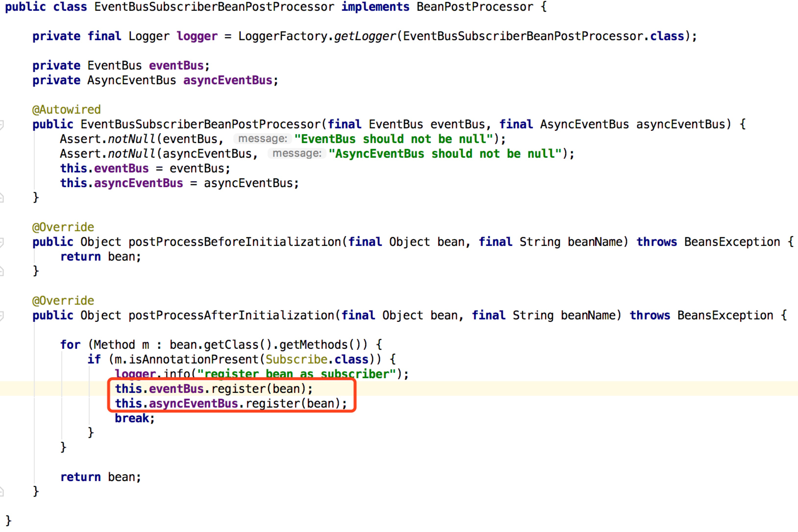

链接文章中，事物的代理生成时会调用`AbstractAutoProxyCreator`中的`postProcessAfterInitialization`

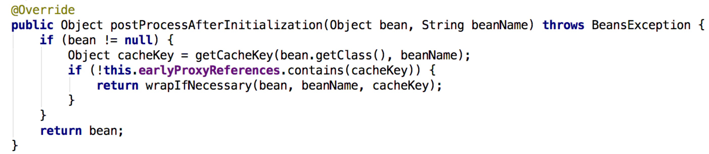

在调试的时候发现首先是扫描所有的`@Transactional`，所以就进入了`AbstractAutoProxyCreator`，在生成了代理类之后，`@Subscribe`注解就已经不存在了。

### 代码实现事务

```
@Service
public class CustomerServiceTxInCode {
    private static final Logger LOG = LoggerFactory.getLogger(CustomerServiceTxInCode.class);

    @Autowired
    private CustomerRepository customerRepository;
    @Autowired
    private PlatformTransactionManager transactionManager;

    public Customer create(Customer customer) {
        LOG.info("CustomerService In Code create customer:{}", customer.getUsername());
        if (customer.getId() != null) {
            throw new RuntimeException("用户已经存在");
        }
        DefaultTransactionDefinition def = new DefaultTransactionDefinition();
        def.setIsolationLevel(TransactionDefinition.ISOLATION_SERIALIZABLE);
        def.setPropagationBehavior(TransactionDefinition.PROPAGATION_REQUIRED);
        def.setTimeout(15);
        TransactionStatus status = transactionManager.getTransaction(def);
        try {
            customer.setUsername("Code:" + customer.getUsername());
            customerRepository.save(customer);
            transactionManager.commit(status);
            return customer;
        } catch (Exception e) {
            transactionManager.rollback(status);
            throw e;
        }
    }
}
```

### Transactional 自动保存到数据库
> 问题1： 
> 
> labelTaskRepository.save(labelTask);   
> labelTask.setLabelResultUri(labelTask.getLabelResultAddress());
> labelTask.setLabelDatasetId("fake");
> 如果在@Transactional里面，那么数据库里会save对labelTask 的修改吗？

> 问题2： 
> 如果在@Transactional里面，从数据库获取一个对象，然后修改对象属性，然后方法返回。并没有save该对象，数据库中对象的值会发生改变吗？

答案是：
是的。因为@Transactional会触发一个事务管理切面，它会把dirty的对象flush进数据库，并进行commit，而不需要显示地save回数据库。
>When a method is transactional, then entities retrieved within this transaction are in managed state, which means that all changes made to them will be populated to the database automatically at the end of the transaction. Therefore either the save() call is redundant and the code should look like this:


## SpringBoot启动：

每个SpringBoot程序都有一个主入口，也就是main方法，main里面调用SpringApplication.run()启动整个spring-boot程序，该方法所在类需要使用@SpringBootApplication注解，以及@ImportResource注解(if need)，@SpringBootApplication包括三个注解，功能如下：

- @EnableAutoConfiguration：SpringBoot根据应用所声明的依赖来对Spring框架进行自动配置

- @SpringBootConfiguration(内部为@Configuration)：被标注的类等于在spring的XML配置文件中(applicationContext.xml)，装配所有bean事务，提供了一个spring的上下文环境

- @ComponentScan：组件扫描，可自动发现和装配Bean，默认扫描SpringApplication的run方法里的Booter.class所在的包路径下文件，所以最好将该启动类放到根包路径下

spring启动时创建容器：AnnotationConfigApplicationContext.refresh() 

```
public void refresh() throws BeansException, IllegalStateException {
	synchronized(this.startupShutdownMonitor){
		//设置环境配置参数
		prepareRefresh();
		//创建beanFactory（同步代码块，反射获取bean）
		ConfigurableListableBeanFactory beanFactory =obtainFreshBeanFactory();
		// 给beanFactory注册一些标准组件，如ClassLoader，BeanPostProcess
		prepareBeanFactory(beanFactory);
		try{
			//设置web生命周期管理的Scope
			postProcessBeanFactory(beanFactory);
			//调⽤所有BeanFactoryProcessor的postProcessBeanFactory()⽅法
			invokeBeanFactoryPostProcessors(beanFactory)
			//注册BeanPostProcessor，BeanPostProcessor作⽤是⽤于拦截Bean的创建
			//如果我们需要在Spring容器完成Bean的实例化、配置和其他的初始化前后添加一些自己的逻辑处理，
			//我们就可以定义一个或者多个BeanPostProcessor接⼝的实现，然后注册到容器中。
			registerBeanPostProcessors(beanFactory);
			//初始化消息Bean
			initMessageSource();
			//初始化上下⽂的事件多播组件，ApplicationEvent触发时由multicaster通知给ApplicationListener
			initApplicationEventMulticaster();
			//ApplicationContext初始化一些特殊的bean
			onRefresh();
			// Check for listener beans and register them.
			//注册事件监听器，事件监听Bean统一注册到multicaster⾥头，ApplicationEvent事件触发后会由multicaster广播
			registerListeners();
			//⾮延迟加载的单例Bean实例化
			finishBeanFactoryInitialization(beanFactory);
			//最后一步，发布ContextRefreshedEvent事件
			finishRefresh();
		}
	}
```
我们发现启动流程主要分为三个部分：

1. 第一部分进行SpringApplication的初始化模块，配置一些基本的环境变量、资源、构造器、监听器
2. 第二部分实现了应用具体的启动方案，包括启动流程的监听模块、加载配置环境模块、及核心的创建上下文环境模块
3. 第三部分是自动化配置模块，该模块作为springboot自动配置核心，在后面的分析中会详细讨论。

详细流程：

1. 首先进入run方法。run方法中去创建了一个SpringApplication实例，在该构造方法内，我们可以发现其调用了一个初始化的initialize方法，这里主要是为SpringApplication对象赋一些初值。构造函数执行完毕后，我们回到run方法。该方法中实现了如下几个关键步骤：
	1. 创建了应用的监听器SpringApplicationRunListeners并开始监听
	2. 加载SpringBoot配置环境(ConfigurableEnvironment)，如果是通过web容器发布，会加载StandardEnvironment，其最终也是继承了ConfigurableEnvironment
	3. 配置环境(Environment)加入到监听器对象中(SpringApplicationRunListeners)
	4. 创建run方法的返回对象：ConfigurableApplicationContext(应用配置上下文)。方法会先获取显式设置的应用上下文(applicationContextClass)，如果不存在，再加载默认的环境配置（通过是否是web environment判断），默认选择AnnotationConfigApplicationContext注解上下文（通过扫描所有注解类来加载bean），最后通过BeanUtils实例化上下文对象，并返回
	5. 回到run方法内，prepareContext方法将listeners、environment、applicationArguments、banner等重要组件与上下文对象关联
	6. 接下来的refreshContext(context)方法(初始化方法如下)将是实现spring-boot-starter-*(mybatis、redis等)自动化配置的关键，包括spring.factories的加载，bean的实例化等核心工作。

### SpringBoot自动化配置：
该配置模块的主要使用到了SpringFactoriesLoader，即Spring工厂加载器，该对象提供了loadFactoryNames方法，入参为factoryClass和classLoader，即需要传入工厂类名称和对应的类加载器，方法会根据指定的classLoader，加载该类加器搜索路径下的指定文件，即spring.factories文件，传入的工厂类为接口，而文件中对应的类则是接口的实现类，或最终作为实现类，所以文件中一般为如下图这种一对多的类名集合，获取到这些实现类的类名后，loadFactoryNames方法返回类名集合，方法调用方得到这些集合后，再通过反射获取这些类的类对象、构造方法，最终生成实例

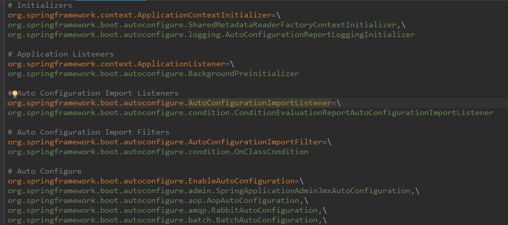

下图有助于我们形象理解自动配置流程
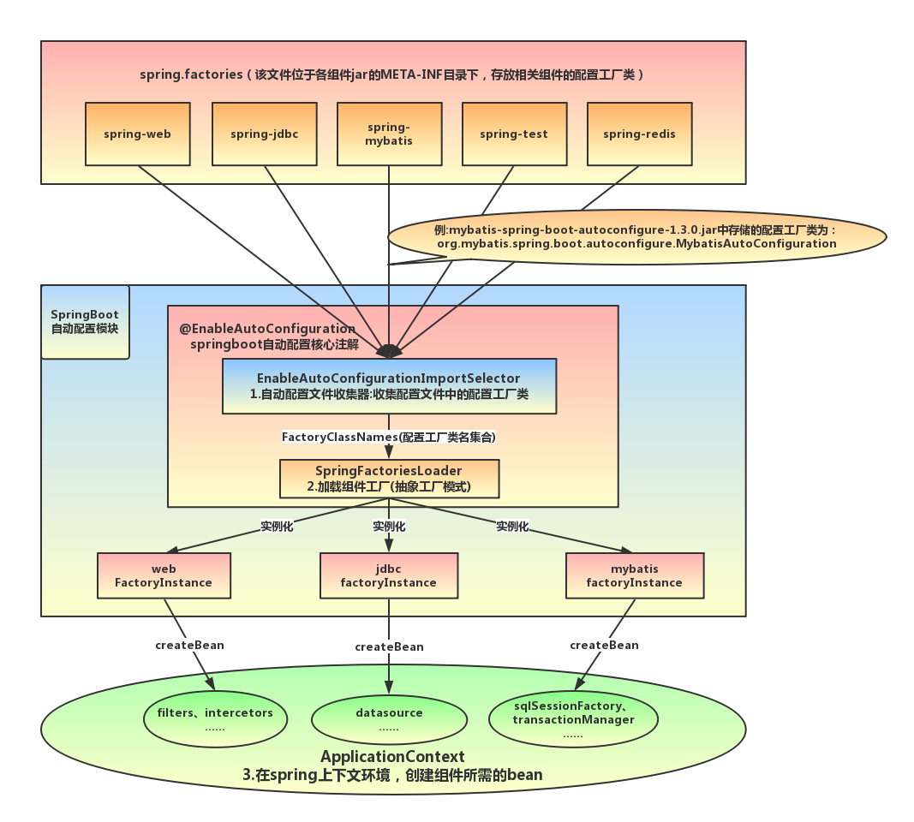
mybatis-spring-boot-starter、spring-boot-starter-web等组件的META-INF文件下均含有spring.factories文件，自动配置模块中，SpringFactoriesLoader收集到文件中的类全名并返回一个类全名的数组，返回的类全名通过反射被实例化，就形成了具体的工厂实例，工厂实例来生成组件具体需要的bean。


