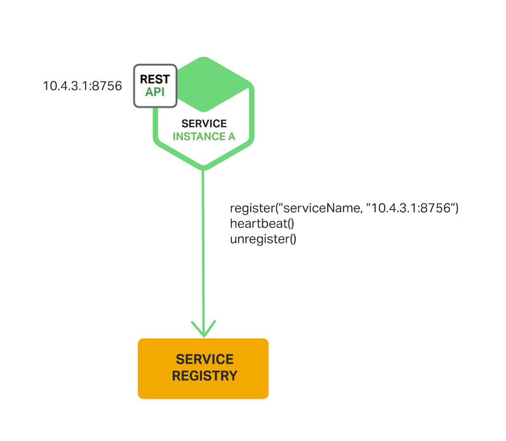

*  目录
{:toc}

<!--more-->

## Microservices概述

### 微服务架构的特点

Monolithic架构主要存在以下问题：

- 系统间通常以API的形式互相访问，耦合紧密导致难以维护；
- 各业务领域需要采用相同的技术栈，难以快速应用新技术；
- 对系统的任何修改都必须整个系统一起重新部署/升级，运维成本高；
- 在系统负载增加时，难以进行水平扩展；
- 当系统中一处出现问题，会影响整个系统；

Martin Fowler在他的文章中总结了微服务的特点：

- 围绕业务功能进行组织（organized around business capability），不再是以前的纵向切分，而改为按业务功能横向划分，一个微服务最好由一个小团队针对一个业务单元来构建。
- 做产品而非做项目（product not project），不再是做完一个个项目，交付后就完工了，而是做产品，从设计编码到产品运维，做到全过程掌控和负责，即自己构建，自己运维（you build it，you run it）。
- 智能终端加简单通道（smart endpoints and dumb pipe），使用基于资源的API，将大量逻辑放在客户端，而服务器端则着重于提供资源，推荐基于Web而不是在Web之后做复杂逻辑（be of the Web，not behind the Web）。
- 去中心化管理（decentralized governance），自行其是，自我管理，不必在局限在一个系统里，不必围绕着一个中心。
- 去中心化数据管理（decentralized data management），只管理和维护自己的数据，相互之间互不直接访问彼此的数据，只通过API来存取数据。
- 基础设施自动化（infrastructure automation），每个微服务应该关注于自己的业务功能实现，基础设施应该尽量自动化——构建自动化、测试自动化、部署自动化、监控自动化。
- 为应对失败而设计（design for failure），设计之初就要考虑高可靠性（high reliability）和灾难恢复（disaster recover），并考虑如何着手进行错误监测和错误诊断。
- 演进式设计（evolutionary design），没有完美的架构，唯一不变的是变化。要善于应对变化，容易改变其设计和实现，因为其小，故而易变。

优点：

- 单一职责，逻辑清晰
- 自治
- 简化部署
- 可扩展
- 技术异构
- 高可靠

缺点：

- 分布式系统，交互，错误的处理，复杂度高
	- 服务调⽤用要考虑被调⽤方故障、过载、消息丢失等各种异常情况，代码逻辑更加复杂；
	- 对于微服务间的事务性操作，因为不同的微服务采⽤了不同的数据库，将⽆法利用数据库本身的事务机制保证一致性，需要引⼊二阶段提交等技术
- 运维复杂。在采用微服务架构时，系统由多个独立运行的微服务构成，需要一个设计良好的监控系统对各个微服务的运行状态进行监控。运维人员需要对系统有细致的了解才对够更好的运维系统。
- 影响性能。相对于Monolithic架构，微服务的间通过REST、RPC等形式进行交互，通信的时延会受到较大的影响。
- 分库，考虑一致性问题
- 测试。涉及多个服务之间的自动化测试也具备相当的挑战性；
- 改变服务
- 自动化

## 使用API Gateway构建微服务

 优点：
 
 - 可以并行发送请求
 - 可以组合出结果时，不需要异步回调，而用reactive写声明式的代码。比如Java8中的CompletableFuture. Netflix在它们的API Gateway中专为JVM创造了RxJava

## 微服务架构下的进程间通信

 | One-to-One | One-to-Many
-----| --------- | ------------
Synchronous | Request/Response | -
Asynchronous | Notification(Request/async response) | Publish/Subscribe(Publish/async response)

## 微服务之负载均衡

负载均衡可以分为两种：服务端负载均衡和客户端负载均衡。通常所说的负载均衡指服务器负载均衡，可通过硬件设备或软件来实现，硬件比如：F5、Array等，软件比如：LVS、Nginx等，类似的架构图如下：

通过硬件或软件实现负载均衡均会维护一个服务端清单，利用心跳检测等手段进行清单维护，保证清单中都是可以正常访问的服务节点。当用户发送请求时，会先到达负载均衡器（也相当于一个服务），负载均衡器根据负载均衡算法（轮训、随机、加权轮训）从可用的服务端列表中取出一台服务端的地址，接着进行转发，降低系统的压力。

而对于客户端负载均衡来说，与服务端负载均衡的主要区分点在于服务清单的存放位置。在客户端负载均衡中，客户端自己会存储一份服务端清单，它是通过从注册中心（Eureka服务注册中心）进行抓取得到的，同时也需要对此进行维护。

## 微服务架构中的服务发现

### The Client‑Side Discovery Pattern

> Netflix Eureka is a service registry. It provides a REST API for managing service‑instance registration and for querying available instances.
> 
> 客户端发现机制有诸多优势和劣势：该模式除了服务注册表之外没有其他的活动部分了，相对来说还是简单直接的，而且，由于客户端知道相关的可用服务实例，那么就可以使用更加智能的，特定于应用的负载均衡机制，比如一致性哈希。一个明显的缺点是它把客户端与服务注册表紧耦合了，你必须为每一种消费服务的客户端对应的编程语言和框架实现服务发现逻辑。

### The Server‑Side Discovery Pattern

> The AWS Elastic Load Balancer (ELB) is an example of a server-side discovery router. 
> 
> 服务端发现模式有一些优势也有一些劣势：一个巨大的优势是，服务发现的细节对客户端来说是抽象的，客户端仅需向负载均衡器发送请求即可。这种方式减少了为消费服务的不同编程语言与框架实现服务发现逻辑的麻烦。当然，正如前面所述，一些部署环境已经提供了该功能。这种模式也有一些劣势： 除非部署环境已经提供了负载均衡器，否则这又是一个需要额外设置和管理的可高可用的系统组件。

### 服务注册

> Netflix achieves high availability by running one or more Eureka servers in each Amazon EC2 availability zone. Each Eureka server runs on an EC2 instance that has an Elastic IP address. DNS TEXT records are used to store the Eureka cluster configuration, which is a map from availability zones to a list of the network locations of Eureka servers. When a Eureka server starts up, it queries DNS to retrieve the Eureka cluster configuration, locates its peers, and assigns itself an unused Elastic IP address.

> DNS TEXT records 存储Eureka集群配置——Map\<AZ, List\<Eureka server网络地址>>，当Eureka server启动时，去查询DNS获取Eureka集群配置信息，定位它的peers，并分配一个没有使用的Elastic IP 地址。

>Eureka clients – services and service clients – query DNS to discover the network locations of Eureka servers. Clients prefer to use a Eureka server in the same availability zone. However, if none is available, the client uses a Eureka server in another availability zone.

服务注册还包括：
 
- etcd
- Consul
- Zookeeper

### 服务注册选项

#### 自己主动注册（The Self‑Registration Pattern）

Netflix OSS Eureka client是个典型的样例，Spring Cloud项目实现了多种模式，包括服务发现，使通过Eureka自动注册你的服务实例变得非常简单，你只需要注解你的Java配置文件为`@EnableEurekaClient`

#### The Third‑Party Registration Pattern

开源项目Registrator是个典型的案例，可以支持多种注册方式，如etcd和Consul, Netflix OSS Prana也是，它是一个sidecar application，与Netflix Eureka共同工作。

> The service registrar is a built‑in component of deployment environments. The EC2 instances created by an Autoscaling Group can be automatically registered with an ELB. Kubernetes services are automatically registered and made available for discovery.

**除非是内置在部署环境中的，否则它也是一个你需要配置和维护的高可用的组件。**

## 微服务中事件驱动数据管理
参考[分布式事物](../_posts/2018-09-06-SQL-XA.md)

## 微服务部署策略

### 多个实例跑在一个主机上面

- 每个服务实例跑在一个port上
- 每个实例是一个进程或者进程组——tomcat server
- 多个实例跑在一个进程或者进程组——比如部署多个Java web应用在同一个Tomcat server

优点：

- 资源利用率相对较高
- 部署相对较快，你只需要copy service到host上，然后启动起来
- 启动也非常快

缺点：

- 不能限制每个实例对资源的使用
- 没有隔离，会相互影响，比如共享JVM heap
- 没法监控资源的使用
- 操作团队必须了解如何启动每个应用

### 每个主机上一个实例

#### Service Instance per Virtual Machine
每个服务打包为一个虚拟机镜像。
优点：

- 完全独立
- 可以使用成熟的云基础设施
- 封装了服务的实现技术

缺点：

- 资源利用率低
- 部署一个新版本的服务较慢

#### Service Instance per Container Pattern