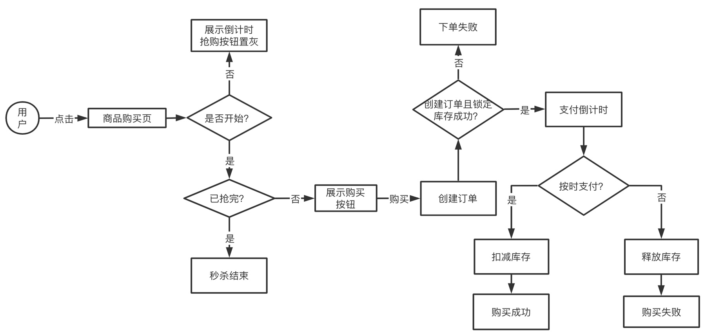
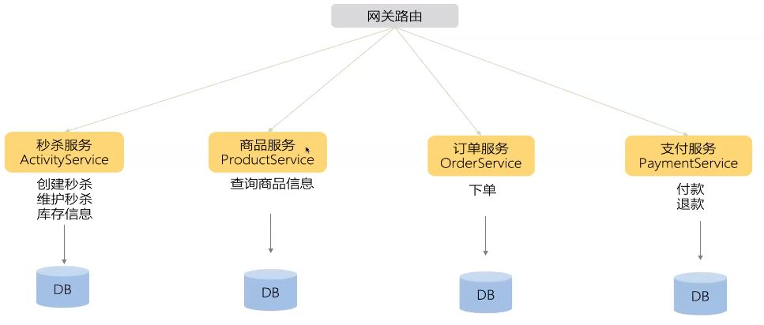
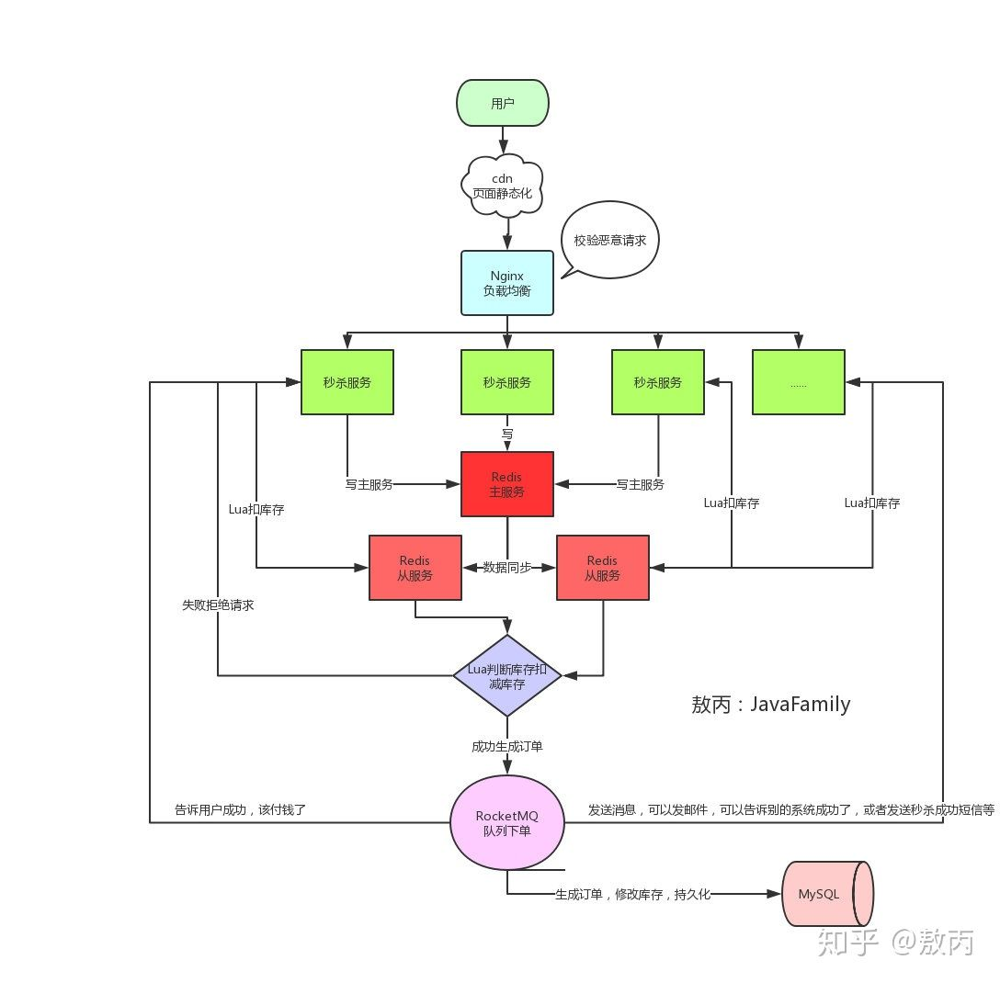
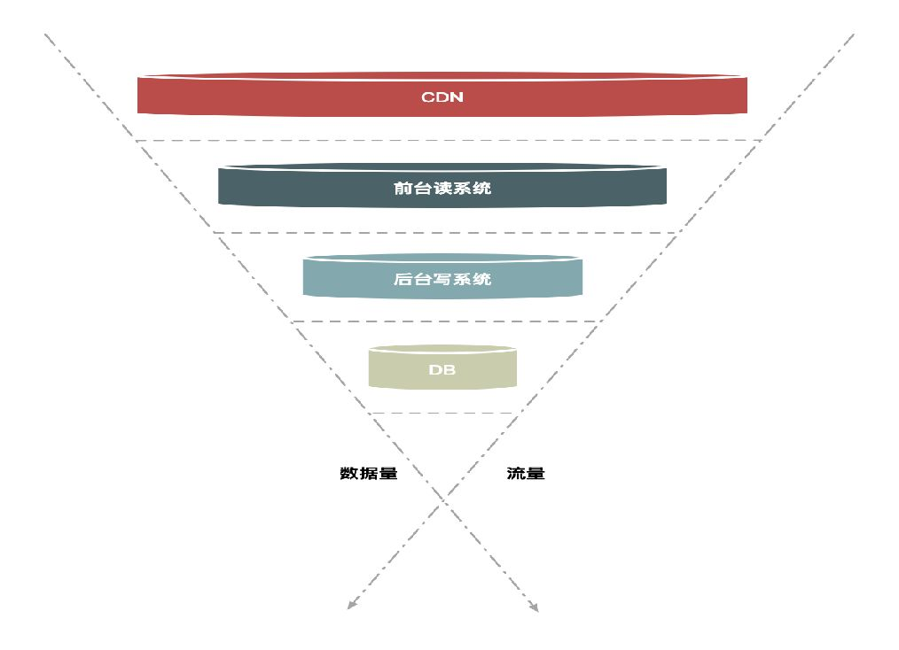
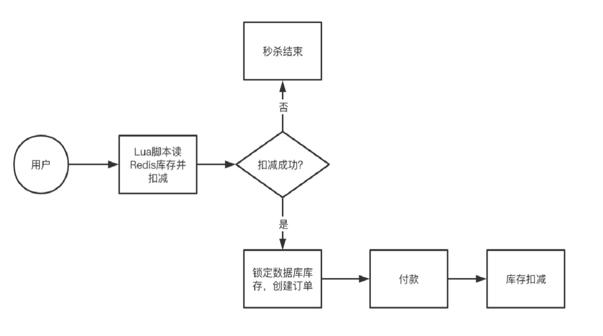
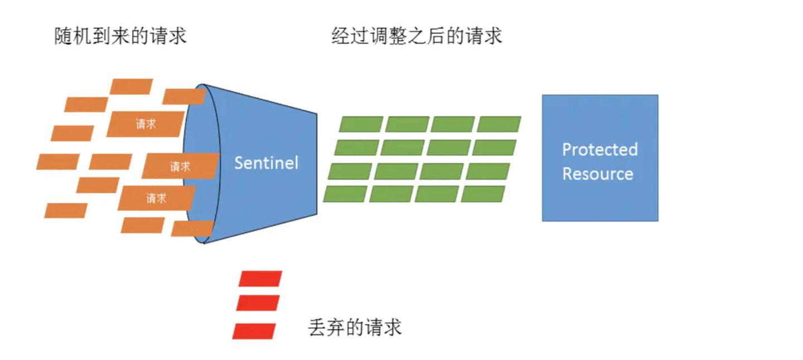

*  目录
{:toc}

<!--more-->

## 架构分层和分类
架构分类可细分为业务架构、应用架构、技术架构, 代码架构, 部署架构

业务架构是战略，应用架构是战术，技术架构是装备。其中应用架构承上启下，一方面承接业务架构的落地，另一方面影响技术选型。

熟悉业务，形成业务架构，根据业务架构，做出相应的应用架构，最后技术架构落地实施。

所有问题的前提要搞清楚我们今天面临的业务量有多大，增长走势是什么样，而且解决高并发的过程，一定是一个循序渐进逐步的过程。合理的架构能够提前预见业务发展1~2年为宜。这样可以付出较为合理的代价换来真正达到技术引领业务成长的效果。

### 技术架构
主要考虑系统的非功能性特征，对系统的高可用、高性能、扩展、安全、伸缩性、简洁等做系统级的把握。

### 衡量架构的合理性
1. 业务需求角度
	- 能解决当下业务需求和问题
	- 高效完成业务需求: 能以优雅且可复用的方式解决当下所有业务问题
	- 前瞻性设计: 能在未来一段时间都能以第2种方式满足业务，从而不会每次当业务进行演变时，导致架构翻天覆地的变化。
2. 非业务需求角度
	- 稳定性。指标：
		- 高可用：要尽可能的提高软件的可用性，我想每个操作人都不愿意看到自己的工作无法正常进行。黑盒白盒测试、单元测试、自动化测试、故障注入测试、提高测试覆盖率等方式来一步一步推进。
	- 高效。指标：
		- 文档化：不管是整体还是部分的整个生命周期内都必须做好文档化，变动的来源包括但不限于BUG，需求。
		- 可扩展：软件的设计秉承着低耦合的理念去做，注意在合理的地方抽象。方便功能更改、新增和运用技术的迭代，并且支持在适时对架构做出重构。
		- 高复用：为了避免重复劳动，为了降低成本，我们希望能够重用之前的代码、之前的设计。这点对于架构环境的依赖是最大的。
	- 安全指标
		- 安全：组织的运作过程中产生的数据都是具有商业价值的，保证数据的安全也是刻不容缓的一部分。以免出现XX门之类丑闻。加密、https等为普遍手段

### ⾼并发原则（性能）
1. 无状态
	- 无状态应⽤，便于水平扩展
	- 有状态配置可通过配置中心实现⽆状态
	- 实践: Disconf、Yaconf、Zookpeer、Consul、Confd、Diamond、Xdiamond等
2. 拆分
	- 系统维度：按照系统功能、业务拆分，如购物车，结算，订单等（垂直拆分）
	- 功能维度：对系统功能在做细粒度拆分
	- 读写维度：根据读写比例特征拆分；读多，可考虑多级缓存；写多，可考虑分库分表
	- AOP维度：根据访问特征，按照AOP进行拆分，⽐如商品⻚可分为CDN、⻚面渲染系统，CDN就是⼀个AOP系统
	- 模块维度：对整体代码结构划分Web、Service、DAO（横向拆分）
3. 服务化
	- 服务化演进: 进程内服务-单机远程服务-集群手动注册服务-自动注册和发现服务-服务的分组、隔离、路由-服务治理
	- 考虑服务分组、隔离、限流、⿊白名单、超时、重试机制、路由、故障补偿等
	- 实践：利用Nginx、HaProxy、LVS等实现**负载均衡**，ZooKeeper、Consul等实现⾃动注册和发现服4. 消息队列
	- 目的: 服务解耦(⼀对多消费)、异步处理、流量削峰缓冲等
	- ⼤流量缓冲：牺牲强⼀致性，保证最终⼀致性(案例：库存扣减，现在Redis中做扣减，记录扣减⽇志，通过后台进程将扣减⽇志应用到DB)
	- 数据校对: 解决异步消息机制下消息丢失问题
5. 数据异构
	- 数据异构: 通过消息队列机制接收数据变更，原⼦化存储
	- 数据闭环: 屏蔽多从数据来源，将数据异构存储，形成闭环
6. 缓存银弹
	- ⽤户层:
		- DNS缓存
		- 浏览器DNS缓存
		- 操作系统DNS缓存
		- 本地DNS服务商缓存
		- DNS服务器缓存
		- 客户端缓存
		- 浏览器缓存(Expires、Cache-Control、Last-Modified、Etag)* App客户缓存(js/css/image...)
	- 代理理层：
		- CDN缓存(⼀般基于ATS、Varnish、Nginx、Squid等构建,边缘节点-⼆级节点-中心节点-源站)
	- 接⼊层：
		- Nginx为例：Proxy_cache：代理理缓存,可以存储到/dev/shm或者SSD
		- FastCGI Cache
		- Nginx+Lua+Redis: 业务数据缓存
		- PHP为例：Opcache：缓存PHP的Opcodes
	- 应⽤层：
		- ⻚面静态化
		- 业务数据缓存(Redis/Memcached/本地⽂件等)
		- 消息队列
	- 数据层：
		- NoSQL： Redis、Memcache、SSDB等
		- MySQL： Innodb/MyISAM等Query Cache、Key Cache、InnodbBuffer Size等
	- 系统层：
		- CPU : L1/L2/L3 Cache/NUMA
		- 内存
		- 磁盘：磁盘本身缓存、dirty_ratio/dirty_background_ratio、阵列卡本身缓存
7. 并发化

### ⾼可⽤原则
- 服务熔断：
	- 如果检查出来频繁超时，就把consumer调用provider的请求，直接短路掉，不实际调⽤，⽽是直接返回一个mock的值。
- 降级
	- consumer 端：consumer 如果发现某个provider出现异常情况，⽐如，经常超时(可能是熔断引起的降级)，数据错误，这时，consumer可以采取一定的策略略，降级provider的逻辑，基本的有直接返回固定的数据。
	- provider 端：当provider 发现流量激增的时候，为了保护⾃身的稳定性，也可能考虑降级服务。⽐如，1，直接给consumer返回固定数据，2，需要实时写⼊数据库的，先缓存到队列⾥，异步写⼊数据库。
	- 降级开关集中化管理：将开关配置信息推送到各个应⽤
	- 可降级的多级读服务：如服务调用降级为只读本地缓存
	- 开关前置化：如Nginx+lua(OpenResty)配置降级策略，引流流量；可基于此做灰度策略
	- 业务降级：⾼并发下，保证核⼼功能，次要功能可由同步改为异步策略或屏蔽功能
- 限流
	- 目的: 防⽌恶意请求攻击或超出系统峰值
	- 实践：
		- 恶意请求流量只访问到Cache
		- 穿透后端应⽤的流量使⽤Nginx的limit处理
		- 恶意IP使用Nginx Deny策略或者iptables拒绝
- 切流量
	- 目的：屏蔽故障机器
	- 实践:
		- DNS: 更改域名解析⼊口，如DNS POD可以添加备用IP，正常IP故障时，会⾃主切换到备用地址;⽣效实践较慢
		- HttpDNS: 为了绕过运营商LocalDNS实现的精准流量调度
		- LVS/HaProxy/Nginx: 摘除故障节点
- 可回滚
	- 发布版本失败时可随时快速回退到上一个稳定版本
- 伸缩性：建集群，是否快速应对大规模增长的流量，容易添加新的机器
- 数据备份
- 监控报警

### 安全性
网站的各种攻击，各种漏洞是否堵住，架构是否可以做到限流作用，防止ddos攻击。

- xss攻击
- sql注入
- csr攻击
- web防火墙漏洞
- 安全漏洞
- ssl

#### 接⼝限流⽅法？
- 限制总并发数（⽐如数据库连接池、线程池）
- 限制瞬时并发数（如nginx的limit_conn模块，⽤来限制瞬时并发连接数）
- 限制时间窗口内的平均速率（如Guava的RateLimiter、nginx的limit_req模块，限制每秒的平均速率）
- 限制远程接⼝调⽤速率
- 限制MQ的消费速率
- 可以根据⽹络连接数、⽹络流量、CPU或内存负载等来限流

#### 业务设计原则
- 防重设计
- 幂等设计
- 流程定义
- 状态与状态机
- 后台系统操作可反馈
- 后台系统审批化]
- 文档注释
- 备份

## 架构演进

- 初始阶段：LAMP,部署在一台服务器
- 应用服务器和数据服务器分离
- 使用缓存改善性能
- 使用集群改善并发
- 数据库地读写分离
- 使用反向代理和cdn加速
- 使用分布式文件和分布式数据库
- 业务拆分
- 分布式服务

### cdn（异地多活）
1. 异地多活：异地多活指分布在异地的多个站点同时对外提供服务的业务场景。异地多活是⾼可⽤架构设计的⼀种，与传统的灾备设计的最主要区别在于“多活”，即所有站点都是同时在对外提供服务的。
2. 两地容灾切换方案：容灾是异地多活中最核⼼的一环，以两个城市异地多活部署架构图为例：
3. 多城异地多活：多城市异地多活模式指的是3个或者3个以上城市间部署异地多活。该模式下存在中心节点和单元节点：

## 秒杀系统设计

1. 秒杀链接加盐,把URL动态化.链接要是提前暴露出去可能有人直接访问url就提前秒杀了
2. nginx恶意请求拦截，一般单个用户请求次数太夸张，不像人为的请求在网关那一层就得拦截掉了，不然请求多了他抢不抢得到是一回事，服务器压力上去了，可能占用网络带宽或者把服务器打崩、缓存击穿等等。
2. Redis集群
3. 资源静态化,秒杀一般都是特定的商品还有页面模板，现在一般都是前后端分离的，所以页面一般都是不会经过后端的，但是前端也要自己的服务器啊，那就把能提前放入cdn服务器的东西都放进去，反正把所有能提升效率的步骤都做一下，减少真正秒杀时候服务器的压力。
4. 前端限流和后端限流
5. 库存预热,提前把商品的库存加载到Redis中，让整个流程都在Redis里面去做，然后等秒杀介绍了，再异步的去修改库存就好了
6. 限流&降级&熔断&隔离
7. 削峰填谷

1. 问题1：如何应对瞬时大流量高并发？
	
	拿双十一的电商秒杀来说，系统能否承载瞬时大流量高并发就是一大难点。高并发问题的解决思路是分层过滤，分而治之。即在不同的层次尽可能地过滤掉无效请求，让“漏斗”最末端的才是有效请求。
	
	具体方法：

	1. 页面静态化
	2. 缓存预热
	3. 异步化
	4. 削峰值填谷，通过消息队列异步地创建订单
2. 问题2：有限库存，如何防止超卖？
	
	秒杀的本质，就是对库存的抢夺，当每个秒杀的用户来都去数据库查询库存校验库存，然后扣减库存，导致数据库崩溃。由于MySQL 数据库单点能支撑 1000 QPS，但是 Redis 单点能支撑 10万 QPS。所以解决方案是将库存信息加载到Redis中，将MySQL的访问压力转移到Redis上，直接通过 Redis 来判断并扣减库存。防止超卖的解决方案是：将库存信息加载到Redis中，将MySQL的访问压力转移到Redis上，直接通过 Redis 来判断并扣减库存。

	
3. 问题3：如何保障系统稳定和高可用？
	
	当秒杀的用户量超过预计，请求量超过服务器最大承载压力怎么办？解决方案：流量控制（flow control），其原理是监控应用流量的 QPS 或并发线程数等指标，当达到指定的阈值时对流量进行控制，以避免被瞬时的流量高峰冲垮，保护系统不会被压垮，从而保障应用的高可用性。(**风控**)

		
	
	当有服务出现故障，不可用时如何应对？

	在互联网系统中，当下游服务因访问压力过大而响应变慢或失败，上游服务为了保护系统整体的可用性，可以暂时切断对下游服务的调用。
4. 问题4：如何限制用户购买商品件数？
	
	一般会使用 Redis 提供的计数功能，记录用户的购买次数	