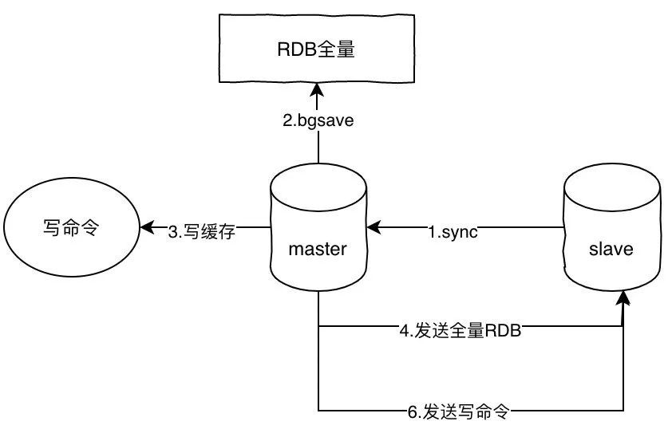
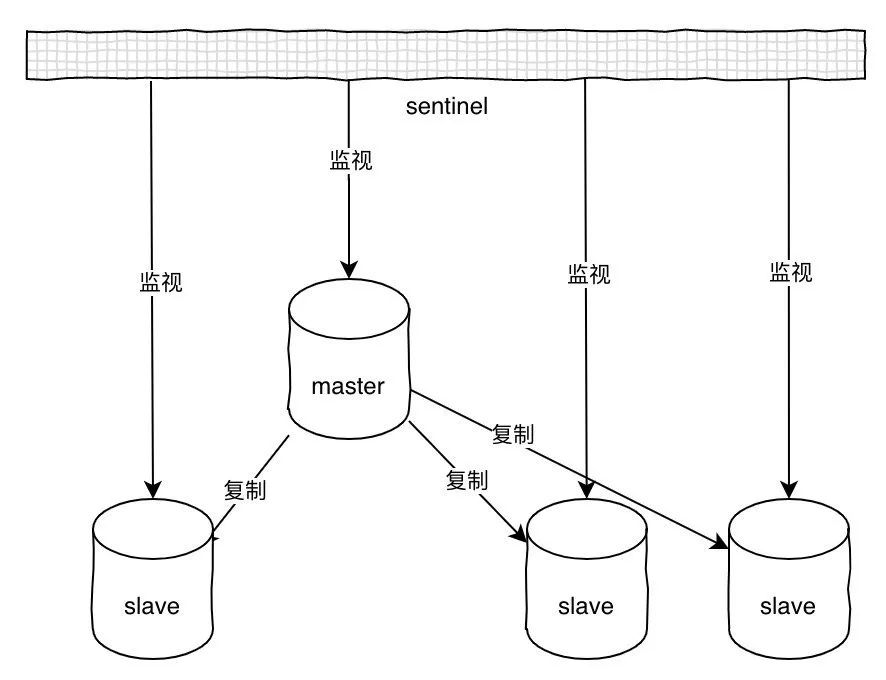
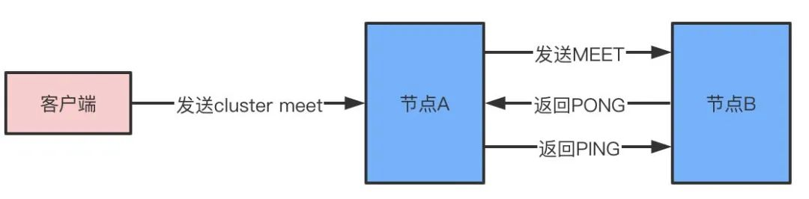
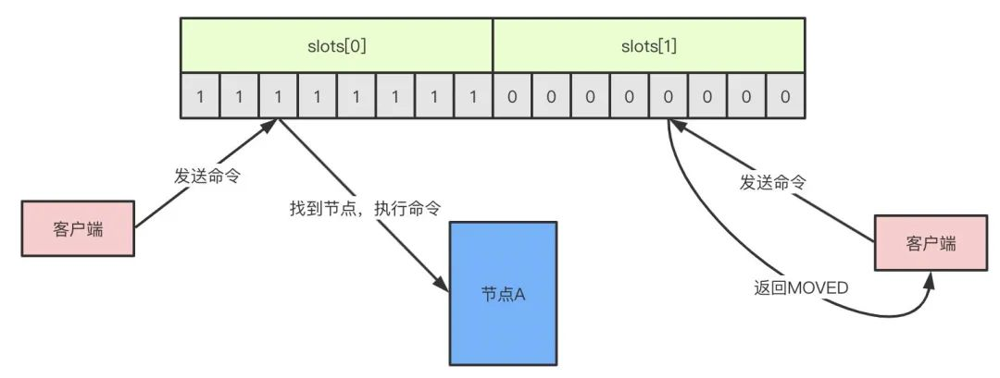

*  目录
{:toc}
	
	
<!--more-->

## redis 常见数据结构以及使用场景分析

1. String.  

	>常用命令: set,get,decr,incr,mget 等。 
	
	String数据结构是简单的key-value类型，value其实不仅可以是String，也可以是数字。 常规key-value缓存应用;   
	常规计数:微博数，粉丝数等。

2. Hash

	> 常用命令: hget,hset,hgetall 等。   
	
	Hash 是一个 string 类型的 field 和 value 的映射表，hash 特别适合用于存储对象，后续操作的时候，你可以直接仅仅修改这个对象中的某个字段的值。 比如我们可以Hash数据结构来存储用户信息，商品信息等等。比如下面我就用 hash 类型存放了我本人的一些信息:
	
	```
	key=JavaUser293847
	value={
	  “id”: 1,
	  “name”: “SnailClimb”,
	  “age”: 22,
	  “location”: “Wuhan, Hubei”
	}
	```
3. List

	> 常用命令: lpush,rpush,lpop,rpop,lrange等
	
	list 就是链表，Redis list 的应用场景非常多，也是Redis最重要的数据结构之一，比如微博的关注列表，粉丝列表， 消息列表等功能都可以用Redis的 list 结构来实现。
	
	Redis list 的实现为一个双向链表，即可以支持反向查找和遍历，更方便操作，不过带来了部分额外的内存开销。 另外可以通过 lrange 命令，就是从某个元素开始读取多少个元素，可以基于 list 实现分页查询，这个很棒的一个功能，基于 redis 实现简单的高性能分页，可以做类似微博那种下拉不断分页的东西(一页一页的往下走)，性能高。 
4. Set
	
	> 常用命令: sadd,spop,smembers,sunion 等
	
	set 对外提供的功能与list类似是一个列表的功能，特殊之处在于 set 是可以自动排重的。当你需要存储一个列表数据，又不希望出现重复数据时，set是一个很好的选择，并且set提供了判断某个成员是否在 一个set集合内的重要接口，这个也是list所不能提供的。可以基于 set 轻易实现交集、并集、差集的操作。   
	比如:在微博应用中，可以将一个用户所有的关注人存在一个集合中，将其所有粉丝存在一个集合。Redis可以非常 方便的实现如共同关注、共同粉丝、共同喜好等功能。这个过程也就是求交集的过程，具体命令如下:`sinterstore key1 key2 key3 将交集存在key1内`
5. Sorted Set
	> 常用命令: zadd,zrange,zrem,zcard等
	
	和set相比，sorted set增加了一个权重参数score，使得集合中的元素能够按score进行有序排列。
举例: 在直播系统中，实时排行信息包含直播间在线用户列表，各种礼物排行榜，弹幕消息(可以理解为按消息维 度的消息排行榜)等信息，适合使用 Redis 中的 SortedSet 结构进行存储。
	
## Redis为什么这么快
1. 完全基于内存   
  Redis完全基于内存，大部分都是简单的存取操作，大量的时间花费在IO上。Redis绝大部分操作时间复杂度为O(1)，所以速度十分快。
2. 非阻塞IO、多路IO复用模型
3. 单线程   
	对于单线程来讲，不存在上下文切换问题，也不用考虑锁的问题，不存在加锁释放锁的操作，没有因为可能出现死锁而导致的性能消耗。虽然单线程无法发挥出多个CPU的性能，但是可以在单机开启多个Redis实例解决这个问题。reids的单线程是指处理网络请求只有一个线程。
	
	Redis为什么没有“锁”
	
	在关系型数据库中，会通过加锁来保证数据的一致性，这种锁被称为悲观锁。Redis为了近可能的减少客户端等待，使用WATCH命令对数据加锁，只会在数据被其他客户端修改时，才会通知执行WATCH的客户端，之后的事务不会执行。这种加锁方式被称为乐观锁，极大的提升了Redis的性能。
4. 数据结构简单   
	数据结构设计简单，对数据的操作也简单，Redis中的数据结构是专门进行设计的。Redis的数据结构有简单动态字符串、链表、字典、跳跃表、整数集合、压缩字典，对象。
	
	- 字符串：redis没有直接使用C语言传统的字符串表示，而是自己实现的叫做简单动态字符串SDS的抽象类型。C语言的字符串不记录自身的长度信息，而SDS则保存了长度信息，这样将获取字符串长度的时间由O(N)降低到了O(1)，同时可以避免缓冲区溢出和减少修改字符串长度时所需的内存重分配次数。
	- 链表linkedlist：redis链表是一个双向无环链表结构，很多发布订阅、慢查询、监视器功能都是使用到了链表来实现，每个链表的节点由一个listNode结构来表示，每个节点都有指向前置节点和后置节点的指针，同时表头节点的前置和后置节点都指向NULL。
	- 字典hashtable：用于保存键值对的抽象数据结构。redis使用hash表作为底层实现，每个字典带有两个hash表，供平时使用和rehash时使用，hash表使用链地址法来解决键冲突，被分配到同一个索引位置的多个键值对会形成一个单向链表，在对hash表进行扩容或者缩容的时候，为了服务的可用性，rehash的过程不是一次性完成的，而是渐进式的。
	- 跳跃表skiplist：跳跃表是有序集合的底层实现之一，redis中在实现有序集合键和集群节点的内部结构中都是用到了跳跃表。redis跳跃表由zskiplist和zskiplistNode组成，zskiplist用于保存跳跃表信息（表头、表尾节点、长度等），zskiplistNode用于表示表跳跃节点，每个跳跃表的层高都是1-32的随机数，在同一个跳跃表中，多个节点可以包含相同的分值，但是每个节点的成员对象必须是唯一的，节点按照分值大小排序，如果分值相同，则按照成员对象的大小排序。
	- 整数集合intset：用于保存整数值的集合抽象数据结构，不会出现重复元素，底层实现为数组。
	- 压缩列表ziplist：压缩列表是为节约内存而开发的顺序性数据结构，他可以包含多个节点，每个节点可以保存一个字节数组或者整数值。
	
	基于这些基础的数据结构，redis封装了自己的对象系统，包含字符串对象string、列表对象list、哈希对象hash、集合对象set、有序集合对象zset，每种对象都用到了至少一种基础的数据结构。
5. 底层模型不同   
	Redis使用的底层模型不同，它们之间底层实现方式以及与客户端之间通信的应用协议不一样，Redis直接自己构建了VM机制，因为一般的系统调用系统函数的话，会浪费一定的时间去移动和请求。
  Redis采用了RDB文件和VM机制来分别实现二进制存储、冷热淘汰的功能。  

## 从海量key里面查询出某一固定前缀的key -- 摸清数据规模，即问清楚边界
keys pattern：查找所有符合给定模式pattern的KEY -- 这个是面试官会问：使用keys对线上业务的影响

1. KEYS指令一次性返回所有匹配的key
2. 键的数量过大会使服务卡顿 

scan cursor [MATCH pattern][COUNT count] -- 不会使服务卡顿

1. 基于游标的迭代器，需要基于上一次的游标延续之前的迭代过程
2. 以0作为游标开始一次新的迭代，直到命令返回游标0完成一次迭代
3. 不保证每次执行都返回某个给定数量的元素，支持模糊查询
4. 一次返回的数量不可控，只能是大概率符合count参数
5. 会有一定的重复概率，在客户端做一次去重就可以了

## 那为什么Redis6.0之后又改用多线程呢?

redis使用多线程并非是完全摒弃单线程，redis还是使用单线程模型来处理客户端的请求，只是使用多线程来处理数据的读写和协议解析，执行命令还是使用单线程。
这样做的目的是因为redis的性能瓶颈在于网络IO而非CPU，使用多线程能提升IO读写的效率，从而整体提高redis的性能。   

## 如何通过Redis实现分布式锁
分布式锁需要解决的问题：

1. 互斥性
2. 安全性
3. 死锁
4. 容错

SETNX key value：如果key不存在，则创建并赋值。创建成功返回1，失败返回0. 所以如果有线程设置了，那它就不能执行成功。

EXPIRE key seconds

缺点：不满足原子性，如果SETNX后，EXPIRE前失效了，那么就没办法释放了。

所以 SET KEY VALUE [EX seconds][PX millisecondseconds][NX|XX]

- EX second: 设置键过期时间为second秒
- PX millisecond：设置键过期时间为毫秒
- NX：只在键不存在时，才对键进行设置操作
- XX：只在键已经存在时，才对键进行设置操作
- 操作成功返回OK，否则返回NIL

获取锁之后使用，使用完成了最后del lock_user_1释放锁。上面的方案不完美的主要原因是释放锁这里控制的还不是很到位，那么有没有其它方法可以控制释放锁的线程和加锁的线程一定是同一个客户端呢？

**random value + lua script**

```
 // 加锁
 SET resource_name my_random_value NX PX 30000
 
 // 释放锁
 if redis.call("get",KEYS[1]) == ARGV[1] then
     return redis.call("del",KEYS[1])
 else
     return 0
 end
```

加锁的时候，设置随机值，保证这个随机值只有当前客户端自己知道。   
释放锁的时候，执行一段lua脚本，把这段lua脚本当成一个完整的命令，先检查这个锁对应的值是不是上面设置的随机值，如果是再执行del释放锁，否则直接返回释放锁失败。   
我们知道，redis是单线程的，所以这段lua脚本中的get和del不会存在并发问题，但是不能在java中先get再del，这样会当成两个命令，会有并发问题，lua脚本相当于是一个命令一起传输给redis的。   
这种方案算是比较完美了，但是还有一点小缺陷，就是这个过期时间设置成多少合适呢？   
设置的过小，有可能上一个线程还没执行完锁内逻辑，锁就自动释放了，导致另一个线程可以获取锁了，就出现并发问题了；   
设置的过大，就要考虑客户端断线了，这个锁要等待很长一段时间。   
所以，这里又衍生出一个新的问题，过期时间我设置小一点，但是快到期了它能自动续期就好了。    

大量的key同时过期的注意事项：

集中过期，由于消除大量的key很耗时，会出现短暂的卡顿现象 -- 在设置key的过期时间的时候，给每个key加上随机值

好在现成的轮子redisson已经帮我们把这个逻辑都实现好了，我们拿过来直接用就可以了。   
而且，redisson充分考虑了redis演化过程中留下的各种问题，单机模式、哨兵模式、集群模式，它统统都处理好了，不管是从单机进化到集群还是从哨兵进化到集群，都只需要简单地修改下配置就可以了，不用改动任何代码，可以说是非（业）常（界）方（良）便（心）。
o

## Redis如何做异步队列
使用list作为队列，RPUSH生成消息，LPOP消费消息

缺点：没有等待队列里面有值就消息，但是可以通过在应用层面引入sleep机制去调用LPOP重试 

另一种方法是BLPOP key [key...] timeout: 阻塞直到队列里有消息或者超时

缺点：只能提供一个消费者消费

pub/sub主题订阅者模式

缺点：消息的发布是无状态的，无法保证可达，且即发即收。当消费者下线时，生产的消息会丢失。

## Redis如何实现延时队列

使用sortedset，使用时间戳做score, 消息内容作为key,调用zadd来生产消息，消费者使用zrangbyscore获取n秒之前的数据做轮询处理。

## Redis常见的性能问题和解决方案

1. master最好不要做持久化工作，如RDB内存快照和AOF日志文件
2. 如果数据比较重要，某个slave开启AOF备份，策略设置成每秒同步一次
3. 为了主从复制的速度和连接的稳定性，master和Slave最好在一个局域网内
4. 尽量避免在压力大得主库上增加从库
5. 主从复制不要采用网状结构，尽量是线性结构，Master<--Slave1<----Slave2 ...

## Redis如何做内存优化？
尽可能使用散列表（hashes），散列表（是说散列表里面存储的数少）使用的内存非常小，所以你应该尽可能的将你的数据模型抽象到一个散列表里面。比如你的web系统中有一个用户对象，不要为这个用户的名称，姓氏，邮箱，密码设置单独的key,而是应该把这个用户的所有信息存储到一张散列表里面

## Redis如何发现热点key

- 凭借经验，进行预估：例如提前知道了某个活动的开启，那么就将此Key作为热点Key。
- 服务端收集：在操作redis之前，加入一行代码进行数据统计。
- 抓包进行评估：Redis使用TCP协议与客户端进行通信，通信协议采用的是RESP，所以自己写程序监听端口也能进行拦截包进行解析。
- 在proxy层，对每一个 redis 请求进行收集上报。
- Redis自带命令查询：Redis4.0.4版本提供了redis-cli –hotkeys就能找出热点Key。（如果要用Redis自带命令查询时，要注意需要先把内存逐出策略设置为allkeys-lfu或者volatile-lfu，否则会返回错误。进入Redis中使用config set maxmemory-policy allkeys-lfu即可。）


## 知道什么是热key吗？热key问题怎么解决？

所谓热key问题就是，突然有几十万的请求去访问redis上的某个特定key，那么这样会造成流量过于集中，达到物理网卡上限，从而导致这台redis的服务器宕机引发雪崩。

针对热key的解决方案：

- 提前把热key打散到不同的服务器，降低压力. 即将热点Key+随机数，随机分配至Redis其他节点中。这样访问热点key的时候就不会全部命中到一台机器上了。
- 加入二级缓存，提前加载热key数据到内存中，如果redis宕机，走内存查询（利用Redis自带的消息通知机制来保证Redis和服务端热点Key的数据一致性，对于热点Key客户端建立一个监听，当热点Key有更新操作的时候，服务端也随之更新。）

## 什么是缓存击穿、缓存穿透、缓存雪崩？
1. 缓存击穿

	缓存击穿的概念就是单个key并发访问过高，过期时导致所有请求直接打到db上，这个和热key的问题比较类似，只是说的点在于过期导致请求全部打到DB上而已。
	解决方案：
	
	- 加锁更新，比如请求查询A，发现缓存中没有，对A这个key加锁，同时去数据库查询数据，写入缓存，再返回给用户，这样后面的请求就可以从缓存中拿到数据了。
	- 永远不过期：物理不过期，但逻辑过期（后台异步线程去刷新）。将过期时间组合写在value中，通过异步的方式不断的刷新过期时间，防止此类现象。
2. 缓存穿透
	缓存穿透是指查询不存在缓存中的数据，每次请求都会打到DB，就像缓存不存在一样。
	
	解决方案：
	
	- 针对这个问题，应用程序加一层布隆过滤器。
	- 接口层增加校验、用户鉴权、ID基础校验
	- key-value对写为key-null，有效时间设置短点，如30s
3. 缓存雪崩

	当某一时刻发生大规模的缓存失效的情况，比如你的缓存服务宕机了，会有大量的请求进来直接打到DB上，这样可能导致整个系统的崩溃，称为雪崩。雪崩和击穿、热key的问题不太一样的是，他是指大规模的缓存都过期失效了。
	
	针对雪崩几个解决方案：
	
	- 事前:尽量保证整个 redis 集群的高可用性，发现机器宕机尽快补上。选择合适的内存淘汰策略。
	- 事中:针对不同key设置不同的过期时间，避免同时过期；本地ehcache缓存 + hystrix限流&降级，避免MySQL崩掉
	- 事后:利用 redis 持久化机制保存的数据尽快恢复缓存;限流降级策略：有一定的备案，比如个性推荐服务不可用了，换成热点数据推荐服务

## 缓存更新策略
1. LRU/LFU/FIFO算法剔除 

## 过期策略
1. 定期删除 -- redis默认是每隔 100ms 就随机抽取一些设置了过期时间的key，检查其是否过期，如果过期就删 除。注意这里是随机抽取的。为什么要随机呢?你想一想假如 redis 存了几十万个 key ，每隔100ms就遍历所 有的设置过期时间的 key 的话，就会给 CPU 带来很大的负载!
2. 惰性删除 -- 定期删除可能会导致很多过期 key 到了时间并没有被删除掉。所以就有了惰性删除。假如你的过期 key，靠定期删除没有被删除掉，还停留在内存里，除非你的系统去查一下那个 key，才会被redis给删除掉。这 就是所谓的惰性删除，也是够懒的哈!

**那么定期+惰性都没有删除过期的key怎么办？** -- 这时候就会走内存淘汰机制

## 内存淘汰机制

- volatile-lru：内存不足时，删除设置了过期时间的键空间中最近最少使用的key
- allkeys-lru：内存不足时，在键空间中删除最少使用的key
- volatile-random：内存不足时，随机删除在设置了过期时间的键空间中的key
- allkeys-random：内存不足时，随即删除在键空间中的key
- volatile-ttl：内存不足时，在设置了过期时间的键空间中，优先移除更早过期时间的key
- noeviction：永不过期，返回错误

## 持久化方式有哪些？有什么区别？
1. RDB

	RDB持久化可以手动执行也可以根据配置定期执行，它的作用是将某个时间点上的数据库状态保存到RDB文件中，RDB文件是一个压缩的二进制文件，通过它可以还原某个时刻数据库的状态。由于RDB文件是保存在硬盘上的，所以即使redis崩溃或者退出，只要RDB文件存在，就可以用它来恢复还原数据库的状态。
	
	缺点：
	
	1. 内存数据的全量同步，数据量大会由于I/O而严重影响性能
	2. 可能会因为Redis挂掉而丢失从当前至最近一次快照期间的数据
	
	可以通过SAVE或者BGSAVE来生成RDB文件。
	
	SAVE命令会阻塞redis进程，直到RDB文件生成完毕，在进程阻塞期间，redis不能处理任何命令请求，这显然是不合适的。
	
	BGSAVE则是会fork出一个子进程，然后由子进程去负责生成RDB文件，父进程还可以继续处理命令请求，不会阻塞进程。
	
	具体配置文件redis.conf
	
	```
	#用的是BGSAVE指令
	save 900 1 #在900秒(15分钟)之后，如果至少有1个key发生变化，Redis就会自动触发BGSAVE命令创建快照。
	save 300 10 #在300秒(5分钟)之后，如果至少有10个key发生变化，Redis就会自动触发BGSAVE命令创建快照。
	save 60 10000 #在60秒(1分钟)之后，如果至少有10000个key发生变化，Redis就会自动触发BGSAVE命令创建快照。
	save "" #禁用了RDB的配置
	stop-writes-on-bgsave-bgsave-error yes #为了保证持久化的数据的一致性可以开启该选项
	rdbcompression yes #redis本身是消耗CPU的，而压缩也是要使用CPU，所以可以不开启该设置
	```
	
	自动化触发RDB持久化的方式：
	
	1. 根据redis.conf的配置
	2. 主从复制时，主节点自动触发
	3. 执行Debug reload 
	4. 执行shutdown且没有开启AOF持久化
2. AOF（Append-Only-File）

	AOF和RDB不同，AOF是通过保存redis服务器所执行的写命令来记录数据库状态的。
	
	AOF通过追加、写入、同步三个步骤来实现持久化机制。
	
	1. 当AOF持久化处于激活状态，服务器执行完写命令之后，写命令将会被追加append到aof_buf缓冲区的末尾
	
	2. 在服务器每结束一个事件循环之前，将会调用flushAppendOnlyFile函数决定是否要将aof_buf的内容保存到AOF文件中，可以通过配置appendfsync来决定。
	
	```
	appendonly yes #默认情况下Redis没有开启AOF(append only file)方式的持久化，可以通过appendonly参数开启
	appendfilename "appendonly.aof"
	#appendsync always ##aof_buf内容写入并同步到AOF文件
	appendsync everysec ##将aof_buf中内容写入到AOF文件，如果上次同步AOF文件时间距离现在超过1秒，则再次对AOF文件进行同步
	#appendsync no ##将aof_buf内容写入AOF文件，但是并不对AOF文件进行同步，同步时间由操作系统决定
	```
	
	如果不设置，默认选项将会是everysec，因为always来说虽然最安全（只会丢失一次事件循环的写命令），但是性能较差，而everysec模式只不过会可能丢失1秒钟的数据，而no模式的效率和everysec相仿，但是会丢失上次同步AOF文件之后的所有写命令数据。
	
模式|WRITE 是否阻塞？|	SAVE 是否阻塞？|	停机时丢失的数据量
---|--------------|--------------|-----------------
AOF_FSYNC_NO|	阻塞|阻塞|操作系统最后一次对 AOF 文件触发 SAVE 操作之后的数据。
AOF_FSYNC_EVERYSEC|阻塞|不阻塞|	一般情况下不超过 2 秒钟的数据。
AOF_FSYNC_ALWAYS	|阻塞|	阻塞|	最多只丢失一个命令的数据。

	
3. RDB-AOF混合持久化方式 -- BGSAVE做镜像全量持久化，AOF做增量持久化

Redis 4.0 开始支持 RDB 和 AOF 的混合持久化(默认关闭，可以通过配置项 aof-use-rdb-preamble 开启)。

如果把混合持久化打开，AOF 重写的时候就直接把 RDB 的内容写到 AOF 文件开头。这样做的好处是可以结合 RDB 和 AOF 的优点, 快速加载同时避免丢失过多的数据。当然缺点也是有的， AOF 里面的 RDB 部分是压缩格式不再是 AOF 格式，可读性较差。

方式|优点|缺点
---|----|---
RDB|全量数据快照，文件小，恢复快|无法保存最近一次快照之后的数据
AOF|可读性高，适合保存增量数据，数据不易丢失|文件体积大，恢复时间长

### AOF 重写

- AOF 持久化是通过保存被执行的写命令来记录数据库状态的，所以AOF文件的大小随着时间的流逝一定会越来越大；影响包括但不限于：对于Redis服务器，计算机的存储压力；AOF还原出数据库状态的时间增加；
- 为了解决AOF文件体积膨胀的问题，Redis提供了AOF重写功能：Redis服务器可以创建一个新的AOF文件来替代现有的AOF文件，新旧两个文件所保存的数据库状态是相同的，但是新的AOF文件不会包含任何浪费空间的冗余命令，通常体积会较旧AOF文件小很多。
  
AOF重写是一个有歧义的名字，该功能无须对现有AOF文件进行任何读入、分析或者写入操作，是通过读取数据库中的键值对来实现的。首先从数据库中读取键现在的值，然后用一条命令去记录键值对，代替之前记录该键值对的多个命令;

Redis不希望AOF重写会造成服务器无法处理请求，所以Redis决定将AOF重写程序放到子进程（后台）里执行。这样处理的最大好处是：

- 子进程进行AOF重写期间，主进程可以继续处理命令请求；
- 子进程带有主进程的数据副本，使用子进程而不是线程，可以避免在锁的情况下，保证数据的安全性。
 

子进程在进行AOF重写期间，服务器进程还要继续处理命令请求，而新的命令可能对现有的数据进行修改，这会让当前数据库的数据和重写后的AOF文件中的数据不一致。

- 为了解决这种数据不一致的问题，Redis增加了一个AOF重写缓存，这个缓存在fork出子进程之后开始启用，Redis服务器主进程在执行完写命令之后，会同时将这个写命令追加到AOF缓冲区和AOF重写缓冲区
- 即子进程在执行AOF重写时，主进程需要执行以下三个工作：

	- 执行client发来的命令请求；
	- 将写命令追加到现有的AOF文件中；
	- 将写命令追加到AOF重写缓存中。

- 可以保证：
	
	- AOF缓冲区的内容会定期被写入和同步到AOF文件中，对现有的AOF文件的处理工作会正常进行
	- 从创建子进程开始，服务器执行的所有写操作都会被记录到AOF重写缓冲区中；
- 当子进程完成对AOF文件重写之后，它会向父进程发送一个完成信号，父进程接到该完成信号之后，会调用一个信号处理函数，该函数完成以下工作：

	- 将AOF重写缓存中的内容全部写入到新的AOF文件中；这个时候新的AOF文件所保存的数据库状态和服务器当前的数据库状态一致；
	- 对新的AOF文件进行改名，原子的覆盖原有的AOF文件；完成新旧两个AOF文件的替换。
- 当这个信号处理函数执行完毕之后，主进程就可以继续像往常一样接收命令请求了。在整个AOF后台重写过程中，只有最后的“主进程写入命令到AOF缓存”和“对新的AOF文件进行改名，覆盖原有的AOF文件。”这两个步骤（信号处理函数执行期间）会造成主进程阻塞，在其他时候，AOF后台重写都不会对主进程造成阻塞，这将AOF重写对性能造成的影响降到最低。


#### 触发AOF后台重写的条件
AOF重写可以由用户通过调用BGREWRITEAOF手动触发。服务器在AOF功能开启的情况下，会维持以下三个变量：

- 记录当前AOF文件大小的变量aof_current_size。
- 记录最后一次AOF重写之后，AOF文件大小的变量aof_rewrite_base_size。
- 增长百分比变量aof_rewrite_perc。

每次当serverCron（服务器周期性操作函数）函数执行时，它会检查以下条件是否全部满足，如果全部满足的话，就触发自动的AOF重写操作：

- 没有BGSAVE命令（RDB持久化）/AOF持久化在执行；
- 没有BGREWRITEAOF在进行；
- 当前AOF文件大小要大于server.aof_rewrite_min_size（默认为1MB），或者在redis.conf配置了auto-aof-rewrite-min-size大小；
- 当前AOF文件大小和最后一次重写后的大小之间的比率等于或者等于指定的增长百分比（在配置文件设置了auto-aof-rewrite-percentage参数，不设置默认为100%）
- 如果前面三个条件都满足，并且当前AOF文件大小比最后一次AOF重写时的大小要大于指定的百分比，那么触发自动AOF重写。


	
## 怎么实现Redis的高可用？

1. 主从架构

	配置：
	
	- redis默认是主数据，所以master无需配置，我们只需要修改slave的配置即可。
	- 设置需要连接的master的ip端口:`slaveof 192.168.0.107 6379`
	- 如果master设置了密码。需要配置：`masterauth`
	- 连接成功进入命令行后，可以通过以下命令行查看连接该数据库的其他库信息:`info replication`

	主从模式是最简单的实现高可用的方案，核心就是主从同步。主从同步的原理如下：
	
	全同步过程：
	
	- slave发送sync命令到master
	- master收到sync之后，执行bgsave，生成RDB全量文件
	- master把slave的写命令记录到缓存
	- bgsave执行完毕之后，发送RDB文件到slave，slave执行
	- master发送缓存中的写命令到slave，slave执行

	增量同步过程：
	
	- master接收到用户的操作指令，判断是否需要传播到slave，一般涉及到增、删、改则需要，进入下一步
	- 将操作记录追加到AOF文件
	- 将操作传播到其他slave：1、对齐主从库；2、往相应缓存写入指令
	- 将缓存中的数据发送给slave

	
2. 哨兵

	基于主从方案的缺点还是很明显的，假设master宕机，那么就不能写入数据，那么slave也就失去了作用，整个架构就不可用了，除非你手动切换，主要原因就是因为没有自动故障转移机制。而哨兵(sentinel)的功能比单纯的主从架构全面的多了，它具备自动故障转移、集群监控、消息通知等功能。
	
	
	
	哨兵进程启动时会读取配置文件的内容，通过sentinel monitor master-name ip port quorum查找到master的ip端口。一个哨兵可以监控多个master数据库，只需要提供多个该配置项即可。并且在被监视的master下线时，自动将某个slave提升为master，然后由新的master继续接收命令。整个过程如下：
	
	- 哨兵启动后，会与要监控的master建立两条连接：
	
		1. 初始化sentinel，将普通的redis代码替换成sentinel专用代码
		2. 初始化masters字典和服务器信息，服务器信息主要保存ip:port，并记录实例的地址和ID
		3. 创建和master的两个连接，命令连接和订阅连接，并且订阅sentinel:hello频道
	- 与master建立连接后，哨兵会执行三个操作，这三个操作的发送频率都可以在配置文件中配置：
	
		4. 每隔10秒向master发送info命令，获取master和它下面所有slave的当前信息
		5. 当发现master有新的slave之后，sentinel和新的slave同样建立两个连接，同时每隔10秒发送info命令，更新master信息
		6. sentinel每隔1秒向所有服务器发送ping命令，如果某台服务器在配置的响应时间内连续返回无效回复，将会被标记为下线状态
		7. 选举出领头sentinel，领头sentinel需要半数以上的sentinel同意
		8. 领头sentinel从已下线的的master所有slave中挑选一个，将其转换为master
		9. 让所有的slave改为从新的master复制数据
		10. 将原来的master设置为新的master的从服务器，当原来master重新回复连接时，就变成了新master的从服务器
	
	sentinel会每隔1秒向所有实例（包括主从服务器和其他sentinel）发送ping命令，并且根据回复判断是否已经下线，这种方式叫做主观下线。当判断为主观下线时，就会向其他监视的sentinel询问，如果超过半数的投票认为已经是下线状态，则会标记为客观下线状态，同时触发故障转移。
	
## Redis集群方案应该怎么做？都有哪些方案？
1. twemproxy，大概概念是，它类似于一个代理方式，使用方法和普通Redis无任何区别，设置好它下属的多个Redis实例后，使用时在本需要连接Redis的地方改为连接twemproxy，它会以一个代理的身份接收请求并使用一致性hash算法，将请求转接到具体Redis，将结果再返回twemproxy。使用方式简便(相对Redis只需修改连接端口)，对旧项目扩展的首选。问题：twemproxy自身单端口实例的压力，使用一致性hash后，对Redis节点数量改变时候的计算值的改变，数据无法自动移动到新的节点。
2. codis，目前用的最多的集群方案，基本和twemproxy一致的效果，但它支持在节点数量改变情况下，旧节点数据可恢复到新hash节点。
3. Rediscluster3.0自带的集群，特点在于他的分布式算法不是一致性hash，而是hash槽的概念，以及自身支持节点设置从节点。具体看官方文档介绍。
4. 在业务代码层实现，起几个毫无关联的Redis实例，在代码层，对key进行hash计算，然后去对应的Redis实例操作数据。这种方式对hash层代码要求比较高，考虑部分包括，节点失效后的替代算法方案，数据震荡后的自动脚本恢复，实例的监控，等等。

## Twemproxy是什么？
Twemproxy是Twitter维护的（缓存）代理系统，代理Memcached的ASCII协议和Redis协议。它是单线程程序，使用c语言编写，运行起来非常快。它是采用Apache2.0license的开源软件。Twemproxy支持自动分区，如果其代理的其中一个Redis节点不可用时，会自动将该节点排除（这将改变原来的keys-instances的映射关系，所以你应该仅在把Redis当缓存时使用Twemproxy)。Twemproxy本身不存在单点问题，因为你可以启动多个Twemproxy实例，然后让你的客户端去连接任意一个Twemproxy实例。Twemproxy是Redis客户端和服务器端的一个中间层，由它来处理分区功能应该不算复杂，并且应该算比较可靠的。
	
## 能说说redis集群的原理吗？

如果说依靠哨兵可以实现redis的高可用，如果还想在支持高并发同时容纳海量的数据，那就需要redis集群。redis集群是redis提供的分布式数据存储方案，集群通过数据分片sharding来进行数据的共享，同时提供复制和故障转移的功能。

1. node
	一个redis集群由多个节点node组成，而多个node之间通过cluster meet命令来进行连接，节点的握手过程：
	
	1. 节点A收到客户端的cluster meet命令
	2. A根据收到的IP地址和端口号，向B发送一条meet消息
	3. 节点B收到meet消息返回pong
	4. A知道B收到了meet消息，返回一条ping消息，握手成功
	5. 最后，节点A将会通过gossip协议把节点B的信息传播给集群中的其他节点，其他节点也将和B进行握手
	
	
2. slot
	Redis集群没有使用一致性hash,而是引入了哈希槽的概念.redis通过集群分片的形式来保存数据，整个集群数据库被分为16384个slot，集群中的每个节点可以处理0-16384个slot，当数据库16384个slot都有节点在处理时，集群处于上线状态，反之只要有一个slot没有得到处理都会处理下线状态。通过cluster addslots命令可以将slot指派给对应节点处理。
	
	slot是一个位数组，数组的长度是16384/8=2048，而数组的每一位用1表示被节点处理，0表示不处理，如图所示的话表示A节点处理0-7的slot。
	
	
	当客户端向节点发送命令，如果刚好找到slot属于当前节点，那么节点就执行命令，反之，则会返回一个MOVED命令到客户端指引客户端转向正确的节点。（MOVED过程是自动的）
	
	
	
	如果增加或者移出节点，对于slot的重新分配也是非常方便的，redis提供了工具帮助实现slot的迁移，整个过程是完全在线的，不需要停止服务。
3. 故障转移

	如果节点A向节点B发送ping消息，节点B没有在规定的时间内响应pong，那么节点A会标记节点B为pfail疑似下线状态，同时把B的状态通过消息的形式发送给其他节点，如果超过半数以上的节点都标记B为pfail状态，B就会被标记为fail下线状态，此时将会发生故障转移，优先从复制数据较多的从节点选择一个成为主节点，并且接管下线节点的slot，整个过程和哨兵非常类似，都是基于Raft协议做选举。
	
### 主从架构、或者集群模式下分布式锁的问题
**如果A往Master放入了一把锁，然后再数据同步到Slave之前，Master crash，Slave被提拔为Master，这时候Master上面就没有锁了，这样其他进程也可以拿到锁，违法了锁的互斥性。**

Redlock算法是Antirez在单Redis节点基础上引入的高可用模式。

在Redis的分布式环境中，我们假设有N个完全互相独立的Redis节点，在N个Redis实例上使用与在Redis单实例下相同方法获取锁和释放锁。

现在假设有5个Redis主节点(大于3的奇数个)，这样基本保证他们不会同时都宕掉，获取锁和释放锁的过程中，客户端会执行以下操作:

1. 获取当前Unix时间，以毫秒为单位
2. 依次尝试从5个实例，使用相同的key和具有唯一性的value获取锁。当向Redis请求获取锁时，客户端应该设置一个网络连接和响应超时时间，这个超时时间应该小于锁的失效时间，这样可以避免客户端死等
3. 客户端使用当前时间减去开始获取锁时间就得到获取锁使用的时间。当且仅当从半数以上的Redis节点取到锁，并且使用的时间小于锁失效时间时，锁才算获取成功
4. 如果取到了锁，key的真正有效时间等于有效时间减去获取锁所使用的时间，这个很重要。每个请求的timeout要比expireTime小很多，比如你的expireTime是10s，那么timeout可以设置为50ms，这样costTime最多也就50*3=150ms，剩下的9850ms，这九秒多钟，你都可以用来执行代码，保证不会有其他进程可以进入。
5. 如果因为某些原因，获取锁失败（没有在半数以上实例取到锁或者取锁时间已经超过了有效时间），客户端应该在所有的Redis实例上进行解锁，无论Redis实例是否加锁成功，因为可能服务端响应消息丢失了但是实际成功了，毕竟多释放一次也不会有问题

**如果有节点crash，锁不也还是会丢失吗？**

的确，单机时候的问题，在集群依然存在。

Redlock算法，在有节点重启或者crash的情况下，也会有可能无法达到互斥的目的。

假设有三个节点ABC：

- 进程1在B和C上拿到了锁
- 这时候B crash了
- 如果B没有Slave节点，那么B会重启，如果数据还没备份，那么重启后B上的锁就丢了
- 又或者B有Slave节点，但是crash时，Master B的数据还没同步到Slave，Slave被提拔为Master
- 不管有没有Slave，其他进程都有可能在Bcrash掉之后，在B上拿到锁，再加上在A拿到的锁，就可以拿到超过半数的锁，这样就有两个进程同时拿到了锁，互斥性被打破

对于上面这个问题，Redis的作者，同时也是Redlock的作者antirez，提出了delay的解决方案，就是让B别那么快重启，稍微等一下，等的时间，就是分布式锁的最大过期时间，等到其他节点上的锁都过期了，你再重启，对外提供服务。

对于有Slave的情况，也可以用类似的方案，Slave先别那么快接替Master，稍微等一下下。

Redlock实现：Redisson。上面讲的只是Redlock的算法，具体怎么用代码来实现，可以看redlock各种语言的客户端源码，比如Java的实现，就可以看看Redisson。


## 了解Redis事务机制吗？

redis通过MULTI、EXEC、WATCH等命令来实现事务机制，事务执行过程将一系列多个命令按照顺序一次性执行，并且在执行期间，事务不会被中断，也不会去执行客户端的其他请求，直到所有命令执行完毕。事务的执行过程如下：

1. 服务端收到客户端请求，事务以MULTI开始
2. 如果客户端正处于事务状态，则会把事务放入队列同时返回给客户端QUEUED，反之则直接执行这个命令
3. 当收到客户端EXEC命令时，WATCH命令监视整个事务中的key是否有被修改，如果有则返回空回复到客户端表示失败，否则redis会遍历整个事务队列，执行队列中保存的所有命令，最后返回结果给客户端
4. WATCH的机制本身是一个CAS的机制，被监视的key会被保存到一个链表中，如果某个key被修改，那么REDIS_DIRTY_CAS标志将会被打开，这时服务器会拒绝执行事务。
5. Redis事务没有隔离级别的概念，批量操作在发送 EXEC 命令前被放入队列缓存，并不会被实际执行，也就不存在事务内的查询要看到事务里的更新，事务外查询不能看到。
6. Redis中，单条命令是原子性执行的，但事务不保证原子性，且没有回滚。事务中任意命令执行失败，其余的命令仍会被执行。

## 修改配置不重启Redis会实时生效吗？
针对运行实例，有许多配置选项可以通过CONFIGSET命令进行修改，而无需执行任何形式的重启。从Redis2.2开始，可以从AOF切换到RDB的快照持久性或其他方式而不需要重启Redis。检索‘CONFIGGET*’命令获取更多信息。但偶尔重新启动是必须的，如为升级Redis程序到新的版本，或者当你需要修改某些目前CONFIG命令还不支持的配置参数的时候。


## Redis和 memcached 的区别
1. 存储方式上：memcache会把数据全部存在内存之中，断电后会挂掉，数据不能超过内存大小。Redis支持数据的持久化，可以将内存中的数据保持在磁盘中，重启的时候可以再次加载进行使用
2. 数据支持类型上：memcache对数据类型的支持简单，只支持简单的key-value，而redis支持五种数据类型，除了key-value，同时还提供 list，set，zset，hash等数据结构的存储。
3. 用底层模型不同：它们之间底层实现方式以及与客户端之间通信的应用协议不一样。redis直接自己构建了VM机制，因为一般的系统调用系统函数的话，会浪费一定的时间去移动和请求。
4. 集群模式:memcached没有原生的集群模式，需要依靠客户端来实现往集群中分片写入数据;但是 redis 目前 是原生支持 cluster 模式的.
5. Memcached是多线程，非阻塞IO复用的网络模型;Redis使用单线程的多路 IO 复用模型。
6. value的大小：redis可以达到1GB，而memcache只有1MB。

### 选择memcache的场景：

纯KV,数据量非常大的业务，使用memcache更合适，原因是，

1. memcache的内存分配采用的是预分配内存池的管理方式，能够省去内存分配的时间，redis是临时申请空间，可能导致碎片化。
2. 虚拟内存使用，memcache将所有的数据存储在物理内存里，redis有自己的vm机制，理论上能够存储比物理内存更多的数据，当数据超量时，引发swap,把冷数据刷新到磁盘上，从这点上，数据量大时，memcache更快
3. 网络模型，memcache使用非阻塞的IO复用模型，redis也是使用非阻塞的IO复用模型，但是redis还提供了一些非KV存储之外的排序，聚合功能，复杂的CPU计算，会阻塞整个IO调度，从这点上由于redis提供的功能较多，memcache更快些
4. 线程模型，memcache使用多线程，主线程监听，worker子线程接受请求，执行读写，这个过程可能存在锁冲突。redis使用的单线程，虽然无锁冲突，但是难以利用多核的特性提升吞吐量。

### 为什么单个item的大小被限制在1M byte之内？ 

简单的回答：因为内存分配器的算法就是这样的。 

详细的回答：Memcached的内存存储引擎（引擎将来可插拔…），使用slabs来管理内存。内存被分成大小不等的slabs chunks（先分成大小相等的slabs，然后每个slab被分成大小相等chunks，不同slab的chunk大小是不相等的）。chunk的大小依次从一个最小数开始，按某个因子增长，直到达到最大的可能值。 

如果最小值为400B，最大值是1MB，因子是1.20，各个slab的chunk的大小依次是：slab1 – 400B slab2 – 480B slab3 – 576B … 

slab中chunk越大，它和前面的slab之间的间隙就越大。因此，最大值越大，内存利用率越低。Memcached必须为每个slab预先分配内存，因此如果设置了较小的因子和较大的最大值，会需要更多的内存。 

还有其他原因使得您不要这样向memcached中存取很大的数据…不要尝试把巨大的网页放到mencached中。把这样大的数据结构load和unpack到内存中需要花费很长的时间，从而导致您的网站性能反而不好。 

如果您确实需要存储大于1MB的数据，你可以修改slabs.c:POWER_BLOCK的值，然后重新编译memcached；或者使用低效的malloc/free。其他的建议包括数据库、MogileFS等。 

我可以在不同的memcached节点上使用大小不等的缓存空间吗？这么做之后，memcached能够更有效地使用内存吗？ 

Memcache客户端仅根据哈希算法来决定将某个key存储在哪个节点上，而不考虑节点的内存大小。因此，您可以在不同的节点上使用大小不等的缓存。但是一般都是这样做的：拥有较多内存的节点上可以运行多个memcached实例，每个实例使用的内存跟其他节点上的实例相同。 
