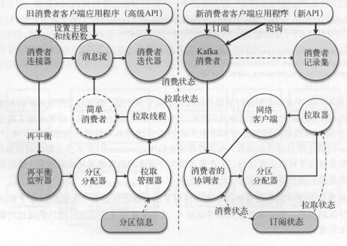
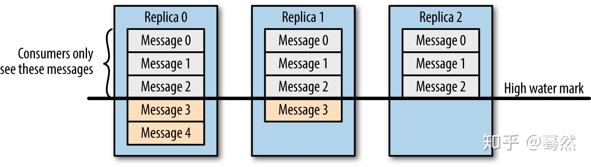
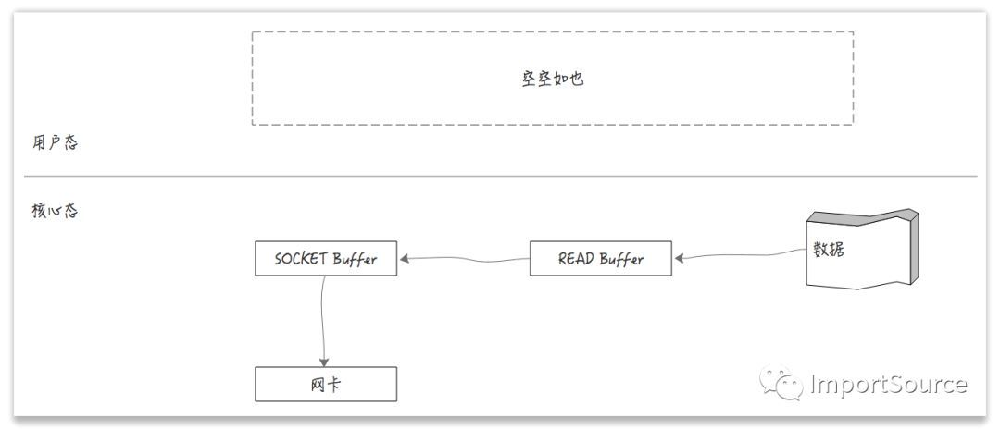
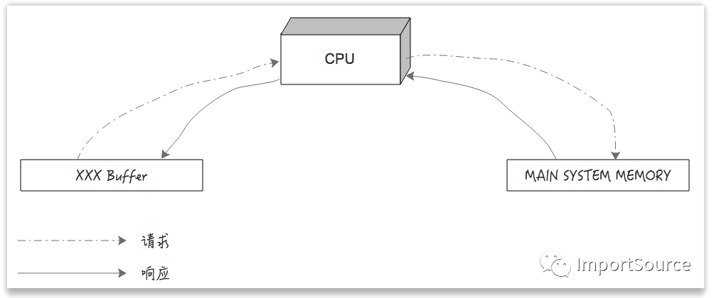
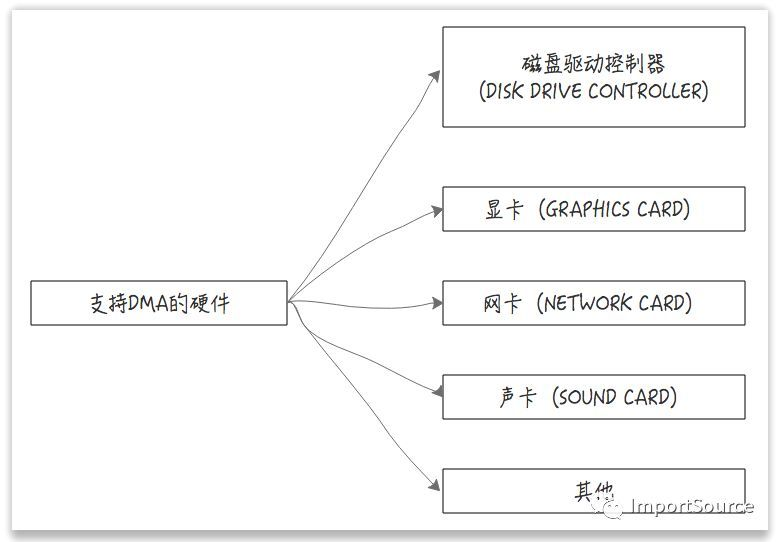
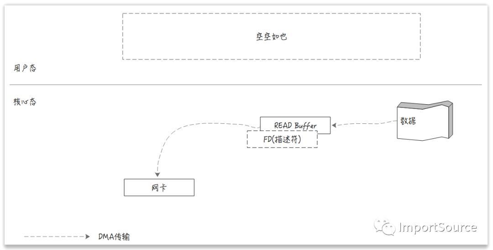

*  目录
{:toc}


<!--more-->

## 1. 生产者
1. Java版本的客户端和服务端的处理器，都使用了Selector模式和KafkaChannel，而Scala版本的客户端则使用比较原始的BlockingChannel。
2. 另外，我们在server端运用了Reactor模式，将网络请求和业务处理的线程进行分离。
3. 除此之外，客户端和服务端在很多地方都运用了队列这种数据结构，来对请求或者响应进行排队。

在client要向server发送消息时，我们会获取cluster集群状态（Java版本）或集群元数据TopicMetadata（Scala版本），并为消息选择分区，选择分区的主副本作为目标节点。在服务端，SocketServer会接收客户端发送的请求交给请求处理线程和KafkaApis处理。具体和消息相关的处理逻辑，由KafkaApis以及KafkaServer中的其他组件一起完成。

1. 获取集群状态
2. 为消息选择分区
3. 选择分区的主副本作为目标节点


## 2. 消费者
### 2.1 消费者线程模型
客户端创建基于ZK的**消费者连接器**，ZK作为共享存储保存了kafka集群或者客户端的相关信息，比如topic、消费者和消费组的关系、分区和消费者的关系、分区的偏移量等。

连接器是消费者进程的入口，根据客户端订阅的topic和设置的线程数，从而引入了**消费者的线程模型**。一个消费者客户端是一个Java进程，消费者可以订阅多个主题，甚至每个主题可以自定义线程数，消费者实际上是个多线程的程序。Java的多线程通常需要考虑加锁同步方案对线程和数据进行隔离，但是kafka消费者的多线程比较简单，因为一个消费者的多个线程处理的分区是互斥的，不存在同一个分区被相同线程处理的情况，所以不需要数据共享。

为什么需要记录消费者和消费组的关系？

所有Consumer组成一个Consumer Group共同消费订阅topic的所有分区，假设所有partition都平均分配给所有的Consumer, 每个Consumer有了独一无二的partition，接着就可以拉取自己负责的partition消息，并消费拉取到的消息。还有Consumer的故障容错机制，Consumer可能挂掉，或者有新的Consumer加入消费组。当出现Consumer增减时，Consumer Group会收集所有的Consumer，将分区重新分配给现存活的Consumer，这个操作叫“再平衡”，Consumer Group的每个消费者都会发生再平衡。每个Consumer在启动时，会往ZK的消费组节点下添加一个子节点，表示自己要加入这个Consumer Group。

Consumer线程要拉取partition消息，需要确定分区的主副本节点，kafka针对分区有一个限制条件：客户端针对partition的读写请求，只能发生在分区的主副本上。一个broker会存储多个partition，有可能消费者负责的分区中有几个partition的主副本是在同一个节点上的。为了减少客户端的网络连接数量，连接到同一个目标节点的多个partition可以合并起来一起处理。就像生产者对消息按照partition的主副本分组后，相同主副本的多个partition只以一个请求的方式，通过一个网络连接发送到一个目标节点。

每个Consumer可以拉取多个partition，拉取到消息后如何暴露给客户端应用程序？客户端是不是应该不停地监听消费者的拉取线程，如果没有新消息就等待？这种**不同步的工作模式**一般使用队列来暂存数据，并对数据的产生和获取进行解耦。拉取线程将拉取到的消息放入队列，消费线程从队列中弹出消息处理，它们之间没有很强的依赖关系。这两个线程除了操作队列还会更新相应的状态信息，所以引出了**分区信息对象（PartitionTopicInfo）**。拉取线程要更新partition信息的拉取状态（fetchOffset），消费线程要更新partition信息的消费状态（consumedOffset）。分配给消费者的每个分区都对应一个分区信息，不同的分区可以共用一个分区信息的队列。

队列作为拉取消息的存储介质，这种底层的数据结构不适合直接暴露给客户端应用程序，所以引出了“消息流”对队列进行了包装。消费者拉取线程每次可以拉取多个分区，每个分区都会对应队列中的一个数据块，每个数据块都包含一个消息集。客户端为了获取每条消息，首先从队列里弹出一个数据块，然后读取数据集的每条消息。为了尽量保持客户端API的简单，消息流实现了Iterable接口，对应的消费者迭代器会负责从队列中读取消息块，最后生成消息集对应的迭代器给客户端使用。

客户端消费完消息，会定时地提交消费进度到ZK或者以消息形式发送到kafka集群的内部主题节点，这样的节点叫作“消费组的协调者（GroupCoordinator）”或“偏移量管理器（OffsetManager）”。偏移量消息内容的键是“消费组、主题、分区”。

### 2.2 再平衡和分区分配

使用高级API，每个消费者进程启动时都会创建一个消费者连接器，并在ZK中注册消费者成员变化、分区变化的监听器。一旦监听器注册的事件被触发，就会被ZKRebalanceListener的再平衡方法，为消费组的所有消费者重新分配分区。为了保证整个消费组分区分配算法的一致性，当一个消费者加入消费组触发再平衡，该消费组内的所有消费者会同时触发再平衡。

由于每个消费者的再平衡都是独立的进程，消费者之间并不知道其他消费者的再平衡最后有没有成功。可能有些消费者再平衡成功了，有些却失败了，就会导致本来分配给这个消费者的分区，因为再平衡失败而无法被消费，但是其他消费者又都无法知晓。解决这个问题的方法是：在服务端为每个消费组都选举一个协调节点，让它负责某个消费组中所有消费者的协调工作。另外，消费者提交分区的偏移量也是写到协调节点上的。**实际上，消费者客户端发送给服务端的请求“只要和消费组有关，都会被协调节点处理”**。具体步骤如下：

第一步：所有成员都向coordinator发送请求，请求入组。一旦所有成员都发送了请求，coordinator会从中选择一个consumer担任leader的角色，并把组成员信息以及订阅信息发给leader。

第二步：leader开始分配消费方案，指明具体哪个consumer负责消费哪些topic的哪些partition。一旦完成分配，leader会将这个方案发给coordinator。coordinator接收到分配方案之后会把方案发给各个consumer，这样组内的所有成员就都知道自己应该消费哪些分区了。

所以对于Rebalance来说，Coordinator起着至关重要的作用

## 3 新消费者




消费者消费消息主要和KafkaConsumer类进行交互。客户端通过subscribe()方法订阅指定的主题，然后调用poll()方法轮询。轮询主要分为3个步骤： 

1. 消费者拉取器发送拉取请求
2. 通过消费者的网络客户端轮询
3. 从拉取器中获取拉取结果

下面列举了消费者消费消息，以及发生再平衡操作时的具体步骤：

1. 消费者分配到分区，订阅状态中的分区状态，初始时还没有拉取偏移量。
2. 客户端轮询为没有拉取偏移量的分区更新位置，会尝试从服务端协调节点读取分区的提交偏移量
3. 由于此时没有记录分区的提交偏移量，只能按照客户端设置的重置策略定位到最早或最近的位置
4. 消费者根据分区的拉取偏移量，从分区的主副本节点拉取消息，并更新分区状态的拉取偏移量
5. 分区有了偏移量，自动提交偏移量的定时任务开始工作
6. 定时提交任务会将分区状态最新的拉取偏移量提交到服务端
7. 如果分区所有权没有发生变化，下次拉取消息时，已经存在拉取偏移量的分区不需要更新位置
8. 如果分区所有权发生变化，协调者会将分区重新分配给新的消费者
9. 新消费者之前没有分配该分区，会从服务端读取其他消费者之前提交的分区偏移量
10. 新消费者从分区最近的提交偏移量拉取数据，而且它的定时任务会提交偏移量到服务端
11. 协调者确保分区一定会分配给消费者，这样让分区一定会被消费者拉取并被消费。

客户端在发送请求后返回一个异步请求对象，表示客户端会在为了某个时刻收到服务端返回的响应结果。客户端可以在返回的异步请求上添加一个监听器，当异步请求完成时，就会自动触发监听器的回调方法。异步请求还有其他高级的用法，比如组合模式、链接模式。组合模式返回的是一个新的异步请求，也可以在这个异步请求再添加一个监听器，形成组合加监听器模式。使用异步请求的步骤有3：

1. 调用发送请求返回异步请求
2. 客户端轮询
3. 获取异步请求的结果

客户端轮询有3种方式：

1. 快速轮询，调用该方法后会立即返回到主程序，这是无阻塞的轮询
2. 带超时时间的轮询，如果在给定时间内没有结果返回，会返回到主线程，这是阻塞的轮询
3. 没有时间限制的轮询，只有在异步请求完成后才会返回到主线程，这是阻塞的轮询

客户端发送请求得到的异步请求，它的泛型类型是客户端响应（ClientResponse）。使用“组合+适配器”模式后，可以将客户端响应转换为自定义的类型。比如获取分区的偏移量（LIST_OFFSET）返回的异步请求对象是RequestFuture<Long>，获取分区的提交偏移量（OFFSET_FETCH）对应类型是Map<TopicPartition, OffsetAndMetadata>，加入消费组对应类型是ByteBuffer，心跳和自动提交任务对应类型是RequestFuture<Void>。下面列举了使用异步请求的3种做法，最后都要获取异步请求的结果，用于回调处理。

1. 客户端使用组合模式发送请求，返回异步请求对象后，立即调用client.poll(future)进行阻塞式地轮询操作。客户端只有在异步请求完成的时候，才可以获取异步请求的结果：

	```
	//客户端发送请求返回异步请求对象，先轮询，等异步请求完成，再获取结果
	RequestFuture<ByteBuffer> future = client.send(req).compose(adapter)
	client.poll(future);
	if (future.succeeded()) {
		handleResponse(future.value);
	}
	```

2.  为客户端发送请求返回的异步请求对象添加一个监听器，然后才开始阻塞式地轮询。异步请求监听器回调方法的参数是客户端响应对象，当客户端收到服务端的响应结果后，会先将客户端的响应结果设置为异步请求对象的结果值，然后调用监听器的回调方法。

	```
	//客户端发送请求返回异步请求对象，先添加监听器再轮询，等收到客户端响应后，触发回调
	RequestFuture<ByteBuffer> future = client.send(req)
	future.addListener(new RequestFutureListener<ClientResponse>) {
		public void onSuccess(ClientResponse value) {
			handleResponse(value);
		}
	}
	client.poll(future);
	```

3. 客户端使用组合模式发送请求，并给返回的异步请求对象添加一个监听器，然后开始阻塞式的轮询。相当于组合了前两种模式，它和第二种模式的区别是异步请求的类型为ByteBuffer而不是客户端响应。和第二组组长一样，最后都会调用异步请求监听器的回调。

	```
	RequestFuture<ByteBuffer> future = client.send(req).compose(adapter)
	future.addListener(new RequestFutureListener<ByteBuffer>) {
		public void onSuccess(ByteBuffer value) {
			handleResponse(value);
		}
	}
	client.poll(future);
	```

以组合模式的异步请求为例，客户端发送请求并获取响应结果的具体步骤如下：

1. 客户端调用sendRequest()向服务端节点发送请求
2. 客户端不需要等待服务端返回结果，返回异步请求
3. 在2返回的异步请求上添加一个监听器
4. 客户端在异步请求轮询，会阻塞式地等待请求完成
5. 如果异步请求完成，则继续轮询
6. 当收到服务端返回的响应结果后，调用handleResponse()回调方法
7. 在回调方法中会解析出客户端响应，调用异步请求的complete()方法，完成异步请求
8. 从客户端响应对象解析出来的数据，会被设置为异步请求的结果值
9. 客户端调用异步请求的value()方法，获取异步请求的结果。

## 4 协调者
新的消费者将“消费者管理协议”和“分区分配策略”进行了分离。协调者仍然负责消费组的管理，包括消费者元数据、消费组元数据、消费组状态机等数据结构的维护。而分区分配的实现则会在消费组的一个主消费者中完成。由于分区分交由主消费者客户端完成，但每个消费者为了获得分区分配结果，还是只能和协调者联系，因此主消费者在完成分区分配后，还要将分配结果发送回协调者。

采用这种方式，每个消费者都需要发送下面两种请求给协调者：

- 加入组请求。协调者收集消费组的所有消费者，并选举一个主消费者执行分区分配操作
- 同步组请求。主消费者完成分区分配，由协调者将分区的分配结果传播给每个消费者。

消费者发送“加入组请求”给协调者，是为了让协调者收集所有的消费者。协调者会把消费者成员列表发送给主消费者，这样主消费者才可以执行分区分配工作。每个消费者发送给协调者的“加入组请求”，都带有各自的消费者成员元数据。比如，消费者订阅的主题、消费者编号、会话超时时间等。

主消费者收到“加入组响应”带有所有消费者成员，它在执行完分区分配工作后，发送给协调者的“同步组请求”带有分配给每个消费者的分区结果。协调者在收到后，会先将消费组的分配结果持久化，然后才返回“同步组响应”给每个消费者。

消费者发送“同步组请求”，是在它收到协调者的“加入组响应”后才开始的，“加入组请求”和“同步组请求”链式依次调用。

协调者除了管理消费者的负载均衡，并最终分配分区给每个消费者，还会接收每个消费者的心跳请求。协调者通过心跳监控消费者成员是否存活。

## 5 存储层

日志存储、日志管理、副本管理器。日志存储会将消息集写到底层的日志文件，它的主要概念如下：

1. 一个日志（Log）有多个日志分段（LogSegment）。每个日志分段由数据文件（FileMessage）和索引文件（OffsetIndex）组成。
2. 偏移量是消息最重要的组成部分。每条消息写入底层数据文件，都会有一个递增的偏移量。
3. 索引文件保存了消息偏移量到物理位置的映射关系，但并不是保存数据文件的所有消息，而是建个一定数量的消息才保存一条映射关系。索引文件保存的偏移量是相对偏移量，数据文件中每条消息的偏移量是分区基本的绝对偏移量。
4. 存储索引文件的条目时，将绝对偏移量-日志分段的基准偏移量。查询索引文件返回的相对偏移量+基准偏移量才能拥有查询数据文件。
5. 客户端每次读取数据文件，服务端都会创建一个文件视图，文件视图和底层文件数据文件公用一个文件通道，但拥有不同的开始位置和结束位置。
6. 服务端返回文件视图给客户端，采用零拷贝技术，将底层文件通道的数据直接传输到网络通道。

日志管理器管理了服务端的所有日志，除了上面对日志的追加和读取操作外，日志管理还有下面几个后台管理的线程类。

- 定时将数据文件写到磁盘上、定时将恢复点写入检查点文件
- 日志清理线程根据日志的大小和时间清理最旧的日志分段
- 日志压缩线程将相同键的不同消息进行压缩，压缩线程将日志按照清理点分成头部和尾部

副本管理器保存了服务端的所有分区，并处理客户端发送的读写请求：

- 副本管理器处理读写请求，会先操作分区的主副本。appendMessage()方法会将消息集写入主副本的本地日志，fetchMessage()方法会从主副本的本地日志读取消息集。
- 每个分区都有一个主副本和多个备份副本，只有主副本才有日志对象。副本有两个重要的位置信息：LEO表示副本的最新偏移量，HW表示副本的最高水位。
- 生成请求的应答值（acks）需要服务端创建延迟的生成（DelayedProduce）,拉取请求的最少字节数（fetchMinBytes）需要服务端创建延迟的拉取（DelayedFetch）。
- 延迟缓存会记录分区到延迟操作的映射关系，外部事件会根据分区尝试完成延迟的操作。
- 延迟缓存有监视器、清理器、定时器协调完成延迟的操作。

## 6 控制器
控制器是kafka副本机制的核心。如何将一个分区的多个副本以分布式的方式存储在不同的消息代理节点上，这就是控制器的主要职责。

kafka集群的元数据信息会持久化到ZK中，kafka控制器需要和ZK进行交互，获取分区的副本集合（AR）、主副本（Leader）、同步的副本集（ISR）。新创建主题时，kafka控制器会从每个分区的AR中选举主副本，并下发LeaderAndIsrRequest给分区所有副本所在的代理节点。在主题数据变化时，kafka控制器有不同的主副本选举策略。

控制器内部的主要组件包括多种类型的监听器，它们分别注册到不同的ZK节点，监控不同的外部事件，比如：代理节点上下线、分区数变化、重新分区等。kafka控制器使用了 分区状态机 和 副本状态机 处理分区和副本的状态变化，状态包括：“不存在”， “新建”， “上线”， “下线”。删除主题时，副本状态机还引入了“开始删除”， “删除成功”，“删除失败”三个状态。状态机的状态转换都有一定的规则，比如：删除主题时，副本状态要从“下线”到“不存在”，中间必须经过“开始删除”， “删除成功”。

分区状态机 和 副本状态机 处理状态转换事件时，都有不同的事件处理逻辑。涉及分区状态变化的事件，控制器最后都会发送LeaderAndIsr请求给分区对应的代理节点，并发送UpdateMetadata请求给所有的代理节点。以用户创建主题为例，分析kafka集群的主要处理流程：

1. 用户新创建主题，会在ZK中创建一个主题节点，节点的数据包括所有的分区和分区的所有副本集。
2. kafka控制器的监听器（TopicChangeListener）会触发分区状态机和副本状态机的事件处理
3. 分区状态机会为分区选举主副本，并在ZK中创建分区节点，数据包括分区的主副本、ISR集合。
4. 控制器发送LeaderAndIsr请求给分区的所有副本，不同副本可以成为主副本、备份副本

为了维护kafka集群的稳定性和可用性，控制器要处理各种各样的异常情况，比如：代理节点挂掉会对上面有主副本的分区产生影响、代理节点重启后增加了可用的副本。另外，控制器还要处理一些管理工作，比如重新分配分区、选举最优副本平和分区、删除主题等。

控制器一个很重要的工作是决定了分区的主副本后，要将LeaderAndIsr请求下发给受影响的代理节点。每个收到LeaderAndIsr请求的代理节点，都会根据分区在当前节点是“主副本”还是“备份副本”，分别调用分区的makeLeader()或者makeFollower()方法。

控制器除了发送LeaderAndIsr请求给部分代理节点，还会发送UpdateMetadata请求给所有的代理节点。元数据包括分区状态数据、存活的代理节点，每个代理节点都会缓存元数据到MetadataCache对象中。元数据的缓存在每个代理节点都是一致的，客户端在需要查询主题元数据（TopicMetadata）时，发送元数据请求（Metadata）只需要连接任意一个节点。

从上面的分析中可以知道，控制器下发LeaderAndIsr请求、UpdateMetadata请求，以及客户端发送元数据请求获取TopicMetadata数据、客户端往分区的主副本写入数据这几个过程都是有序的。

## 数据可靠性和持久性保证

当producer向leader发送数据时，可以通过request.required.acks参数来设置数据可靠性的级别：

- 1（默认）：这意味着producer在ISR中的leader已成功收到数据并得到确认。如果leader宕机了，则会丢失数据。
- 0：这意味着producer无需等待来自broker的确认而继续发送下一批消息。这种情况下数据传输效率最高，但是数据可靠性确是最低的。
- -1：producer需要等待ISR中的所有follower都确认接收到数据后才算一次发送完成，可靠性最高。但是这样也不能保证数据不丢失，比如当ISR中只有leader时（前面ISR那一节讲到，ISR中的成员由于某些情况会增加也会减少，最少就只剩一个leader），这样就变成了acks=1的情况。

### 复制原理和同步方式

Kafka中topic的每个partition有一个预写式的日志文件，虽然partition可以继续细分为若干个segment文件，但是对于上层应用来说可以将partition看成最小的存储单元


下图详细的说明了当producer生产消息至broker后，ISR以及HW和LEO的流转过程：


由此可见，Kafka的复制机制既不是完全的同步复制，也不是单纯的异步复制。事实上，同步复制要求所有能工作的follower都复制完，这条消息才会被commit，这种复制方式极大的影响了吞吐率。而异步复制方式下，follower异步的从leader复制数据，数据只要被leader写入log就被认为已经commit，这种情况下如果follower都还没有复制完，落后于leader时，突然leader宕机，则会丢失数据。而Kafka的这种使用ISR的方式则很好的均衡了确保数据不丢失以及吞吐率。

Kafka的ISR的管理最终都会反馈到Zookeeper节点上。具体位置为：/brokers/topics/[topic]/partitions/[partition]/state。目前有两个地方会对这个Zookeeper的节点进行维护：

- Controller来维护：Kafka集群中的其中一个Broker会被选举为Controller，主要负责Partition管理和副本状态管理，也会执行类似于重分配partition之类的管理任务。在符合某些特定条件下，Controller下的LeaderSelector会选举新的leader，ISR和新的`leader_epoch`及`controller_epoch`写入Zookeeper的相关节点中。同时发起LeaderAndIsrRequest通知所有的replicas。
- leader来维护：leader有单独的线程定期检测ISR中follower是否脱离ISR, 如果发现ISR变化，则会将新的ISR的信息返回到Zookeeper的相关节点中。

### 要保证数据写入到Kafka是安全的，高可靠的，需要如下的配置：

- topic的配置：replication.factor>=3,即副本数至少是3个；2<=min.insync.replicas<=replication.factor
- broker的配置：leader的选举条件unclean.leader.election.enable=false
- producer的配置：定义 Producer 时通过 acks 参数指定（在 0.8.2.X 版本之前是通过 request.required.acks 参数设置的）。

### Kafka数据一致性原理

这里介绍的数据一致性主要是说不论是老的 Leader 还是新选举的 Leader，Consumer 都能读到一样的数据。那么 Kafka 是如何实现的呢？

如果我们允许消费者读取这些消息，可能就会破坏一致性。试想，一个消费者从当前 Leader（副本0） 读取并处理了 Message4，这个时候 Leader 挂掉了，选举了副本1为新的 Leader，这时候另一个消费者再去从新的 Leader 读取消息，发现这个消息其实并不存在，这就导致了数据不一致性问题。

当然，引入了 High Water Mark 机制，会导致 Broker 间的消息复制因为某些原因变慢，那么消息到达消费者的时间也会随之变长（因为我们会先等待消息复制完毕）。延迟时间可以通过参数 replica.lag.time.max.ms 参数配置，它指定了副本在复制消息时可被允许的最大延迟时间。


## consumer消息保证

有三种级别的消息保证：

-  At most once: 先commit offset再消费消息，如果在offset被commit之后但消息没有被消费时consumer宕机，则会丢失消息，实现at most once。
- At least once：先消费消息，再commit offset，如果在offset被commit之前consumer宕机，当重启时会重复消费。实现at least once。
- Exactly once：要实现exactly once则需要对commit offset和消息消费加上事务，或者对at least once加上去重机制。

## 8 kafka 为什么这么快

下面从数据写入和读取两方面分析

### 8.1 写入数据

1. 顺序写入
2. Memory Mapped Files

即便是顺序写入硬盘，硬盘的访问速度还是不可能追上内存。所以Kafka的数据并 不是实时的写入硬盘 ，它充分利用了现代操作系统 分页存储 来利用内存提高I/O效率。

Memory Mapped Files(后面简称mmap)也被翻译成 内存映射文件 ，在64位操作系统中一般可以表示20G的数据文件，它的工作原理是直接利用操作系统的Page来实现文件到物理内存的直接映射。完成映射之后你对物理内存的操作会被同步到硬盘上（操作系统在适当的时候）。

通过mmap，进程像读写硬盘一样读写内存（当然是虚拟机内存），也不必关心内存的大小有虚拟内存为我们兜底。

使用这种方式可以获取很大的I/O提升， 省去了用户空间到内核空间 复制的开销（调用文件的read会把数据先放到内核空间的内存中，然后再复制到用户空间的内存中。）也有一个很明显的缺陷——不可靠， 写到mmap中的数据并没有被真正的写到硬盘，操作系统会在程序主动调用flush的时候才把数据真正的写到硬盘。 Kafka提供了一个参数——producer.type来控制是不是主动flush，如果Kafka写入到mmap之后就立即flush然后再返回Producer叫 同步 (sync)；写入mmap之后立即返回Producer不调用flush叫 异步 (async)。

mmap其实是Linux中的一个函数就是用来实现内存映射的，谢谢Java NIO，它给我提供了一个mappedbytebuffer类可以用来实现内存映射

### 8.2 读取数据

1. 一个原因就是零拷贝（zero-copy）技术
2. 批量压缩

传统的文件拷贝

传统的文件拷贝通常需要从用户态去转到核心态，经过read buffer，然后再返回到用户态的应用层buffer，然后再从用户态把数据拷贝到核心态的socket buffer，然后发送到网卡。如下图所示：


如果减少了用户态与核心态之间的切换，是不是就会更快了呢？如下图：



如果可以进一步减少数据复制的次数，甚至没有数据复制是不是就会做到最快呢？

DMA

别急，这里我们先介绍一个新的武器:DMA。

DMA，全称叫Direct Memory Access，一种可让某些硬件子系统去直接访问系统主内存，而不用依赖CPU的计算机系统的功能。听着是不是很厉害，跳过CPU，直接访问主内存。传统的内存访问都需要通过CPU的调度来完成。如下图：



而DMA，则可以绕过CPU，硬件自己去直接访问系统主内存。如下图：


很多硬件都支持DMA，这其中就包括网卡。

	

零拷贝

回到本文中的文件传输，有了DMA后，就可以实现绝对的零拷贝了，因为网卡是直接去访问系统主内存的。如下图：
	

**Java的零拷贝实现**

在Java中的零拷贝实现是在FileChannel中，其中有个方法transferTo(position,fsize,src)。

传统的文件传输是通过java.io.DataOutputStream，java.io.FileInputStream来实现的，然后通过while循环来读取input，然后写入到output中。

零拷贝则是通过java.nio.channels.FileChannel中的transferTo方法来实现的。transferTo方法底层是基于操作系统的sendfile这个system call来实现的（不再需要拷贝到用户态了），sendfile负责把数据从某个fd（file descriptor）传输到另一个fd。

```
#include <sys/socket.h>
ssize_t sendfile(int out_fd, int in_fd, off_t *offset, size_t count)
```


Kafka在文件传输的过程中正是使用了零拷贝技术对文件进行拷贝。建议以后多用FileChannel的transferTo吧。


### kafka数据分区和消费者的关系，kafka的数据offset读取流程，kafka内部如何保证顺序，结合外部组件如何保证消费者的顺序？

1. kafka数据分区和消费者的关系：1个partition只能被同组的一个consumer消费，同组的consumer则起到均衡效果
2. kafka的数据offset读取流程​:
	 1. 连接ZK集群，从ZK中拿到对应topic的partition信息和partition的Leader的相关信息​ 
	 2. 连接到对应Leader对应的broker​ 
	 3. consumer将⾃己保存的offset发送给Leader​ 
	 4. Leader根据offset等信息定位到segment（索引⽂件和⽇志⽂件）​ 
	 5. 根据索引⽂件中的内容，定位到⽇志⽂件中该偏移量对应的开始位置读取相应长度的数据并返回给consumer 
3. kafka内部如何保证顺序：   
     
	kafka只能保证partition内是有序的，但是partition间的有序是没办法的。

## 常见的消息队列对比

对 比 方 向|概要
----------|---
吞 吐 量|万级的 ActiveMQ 和 RabbitMQ 的吞吐量(ActiveMQ 的性能最差)要比 十万级甚至是百万级的 RocketMQ 和 Kafka 低一个数量级。
可 用 性|都可以实现高可用。ActiveMQ 和 RabbitMQ 都是基于主从架构实现高可用性。RocketMQ 基于分布式 架构。 kafka 也是分布式的，一个数据多个副本，少数机器宕机，不会丢失数据，不会导致不可用
时 效 性|RabbitMQ 基于erlang开发，所以并发能力很强，性能极其好，延时很低，达到微秒级。其他三个都是 ms 级。
功 能 支 持|除了 Kafka，其他三个功能都较为完备。 Kafka 功能较为简单，主要支持简单的MQ功能，在大数据领域 的实时计算以及日志采集被大规模使用，是事实上的标准
消 息 丢 失|ActiveMQ 和 RabbitMQ 丢失的可能性非常低， RocketMQ 和 Kafka 理论上不会丢失。


特性|ActiveMQ|RabbitMQ|RocketMQ|kafka
---|--------|--------|---------|------
开发语⾔|java|erlang|java|scala
社区活跃|算是比较成熟|国内很少有公司有实力做 erlang源码级别的研究和定制|阿里出品，Java 系开源项目，源代码我们可以直接阅读，然后可以定制自己公司的MQ，并且 RocketMQ 有阿里巴巴的实际业务场景的实战考验。RocketMQ 社区活跃度相对较为一般，不过也还可以，文 档相对来说简单一些，然后接口这块不是按照标准 JMS 规范走的有些系统要迁移需要修改大量代码。|社区非常活跃，几乎是全世界这个领域的事实性规范
单机吞吐量|万级|万级|10万级|10万级|
性能、场景|性能比较差，而且版本迭代很慢，不推荐使用|它基于erlang开发，所以并发能力很强，性能极其好，延时很低，达到微秒级。如果业务场景对并发量要求不是太高(十万级、百万级)，那这四种消息队列 中，RabbitMQ 一定是你的首选。||kafka 唯一的一点劣势是有可能消息重复消费，那么对数据准确性会造成极其轻微的影响。大数据领域的实时计算、日志采集等场景
时效性|ms级|us级|ms级|ms级以内
可⽤性|高(主从架构)|高(主从架构)|⾮常高(分布式架构)|⾮常⾼(分布式架构)
功能特性|成熟的产品，在很多公司得到应⽤；有较多的文档；各种协议支持较好|基于erlang开发，所以并发能⼒很强，性能极其好，延时很低;管理界⾯较丰富|MQ功能比较完备，扩展性佳|只⽀持主要的MQ功能，像一些消息查询，消息回溯等功能没有提供，毕竟是为大数据准备的，在⼤数据领域应⽤广。

kafka和RabbitMQ区别：   

1. RabbitMQ,遵循AMQP协议，由内在高并发的erlanng语⾔开发，⽤在实时的对可靠性要求⽐较⾼的消息传递上(有消息确认机制)。    
2. kafka是Linkedin于2010年12⽉份开源的消息发布订阅系统,它主要⽤于处理活跃的流式数据,大数据量的数据处理上(⽆消息确认机制，但吞吐量⾼)，kafka用zk做集群负载均衡。

## RabbitMQ如何保证数据⼀致性

1. ⽣产者确认机制：消息持久化后异步回调通知⽣产者，保证消息已经发出去；将信道设置成confirm模式（发送⽅确认模式），则所有在信道上发布的消息都会被指派一个唯一的ID。一旦消息被投递到⽬的队列后，或者消息被写⼊磁盘后（可持久化的消息），信道会发送一个确认给⽣产者（包含消息唯⼀ID）。如果RabbitMQ发生内部错误从而导致消息丢失，会发送一条nack（not acknowledged，未确认）消息。发送方确认模式是异步的，生产者应用程序在等待确认的同时，可以继续发送消息。当确认消息到达生产者应用程序，生产者应用程序的回调方法就会被触发来处理确认消息
2. 消息持久化：设置消息持久化；
3. 消费者确认机制：消费者成功消费消息之后，⼿动确认，保证消息已经消费。消费者接收每一条消息后都必须进⾏确认（消息接收和消息确认是两个不同操作）。只有消费者确认了消息，RabbitMQ才能安全地把消息从队列列中删除。这⾥并没有⽤到超时机制，RabbitMQ仅通过Consumer的连接中断来确认是否需要重新发送消息。也就是说，只要连接不中断，RabbitMQ给了Consumer⾜够⻓的时间来处理消息。特殊情况：1、如果消费者接收到消息，在确认之前断开了连接或取消订阅，RabbitMQ会认为消息没有被分发，然后重新分发给下一个订阅的消费者。（可能存在消息重复消费的隐患，需要根据bizId去重）2、如果消费者接收到消息却没有确认消息，连接也未断开，则RabbitMQ认为该消费者繁忙，将不会给该消费者分发更多的消息。

## RabbitMQ如何避免消息重复投递或重复消费？
在消息生产时，MQ内部针对每条⽣产者发送的消息⽣成一个inner-msg-id，作为去重和幂等的依据（消息投递失败并重传），避免重复的消息进入队列；在消息消费时，要求消息体中必须要有一个bizId（对于同一业务全局唯一，如支付ID、订单ID、帖⼦ID等）作为去重和幂等的依据，避免同一条消息被重复消费。
