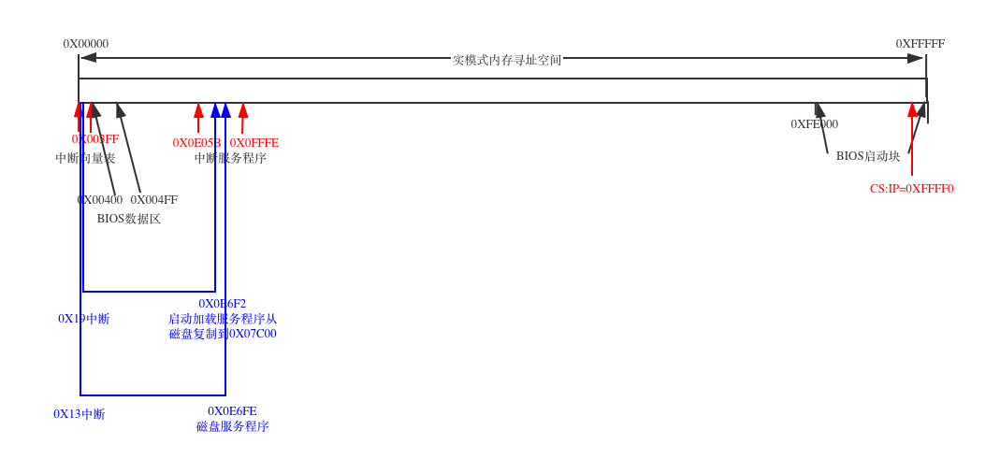
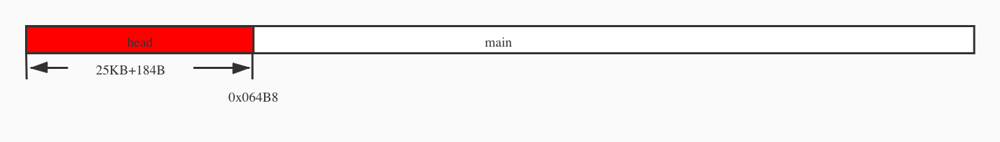
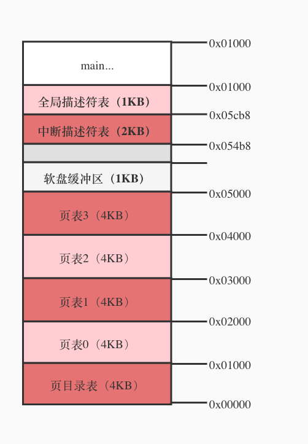

<!--more-->

# Linux 启动过程

## 1. 从开机加电到执行main函数之前的过程

1. 启动BIOS，准备实模式下的中端向量表和中断服务程序
2.  从启动盘加载操作系统程序到内存，加载操作系统程序的工作就是利用第一步中准备的中断服务程序实现的。
3.  为执行32位的main函数做过渡工作。

> 实模式：是Intel80286和之后的80x86兼容CPU的操作模式，它的特性是一个20位的存储器地址空间，即1MB的存储器可被寻址，可以直接软件访问BIOS以及周边硬件，没有硬件支持的分页机制和实时多任务概念。
> 到底多少位？

### 1.1 启动BIOS，准备实模式下的中端向量表和中断服务程序

如何将硬盘中的OS加载到内存？答案是靠BIOS。

BIOS如何启动呢？答案是靠硬件完成，Intel将所有80x86系列的CPU，都设计为加电即进入16位实模式状态运行。同时，将CPU硬件逻辑设计为加电瞬间强行设置CS=0xf000, IP=0xfff0，CS:IP=0xffff0

BIOS程序被固化在计算机主板上的一块很小的ROM芯片里，不同主板所用BIOS不同，但原理都是类似的，图片里选用的是一个8KB的。

接下来BIOS会检测显卡，内存，因此屏幕上也会显示显示和内存信息。其中最重要的是建立中断向量表和中断服务程序。

中断向量表中有256个中断向量，每个向量4个字节，其中CS,IP各两个

### 1.2 利用中断服务程序把系统内核加载到内存

分三批：

1. 中断int0x19把第一扇区bootsect的内容加载到内存。

	每个操作系统的设计者都可以设计自己的启动方案，而且操作系统和BIOS通常由不同团队开发，为了能协同工作，必须建立操作系统和BIOS之间的协调机制。因此有了现行的“两头约定”和“定位识别”——“约定”操作系统设计者必须把最开始执行的程序“定位”在启动扇区（软盘中的0盘面0磁道1扇区），其余的可以自定义后续加载操作。
2. 第二批和第三批在bootsect的指挥下，分别把其后的4个扇区和随后的240个扇区的内容加载至内存。

这里需要记住的就是为了把第二批和第三批程序加载到内存适当的位置，bootsect首先做的就是规划内存，操作系统的设计者，需要全面地、整体地考虑内存的规划。

bootsect规划好内存后，并把自身从0X07C00的位置复制至0X90000的位置后，接下来要做的就是将setup程序加载到内存中。这时，需要借助BIOS提供的int 0x13中断向量所指向的中断服务程序。

	
### 1.3 开始向32位模式转变，为main函数的调用做准备

1. 关中断并将system 移动到内存地址起始位置0x00000.
	1. 关中断即将CPU的标志寄存器（EFLAGSA）的中断允许标志（IF）置为0.
	2. 0x00000原来存放的是BIOS建立的中断向量表，以及BIOS数据区，现在它们被覆盖了，等同于废除了BIOS提供的实模式下的中断服务程序。
	3. 让内核代码占据内存物理地址最开始、天然的、有利的位置。

2. 建立新的中断机制——设置中断描述符表和全局描述符表

	通过setup程序自身提供的数据信息对中断描述符表寄存器（IDTR）和全局描述符表寄存器（GDTR）进行初始化设置。
	
	> **GDT** 全局描述符表，在系统中唯一的存放段寄存器内容（段描述符）的数组，配合程序进行保护模式下的段寻址，可以把它看做一个所有进程的总目录表，其中存放每一个任务局部描述符表（LDT）地址和任务状态段（TSS）地址，完成进程中各段的寻址、现场保护和现场恢复。
	>**GDTR** GDT基地址寄存器，是GDT的入口
	>**IDT** 中断描述符表，保存保护模式下所有中断服务程序的入口地址，类似实模式下的中断向量表。
	
	32位中断机制和16位的中断机制的不同： 16位的中断向量表的起始位置在0x00000处；32位的中断机制是用的IDT，位置是不固定的，可以由操作系统的设计者根据设计要求灵活安排，由IDTR来锁定其位置。
	
3. 打开A20，实现32位寻址，最大寻址空间为4GB

	实模式下，共1MB寻址空间，需要0~19号共20根地址线，进入保护模式后，将使用32位寻址模式，即采用32根地址线进行寻址，第21根（A20）至第32根地址线的选通控制将意味着寻址模式的切换。
	
	
	
4. 为保护模式下执行head.s做准备，然后开始执行

	head做了一件对内核程序在内存中的布局及内核程序的正常运行有重大意义的事，就是用程序自身的代码在程序自身所在的内核空间创建了内核分页机制，即在0x000000的位置创建了页目录表、页表、缓冲区、GDT、IDT，并将head程序已经执行过的代码所占内存空间覆盖，内存布局如图所示。main函数即将开始执行。
	
	
	
	这4个页表都是内核专属的页表，将来每个用户进程都会有它们专属的页表。
	
	
	
	

